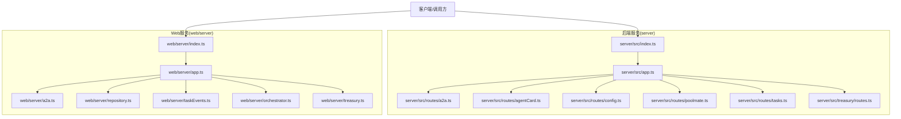
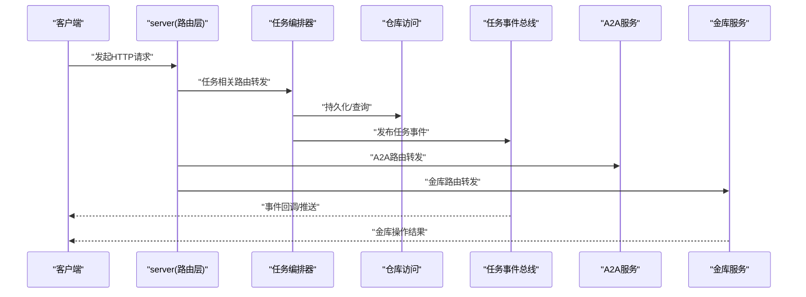
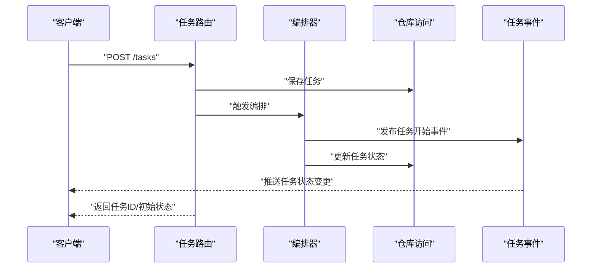
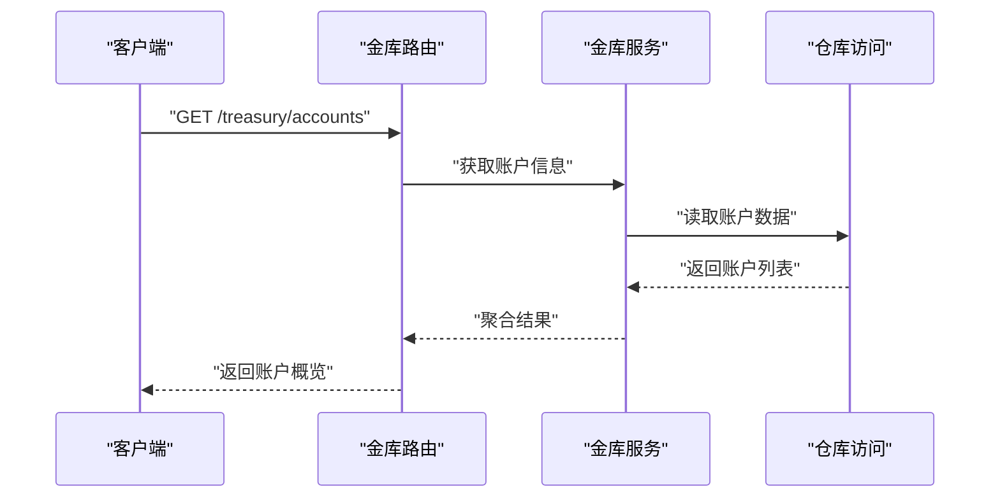
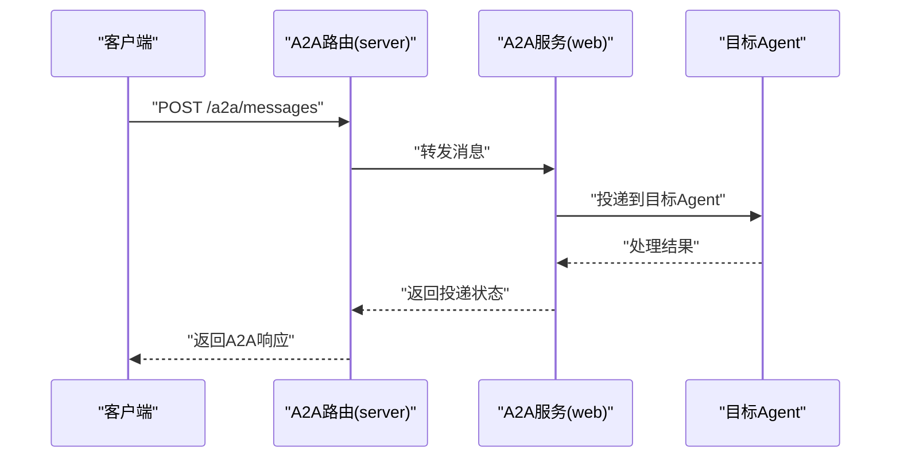
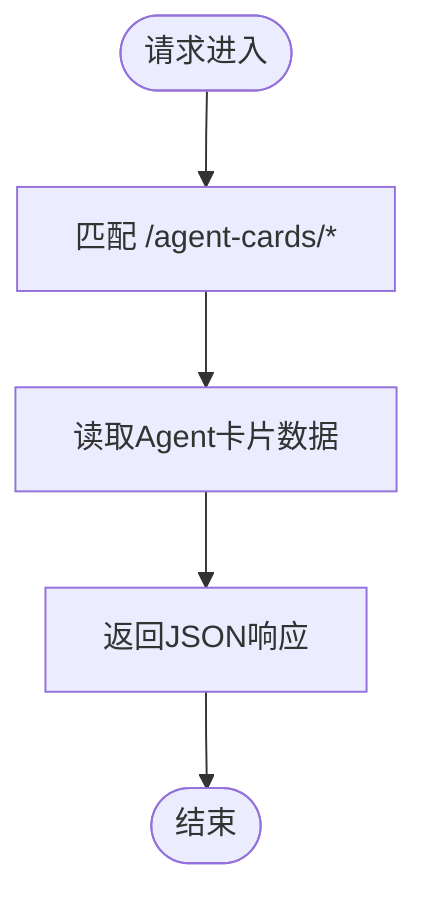
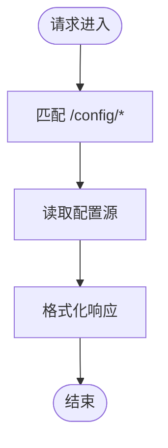
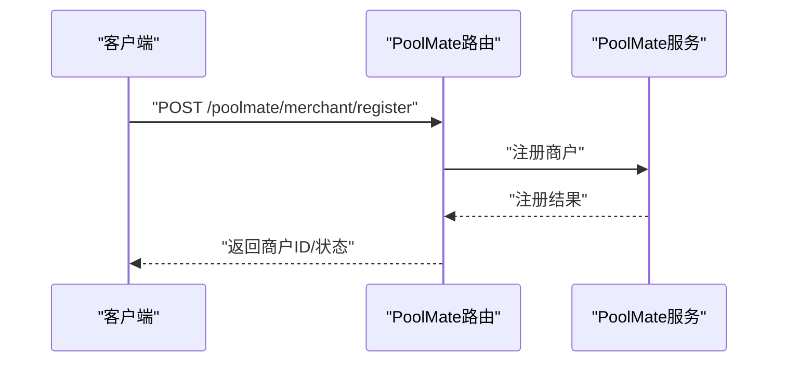
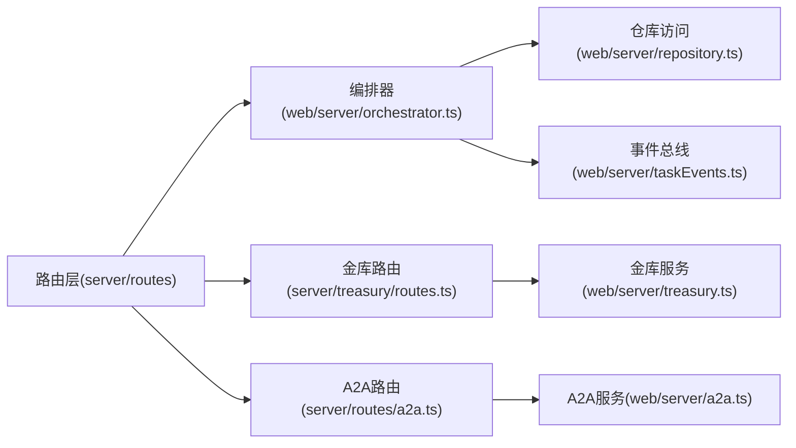

# API参考文档

<cite>
**本文引用的文件**   
- [server/src/index.ts](file://server/src/index.ts)
- [server/src/app.ts](file://server/src/app.ts)
- [server/src/routes/a2a.ts](file://server/src/routes/a2a.ts)
- [server/src/routes/agentCard.ts](file://server/src/routes/agentCard.ts)
- [server/src/routes/config.ts](file://server/src/routes/config.ts)
- [server/src/routes/poolmate.ts](file://server/src/routes/poolmate.ts)
- [server/src/routes/tasks.ts](file://server/src/routes/tasks.ts)
- [server/src/treasury/routes.ts](file://server/src/treasury/routes.ts)
- [web/server/index.ts](file://web/server/index.ts)
- [web/server/app.ts](file://web/server/app.ts)
- [web/server/a2a.ts](file://web/server/a2a.ts)
- [web/server/repository.ts](file://web/server/repository.ts)
- [web/server/taskEvents.ts](file://web/server/taskEvents.ts)
- [web/server/orchestrator.ts](file://web/server/orchestrator.ts)
- [web/server/treasury.ts](file://web/server/treasury.ts)
</cite>

## 目录
1. [简介](#简介)
2. [项目结构](#项目结构)
3. [核心组件](#核心组件)
4. [架构总览](#架构总览)
5. [详细组件分析](#详细组件分析)
6. [依赖分析](#依赖分析)
7. [性能考虑](#性能考虑)
8. [故障排查指南](#故障排查指南)
9. [结论](#结论)
10. [附录](#附录)

## 简介
本API参考文档面向开发者与集成方，系统化梳理AdventureX后端服务（server）与Web服务（web/server）的接口、数据流与关键处理逻辑。文档聚焦于：
- 路由与端点定义
- 请求/响应契约与状态码约定
- 任务编排与事件机制
- 金库（Treasury）相关操作
- A2A（Agent-to-Agent）通信能力
- PoolMate生态集成

## 项目结构
本项目采用前后端分离的双服务架构：
- server：提供核心业务API（任务、配置、金库、PoolMate、A2A等），基于TypeScript/Node.js实现。
- web/server：提供Web侧服务端能力（应用入口、A2A桥接、任务事件、编排器、仓库访问、金库服务等）。

图表来源
- [server/src/index.ts](file://server/src/index.ts)
- [server/src/app.ts](file://server/src/app.ts)
- [server/src/routes/a2a.ts](file://server/src/routes/a2a.ts)
- [server/src/routes/agentCard.ts](file://server/src/routes/agentCard.ts)
- [server/src/routes/config.ts](file://server/src/routes/config.ts)
- [server/src/routes/poolmate.ts](file://server/src/routes/poolmate.ts)
- [server/src/routes/tasks.ts](file://server/src/routes/tasks.ts)
- [server/src/treasury/routes.ts](file://server/src/treasury/routes.ts)
- [web/server/index.ts](file://web/server/index.ts)
- [web/server/app.ts](file://web/server/app.ts)
- [web/server/a2a.ts](file://web/server/a2a.ts)
- [web/server/repository.ts](file://web/server/repository.ts)
- [web/server/taskEvents.ts](file://web/server/taskEvents.ts)
- [web/server/orchestrator.ts](file://web/server/orchestrator.ts)
- [web/server/treasury.ts](file://web/server/treasury.ts)

章节来源
- [server/src/index.ts](file://server/src/index.ts)
- [server/src/app.ts](file://server/src/app.ts)
- [web/server/index.ts](file://web/server/index.ts)
- [web/server/app.ts](file://web/server/app.ts)

## 核心组件
- 路由层
  - server端：按功能域拆分路由模块（A2A、Agent卡片、配置、PoolMate、任务、金库）。
  - web端：应用初始化、A2A桥接、任务事件、编排器、仓库访问、金库服务。
- 服务层
  - 任务编排：负责任务的创建、调度、生命周期管理。
  - 金库服务：资金账户、交易记录、策略执行相关的聚合能力。
  - A2A服务：Agent间消息传递与协议适配。
- 数据层
  - 仓库访问：统一的数据读写封装。
  - 数据库迁移与连接池：由server/db模块提供（不在本API文档范围内详述）。

章节来源
- [server/src/routes/a2a.ts](file://server/src/routes/a2a.ts)
- [server/src/routes/agentCard.ts](file://server/src/routes/agentCard.ts)
- [server/src/routes/config.ts](file://server/src/routes/config.ts)
- [server/src/routes/poolmate.ts](file://server/src/routes/poolmate.ts)
- [server/src/routes/tasks.ts](file://server/src/routes/tasks.ts)
- [server/src/treasury/routes.ts](file://server/src/treasury/routes.ts)
- [web/server/a2a.ts](file://web/server/a2a.ts)
- [web/server/repository.ts](file://web/server/repository.ts)
- [web/server/taskEvents.ts](file://web/server/taskEvents.ts)
- [web/server/orchestrator.ts](file://web/server/orchestrator.ts)
- [web/server/treasury.ts](file://web/server/treasury.ts)

## 架构总览
下图展示从客户端到各服务层的端到端调用路径，以及关键组件间的交互关系。

图表来源
- [server/src/routes/tasks.ts](file://server/src/routes/tasks.ts)
- [web/server/orchestrator.ts](file://web/server/orchestrator.ts)
- [web/server/repository.ts](file://web/server/repository.ts)
- [web/server/taskEvents.ts](file://web/server/taskEvents.ts)
- [server/src/routes/a2a.ts](file://server/src/routes/a2a.ts)
- [web/server/a2a.ts](file://web/server/a2a.ts)
- [server/src/treasury/routes.ts](file://server/src/treasury/routes.ts)
- [web/server/treasury.ts](file://web/server/treasury.ts)

## 详细组件分析

### 任务管理API（Tasks）
- 职责
  - 提供任务的创建、查询、更新、删除等操作。
  - 与编排器协作，驱动任务生命周期。
  - 通过事件总线广播任务状态变更。
- 典型流程
  - 客户端提交任务参数。
  - 路由层校验并持久化。
  - 编排器接收任务并调度执行。
  - 事件总线发布任务状态变更。
  - 客户端订阅或轮询获取最新状态。

图表来源
- [server/src/routes/tasks.ts](file://server/src/routes/tasks.ts)
- [web/server/orchestrator.ts](file://web/server/orchestrator.ts)
- [web/server/repository.ts](file://web/server/repository.ts)
- [web/server/taskEvents.ts](file://web/server/taskEvents.ts)

章节来源
- [server/src/routes/tasks.ts](file://server/src/routes/tasks.ts)
- [web/server/orchestrator.ts](file://web/server/orchestrator.ts)
- [web/server/taskEvents.ts](file://web/server/taskEvents.ts)

### 金库API（Treasury）
- 职责
  - 提供金库账户信息、交易记录、策略执行结果等查询与操作。
  - 与任务系统联动，将策略执行结果持久化与上报。
- 典型流程
  - 客户端请求金库概览或具体交易。
  - 路由层转发至金库服务。
  - 服务层聚合数据并返回。

图表来源
- [server/src/treasury/routes.ts](file://server/src/treasury/routes.ts)
- [web/server/treasury.ts](file://web/server/treasury.ts)
- [web/server/repository.ts](file://web/server/repository.ts)

章节来源
- [server/src/treasury/routes.ts](file://server/src/treasury/routes.ts)
- [web/server/treasury.ts](file://web/server/treasury.ts)

### A2A（Agent-to-Agent）API
- 职责
  - 提供Agent间消息发送、接收、路由能力。
  - 在server与web两端分别暴露A2A路由与服务。
- 典型流程
  - 客户端向A2A路由发送消息。
  - 路由层解析目标Agent与协议。
  - A2A服务进行投递与确认。

图表来源
- [server/src/routes/a2a.ts](file://server/src/routes/a2a.ts)
- [web/server/a2a.ts](file://web/server/a2a.ts)

章节来源
- [server/src/routes/a2a.ts](file://server/src/routes/a2a.ts)
- [web/server/a2a.ts](file://web/server/a2a.ts)

### Agent卡片API（Agent Card）
- 职责
  - 提供Agent元数据、能力描述、版本信息等查询。
  - 支持动态注册与发现。
- 典型流程
  - 客户端查询Agent卡片。
  - 路由层返回Agent能力清单与版本信息。

图表来源
- [server/src/routes/agentCard.ts](file://server/src/routes/agentCard.ts)

章节来源
- [server/src/routes/agentCard.ts](file://server/src/routes/agentCard.ts)

### 配置API（Config）
- 职责
  - 提供系统配置项的读取与更新。
  - 支持运行时热更新（若实现）。
- 典型流程
  - 客户端请求配置项。
  - 路由层返回当前配置快照。

图表来源
- [server/src/routes/config.ts](file://server/src/routes/config.ts)

章节来源
- [server/src/routes/config.ts](file://server/src/routes/config.ts)

### PoolMate集成API
- 职责
  - 提供与PoolMate生态的对接能力（如商户、机器人状态等）。
  - 可能包含支付、订单、对账等扩展能力。
- 典型流程
  - 客户端调用PoolMate相关端点。
  - 路由层转发至对应服务。
  - 返回集成结果。

图表来源
- [server/src/routes/poolmate.ts](file://server/src/routes/poolmate.ts)

章节来源
- [server/src/routes/poolmate.ts](file://server/src/routes/poolmate.ts)

## 依赖分析
- 组件耦合
  - 路由层仅负责请求分发与基础校验，业务逻辑下沉至服务层。
  - 任务编排器与事件总线解耦，便于扩展新的事件消费者。
  - 金库服务与仓库访问解耦，利于替换存储实现。
- 外部依赖
  - 数据库连接池与迁移脚本位于server/db模块。
  - A2A协议适配可能在web/server/a2a.ts中实现。

图表来源
- [server/src/routes/tasks.ts](file://server/src/routes/tasks.ts)
- [server/src/treasury/routes.ts](file://server/src/treasury/routes.ts)
- [server/src/routes/a2a.ts](file://server/src/routes/a2a.ts)
- [web/server/orchestrator.ts](file://web/server/orchestrator.ts)
- [web/server/repository.ts](file://web/server/repository.ts)
- [web/server/taskEvents.ts](file://web/server/taskEvents.ts)
- [web/server/treasury.ts](file://web/server/treasury.ts)
- [web/server/a2a.ts](file://web/server/a2a.ts)

章节来源
- [server/src/routes/tasks.ts](file://server/src/routes/tasks.ts)
- [server/src/treasury/routes.ts](file://server/src/treasury/routes.ts)
- [server/src/routes/a2a.ts](file://server/src/routes/a2a.ts)
- [web/server/orchestrator.ts](file://web/server/orchestrator.ts)
- [web/server/repository.ts](file://web/server/repository.ts)
- [web/server/taskEvents.ts](file://web/server/taskEvents.ts)
- [web/server/treasury.ts](file://web/server/treasury.ts)
- [web/server/a2a.ts](file://web/server/a2a.ts)

## 性能考虑
- 路由层保持轻量，避免阻塞I/O。
- 任务编排建议异步处理，结合事件总线进行状态广播。
- 金库查询可引入缓存层以减少重复计算。
- A2A消息投递需具备重试与幂等保障。

## 故障排查指南
- 常见问题
  - 任务未执行：检查编排器是否收到任务事件；查看任务状态与错误日志。
  - 金库数据不一致：核对仓库访问层的事务边界与一致性策略。
  - A2A投递失败：确认目标Agent可达性与协议版本兼容。
- 定位步骤
  - 通过事件总线追踪任务生命周期。
  - 使用仓库访问层审计日志定位数据变更。
  - 在A2A路由层增加请求/响应日志以便排障。

## 结论
本API参考文档梳理了AdventureX的核心接口与组件关系，明确了任务、金库、A2A、配置与PoolMate集成的职责边界与交互流程。建议在后续迭代中持续完善错误码规范、鉴权机制与监控指标，以提升系统的可观测性与稳定性。

## 附录
- 术语
  - 任务：可被编排执行的原子工作单元。
  - 金库：资金管理相关能力的集合。
  - A2A：Agent-to-Agent，智能体间通信协议。
  - PoolMate：生态合作伙伴集成能力。