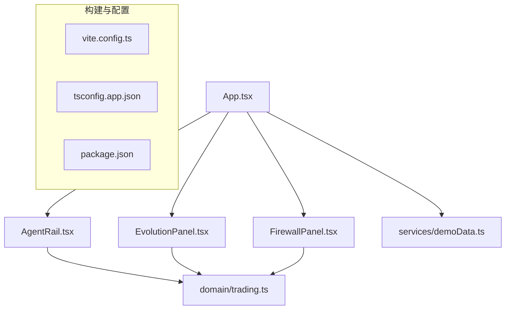
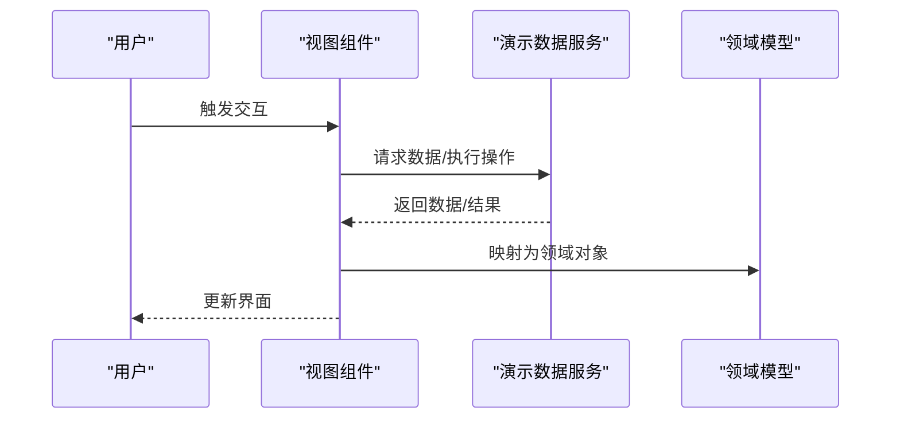
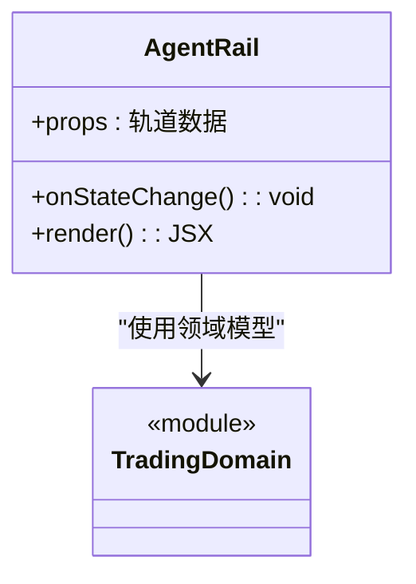
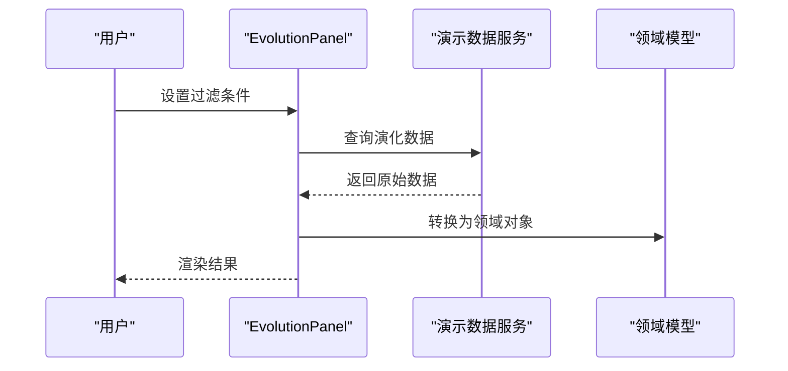
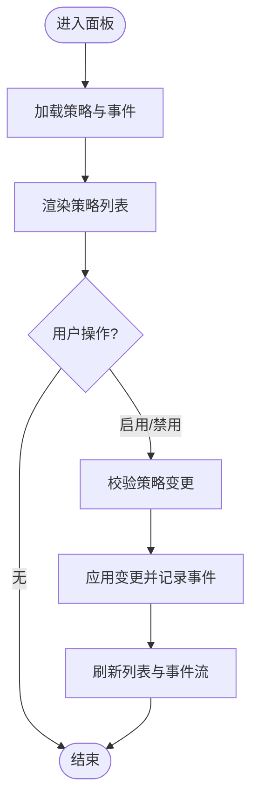
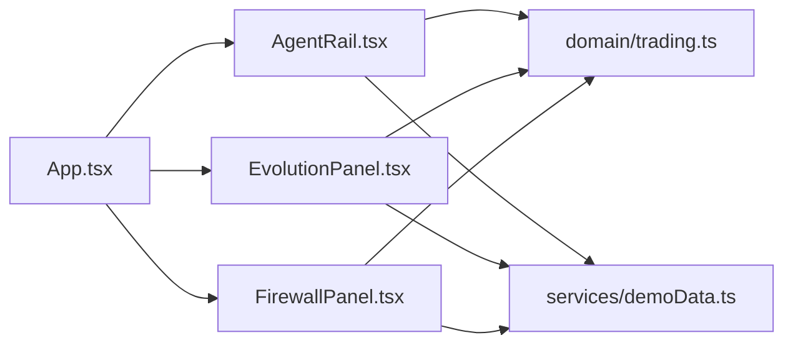

# API参考文档

<cite>
**本文引用的文件**   
- [web/src/App.tsx](file://web/src/App.tsx)
- [web/src/main.tsx](file://web/src/main.tsx)
- [web/src/components/AgentRail.tsx](file://web/src/components/AgentRail.tsx)
- [web/src/components/EvolutionPanel.tsx](file://web/src/components/EvolutionPanel.tsx)
- [web/src/components/FirewallPanel.tsx](file://web/src/components/FirewallPanel.tsx)
- [web/src/domain/trading.ts](file://web/src/domain/trading.ts)
- [web/src/services/demoData.ts](file://web/src/services/demoData.ts)
- [web/package.json](file://web/package.json)
- [web/tsconfig.app.json](file://web/tsconfig.app.json)
- [web/vite.config.ts](file://web/vite.config.ts)
</cite>

## 目录
1. [简介](#简介)
2. [项目结构](#项目结构)
3. [核心组件](#核心组件)
4. [架构总览](#架构总览)
5. [详细组件分析](#详细组件分析)
6. [依赖分析](#依赖分析)
7. [性能考虑](#性能考虑)
8. [故障排查指南](#故障排查指南)
9. [结论](#结论)
10. [附录](#附录)

## 简介
本API参考文档面向AdventureX前端应用，聚焦于公共接口与类型定义，覆盖以下范围：
- 组件Props接口：属性名称、数据类型、默认值与说明
- 业务领域模型：数据结构、字段说明、验证规则与关联关系
- 服务层方法：参数、返回值与异常处理约定
- TypeScript类型定义：接口、枚举与联合类型的完整参考
- 第三方集成规范与最佳实践
- 使用示例（以路径引用形式提供）

本项目为基于React的前端可视化应用，包含三个核心UI组件与一个交易领域模型，以及演示数据服务。

## 项目结构
项目采用按功能分层组织方式：
- components：可复用UI组件
- domain：领域模型与业务类型
- services：数据与服务逻辑
- App与main：应用入口与根组件挂载

图表来源
- [web/src/App.tsx](file://web/src/App.tsx)
- [web/src/components/AgentRail.tsx](file://web/src/components/AgentRail.tsx)
- [web/src/components/EvolutionPanel.tsx](file://web/src/components/EvolutionPanel.tsx)
- [web/src/components/FirewallPanel.tsx](file://web/src/components/FirewallPanel.tsx)
- [web/src/domain/trading.ts](file://web/src/domain/trading.ts)
- [web/src/services/demoData.ts](file://web/src/services/demoData.ts)
- [web/vite.config.ts](file://web/vite.config.ts)
- [web/tsconfig.app.json](file://web/tsconfig.app.json)
- [web/package.json](file://web/package.json)

章节来源
- [web/src/App.tsx](file://web/src/App.tsx)
- [web/src/main.tsx](file://web/src/main.tsx)
- [web/vite.config.ts](file://web/vite.config.ts)
- [web/tsconfig.app.json](file://web/tsconfig.app.json)
- [web/package.json](file://web/package.json)

## 核心组件
本节概述三个核心组件的职责与交互关系：
- AgentRail：展示与管理智能体轨道状态
- EvolutionPanel：呈现演化过程与结果
- FirewallPanel：管理与展示防火墙策略与事件

这些组件通过统一的领域模型进行数据交互，并通过演示数据服务获取初始或模拟数据。

章节来源
- [web/src/components/AgentRail.tsx](file://web/src/components/AgentRail.tsx)
- [web/src/components/EvolutionPanel.tsx](file://web/src/components/EvolutionPanel.tsx)
- [web/src/components/FirewallPanel.tsx](file://web/src/components/FirewallPanel.tsx)
- [web/src/domain/trading.ts](file://web/src/domain/trading.ts)
- [web/src/services/demoData.ts](file://web/src/services/demoData.ts)

## 架构总览
整体架构遵循“视图-领域-服务”的清晰分层：
- 视图层：React组件负责渲染与用户交互
- 领域层：交易领域模型定义数据结构与约束
- 服务层：演示数据服务提供数据源与操作

图表来源
- [web/src/components/AgentRail.tsx](file://web/src/components/AgentRail.tsx)
- [web/src/components/EvolutionPanel.tsx](file://web/src/components/EvolutionPanel.tsx)
- [web/src/components/FirewallPanel.tsx](file://web/src/components/FirewallPanel.tsx)
- [web/src/services/demoData.ts](file://web/src/services/demoData.ts)
- [web/src/domain/trading.ts](file://web/src/domain/trading.ts)

## 详细组件分析

### AgentRail 组件
职责：
- 接收并展示智能体轨道相关数据
- 支持对轨道状态的交互操作
- 将外部数据转换为领域模型用于渲染

关键Props接口（建议）：
- 数据源：来自演示数据服务的轨道列表
- 回调：用于上报状态变更或用户操作
- 控制项：是否只读、主题、尺寸等

使用示例（路径引用）：
- [web/src/App.tsx](file://web/src/App.tsx)

章节来源
- [web/src/components/AgentRail.tsx](file://web/src/components/AgentRail.tsx)
- [web/src/App.tsx](file://web/src/App.tsx)

#### 类图（概念性）

图表来源
- [web/src/components/AgentRail.tsx](file://web/src/components/AgentRail.tsx)
- [web/src/domain/trading.ts](file://web/src/domain/trading.ts)

### EvolutionPanel 组件
职责：
- 展示演化流程与阶段性结果
- 提供筛选与排序能力
- 与领域模型紧密耦合以显示结构化信息

关键Props接口（建议）：
- 演化数据集：来自演示数据服务
- 过滤条件：时间范围、阶段、标签等
- 回调：选择事件、导出事件等

使用示例（路径引用）：
- [web/src/App.tsx](file://web/src/App.tsx)

章节来源
- [web/src/components/EvolutionPanel.tsx](file://web/src/components/EvolutionPanel.tsx)
- [web/src/App.tsx](file://web/src/App.tsx)

#### 序列图（概念性）

图表来源
- [web/src/components/EvolutionPanel.tsx](file://web/src/components/EvolutionPanel.tsx)
- [web/src/services/demoData.ts](file://web/src/services/demoData.ts)
- [web/src/domain/trading.ts](file://web/src/domain/trading.ts)

### FirewallPanel 组件
职责：
- 管理防火墙策略与事件日志
- 提供策略启用/禁用与审计记录
- 与领域模型保持一致的数据结构

关键Props接口（建议）：
- 策略列表：来自演示数据服务
- 事件流：实时或批量事件
- 回调：策略变更、确认对话框等

使用示例（路径引用）：
- [web/src/App.tsx](file://web/src/App.tsx)

章节来源
- [web/src/components/FirewallPanel.tsx](file://web/src/components/FirewallPanel.tsx)
- [web/src/App.tsx](file://web/src/App.tsx)

#### 流程图（概念性）

图表来源
- [web/src/components/FirewallPanel.tsx](file://web/src/components/FirewallPanel.tsx)
- [web/src/services/demoData.ts](file://web/src/services/demoData.ts)
- [web/src/domain/trading.ts](file://web/src/domain/trading.ts)

## 依赖分析
组件与模块之间的依赖关系如下：
- 所有组件均依赖领域模型进行交易数据的统一表示
- 组件从演示数据服务获取数据，避免直接访问外部系统
- 应用入口负责组装组件与数据流

图表来源
- [web/src/App.tsx](file://web/src/App.tsx)
- [web/src/components/AgentRail.tsx](file://web/src/components/AgentRail.tsx)
- [web/src/components/EvolutionPanel.tsx](file://web/src/components/EvolutionPanel.tsx)
- [web/src/components/FirewallPanel.tsx](file://web/src/components/FirewallPanel.tsx)
- [web/src/domain/trading.ts](file://web/src/domain/trading.ts)
- [web/src/services/demoData.ts](file://web/src/services/demoData.ts)

章节来源
- [web/src/App.tsx](file://web/src/App.tsx)
- [web/src/domain/trading.ts](file://web/src/domain/trading.ts)
- [web/src/services/demoData.ts](file://web/src/services/demoData.ts)

## 性能考虑
- 数据量较大时，建议在服务层实现分页与增量更新
- 组件内部应避免不必要的重渲染，合理使用记忆化与状态提升
- 领域模型转换尽量在边界处完成，减少重复计算
- 对于实时事件流，采用节流与批处理策略降低UI压力

[本节为通用指导，不直接分析具体文件]

## 故障排查指南
常见问题与建议：
- 组件未渲染：检查Props是否正确传入与类型匹配
- 数据为空：确认演示数据服务是否正常返回数据
- 状态不同步：核对回调函数是否被正确调用与更新
- 类型错误：确保领域模型与组件Props的类型一致

章节来源
- [web/src/components/AgentRail.tsx](file://web/src/components/AgentRail.tsx)
- [web/src/components/EvolutionPanel.tsx](file://web/src/components/EvolutionPanel.tsx)
- [web/src/components/FirewallPanel.tsx](file://web/src/components/FirewallPanel.tsx)
- [web/src/services/demoData.ts](file://web/src/services/demoData.ts)
- [web/src/domain/trading.ts](file://web/src/domain/trading.ts)

## 结论
本参考文档梳理了AdventureX前端的组件、领域模型与服务层的接口与类型定义，提供了架构图表与使用指引。建议在实际开发中严格遵循类型契约与数据流转约定，以提升可维护性与稳定性。

[本节为总结性内容，不直接分析具体文件]

## 附录

### TypeScript类型定义参考
- 领域模型：交易相关的实体与枚举定义
- 组件Props：各组件对外暴露的属性接口
- 服务接口：演示数据服务的函数签名与返回类型

章节来源
- [web/src/domain/trading.ts](file://web/src/domain/trading.ts)
- [web/src/components/AgentRail.tsx](file://web/src/components/AgentRail.tsx)
- [web/src/components/EvolutionPanel.tsx](file://web/src/components/EvolutionPanel.tsx)
- [web/src/components/FirewallPanel.tsx](file://web/src/components/FirewallPanel.tsx)
- [web/src/services/demoData.ts](file://web/src/services/demoData.ts)

### 第三方集成规范与最佳实践
- 数据接入：通过服务层封装，保持组件与外部系统的解耦
- 错误处理：在服务层统一捕获与转换错误，向上抛出明确异常
- 鉴权与安全：在请求层添加必要的认证与校验
- 版本兼容：对外接口需保持向后兼容，变更需发布说明

[本节为通用指导，不直接分析具体文件]