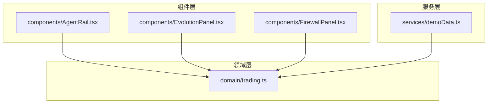
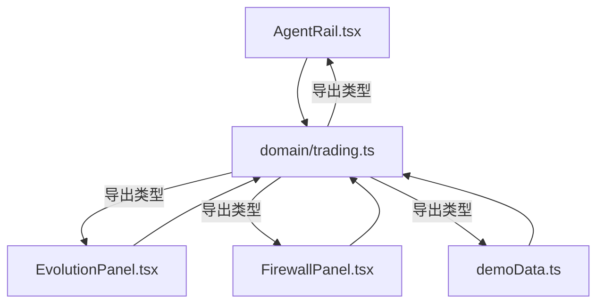
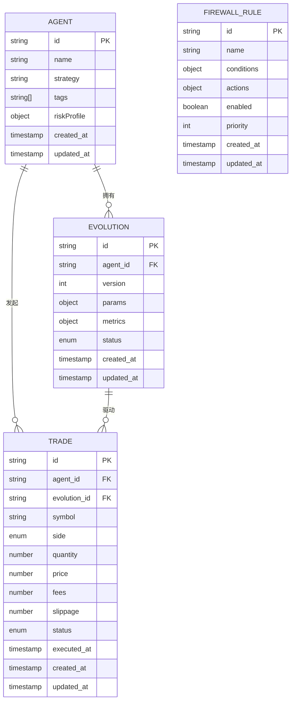
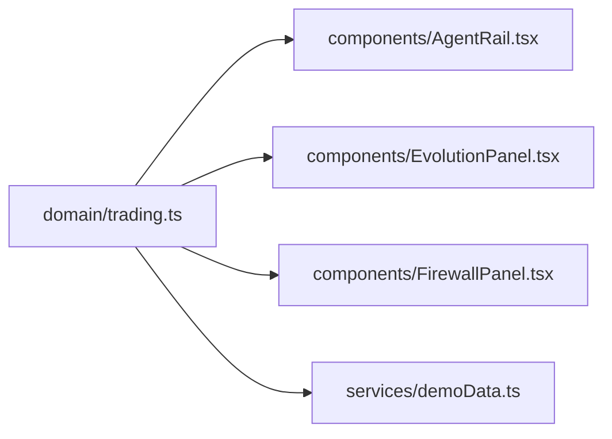

# 业务模型定义

<cite>
**本文引用的文件**   
- [trading.ts](file://web/src/domain/trading.ts)
- [AgentRail.tsx](file://web/src/components/AgentRail.tsx)
- [EvolutionPanel.tsx](file://web/src/components/EvolutionPanel.tsx)
- [FirewallPanel.tsx](file://web/src/components/FirewallPanel.tsx)
- [demoData.ts](file://web/src/services/demoData.ts)
</cite>

## 目录
1. [简介](#简介)
2. [项目结构](#项目结构)
3. [核心组件](#核心组件)
4. [架构总览](#架构总览)
5. [详细组件分析](#详细组件分析)
6. [依赖关系分析](#依赖关系分析)
7. [性能考虑](#性能考虑)
8. [故障排查指南](#故障排查指南)
9. [结论](#结论)
10. [附录](#附录) 

## 简介
本文件聚焦于交易领域模型的数据结构与类型定义，覆盖智能体(Agent)、进化(Evolution)、防火墙规则(FirewallRule)与交易(Trade)等核心实体。文档从字段定义、数据类型、业务规则、关系映射、验证约束、序列化格式、生命周期与状态转换，以及最佳实践等方面进行全面说明，帮助开发者正确理解和使用这些模型。

## 项目结构
本项目为前端应用，领域模型集中在领域层，UI 组件与服务层通过导入领域类型进行交互。关键路径如下：
- 领域模型定义：web/src/domain/trading.ts
- 展示与交互组件：web/src/components/AgentRail.tsx、EvolutionPanel.tsx、FirewallPanel.tsx
- 演示数据与服务：web/src/services/demoData.ts

图表来源
- [trading.ts](file://web/src/domain/trading.ts)
- [AgentRail.tsx](file://web/src/components/AgentRail.tsx)
- [EvolutionPanel.tsx](file://web/src/components/EvolutionPanel.tsx)
- [FirewallPanel.tsx](file://web/src/components/FirewallPanel.tsx)
- [demoData.ts](file://web/src/services/demoData.ts)

章节来源
- [trading.ts](file://web/src/domain/trading.ts)
- [AgentRail.tsx](file://web/src/components/AgentRail.tsx)
- [EvolutionPanel.tsx](file://web/src/components/EvolutionPanel.tsx)
- [FirewallPanel.tsx](file://web/src/components/FirewallPanel.tsx)
- [demoData.ts](file://web/src/services/demoData.ts)

## 核心组件
本节概述各核心实体的职责与相互关系，并给出字段与规则的概览。

- 智能体(Agent)
  - 职责：描述参与交易的智能体主体，包含标识、名称、策略参数、能力标签、风险偏好等。
  - 关键字段（示例）：id、name、strategy、tags、riskProfile、createdAt、updatedAt。
  - 业务规则：id 唯一；name 非空且长度受限；strategy 需符合策略枚举或模式；tags 用于筛选与分组；riskProfile 影响风控阈值。
  - 生命周期：创建 -> 激活 -> 休眠/停用 -> 归档。

- 进化(Evolution)
  - 职责：记录智能体策略或参数的演化版本，支持回溯与对比。
  - 关键字段（示例）：id、agentId、version、params、metrics、status、createdAt、updatedAt。
  - 业务规则：同一 agentId 下 version 严格递增；metrics 用于评估效果；status 控制可用性与发布流程。
  - 生命周期：草稿 -> 评审 -> 已发布 -> 回滚/废弃。

- 防火墙规则(FirewallRule)
  - 职责：定义交易执行前的准入与限制条件，如标的白名单、最大仓位、时间窗口等。
  - 关键字段（示例）：id、name、conditions、actions、enabled、priority、createdAt、updatedAt。
  - 业务规则：conditions 为布尔表达式集合；actions 决定放行/拒绝/告警；priority 控制匹配顺序；enabled 控制生效。
  - 生命周期：草稿 -> 启用 -> 禁用 -> 删除。

- 交易(Trade)
  - 职责：记录一次具体的交易行为，包括方向、数量、价格、滑点、手续费、成交状态等。
  - 关键字段（示例）：id、agentId、evolutionId、symbol、side、quantity、price、fees、slippage、status、executedAt、createdAt、updatedAt。
  - 业务规则：quantity 与 price 必须为正数；side 限定为买入/卖出；status 遵循订单状态机；关联的 agentId 与 evolutionId 必须存在且有效。
  - 生命周期：待处理 -> 已提交 -> 部分成交 -> 全部成交 -> 取消/失败。

章节来源
- [trading.ts](file://web/src/domain/trading.ts)

## 架构总览
下图展示了领域模型在系统中的位置与交互方式。组件与服务通过导入领域类型来构建与消费数据，确保前后端一致的类型契约。

图表来源
- [trading.ts](file://web/src/domain/trading.ts)
- [AgentRail.tsx](file://web/src/components/AgentRail.tsx)
- [EvolutionPanel.tsx](file://web/src/components/EvolutionPanel.tsx)
- [FirewallPanel.tsx](file://web/src/components/FirewallPanel.tsx)
- [demoData.ts](file://web/src/services/demoData.ts)

## 详细组件分析

### 智能体(Agent)
- 字段定义与类型
  - id: 字符串，全局唯一标识。
  - name: 字符串，非空，长度上限建议 64。
  - strategy: 字符串或对象，表示策略配置，需满足策略校验器。
  - tags: 字符串数组，用于分类与检索。
  - riskProfile: 字符串或对象，描述风险偏好与限额。
  - createdAt/updatedAt: 时间戳，自动维护。
- 业务规则
  - 唯一性：id 不可重复。
  - 有效性：name 非空；strategy 必须通过策略校验；tags 元素非空。
  - 可观测性：更新时刷新 updatedAt。
- 生命周期与状态
  - 状态：active/inactive/archived。
  - 转换：创建后默认 active；inactive 不可参与新交易；archived 仅保留历史。
- 数据验证
  - 必填项：id、name。
  - 格式：时间戳 ISO 8601；tags 去重。
- 序列化
  - JSON 键名与字段一致；时间戳使用字符串形式。
- 示例（示意）
  - { "id": "a1", "name": "趋势跟踪", "strategy": "trend_v1", "tags": ["趋势","中频"], "riskProfile": {"maxDrawdown": 0.1}, "createdAt": "2024-01-01T00:00:00Z", "updatedAt": "2024-06-01T00:00:00Z" }

章节来源
- [trading.ts](file://web/src/domain/trading.ts)

### 进化(Evolution)
- 字段定义与类型
  - id: 字符串，全局唯一。
  - agentId: 字符串，外键指向 Agent。
  - version: 整数或语义化版本字符串，单调递增。
  - params: 对象，策略参数快照。
  - metrics: 对象，回测/实盘指标摘要。
  - status: 枚举，如 draft/released/rolled_back。
  - createdAt/updatedAt: 时间戳。
- 业务规则
  - 版本约束：同一 agentId 下 version 严格递增。
  - 发布约束：released 状态需通过评审指标阈值。
  - 可追溯：每次变更生成新版本，禁止就地修改。
- 生命周期与状态
  - 状态：draft -> released -> rolled_back。
  - 转换：draft 可编辑；released 可被引用；rolled_back 不可再发布。
- 数据验证
  - 必填项：agentId、version、params。
  - 数值范围：metrics 中的比率需在 [0,1] 区间。
- 序列化
  - JSON 键名与字段一致；params/metrics 保持结构化对象。
- 示例（示意）
  - { "id": "e1", "agentId": "a1", "version": 3, "params": {"lookback": 20, "threshold": 0.02}, "metrics": {"sharpe": 1.2, "drawdown": 0.08}, "status": "released", "createdAt": "2024-05-01T00:00:00Z", "updatedAt": "2024-06-10T00:00:00Z" }

章节来源
- [trading.ts](file://web/src/domain/trading.ts)

### 防火墙规则(FirewallRule)
- 字段定义与类型
  - id: 字符串，全局唯一。
  - name: 字符串，非空，长度上限建议 128。
  - conditions: 对象或数组，描述匹配条件。
  - actions: 对象或数组，描述动作（放行/拒绝/告警）。
  - enabled: 布尔值，是否生效。
  - priority: 整数，越小优先级越高。
  - createdAt/updatedAt: 时间戳。
- 业务规则
  - 匹配顺序：按 priority 升序匹配，命中即返回结果。
  - 互斥：同组 rules 不应出现冲突条件。
  - 审计：启用/禁用需记录操作人。
- 生命周期与状态
  - 状态：draft/enabled/disabled/deleted。
  - 转换：draft -> enabled；enabled <-> disabled；deleted 软删除。
- 数据验证
  - 必填项：name、conditions、actions。
  - 数值范围：priority 为非负整数。
- 序列化
  - JSON 键名与字段一致；conditions/actions 保持结构化表达。
- 示例（示意）
  - { "id": "r1", "name": "标的白名单", "conditions": {"symbols": ["BTC/USDT"]}, "actions": {"allow": true, "alert": false}, "enabled": true, "priority": 10, "createdAt": "2024-04-01T00:00:00Z", "updatedAt": "2024-06-15T00:00:00Z" }

章节来源
- [trading.ts](file://web/src/domain/trading.ts)

### 交易(Trade)
- 字段定义与类型
  - id: 字符串，全局唯一。
  - agentId: 字符串，外键指向 Agent。
  - evolutionId: 字符串，外键指向 Evolution。
  - symbol: 字符串，交易对代码。
  - side: 枚举，buy/sell。
  - quantity: 数字，正数。
  - price: 数字，正数。
  - fees: 数字，非负。
  - slippage: 数字，非负。
  - status: 枚举，pending/submitted/partial/filled/cancelled/failed。
  - executedAt: 时间戳，可选。
  - createdAt/updatedAt: 时间戳。
- 业务规则
  - 完整性：agentId、evolutionId、symbol、side、quantity、price 必填。
  - 一致性：quantity*price 应与金额口径一致；fees/slippage 非负。
  - 幂等：相同请求应返回相同 Trade 实例。
- 生命周期与状态
  - 状态机：pending -> submitted -> partial -> filled；任意阶段可 cancel/failed。
  - 转换约束：filled 后不可变更；cancelled/failed 需记录原因。
- 数据验证
  - 必填项：id、agentId、evolutionId、symbol、side、quantity、price、status。
  - 数值范围：quantity、price > 0；fees、slippage >= 0。
- 序列化
  - JSON 键名与字段一致；时间戳使用字符串；数值避免浮点误差，建议使用高精度类型或分位单位。
- 示例（示意）
  - { "id": "t1", "agentId": "a1", "evolutionId": "e1", "symbol": "BTC/USDT", "side": "buy", "quantity": 0.1, "price": 60000, "fees": 6, "slippage": 0.5, "status": "filled", "executedAt": "2024-06-20T12:00:00Z", "createdAt": "2024-06-20T11:59:00Z", "updatedAt": "2024-06-20T12:00:00Z" }

章节来源
- [trading.ts](file://web/src/domain/trading.ts)

### 实体关系与依赖
- 一对多
  - Agent 1..* Evolution：一个智能体拥有多个进化版本。
  - Agent 1..* Trade：一个智能体产生多笔交易。
  - Evolution 1..* Trade：一个进化版本驱动多笔交易。
- 独立实体
  - FirewallRule 独立存在，可在交易前置校验中被引用。
- 依赖方向
  - Trade 依赖 Agent 与 Evolution 的存在性与有效性。
  - 组件与服务仅依赖类型定义，不直接耦合实现细节。

图表来源
- [trading.ts](file://web/src/domain/trading.ts)

## 依赖关系分析
- 模块内聚
  - trading.ts 集中定义所有领域类型，保证高内聚。
- 外部耦合
  - 组件与服务仅通过导入类型与接口进行交互，降低耦合度。
- 潜在循环依赖
  - 当前结构无循环导入；若后续引入更多领域逻辑，需保持单向依赖。

图表来源
- [trading.ts](file://web/src/domain/trading.ts)
- [AgentRail.tsx](file://web/src/components/AgentRail.tsx)
- [EvolutionPanel.tsx](file://web/src/components/EvolutionPanel.tsx)
- [FirewallPanel.tsx](file://web/src/components/FirewallPanel.tsx)
- [demoData.ts](file://web/src/services/demoData.ts)

章节来源
- [trading.ts](file://web/src/domain/trading.ts)
- [AgentRail.tsx](file://web/src/components/AgentRail.tsx)
- [EvolutionPanel.tsx](file://web/src/components/EvolutionPanel.tsx)
- [FirewallPanel.tsx](file://web/src/components/FirewallPanel.tsx)
- [demoData.ts](file://web/src/services/demoData.ts)

## 性能考虑
- 类型检查
  - 使用 TypeScript 编译期类型检查减少运行时错误。
- 数据结构
  - 大对象（如 params/metrics）按需加载与缓存，避免全量传输。
- 序列化
  - 时间戳统一为 ISO 8601 字符串；数值采用高精度表示以避免精度丢失。
- 索引与查询
  - 对外暴露的查询接口应对常用过滤字段建立索引（如 agentId、symbol、status）。

## 故障排查指南
- 常见错误
  - 字段缺失：必填字段未提供导致校验失败。
  - 类型不符：数值/枚举/时间戳类型不正确。
  - 状态非法：违反状态机转换规则。
  - 外键无效：agentId/evolutionId 不存在。
- 定位方法
  - 检查入参是否符合类型定义与约束。
  - 核对状态转换是否合法。
  - 查看日志中的错误码与上下文信息。
- 修复建议
  - 增加前端表单校验与后端二次校验。
  - 为状态变更添加审计日志。
  - 对外键关联进行存在性检查。

章节来源
- [trading.ts](file://web/src/domain/trading.ts)

## 结论
本文档系统化梳理了交易领域模型的数据结构与类型定义，明确了字段、规则、关系、生命周期与序列化格式，并提供最佳实践与排障指引。遵循本文规范有助于提升系统的一致性与可维护性。

## 附录
- 命名约定
  - 字段使用小驼峰；枚举值使用小写下划线。
- 版本管理
  - 领域类型变更需保持向后兼容，新增字段设置默认值。
- 测试建议
  - 针对边界条件与异常路径编写单元测试，覆盖校验与状态机。