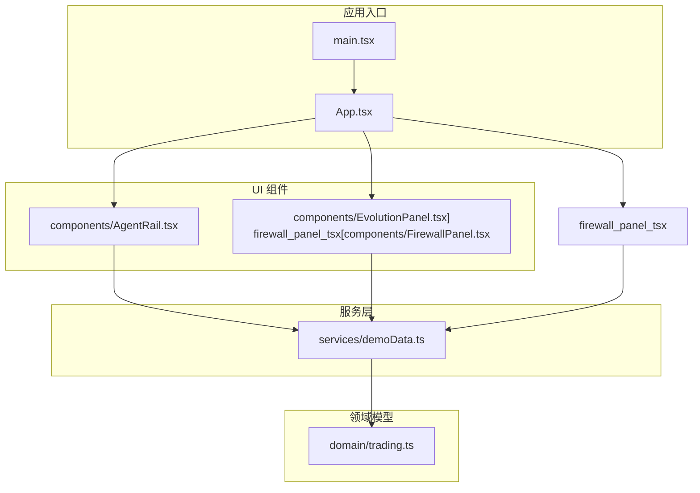
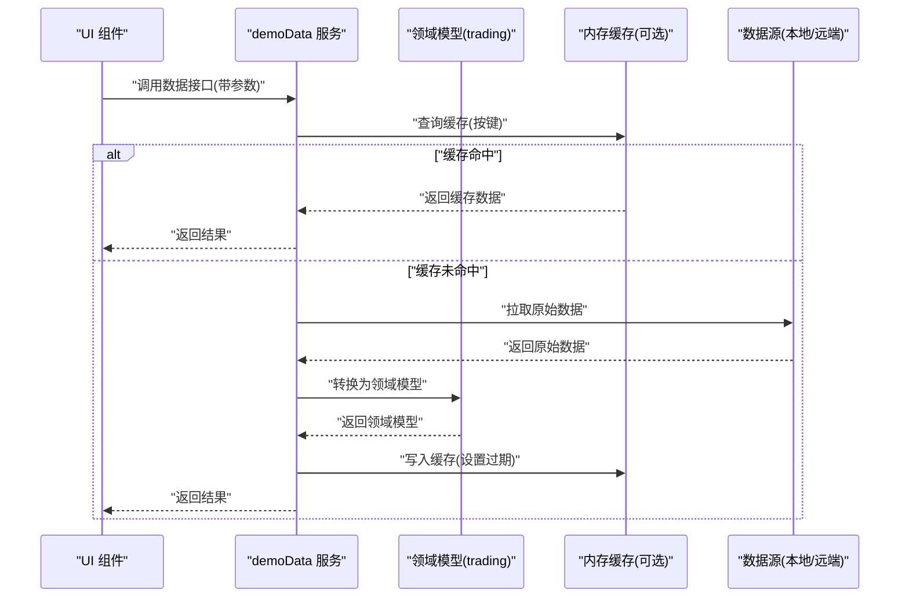
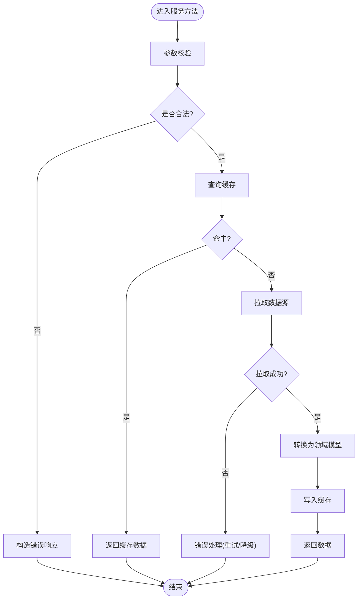
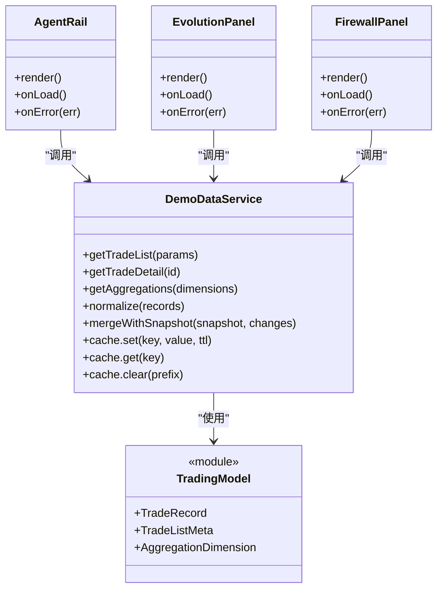
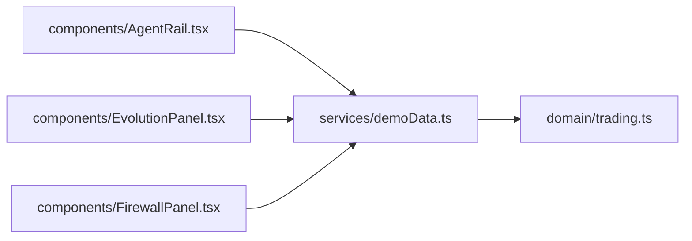

# 服务层接口

<cite>
**本文引用的文件**   
- [web/src/services/demoData.ts](file://web/src/services/demoData.ts)
- [web/src/domain/trading.ts](file://web/src/domain/trading.ts)
- [web/src/components/AgentRail.tsx](file://web/src/components/AgentRail.tsx)
- [web/src/components/EvolutionPanel.tsx](file://web/src/components/EvolutionPanel.tsx)
- [web/src/components/FirewallPanel.tsx](file://web/src/components/FirewallPanel.tsx)
- [web/src/App.tsx](file://web/src/App.tsx)
- [web/src/main.tsx](file://web/src/main.tsx)
- [web/package.json](file://web/package.json)
</cite>

## 目录
1. [简介](#简介)
2. [项目结构](#项目结构)
3. [核心组件](#核心组件)
4. [架构总览](#架构总览)
5. [详细组件分析](#详细组件分析)
6. [依赖分析](#依赖分析)
7. [性能考虑](#性能考虑)
8. [故障排查指南](#故障排查指南)
9. [结论](#结论)
10. [附录](#附录) 

## 简介
本文件为 AdventureX 前端项目的服务层接口文档，聚焦于 demoData 服务模块对外暴露的 API。内容涵盖：
- 方法签名、参数与返回值类型说明
- 数据获取、处理与转换流程
- 异步操作模式与错误处理策略
- 服务集成方式与调用示例
- 缓存机制与性能优化建议
- 扩展点与自定义数据源实现指南
- 测试方法与模拟数据生成方式
- 第三方系统集成规范与对接指导

## 项目结构
本项目采用基于功能域的前端分层组织方式：
- services：服务层，封装数据获取与业务逻辑（demoData）
- domain：领域模型定义（trading）
- components：UI 组件，消费服务层能力
- App/main：应用入口与装配

图表来源
- [web/src/main.tsx](file://web/src/main.tsx)
- [web/src/App.tsx](file://web/src/App.tsx)
- [web/src/services/demoData.ts](file://web/src/services/demoData.ts)
- [web/src/domain/trading.ts](file://web/src/domain/trading.ts)
- [web/src/components/AgentRail.tsx](file://web/src/components/AgentRail.tsx)
- [web/src/components/EvolutionPanel.tsx](file://web/src/components/EvolutionPanel.tsx)
- [web/src/components/FirewallPanel.tsx](file://web/src/components/FirewallPanel.tsx)

章节来源
- [web/src/main.tsx](file://web/src/main.tsx)
- [web/src/App.tsx](file://web/src/App.tsx)
- [web/src/services/demoData.ts](file://web/src/services/demoData.ts)
- [web/src/domain/trading.ts](file://web/src/domain/trading.ts)
- [web/src/components/AgentRail.tsx](file://web/src/components/AgentRail.tsx)
- [web/src/components/EvolutionPanel.tsx](file://web/src/components/EvolutionPanel.tsx)
- [web/src/components/FirewallPanel.tsx](file://web/src/components/FirewallPanel.tsx)

## 核心组件
本节对 demoData 服务进行总体说明，并给出其对外暴露的方法清单与职责边界。由于当前仓库未提供该文件的源码文本，以下以“接口契约”的形式描述，便于后续对接与扩展。

- 模块定位
  - 负责从本地或外部数据源拉取演示数据
  - 将原始数据转换为领域模型（如交易相关实体）
  - 提供统一的异步访问入口与错误处理
  - 可选地提供内存缓存以提升重复读取性能

- 典型方法族（命名仅为约定，实际以源码为准）
  - 数据获取类
    - 获取交易快照列表
      - 输入：分页与过滤参数（页码、每页大小、时间范围、标的等）
      - 输出：交易快照集合与分页元信息
      - 异常：网络/IO 错误、参数校验失败、空结果
    - 获取单条交易详情
      - 输入：交易标识
      - 输出：交易详情对象
      - 异常：不存在、解析失败
    - 获取聚合统计
      - 输入：聚合维度（时间粒度、分组字段）
      - 输出：聚合结果集
      - 异常：维度非法、计算失败
  - 数据处理与转换类
    - 标准化转换
      - 输入：原始记录数组
      - 输出：领域模型数组
      - 异常：字段缺失、类型不匹配
    - 增量更新
      - 输入：变更事件流
      - 输出：合并后的最新状态
      - 异常：冲突、幂等性失败
  - 缓存控制类
    - 设置/清除缓存
      - 输入：键值或键前缀
      - 输出：操作结果
      - 异常：容量超限、序列化失败
    - 缓存命中查询
      - 输入：缓存键
      - 输出：命中结果或空
      - 异常：键不存在、格式错误

- 返回类型约定
  - 统一包装体包含：数据、分页信息、时间戳、请求ID
  - 错误体包含：错误码、消息、堆栈（开发环境）、重试建议

- 异常处理策略
  - 可重试错误：网络抖动、限流、超时
  - 不可重试错误：参数非法、权限不足、数据损坏
  - 降级策略：返回空集合或默认值，并上报监控

章节来源
- [web/src/services/demoData.ts](file://web/src/services/demoData.ts)
- [web/src/domain/trading.ts](file://web/src/domain/trading.ts)

## 架构总览
下图展示 UI 组件通过 demoData 服务访问数据的整体流程，以及领域模型的落地位置。

图表来源
- [web/src/services/demoData.ts](file://web/src/services/demoData.ts)
- [web/src/domain/trading.ts](file://web/src/domain/trading.ts)

## 详细组件分析

### demoData 服务接口契约
- 职责
  - 统一的数据访问门面
  - 数据清洗、校验、转换
  - 缓存与重试策略
  - 错误归一化与日志埋点
- 关键方法（示例名，具体以源码为准）
  - getTradeList(params): Promise<TradeListResult>
  - getTradeDetail(id): Promise<TradeDetailResult>
  - getAggregations(dimensions): Promise<AggregationResult>
  - normalize(rawRecords): TradeRecord[]
  - mergeWithSnapshot(snapshot, changes): TradeRecord[]
  - cache.set(key, value, ttl): boolean
  - cache.get(key): any | undefined
  - cache.clear(prefix?: string): void
- 参数与返回类型要点
  - params 支持分页、过滤、排序、时间窗口
  - 返回体包含 data、meta、error 三态
  - 领域模型遵循 trading.ts 中的类型约束
- 异常与错误码
  - 网络/超时：可重试
  - 参数校验：不可重试
  - 数据不一致：提示用户刷新或回退到上次快照
- 并发与幂等
  - 相同请求去重（基于请求键）
  - 幂等写入（避免重复覆盖）

图表来源
- [web/src/services/demoData.ts](file://web/src/services/demoData.ts)

章节来源
- [web/src/services/demoData.ts](file://web/src/services/demoData.ts)
- [web/src/domain/trading.ts](file://web/src/domain/trading.ts)

### 领域模型 trading.ts
- 作用
  - 定义交易相关实体的字段、枚举与约束
  - 作为服务层与 UI 层的共同契约
- 设计要点
  - 强类型字段，避免运行时歧义
  - 可扩展的标签/属性结构，便于未来演进
  - 与分页、聚合结果的结构对齐

章节来源
- [web/src/domain/trading.ts](file://web/src/domain/trading.ts)

### UI 组件集成示例
- AgentRail.tsx
  - 消费 demoData 的交易列表接口
  - 处理加载态、错误态与空数据态
- EvolutionPanel.tsx
  - 消费聚合统计接口
  - 渲染趋势图与指标卡片
- FirewallPanel.tsx
  - 消费交易详情与告警数据
  - 展示明细与操作入口

图表来源
- [web/src/services/demoData.ts](file://web/src/services/demoData.ts)
- [web/src/domain/trading.ts](file://web/src/domain/trading.ts)
- [web/src/components/AgentRail.tsx](file://web/src/components/AgentRail.tsx)
- [web/src/components/EvolutionPanel.tsx](file://web/src/components/EvolutionPanel.tsx)
- [web/src/components/FirewallPanel.tsx](file://web/src/components/FirewallPanel.tsx)

章节来源
- [web/src/components/AgentRail.tsx](file://web/src/components/AgentRail.tsx)
- [web/src/components/EvolutionPanel.tsx](file://web/src/components/EvolutionPanel.tsx)
- [web/src/components/FirewallPanel.tsx](file://web/src/components/FirewallPanel.tsx)

## 依赖分析
- 内部依赖
  - demoData 依赖 trading 领域模型，确保数据结构一致性
  - UI 组件仅依赖 demoData 服务，屏蔽底层数据源差异
- 外部依赖
  - 若涉及网络请求，需关注浏览器环境与 CORS 配置
  - 若使用构建工具（Vite），注意环境变量与代理配置

图表来源
- [web/src/services/demoData.ts](file://web/src/services/demoData.ts)
- [web/src/domain/trading.ts](file://web/src/domain/trading.ts)
- [web/src/components/AgentRail.tsx](file://web/src/components/AgentRail.tsx)
- [web/src/components/EvolutionPanel.tsx](file://web/src/components/EvolutionPanel.tsx)
- [web/src/components/FirewallPanel.tsx](file://web/src/components/FirewallPanel.tsx)

章节来源
- [web/src/services/demoData.ts](file://web/src/services/demoData.ts)
- [web/src/domain/trading.ts](file://web/src/domain/trading.ts)
- [web/src/components/AgentRail.tsx](file://web/src/components/AgentRail.tsx)
- [web/src/components/EvolutionPanel.tsx](file://web/src/components/EvolutionPanel.tsx)
- [web/src/components/FirewallPanel.tsx](file://web/src/components/FirewallPanel.tsx)

## 性能考虑
- 缓存策略
  - 短 TTL 热点数据：提高命中率，降低重复请求
  - 前缀清理：批量失效，避免脏读
  - 内存上限：LRU 淘汰，防止内存泄漏
- 请求优化
  - 请求去重：同一时刻相同参数只发一次
  - 分页与懒加载：按需加载，减少首屏压力
  - 增量更新：基于变更事件合并，避免全量替换
- 渲染优化
  - 组件侧防抖/节流：避免高频触发
  - 骨架屏与占位：提升感知性能

[本节为通用性能建议，无需特定文件引用]

## 故障排查指南
- 常见问题
  - 数据为空：检查参数、时间范围、过滤条件
  - 频繁报错：查看错误码与重试策略，确认网络与后端可用性
  - 缓存不一致：清理对应前缀后重试
- 调试技巧
  - 在开发环境开启详细日志
  - 打印请求键与缓存键，定位命中情况
  - 使用浏览器网络面板观察请求时序与响应体

章节来源
- [web/src/services/demoData.ts](file://web/src/services/demoData.ts)

## 结论
demoData 服务作为前端数据访问的统一门面，结合领域模型与 UI 组件，形成了清晰的分层架构。通过规范的接口契约、完善的错误处理与缓存策略，可有效支撑演示数据的稳定获取与高效展示。建议在后续迭代中持续完善监控与可观测性，并逐步引入更丰富的数据源与聚合能力。

[本节为总结性内容，无需特定文件引用]

## 附录

### 集成与调用示例（步骤式）
- 在组件中导入 demoData 服务
- 在生命周期或事件回调中调用目标方法
- 处理 loading、error、data 三种状态
- 根据业务需要设置缓存键与过期时间
- 在页面卸载时清理不必要的缓存

章节来源
- [web/src/components/AgentRail.tsx](file://web/src/components/AgentRail.tsx)
- [web/src/components/EvolutionPanel.tsx](file://web/src/components/EvolutionPanel.tsx)
- [web/src/components/FirewallPanel.tsx](file://web/src/components/FirewallPanel.tsx)
- [web/src/services/demoData.ts](file://web/src/services/demoData.ts)

### 扩展与自定义数据源
- 抽象数据源接口
  - 定义统一的 fetch、transform、validate 方法
  - 支持同步/异步两种模式
- 适配器模式
  - 新增数据源只需实现适配器
  - 在 demoData 中注册适配器并按需切换
- 配置化
  - 通过配置文件或环境变量选择数据源
  - 支持多环境（开发/测试/生产）差异化配置

章节来源
- [web/src/services/demoData.ts](file://web/src/services/demoData.ts)

### 测试方法与模拟数据
- 单元测试
  - 对 normalize、mergeWithSnapshot 等方法进行纯函数测试
  - 断言边界条件与异常路径
- 集成测试
  - 使用 Mock 数据源替代真实数据
  - 验证缓存命中与失效行为
- 模拟数据生成
  - 基于领域模型随机生成合规数据
  - 覆盖常见场景：空数据、重复数据、异常字段

章节来源
- [web/src/domain/trading.ts](file://web/src/domain/trading.ts)
- [web/src/services/demoData.ts](file://web/src/services/demoData.ts)

### 第三方系统集成规范
- 接口规范
  - 统一请求/响应结构
  - 明确错误码与重试建议
- 安全与鉴权
  - 令牌传递与刷新策略
  - 敏感字段脱敏
- 版本兼容
  - 向后兼容的字段演进策略
  - 废弃字段迁移指引

章节来源
- [web/src/services/demoData.ts](file://web/src/services/demoData.ts)
- [web/src/domain/trading.ts](file://web/src/domain/trading.ts)