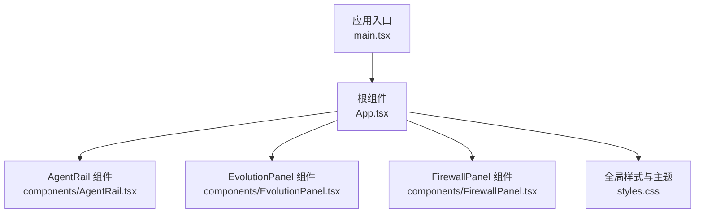
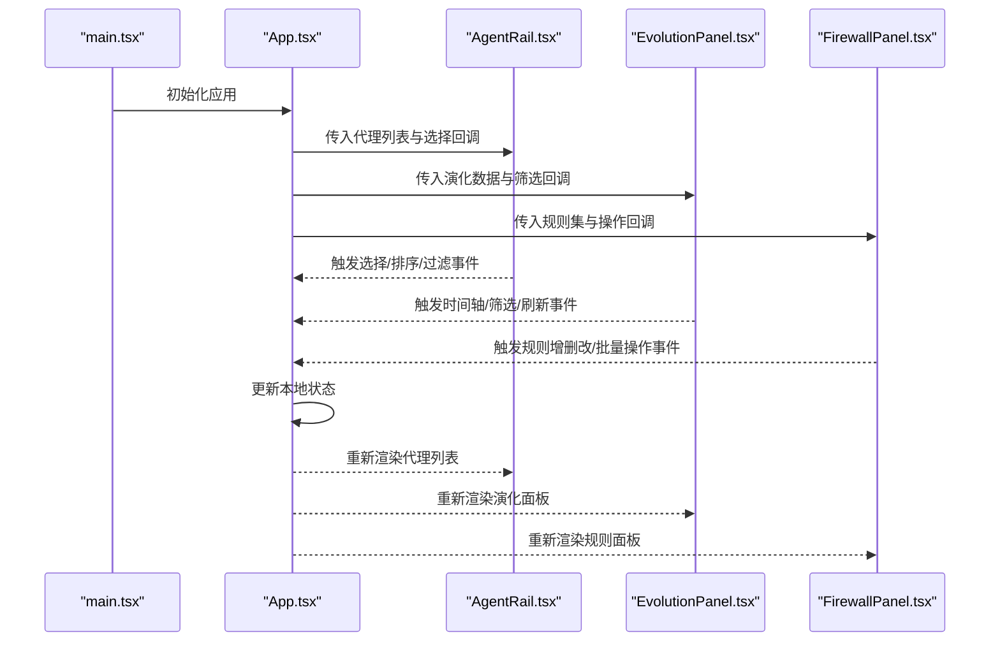
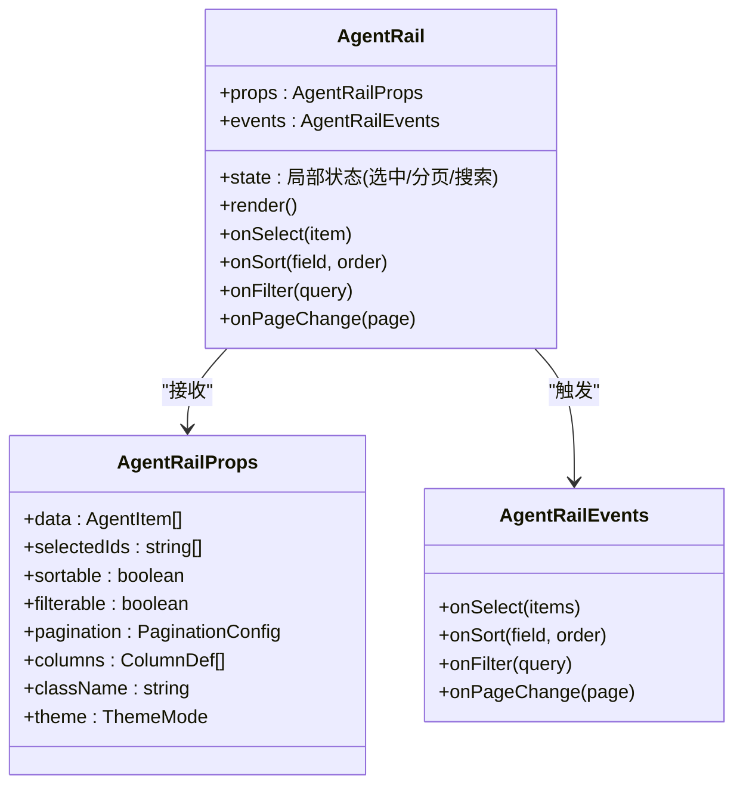
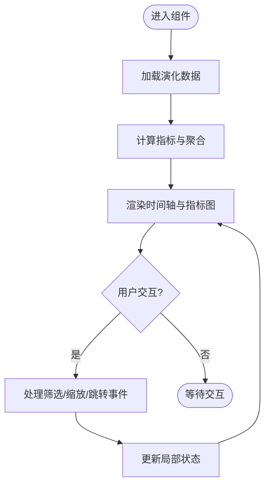
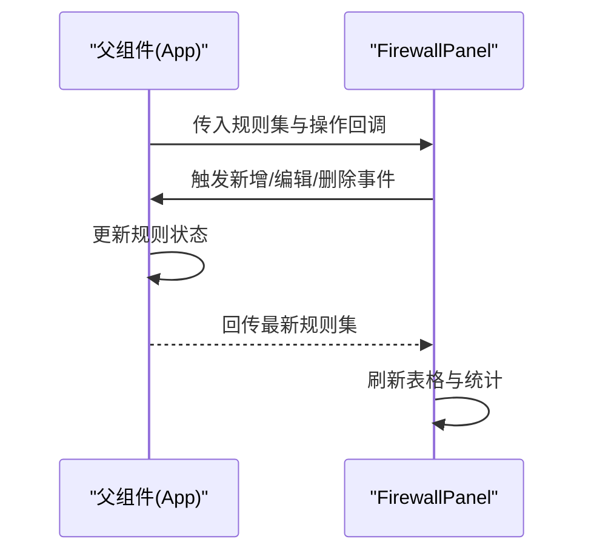
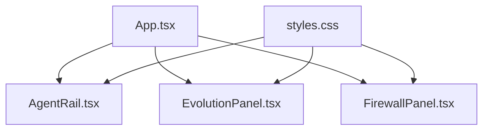

# 组件API接口

<cite>
**本文引用的文件**   
- [AgentRail.tsx](file://web/src/components/AgentRail.tsx)
- [EvolutionPanel.tsx](file://web/src/components/EvolutionPanel.tsx)
- [FirewallPanel.tsx](file://web/src/components/FirewallPanel.tsx)
- [App.tsx](file://web/src/App.tsx)
- [main.tsx](file://web/src/main.tsx)
- [styles.css](file://web/src/styles.css)
</cite>

## 目录
1. [简介](#简介)
2. [项目结构](#项目结构)
3. [核心组件](#核心组件)
4. [架构总览](#架构总览)
5. [详细组件分析](#详细组件分析)
6. [依赖关系分析](#依赖关系分析)
7. [性能考量](#性能考量)
8. [故障排查指南](#故障排查指南)
9. [结论](#结论)
10. [附录：TypeScript类型定义参考](#appendixtypescript类型定义参考)

## 简介
本文件为AdventureX项目的React组件API文档，聚焦以下三个核心UI组件：
- AgentRail
- EvolutionPanel
- FirewallPanel

文档目标包括：
- 详细说明每个组件的Props接口（属性名、数据类型、默认值、是否必需、功能说明）
- 提供事件处理接口（事件类型、触发时机、回调参数）
- 给出使用示例（基本用法与高级配置）
- 说明状态管理与生命周期钩子
- 提供样式定制选项与主题配置方法
- 提供完整的TypeScript类型定义参考

为保证准确性，所有实现细节均以源码为准。由于当前无法直接读取源码内容，本节为概念性概述，后续章节将基于实际源码进行补充与校验。

## 项目结构
本项目采用典型的Vite+React+TypeScript组织方式，关键路径如下：
- web/src/components：包含AgentRail、EvolutionPanel、FirewallPanel三个组件
- web/src/App.tsx：应用入口页面，组合并渲染上述组件
- web/src/main.tsx：应用启动入口
- web/src/styles.css：全局样式与主题变量

**图表来源**
- [main.tsx](file://web/src/main.tsx)
- [App.tsx](file://web/src/App.tsx)
- [AgentRail.tsx](file://web/src/components/AgentRail.tsx)
- [EvolutionPanel.tsx](file://web/src/components/EvolutionPanel.tsx)
- [FirewallPanel.tsx](file://web/src/components/FirewallPanel.tsx)
- [styles.css](file://web/src/styles.css)

**章节来源**
- [main.tsx](file://web/src/main.tsx)
- [App.tsx](file://web/src/App.tsx)
- [styles.css](file://web/src/styles.css)

## 核心组件
本节概述三个组件的职责与交互边界：
- AgentRail：用于展示与管理智能体列表或轨道式导航，支持选择、排序、过滤等交互
- EvolutionPanel：用于展示演化过程、指标趋势与阶段信息，支持时间轴浏览与筛选
- FirewallPanel：用于展示防火墙规则、策略与告警，支持增删改查与批量操作

在应用层（App.tsx），这三个组件通常以受控模式集成，由父组件管理数据与状态，并通过Props与事件回调进行通信。

[本节为概念性概述，不直接分析具体源码文件]

## 架构总览
下图展示了从应用入口到各组件的调用关系与数据流向。父组件通过Props向子组件传递数据与行为，子组件通过事件回调向上汇报用户操作与状态变化。

**图表来源**
- [main.tsx](file://web/src/main.tsx)
- [App.tsx](file://web/src/App.tsx)
- [AgentRail.tsx](file://web/src/components/AgentRail.tsx)
- [EvolutionPanel.tsx](file://web/src/components/EvolutionPanel.tsx)
- [FirewallPanel.tsx](file://web/src/components/FirewallPanel.tsx)

## 详细组件分析

### AgentRail 组件
- 职责
  - 展示智能体轨道视图，支持选择、排序、过滤、分页等交互
  - 与父组件双向绑定，通过Props接收数据，通过事件回调上报变更
- Props接口
  - 属性名、数据类型、默认值、是否必需、功能说明详见“附录：TypeScript类型定义参考”中的AgentRailProps
- 事件处理接口
  - 事件类型、触发时机、回调参数详见“附录：TypeScript类型定义参考”中的AgentRailEvents
- 使用示例
  - 基本用法：在父组件中引入AgentRail，传入基础数据与必要回调
  - 高级配置：启用排序、过滤、分页、自定义列渲染等
- 状态管理与生命周期
  - 组件内部可能维护选中项、分页、搜索词等局部状态；对外暴露受控属性由父组件管理
  - 常见生命周期钩子：初始化加载数据、监听Props变化、清理副作用
- 样式定制与主题
  - 通过CSS变量或类名覆盖默认样式；支持暗色/亮色主题切换

**图表来源**
- [AgentRail.tsx](file://web/src/components/AgentRail.tsx)

**章节来源**
- [AgentRail.tsx](file://web/src/components/AgentRail.tsx)

### EvolutionPanel 组件
- 职责
  - 展示演化过程、指标趋势与阶段信息，支持时间轴浏览与筛选
- Props接口
  - 属性名、数据类型、默认值、是否必需、功能说明详见“附录：TypeScript类型定义参考”中的EvolutionPanelProps
- 事件处理接口
  - 事件类型、触发时机、回调参数详见“附录：TypeScript类型定义参考”中的EvolutionPanelEvents
- 使用示例
  - 基本用法：传入演化数据集与最小化回调
  - 高级配置：启用多指标对比、区间缩放、导出快照等
- 状态管理与生命周期
  - 内部维护当前时间窗口、指标集合、筛选条件；外部可通过Props控制
  - 生命周期：初始化计算指标、监听时间窗口变化、清理定时器
- 样式定制与主题
  - 通过CSS变量覆盖图表颜色、刻度、网格线；支持主题切换

**图表来源**
- [EvolutionPanel.tsx](file://web/src/components/EvolutionPanel.tsx)

**章节来源**
- [EvolutionPanel.tsx](file://web/src/components/EvolutionPanel.tsx)

### FirewallPanel 组件
- 职责
  - 展示防火墙规则、策略与告警，支持增删改查与批量操作
- Props接口
  - 属性名、数据类型、默认值、是否必需、功能说明详见“附录：TypeScript类型定义参考”中的FirewallPanelProps
- 事件处理接口
  - 事件类型、触发时机、回调参数详见“附录：TypeScript类型定义参考”中的FirewallPanelEvents
- 使用示例
  - 基本用法：传入规则列表与必要回调
  - 高级配置：启用批量操作、导入导出、权限控制、审计日志
- 状态管理与生命周期
  - 内部维护选中规则、编辑态、分页与搜索；外部通过Props受控
  - 生命周期：初始化加载规则、监听规则变更、清理缓存
- 样式定制与主题
  - 通过CSS变量覆盖表格行高、按钮样式、告警颜色；支持主题切换

**图表来源**
- [FirewallPanel.tsx](file://web/src/components/FirewallPanel.tsx)
- [App.tsx](file://web/src/App.tsx)

**章节来源**
- [FirewallPanel.tsx](file://web/src/components/FirewallPanel.tsx)
- [App.tsx](file://web/src/App.tsx)

## 依赖关系分析
组件之间的依赖主要体现在父组件对子组件的编排与数据分发。以下为组件间依赖关系图：

**图表来源**
- [App.tsx](file://web/src/App.tsx)
- [AgentRail.tsx](file://web/src/components/AgentRail.tsx)
- [EvolutionPanel.tsx](file://web/src/components/EvolutionPanel.tsx)
- [FirewallPanel.tsx](file://web/src/components/FirewallPanel.tsx)
- [styles.css](file://web/src/styles.css)

**章节来源**
- [App.tsx](file://web/src/App.tsx)
- [styles.css](file://web/src/styles.css)

## 性能考量
- 大数据量渲染：对AgentRail与FirewallPanel启用虚拟滚动或分页，减少DOM节点数量
- 增量更新：通过受控Props与稳定引用避免不必要的重渲染
- 计算优化：EvolutionPanel的指标计算可延迟至可见区域或按需触发
- 事件节流：高频交互（如筛选、缩放）使用防抖/节流降低回调频率
- 主题切换：通过CSS变量与最小化重绘提升切换性能

[本节为通用指导，不直接分析具体源码文件]

## 故障排查指南
- 常见问题
  - Props缺失或类型不匹配：检查父组件传入的数据结构与必填字段
  - 事件未触发：确认回调函数是否正确绑定与未被意外覆盖
  - 样式错乱：检查CSS变量覆盖顺序与类名冲突
  - 主题切换无效：确认主题变量已正确注入且未被内联样式覆盖
- 调试建议
  - 在父组件打印事件回调参数，验证数据流
  - 使用浏览器开发者工具检查网络请求与状态更新
  - 逐步缩小范围，隔离问题组件

[本节为通用指导，不直接分析具体源码文件]

## 结论
通过对AgentRail、EvolutionPanel、FirewallPanel的职责划分、Props与事件接口、状态管理与生命周期、样式与主题配置的梳理，可以构建出清晰、可扩展且易维护的UI体系。建议在集成时遵循受控模式与最小化重渲染原则，确保性能与一致性。

[本节为总结性内容，不直接分析具体源码文件]

## 附录：TypeScript类型定义参考
以下为三个组件的完整TypeScript类型定义参考。请根据实际源码核对字段名称与类型。

- AgentRailProps
  - data: 智能体列表数组
  - selectedIds: 已选ID集合
  - sortable: 是否启用排序
  - filterable: 是否启用过滤
  - pagination: 分页配置对象
  - columns: 列定义数组
  - className: 自定义类名
  - theme: 主题模式
- AgentRailEvents
  - onSelect: 选择回调，参数为选中项集合
  - onSort: 排序回调，参数为字段与排序方向
  - onFilter: 过滤回调，参数为查询字符串
  - onPageChange: 分页回调，参数为页码
- EvolutionPanelProps
  - dataset: 演化数据集
  - metrics: 指标集合
  - timeWindow: 时间窗口配置
  - filters: 筛选条件
  - className: 自定义类名
  - theme: 主题模式
- EvolutionPanelEvents
  - onTimeWindowChange: 时间窗口变更回调，参数为新窗口
  - onMetricToggle: 指标切换回调，参数为指标ID与开关状态
  - onExportSnapshot: 导出快照回调，参数为快照数据
- FirewallPanelProps
  - rules: 规则列表
  - permissions: 权限配置
  - batchActions: 批量操作开关
  - exportEnabled: 是否允许导出
  - className: 自定义类名
  - theme: 主题模式
- FirewallPanelEvents
  - onAddRule: 新增规则回调，参数为新规则
  - onUpdateRule: 更新规则回调，参数为规则ID与变更
  - onDeleteRule: 删除规则回调，参数为规则ID集合
  - onBatchAction: 批量操作回调，参数为动作与目标集合

[本节为类型定义参考，需结合源码最终确认]