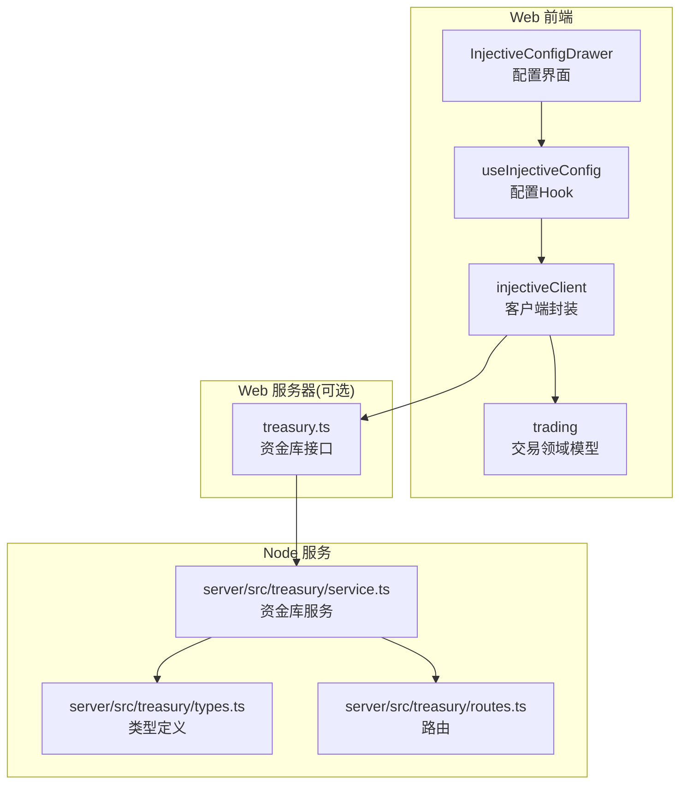
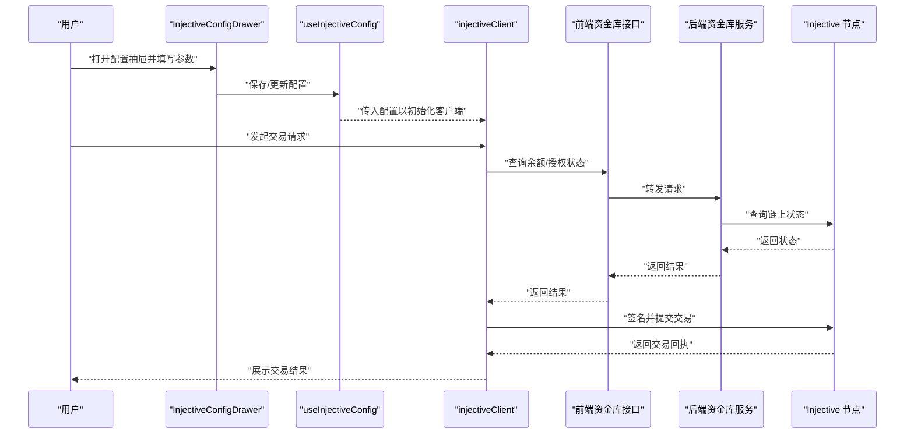
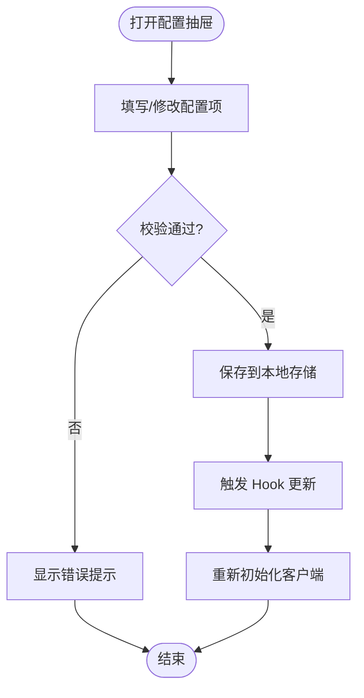
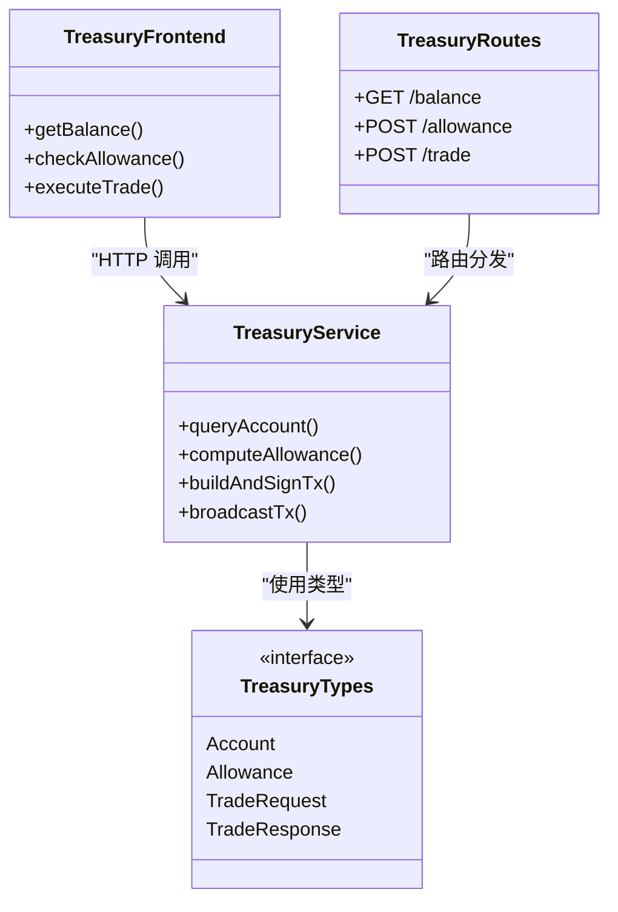
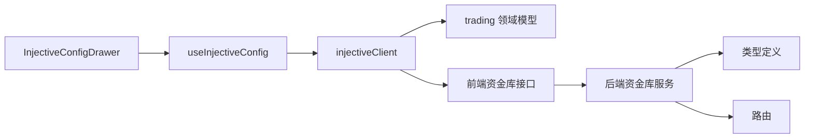

# Injective协议集成

<cite>
**本文引用的文件**   
- [web/server/config/injective.ts](file://web/server/config/injective.ts)
- [web/server/config/injective.test.ts](file://web/server/config/injective.test.ts)
- [web/src/services/injectiveClient.ts](file://web/src/services/injectiveClient.ts)
- [web/src/components/InjectiveConfigDrawer.tsx](file://web/src/components/InjectiveConfigDrawer.tsx)
- [web/src/services/useInjectiveConfig.ts](file://web/src/services/useInjectiveConfig.ts)
- [web/src/domain/trading.ts](file://web/src/domain/trading.ts)
- [web/server/treasury.ts](file://web/server/treasury.ts)
- [server/src/treasury/service.ts](file://server/src/treasury/service.ts)
- [server/src/treasury/types.ts](file://server/src/treasury/types.ts)
- [server/src/treasury/routes.ts](file://server/src/treasury/routes.ts)
</cite>

## 目录
1. [简介](#简介)
2. [项目结构](#项目结构)
3. [核心组件](#核心组件)
4. [架构总览](#架构总览)
5. [详细组件分析](#详细组件分析)
6. [依赖关系分析](#依赖关系分析)
7. [性能考虑](#性能考虑)
8. [故障排查指南](#故障排查指南)
9. [结论](#结论)
10. [附录](#附录)

## 简介
本文件聚焦于仓库中与 Injective 协议集成的实现与使用方式，涵盖前端配置、客户端封装、交易领域模型、以及资金库（Treasury）在链上交互中的角色。文档旨在帮助开发者快速理解注入式配置、客户端调用链路、以及与后端资金库的协作模式，并提供排障与优化建议。

## 项目结构
围绕 Injective 集成的关键位置如下：
- 服务端配置与测试：位于 web/server/config 下，负责读取并校验 Injective 相关环境变量与连接参数。
- 前端服务层：位于 web/src/services 下，提供 Injective 客户端封装与配置 Hook。
- 前端组件：位于 web/src/components 下，提供可视化配置抽屉，便于用户输入与切换网络。
- 领域模型：位于 web/src/domain 下，定义交易相关的类型与约束。
- 资金库（Treasury）：前后端均涉及，用于管理账户、余额、授权与交易执行等能力。

图表来源
- [web/src/components/InjectiveConfigDrawer.tsx](file://web/src/components/InjectiveConfigDrawer.tsx)
- [web/src/services/useInjectiveConfig.ts](file://web/src/services/useInjectiveConfig.ts)
- [web/src/services/injectiveClient.ts](file://web/src/services/injectiveClient.ts)
- [web/src/domain/trading.ts](file://web/src/domain/trading.ts)
- [web/server/treasury.ts](file://web/server/treasury.ts)
- [server/src/treasury/service.ts](file://server/src/treasury/service.ts)
- [server/src/treasury/types.ts](file://server/src/treasury/types.ts)
- [server/src/treasury/routes.ts](file://server/src/treasury/routes.ts)

章节来源
- [web/server/config/injective.ts](file://web/server/config/injective.ts)
- [web/server/config/injective.test.ts](file://web/server/config/injective.test.ts)
- [web/src/services/injectiveClient.ts](file://web/src/services/injectiveClient.ts)
- [web/src/components/InjectiveConfigDrawer.tsx](file://web/src/components/InjectiveConfigDrawer.tsx)
- [web/src/services/useInjectiveConfig.ts](file://web/src/services/useInjectiveConfig.ts)
- [web/src/domain/trading.ts](file://web/src/domain/trading.ts)
- [web/server/treasury.ts](file://web/server/treasury.ts)
- [server/src/treasury/service.ts](file://server/src/treasury/service.ts)
- [server/src/treasury/types.ts](file://server/src/treasury/types.ts)
- [server/src/treasury/routes.ts](file://server/src/treasury/routes.ts)

## 核心组件
- 配置模块（web/server/config/injective.ts）
  - 职责：集中读取与校验 Injective 连接参数（如 RPC、节点地址、网络标识等），为前端与服务端提供统一配置入口。
  - 要点：支持多环境（开发/测试/生产）；对必填字段进行校验；暴露稳定的配置对象供上层消费。
- 配置测试（web/server/config/injective.test.ts）
  - 职责：验证配置加载逻辑与环境变量覆盖行为，确保不同环境下配置正确解析。
- 客户端封装（web/src/services/injectiveClient.ts）
  - 职责：封装与 Injective 节点的通信细节，包括初始化、签名、广播、查询等方法；对外暴露简洁 API。
  - 要点：错误处理与重试策略；网络切换；鉴权信息注入。
- 配置 Hook（web/src/services/useInjectiveConfig.ts）
  - 职责：在前端组件中便捷获取与更新 Injective 配置；提供默认值与本地持久化。
- 配置抽屉（web/src/components/InjectiveConfigDrawer.tsx）
  - 职责：提供 UI 表单，允许用户输入/修改节点地址、网络、私钥等敏感信息；包含基础校验与提示。
- 交易领域模型（web/src/domain/trading.ts）
  - 职责：定义交易订单、滑点、手续费、价格精度等数据结构与约束。
- 资金库（Treasury）
  - 前端侧（web/server/treasury.ts）：提供与后端资金库服务的交互接口，封装账户、余额、授权、交易等能力。
  - 后端侧（server/src/treasury/service.ts, types.ts, routes.ts）：实现资金库业务逻辑、类型定义与 HTTP 路由，对接链上操作或内部状态。

章节来源
- [web/server/config/injective.ts](file://web/server/config/injective.ts)
- [web/server/config/injective.test.ts](file://web/server/config/injective.test.ts)
- [web/src/services/injectiveClient.ts](file://web/src/services/injectiveClient.ts)
- [web/src/services/useInjectiveConfig.ts](file://web/src/services/useInjectiveConfig.ts)
- [web/src/components/InjectiveConfigDrawer.tsx](file://web/src/components/InjectiveConfigDrawer.tsx)
- [web/src/domain/trading.ts](file://web/src/domain/trading.ts)
- [web/server/treasury.ts](file://web/server/treasury.ts)
- [server/src/treasury/service.ts](file://server/src/treasury/service.ts)
- [server/src/treasury/types.ts](file://server/src/treasury/types.ts)
- [server/src/treasury/routes.ts](file://server/src/treasury/routes.ts)

## 架构总览
下图展示了从前端配置到链上交易的端到端流程，涵盖配置加载、客户端初始化、交易构建与提交、以及资金库参与的角色。

图表来源
- [web/src/components/InjectiveConfigDrawer.tsx](file://web/src/components/InjectiveConfigDrawer.tsx)
- [web/src/services/useInjectiveConfig.ts](file://web/src/services/useInjectiveConfig.ts)
- [web/src/services/injectiveClient.ts](file://web/src/services/injectiveClient.ts)
- [web/server/treasury.ts](file://web/server/treasury.ts)
- [server/src/treasury/service.ts](file://server/src/treasury/service.ts)
- [server/src/treasury/routes.ts](file://server/src/treasury/routes.ts)

## 详细组件分析

### 配置模块与测试
- 配置模块
  - 提供统一的配置对象，包含节点地址、RPC、网络标识、超时等。
  - 支持环境变量覆盖与默认值回退，保证在不同部署环境中稳定可用。
- 配置测试
  - 覆盖关键场景：缺失必填项、非法值、多环境切换、默认值生效。
  - 通过断言确保配置解析符合预期，避免运行时异常。

章节来源
- [web/server/config/injective.ts](file://web/server/config/injective.ts)
- [web/server/config/injective.test.ts](file://web/server/config/injective.test.ts)

### 客户端封装（injectiveClient）
- 职责
  - 初始化连接：根据配置创建与 Injective 节点的连接实例。
  - 交易构建与签名：基于领域模型组装交易消息，注入签名者信息。
  - 广播与查询：提交交易至节点并轮询回执；提供余额、授权等查询方法。
- 错误处理
  - 区分网络错误、签名失败、链上拒绝等错误类型，向上层返回结构化错误。
  - 可配置重试与退避策略，提升稳定性。
- 安全
  - 私钥等敏感信息仅在内存中使用，避免落盘。
  - 提供最小权限原则的签名上下文。

章节来源
- [web/src/services/injectiveClient.ts](file://web/src/services/injectiveClient.ts)

### 配置 Hook 与配置抽屉
- 配置 Hook（useInjectiveConfig）
  - 提供 get/set 接口，支持本地存储持久化与热更新。
  - 在客户端初始化前自动注入最新配置。
- 配置抽屉（InjectiveConfigDrawer）
  - 表单字段：节点地址、RPC、网络、私钥等。
  - 校验规则：非空、URL 格式、长度限制等。
  - 交互反馈：成功/失败提示，错误定位。

图表来源
- [web/src/components/InjectiveConfigDrawer.tsx](file://web/src/components/InjectiveConfigDrawer.tsx)
- [web/src/services/useInjectiveConfig.ts](file://web/src/services/useInjectiveConfig.ts)
- [web/src/services/injectiveClient.ts](file://web/src/services/injectiveClient.ts)

章节来源
- [web/src/components/InjectiveConfigDrawer.tsx](file://web/src/components/InjectiveConfigDrawer.tsx)
- [web/src/services/useInjectiveConfig.ts](file://web/src/services/useInjectiveConfig.ts)

### 交易领域模型（trading）
- 数据模型
  - 订单：包含交易对、方向、数量、限价/市价、滑点容忍度等。
  - 费用与精度：手续费率、最小报价单位、价格精度。
- 约束与校验
  - 数量与价格范围检查。
  - 滑点与最大损失保护。
- 扩展性
  - 预留扩展字段，便于未来增加条件单、止损止盈等高级功能。

章节来源
- [web/src/domain/trading.ts](file://web/src/domain/trading.ts)

### 资金库（Treasury）
- 前端接口（web/server/treasury.ts）
  - 封装与后端资金库服务的交互，提供账户、余额、授权、交易等方法的 Promise 化调用。
  - 统一错误映射与日志记录。
- 后端服务（server/src/treasury/service.ts）
  - 实现核心业务逻辑：账户管理、余额计算、授权检查、交易执行编排。
  - 与链上节点交互（或通过中间件）完成最终状态确认。
- 类型定义（server/src/treasury/types.ts）
  - 统一定义请求/响应结构、枚举值、错误码，确保前后端契约一致。
- 路由（server/src/treasury/routes.ts）
  - 暴露 REST 接口，承载前端资金库请求，转发至服务层处理。

图表来源
- [web/server/treasury.ts](file://web/server/treasury.ts)
- [server/src/treasury/service.ts](file://server/src/treasury/service.ts)
- [server/src/treasury/types.ts](file://server/src/treasury/types.ts)
- [server/src/treasury/routes.ts](file://server/src/treasury/routes.ts)

章节来源
- [web/server/treasury.ts](file://web/server/treasury.ts)
- [server/src/treasury/service.ts](file://server/src/treasury/service.ts)
- [server/src/treasury/types.ts](file://server/src/treasury/types.ts)
- [server/src/treasury/routes.ts](file://server/src/treasury/routes.ts)

## 依赖关系分析
- 前端侧
  - 配置抽屉依赖配置 Hook，Hook 驱动客户端初始化。
  - 客户端依赖交易领域模型以构建交易消息。
  - 客户端通过前端资金库接口与后端服务交互。
- 后端侧
  - 资金库服务依赖类型定义，确保契约一致性。
  - 路由将外部请求分发给服务层，服务层协调链上交互。

图表来源
- [web/src/components/InjectiveConfigDrawer.tsx](file://web/src/components/InjectiveConfigDrawer.tsx)
- [web/src/services/useInjectiveConfig.ts](file://web/src/services/useInjectiveConfig.ts)
- [web/src/services/injectiveClient.ts](file://web/src/services/injectiveClient.ts)
- [web/src/domain/trading.ts](file://web/src/domain/trading.ts)
- [web/server/treasury.ts](file://web/server/treasury.ts)
- [server/src/treasury/service.ts](file://server/src/treasury/service.ts)
- [server/src/treasury/types.ts](file://server/src/treasury/types.ts)
- [server/src/treasury/routes.ts](file://server/src/treasury/routes.ts)

章节来源
- [web/src/services/injectiveClient.ts](file://web/src/services/injectiveClient.ts)
- [web/src/domain/trading.ts](file://web/src/domain/trading.ts)
- [web/server/treasury.ts](file://web/server/treasury.ts)
- [server/src/treasury/service.ts](file://server/src/treasury/service.ts)
- [server/src/treasury/types.ts](file://server/src/treasury/types.ts)
- [server/src/treasury/routes.ts](file://server/src/treasury/routes.ts)

## 性能考虑
- 连接复用：客户端应复用与节点的连接实例，避免频繁建立/销毁连接带来的开销。
- 批量查询：余额与授权等查询可合并请求，减少往返次数。
- 缓存策略：对不频繁变化的链上状态（如合约元数据）进行短期缓存。
- 重试与退避：对瞬时网络错误采用指数退避重试，避免雪崩。
- 序列化优化：交易消息与响应体尽量精简，减少带宽占用。

[本节为通用指导，无需具体文件引用]

## 故障排查指南
- 配置问题
  - 现象：无法连接节点或初始化失败。
  - 排查：检查环境变量是否设置正确；确认网络地址与端口可达；查看配置测试用例覆盖的场景。
- 客户端错误
  - 现象：签名失败、广播被拒、回执为空。
  - 排查：核对私钥与账户匹配；检查 Gas 与手续费设置；查看节点返回的错误码与原因。
- 资金库接口
  - 现象：余额查询为空、授权不足导致交易失败。
  - 排查：确认后端服务正常；检查授权额度与目标合约；查看路由日志与服务层错误。
- 领域模型约束
  - 现象：交易参数校验失败。
  - 排查：检查数量、价格、滑点是否符合约束；调整精度与最小单位。

章节来源
- [web/server/config/injective.test.ts](file://web/server/config/injective.test.ts)
- [web/src/services/injectiveClient.ts](file://web/src/services/injectiveClient.ts)
- [web/server/treasury.ts](file://web/server/treasury.ts)
- [server/src/treasury/service.ts](file://server/src/treasury/service.ts)
- [server/src/treasury/routes.ts](file://server/src/treasury/routes.ts)
- [web/src/domain/trading.ts](file://web/src/domain/trading.ts)

## 结论
本项目围绕 Injective 协议实现了从前端配置到链上交易的完整链路。通过模块化设计，配置、客户端、领域模型与资金库各司其职，既保证了可扩展性，也提升了可维护性与稳定性。建议在后续迭代中持续完善错误分类、监控指标与自动化测试覆盖，进一步提升用户体验与系统可靠性。

[本节为总结性内容，无需具体文件引用]

## 附录
- 术语
  - 资金库（Treasury）：统一管理账户、余额、授权与交易执行的子系统。
  - 领域模型：描述业务实体的数据结构与约束。
- 参考路径
  - 配置与测试：[web/server/config/injective.ts](file://web/server/config/injective.ts)、[web/server/config/injective.test.ts](file://web/server/config/injective.test.ts)
  - 客户端与 Hook：[web/src/services/injectiveClient.ts](file://web/src/services/injectiveClient.ts)、[web/src/services/useInjectiveConfig.ts](file://web/src/services/useInjectiveConfig.ts)
  - 配置界面：[web/src/components/InjectiveConfigDrawer.tsx](file://web/src/components/InjectiveConfigDrawer.tsx)
  - 领域模型：[web/src/domain/trading.ts](file://web/src/domain/trading.ts)
  - 资金库：[web/server/treasury.ts](file://web/server/treasury.ts)、[server/src/treasury/service.ts](file://server/src/treasury/service.ts)、[server/src/treasury/types.ts](file://server/src/treasury/types.ts)、[server/src/treasury/routes.ts](file://server/src/treasury/routes.ts)