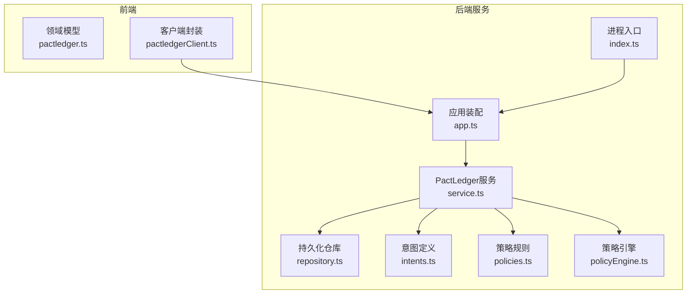
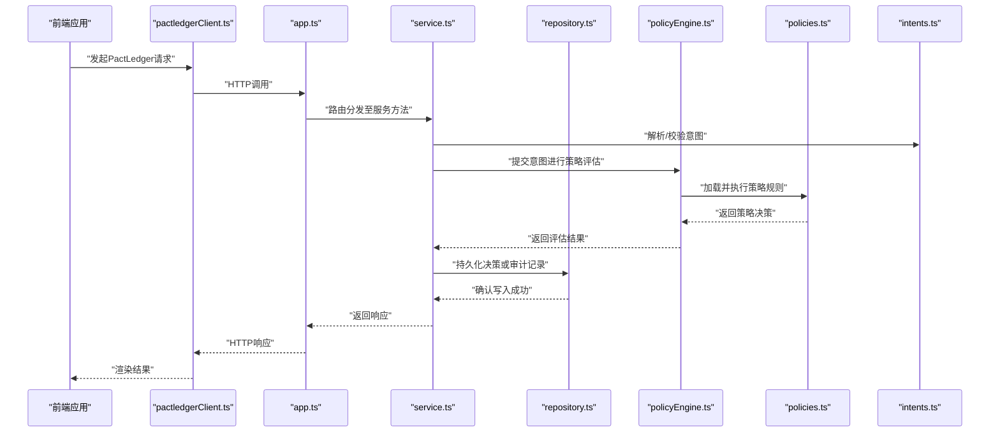
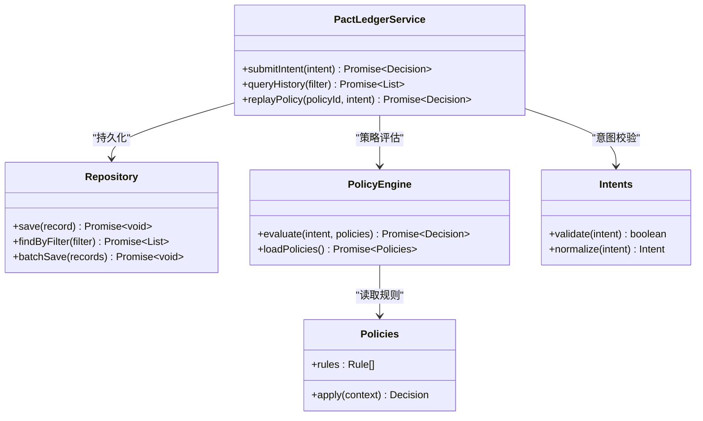
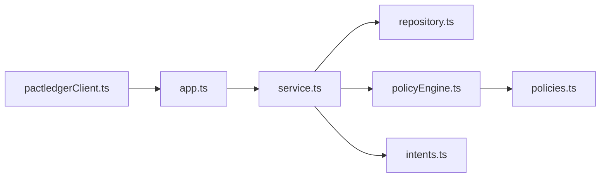

# PactLedger集成系统

<cite>
**本文引用的文件**   
- [web/server/pactledger/service.ts](file://web/server/pactledger/service.ts)
- [web/server/pactledger/repository.ts](file://web/server/pactledger/repository.ts)
- [web/server/pactledger/intents.ts](file://web/server/pactledger/intents.ts)
- [web/server/pactledger/policies.ts](file://web/server/pactledger/policies.ts)
- [web/server/pactledger/policyEngine.ts](file://web/server/pactledger/policyEngine.ts)
- [web/src/domain/pactledger.ts](file://web/src/domain/pactledger.ts)
- [web/src/services/pactledgerClient.ts](file://web/src/services/pactledgerClient.ts)
- [web/server/app.ts](file://web/server/app.ts)
- [web/server/index.ts](file://web/server/index.ts)
</cite>

## 目录
1. [简介](#简介)
2. [项目结构](#项目结构)
3. [核心组件](#核心组件)
4. [架构总览](#架构总览)
5. [详细组件分析](#详细组件分析)
6. [依赖关系分析](#依赖关系分析)
7. [性能考虑](#性能考虑)
8. [故障排查指南](#故障排查指南)
9. [结论](#结论)
10. [附录](#附录)

## 简介
本文件面向PactLedger集成系统的后端与前端对接，聚焦于策略意图、策略引擎、持久化与服务编排。文档从系统架构、数据流、处理逻辑、错误处理与性能特性等维度进行系统化说明，并提供可视化图示帮助读者快速理解模块职责与交互方式。

## 项目结构
PactLedger相关代码主要分布在以下位置：
- 服务端实现：web/server/pactledger/ 下的服务、仓库、意图、策略与策略引擎
- 前端领域模型与客户端：web/src/domain/pactledger.ts 与 web/src/services/pactledgerClient.ts
- 应用入口与路由挂载：web/server/app.ts 与 web/server/index.ts

图表来源
- [web/server/app.ts](file://web/server/app.ts)
- [web/server/index.ts](file://web/server/index.ts)
- [web/server/pactledger/service.ts](file://web/server/pactledger/service.ts)
- [web/server/pactledger/repository.ts](file://web/server/pactledger/repository.ts)
- [web/server/pactledger/intents.ts](file://web/server/pactledger/intents.ts)
- [web/server/pactledger/policies.ts](file://web/server/pactledger/policies.ts)
- [web/server/pactledger/policyEngine.ts](file://web/server/pactledger/policyEngine.ts)
- [web/src/domain/pactledger.ts](file://web/src/domain/pactledger.ts)
- [web/src/services/pactledgerClient.ts](file://web/src/services/pactledgerClient.ts)

章节来源
- [web/server/app.ts](file://web/server/app.ts)
- [web/server/index.ts](file://web/server/index.ts)
- [web/server/pactledger/service.ts](file://web/server/pactledger/service.ts)
- [web/server/pactledger/repository.ts](file://web/server/pactledger/repository.ts)
- [web/server/pactledger/intents.ts](file://web/server/pactledger/intents.ts)
- [web/server/pactledger/policies.ts](file://web/server/pactledger/policies.ts)
- [web/server/pactledger/policyEngine.ts](file://web/server/pactledger/policyEngine.ts)
- [web/src/domain/pactledger.ts](file://web/src/domain/pactledger.ts)
- [web/src/services/pactledgerClient.ts](file://web/src/services/pactledgerClient.ts)

## 核心组件
- 服务层（Service）：对外暴露PactLedger能力，协调意图解析、策略评估与持久化读写。
- 仓库层（Repository）：负责PactLedger相关数据的持久化访问。
- 意图（Intents）：描述业务意图的结构与校验。
- 策略（Policies）：定义可执行的策略规则集合。
- 策略引擎（PolicyEngine）：对意图执行策略评估并返回决策结果。
- 前端领域模型（Domain）：为前端提供类型与数据结构。
- 前端客户端（Client）：封装HTTP调用，统一与后端服务交互。

章节来源
- [web/server/pactledger/service.ts](file://web/server/pactledger/service.ts)
- [web/server/pactledger/repository.ts](file://web/server/pactledger/repository.ts)
- [web/server/pactledger/intents.ts](file://web/server/pactledger/intents.ts)
- [web/server/pactledger/policies.ts](file://web/server/pactledger/policies.ts)
- [web/server/pactledger/policyEngine.ts](file://web/server/pactledger/policyEngine.ts)
- [web/src/domain/pactledger.ts](file://web/src/domain/pactledger.ts)
- [web/src/services/pactledgerClient.ts](file://web/src/services/pactledgerClient.ts)

## 架构总览
下图展示了从前端到后端的完整调用链路，以及服务内部各模块的协作关系。

图表来源
- [web/server/app.ts](file://web/server/app.ts)
- [web/server/pactledger/service.ts](file://web/server/pactledger/service.ts)
- [web/server/pactledger/repository.ts](file://web/server/pactledger/repository.ts)
- [web/server/pactledger/policyEngine.ts](file://web/server/pactledger/policyEngine.ts)
- [web/server/pactledger/policies.ts](file://web/server/pactledger/policies.ts)
- [web/server/pactledger/intents.ts](file://web/server/pactledger/intents.ts)
- [web/src/services/pactledgerClient.ts](file://web/src/services/pactledgerClient.ts)

## 详细组件分析

### 服务层（service.ts）
- 职责：聚合意图、策略与仓库，提供统一的业务接口；负责事务边界与错误归一化。
- 关键流程：
  - 接收外部请求参数，构造意图对象
  - 调用策略引擎进行决策
  - 将决策结果与必要上下文持久化
  - 返回标准化响应
- 异常处理：捕获底层错误并转换为上层语义明确的错误码与消息。

章节来源
- [web/server/pactledger/service.ts](file://web/server/pactledger/service.ts)

### 仓库层（repository.ts）
- 职责：封装数据库访问，提供增删改查与批量操作。
- 设计要点：
  - 连接池与重试机制（如适用）
  - 事务支持，确保一致性
  - 查询优化与分页

章节来源
- [web/server/pactledger/repository.ts](file://web/server/pactledger/repository.ts)

### 意图（intents.ts）
- 职责：定义业务意图的数据结构与校验规则。
- 关键点：
  - 字段约束与必填项
  - 枚举值与范围限制
  - 可扩展的扩展字段设计

章节来源
- [web/server/pactledger/intents.ts](file://web/server/pactledger/intents.ts)

### 策略（policies.ts）
- 职责：声明式地定义策略规则，供策略引擎加载与执行。
- 关键点：
  - 规则优先级与短路逻辑
  - 条件分支与组合策略
  - 可配置的策略参数

章节来源
- [web/server/pactledger/policies.ts](file://web/server/pactledger/policies.ts)

### 策略引擎（policyEngine.ts）
- 职责：根据意图与策略规则计算决策结果。
- 关键点：
  - 规则匹配与执行顺序
  - 上下文注入与变量替换
  - 决策缓存与性能优化

章节来源
- [web/server/pactledger/policyEngine.ts](file://web/server/pactledger/policyEngine.ts)

### 前端领域模型（domain/pactledger.ts）
- 职责：为前端提供类型定义与常量，保证前后端数据结构一致。
- 关键点：
  - 严格类型约束
  - 与后端一致的枚举与状态码

章节来源
- [web/src/domain/pactledger.ts](file://web/src/domain/pactledger.ts)

### 前端客户端（services/pactledgerClient.ts）
- 职责：封装HTTP请求、鉴权、重试与错误处理。
- 关键点：
  - 统一错误映射
  - 请求拦截与日志
  - 取消与超时控制

章节来源
- [web/src/services/pactledgerClient.ts](file://web/src/services/pactledgerClient.ts)

#### 类图（概念性）

图表来源
- [web/server/pactledger/service.ts](file://web/server/pactledger/service.ts)
- [web/server/pactledger/repository.ts](file://web/server/pactledger/repository.ts)
- [web/server/pactledger/policyEngine.ts](file://web/server/pactledger/policyEngine.ts)
- [web/server/pactledger/policies.ts](file://web/server/pactledger/policies.ts)
- [web/server/pactledger/intents.ts](file://web/server/pactledger/intents.ts)

## 依赖关系分析
- 耦合关系：
  - 服务层强依赖策略引擎、意图与仓库
  - 策略引擎依赖策略规则集
  - 前端客户端仅依赖HTTP与领域模型
- 潜在循环依赖：
  - 避免在策略中反向引用服务层，防止循环
- 外部依赖：
  - 数据库驱动与连接池
  - HTTP客户端库

图表来源
- [web/server/app.ts](file://web/server/app.ts)
- [web/server/pactledger/service.ts](file://web/server/pactledger/service.ts)
- [web/server/pactledger/repository.ts](file://web/server/pactledger/repository.ts)
- [web/server/pactledger/policyEngine.ts](file://web/server/pactledger/policyEngine.ts)
- [web/server/pactledger/policies.ts](file://web/server/pactledger/policies.ts)
- [web/server/pactledger/intents.ts](file://web/server/pactledger/intents.ts)
- [web/src/services/pactledgerClient.ts](file://web/src/services/pactledgerClient.ts)

章节来源
- [web/server/app.ts](file://web/server/app.ts)
- [web/server/pactledger/service.ts](file://web/server/pactledger/service.ts)
- [web/server/pactledger/repository.ts](file://web/server/pactledger/repository.ts)
- [web/server/pactledger/policyEngine.ts](file://web/server/pactledger/policyEngine.ts)
- [web/server/pactledger/policies.ts](file://web/server/pactledger/policies.ts)
- [web/server/pactledger/intents.ts](file://web/server/pactledger/intents.ts)
- [web/src/services/pactledgerClient.ts](file://web/src/services/pactledgerClient.ts)

## 性能考虑
- 策略评估缓存：对热点策略与意图进行结果缓存，降低重复计算开销。
- 批量持久化：合并多次写入，减少数据库往返。
- 连接池调优：合理设置最大连接数与空闲回收时间。
- 异步与并发：在服务层使用非阻塞I/O，避免长耗时同步操作阻塞主线程。
- 查询优化：为高频查询建立索引，采用分页与过滤下推。

[本节为通用指导，不直接分析具体文件]

## 故障排查指南
- 常见错误分类：
  - 意图校验失败：检查字段完整性与取值范围
  - 策略评估异常：核对策略规则版本与上下文变量
  - 持久化失败：检查数据库连接、权限与事务回滚
- 定位步骤：
  - 查看服务层日志，确认请求进入点与参数
  - 追踪策略引擎输出，验证规则命中情况
  - 检查仓库层SQL与事务状态
- 恢复建议：
  - 对不可恢复错误进行幂等重试
  - 对部分失败场景启用补偿任务

章节来源
- [web/server/pactledger/service.ts](file://web/server/pactledger/service.ts)
- [web/server/pactledger/repository.ts](file://web/server/pactledger/repository.ts)
- [web/server/pactledger/policyEngine.ts](file://web/server/pactledger/policyEngine.ts)

## 结论
PactLedger集成系统通过清晰的分层与职责划分，实现了意图解析、策略评估与持久化的解耦。前端通过类型安全的领域模型与客户端封装，提升了开发效率与稳定性。建议在后续迭代中持续完善策略的可观测性与性能指标，以支撑更大规模的策略运行与更高的吞吐需求。

[本节为总结性内容，不直接分析具体文件]

## 附录
- 术语表：
  - 意图：业务操作的抽象描述
  - 策略：用于决策的规则集合
  - 策略引擎：执行策略并产出决策的核心组件
- 参考路径：
  - 服务实现：[web/server/pactledger/service.ts](file://web/server/pactledger/service.ts)
  - 仓库实现：[web/server/pactledger/repository.ts](file://web/server/pactledger/repository.ts)
  - 意图定义：[web/server/pactledger/intents.ts](file://web/server/pactledger/intents.ts)
  - 策略规则：[web/server/pactledger/policies.ts](file://web/server/pactledger/policies.ts)
  - 策略引擎：[web/server/pactledger/policyEngine.ts](file://web/server/pactledger/policyEngine.ts)
  - 前端领域模型：[web/src/domain/pactledger.ts](file://web/src/domain/pactledger.ts)
  - 前端客户端：[web/src/services/pactledgerClient.ts](file://web/src/services/pactledgerClient.ts)
  - 应用装配：[web/server/app.ts](file://web/server/app.ts)
  - 进程入口：[web/server/index.ts](file://web/server/index.ts)