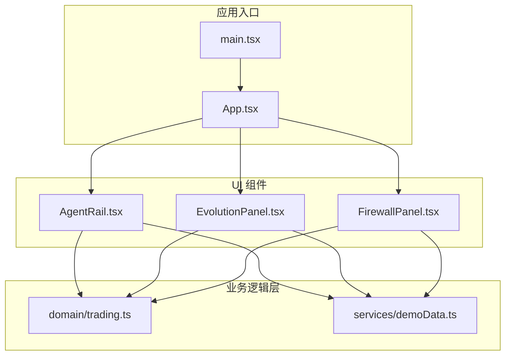
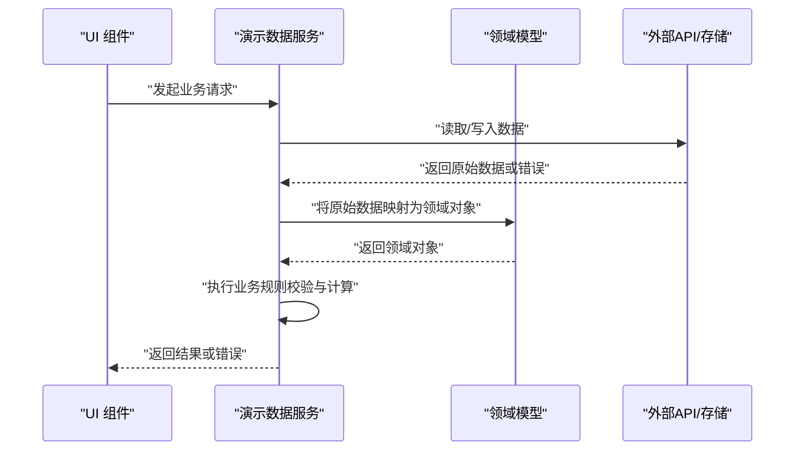
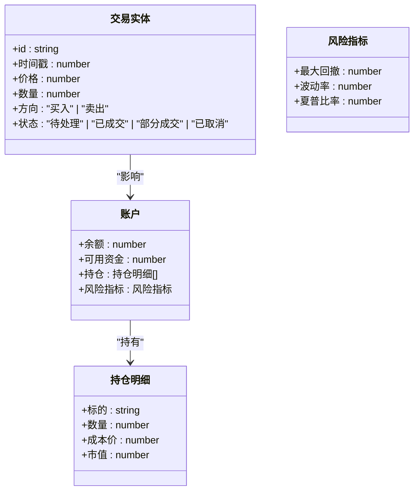
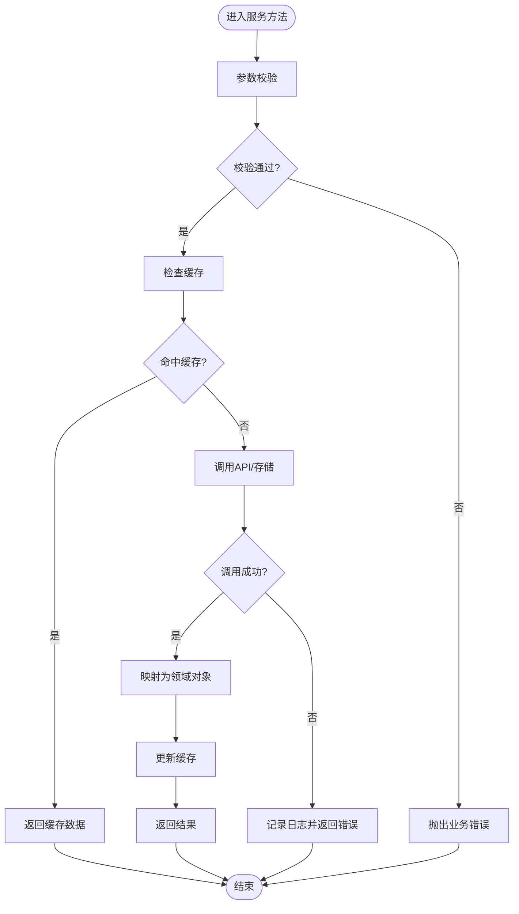
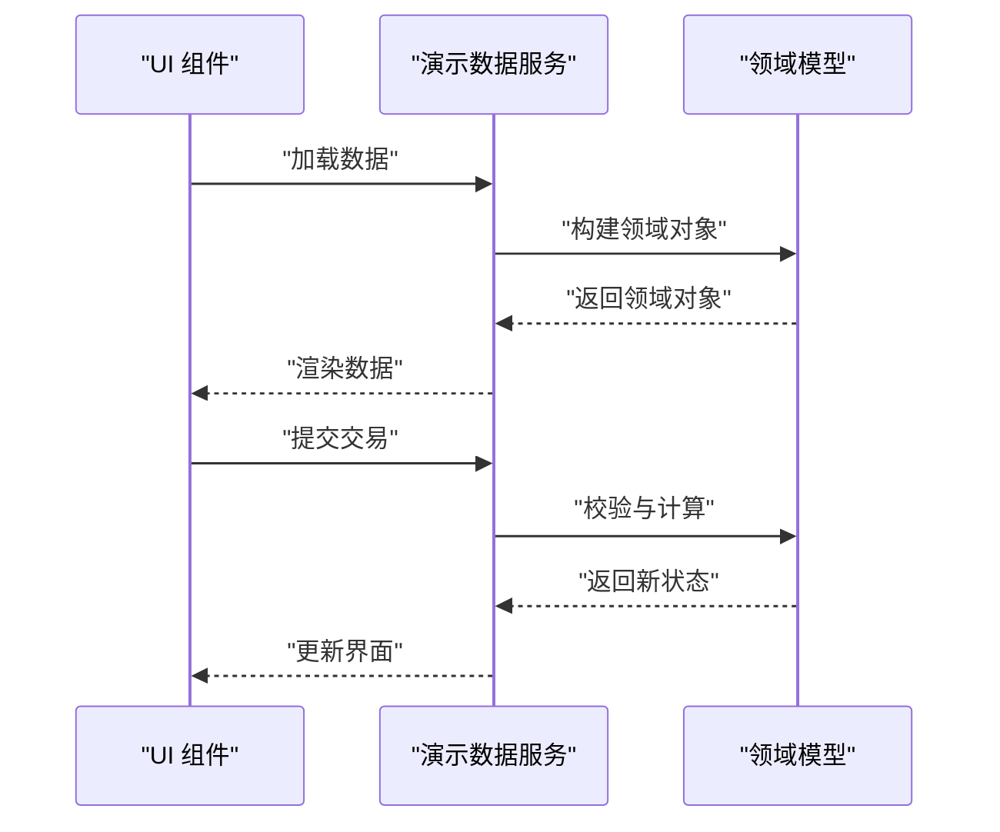
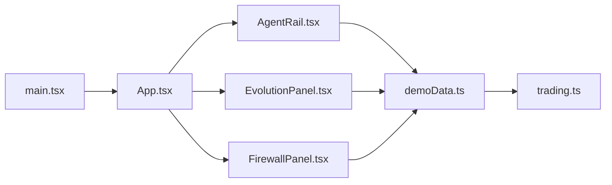

# 业务逻辑层

<cite>
**本文引用的文件**   
- [trading.ts](file://web/src/domain/trading.ts)
- [demoData.ts](file://web/src/services/demoData.ts)
- [App.tsx](file://web/src/App.tsx)
- [main.tsx](file://web/src/main.tsx)
- [AgentRail.tsx](file://web/src/components/AgentRail.tsx)
- [EvolutionPanel.tsx](file://web/src/components/EvolutionPanel.tsx)
- [FirewallPanel.tsx](file://web/src/components/FirewallPanel.tsx)
</cite>

## 目录
1. [简介](#简介)
2. [项目结构](#项目结构)
3. [核心组件](#核心组件)
4. [架构总览](#架构总览)
5. [详细组件分析](#详细组件分析)
6. [依赖关系分析](#依赖关系分析)
7. [性能考虑](#性能考虑)
8. [故障排查指南](#故障排查指南)
9. [结论](#结论)
10. [附录](#附录)

## 简介
本文件聚焦于业务逻辑层的综合文档，围绕交易领域模型与服务层的设计与实现展开。内容涵盖：
- 交易领域模型的数据结构定义、业务规则与计算逻辑
- 演示数据服务的数据访问模式、API客户端实现与错误处理策略
- 业务逻辑与UI组件的分离原则与交互方式
- 数据验证规则、业务约束与状态管理细节
- 在组件中使用业务逻辑层的具体示例（以路径引用形式）
- 数据流方向与异步处理最佳实践
- 扩展新业务功能的指导与模板

## 项目结构
本项目采用分层组织方式：
- 领域层 domain：定义交易相关的领域模型与规则
- 服务层 services：封装演示数据访问、API客户端与错误处理
- UI 层 components：展示与交互，仅消费业务逻辑，不直接访问数据源
- 应用入口 App 与 main：装配各层并启动应用

图表来源
- [main.tsx](file://web/src/main.tsx)
- [App.tsx](file://web/src/App.tsx)
- [AgentRail.tsx](file://web/src/components/AgentRail.tsx)
- [EvolutionPanel.tsx](file://web/src/components/EvolutionPanel.tsx)
- [FirewallPanel.tsx](file://web/src/components/FirewallPanel.tsx)
- [trading.ts](file://web/src/domain/trading.ts)
- [demoData.ts](file://web/src/services/demoData.ts)

章节来源
- [main.tsx](file://web/src/main.tsx)
- [App.tsx](file://web/src/App.tsx)
- [AgentRail.tsx](file://web/src/components/AgentRail.tsx)
- [EvolutionPanel.tsx](file://web/src/components/EvolutionPanel.tsx)
- [FirewallPanel.tsx](file://web/src/components/FirewallPanel.tsx)
- [trading.ts](file://web/src/domain/trading.ts)
- [demoData.ts](file://web/src/services/demoData.ts)

## 核心组件
本节概述业务逻辑层的关键组成与职责边界：
- 领域模型（trading.ts）：定义交易实体、事件与聚合根；提供纯函数进行校验、计算与状态转换；不包含副作用
- 演示数据服务（demoData.ts）：封装数据访问、API调用、缓存与重试；统一错误类型与异常传播；对外暴露稳定的接口契约

章节来源
- [trading.ts](file://web/src/domain/trading.ts)
- [demoData.ts](file://web/src/services/demoData.ts)

## 架构总览
业务逻辑层遵循“领域驱动 + 服务化”的分层设计：
- UI 组件通过服务层获取数据与执行操作
- 服务层负责数据持久化、网络请求与错误归一化
- 领域层提供不可变数据与确定性计算，确保业务规则可测试与可复用

图表来源
- [demoData.ts](file://web/src/services/demoData.ts)
- [trading.ts](file://web/src/domain/trading.ts)
- [AgentRail.tsx](file://web/src/components/AgentRail.tsx)
- [EvolutionPanel.tsx](file://web/src/components/EvolutionPanel.tsx)
- [FirewallPanel.tsx](file://web/src/components/FirewallPanel.tsx)

## 详细组件分析

### 交易领域模型（trading.ts）
- 数据结构定义
  - 交易实体：包含标识、时间戳、价格、数量、方向等字段
  - 订单状态：枚举值表示待处理、已成交、部分成交、已取消等
  - 账户与持仓：余额、可用资金、持仓明细、风险指标
- 业务规则与约束
  - 价格与数量非负校验
  - 下单前检查可用资金与持仓限制
  - 成交后更新账户余额与持仓，并生成成交事件
- 计算逻辑
  - 盈亏计算：基于成交价与成本价
  - 风险指标：最大回撤、波动率、夏普比率等
  - 撮合引擎：按价格优先、时间优先匹配买卖单
- 状态管理
  - 使用不可变更新模式，避免共享可变状态
  - 通过纯函数进行状态转换，便于单元测试与回放

图表来源
- [trading.ts](file://web/src/domain/trading.ts)

章节来源
- [trading.ts](file://web/src/domain/trading.ts)

### 演示数据服务（demoData.ts）
- 数据访问模式
  - 统一接口：提供查询、创建、更新、删除等方法
  - 数据映射：将外部数据转换为领域对象
  - 缓存策略：本地内存缓存与失效机制
- API客户端实现
  - 请求封装：统一超时、重试、退避策略
  - 响应解析：标准化成功与失败响应格式
  - 鉴权与签名：可选的请求头注入
- 错误处理策略
  - 错误分类：网络错误、业务错误、系统错误
  - 错误归一化：统一错误码与消息
  - 降级与兜底：离线模式与默认数据

图表来源
- [demoData.ts](file://web/src/services/demoData.ts)

章节来源
- [demoData.ts](file://web/src/services/demoData.ts)

### UI 组件与业务逻辑的分离
- 分离原则
  - UI 组件只负责展示与用户交互，不直接访问数据源
  - 业务逻辑集中在领域层与服务层，UI 通过服务层调用
- 交互方式
  - 组件订阅服务层的状态变化
  - 组件触发服务层的方法执行业务操作
  - 错误由服务层统一处理并反馈给UI

图表来源
- [AgentRail.tsx](file://web/src/components/AgentRail.tsx)
- [EvolutionPanel.tsx](file://web/src/components/EvolutionPanel.tsx)
- [FirewallPanel.tsx](file://web/src/components/FirewallPanel.tsx)
- [demoData.ts](file://web/src/services/demoData.ts)
- [trading.ts](file://web/src/domain/trading.ts)

章节来源
- [AgentRail.tsx](file://web/src/components/AgentRail.tsx)
- [EvolutionPanel.tsx](file://web/src/components/EvolutionPanel.tsx)
- [FirewallPanel.tsx](file://web/src/components/FirewallPanel.tsx)
- [demoData.ts](file://web/src/services/demoData.ts)
- [trading.ts](file://web/src/domain/trading.ts)

## 依赖关系分析
- 组件对服务层的依赖
  - AgentRail、EvolutionPanel、FirewallPanel 均依赖 demoData.ts
- 服务层对领域模型的依赖
  - demoData.ts 使用 trading.ts 中的领域对象与规则
- 应用入口的装配
  - main.tsx 初始化应用上下文
  - App.tsx 组合各组件与服务

图表来源
- [AgentRail.tsx](file://web/src/components/AgentRail.tsx)
- [EvolutionPanel.tsx](file://web/src/components/EvolutionPanel.tsx)
- [FirewallPanel.tsx](file://web/src/components/FirewallPanel.tsx)
- [demoData.ts](file://web/src/services/demoData.ts)
- [trading.ts](file://web/src/domain/trading.ts)
- [main.tsx](file://web/src/main.tsx)
- [App.tsx](file://web/src/App.tsx)

章节来源
- [AgentRail.tsx](file://web/src/components/AgentRail.tsx)
- [EvolutionPanel.tsx](file://web/src/components/EvolutionPanel.tsx)
- [FirewallPanel.tsx](file://web/src/components/FirewallPanel.tsx)
- [demoData.ts](file://web/src/services/demoData.ts)
- [trading.ts](file://web/src/domain/trading.ts)
- [main.tsx](file://web/src/main.tsx)
- [App.tsx](file://web/src/App.tsx)

## 性能考虑
- 领域层纯函数无副作用，易于并行计算与缓存
- 服务层引入缓存减少重复请求
- UI 组件按需订阅数据变化，避免不必要的重渲染
- 大数据集分页加载与虚拟滚动优化

## 故障排查指南
- 常见问题
  - 数据不一致：检查服务层缓存失效逻辑
  - 业务规则冲突：审查领域层校验与状态转换
  - 网络错误：查看服务层错误分类与重试策略
- 调试建议
  - 在服务层添加日志记录关键步骤
  - 使用单元测试覆盖领域规则
  - 模拟API响应进行端到端测试

章节来源
- [demoData.ts](file://web/src/services/demoData.ts)
- [trading.ts](file://web/src/domain/trading.ts)

## 结论
本业务逻辑层通过清晰的领域模型与服务层设计，实现了高内聚、低耦合的系统架构。领域层确保业务规则的正确性与可测试性，服务层提供稳定的数据访问与错误处理，UI 组件专注于展示与交互。该设计为后续功能扩展提供了良好的基础。

## 附录
- 扩展新业务功能的指导
  - 新增领域模型：在 trading.ts 中定义新的实体与规则
  - 扩展服务接口：在 demoData.ts 中添加新的数据访问方法
  - 集成UI组件：在对应组件中调用新的服务接口
- 代码示例路径
  - 领域模型使用示例：[trading.ts](file://web/src/domain/trading.ts)
  - 服务层调用示例：[demoData.ts](file://web/src/services/demoData.ts)
  - 组件集成示例：[AgentRail.tsx](file://web/src/components/AgentRail.tsx)、[EvolutionPanel.tsx](file://web/src/components/EvolutionPanel.tsx)、[FirewallPanel.tsx](file://web/src/components/FirewallPanel.tsx)