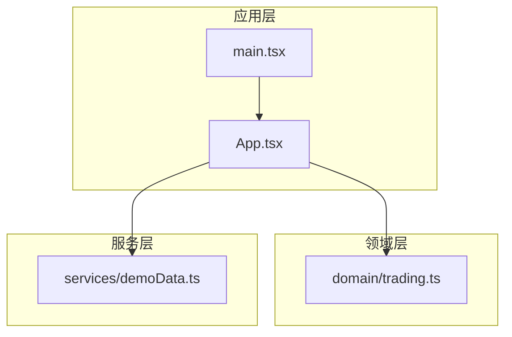
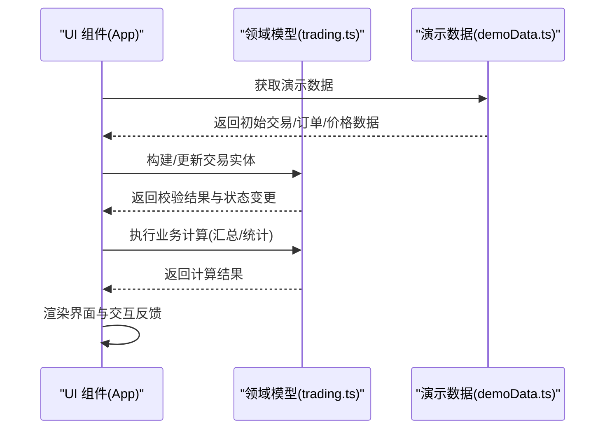
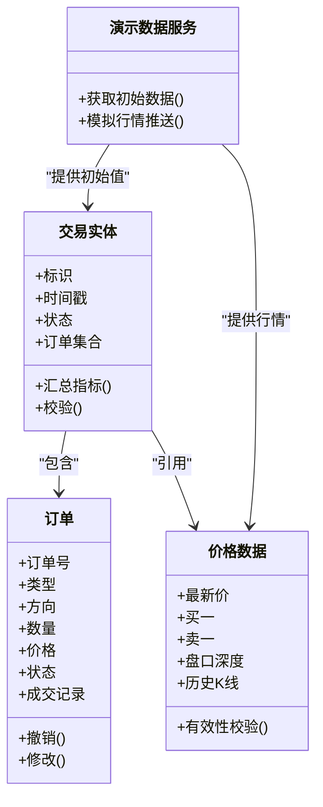
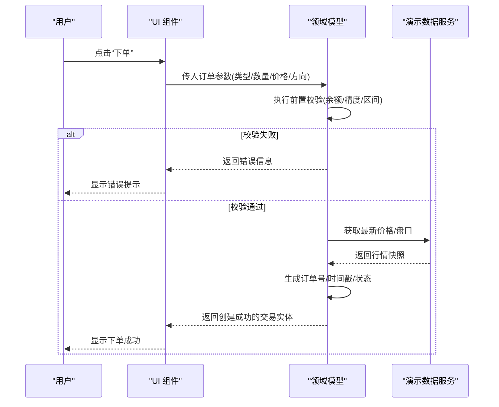
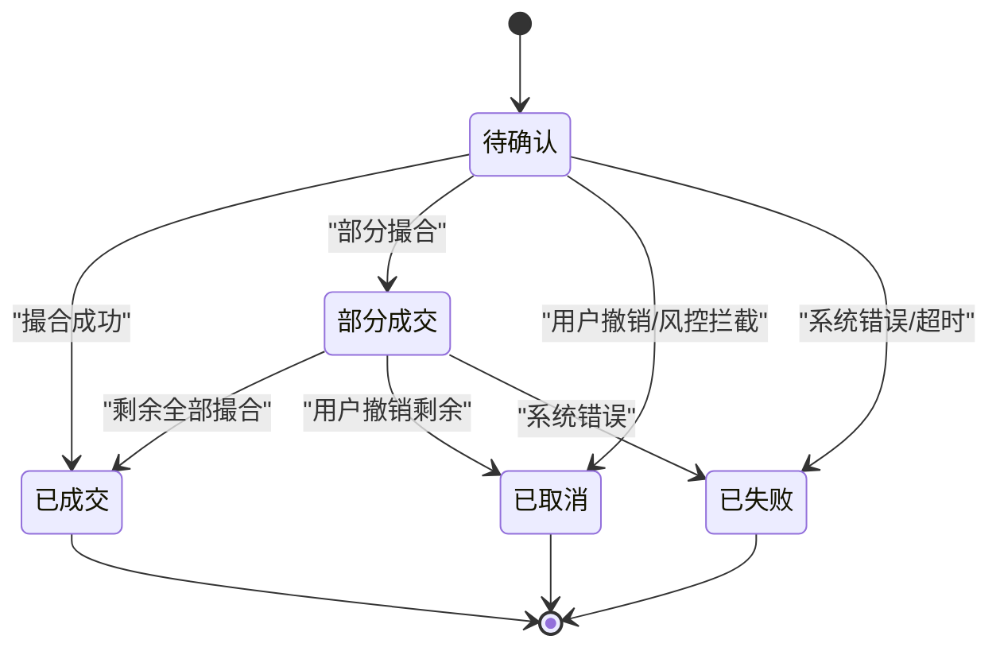
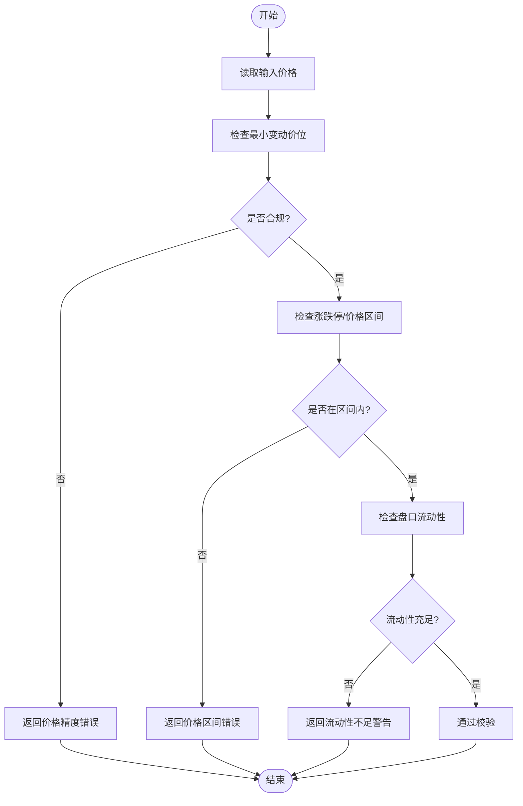
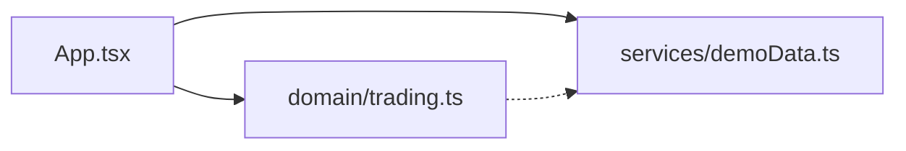

# 交易领域模型

<cite>
**本文引用的文件**   
- [trading.ts](file://web/src/domain/trading.ts)
- [demoData.ts](file://web/src/services/demoData.ts)
- [App.tsx](file://web/src/App.tsx)
- [main.tsx](file://web/src/main.tsx)
</cite>

## 目录
1. [简介](#简介)
2. [项目结构](#项目结构)
3. [核心组件](#核心组件)
4. [架构总览](#架构总览)
5. [详细组件分析](#详细组件分析)
6. [依赖分析](#依赖分析)
7. [性能考虑](#性能考虑)
8. [故障排查指南](#故障排查指南)
9. [结论](#结论)
10. [附录](#附录)

## 简介
本文件围绕“交易领域模型”进行系统化说明，聚焦于交易实体、订单类型、价格数据等核心业务对象的设计与实现；阐述交易验证逻辑、状态转换规则与业务计算算法；描述领域模型与UI组件的交互方式（数据绑定与事件处理）；提供创建、更新、查询交易的实践路径；并给出数据验证策略、错误处理模式、扩展点与自定义规则的实现方法，以及性能优化建议与最佳实践。

## 项目结构
本项目为前端应用，采用分层组织：
- 领域层：定义交易相关的领域模型与规则（位于 domain 目录）。
- 服务层：提供演示数据与示例数据源（位于 services 目录）。
- 应用层/视图层：React 组件与入口文件（位于 src 根目录）。

图表来源
- [App.tsx](file://web/src/App.tsx)
- [main.tsx](file://web/src/main.tsx)
- [trading.ts](file://web/src/domain/trading.ts)
- [demoData.ts](file://web/src/services/demoData.ts)

章节来源
- [App.tsx](file://web/src/App.tsx)
- [main.tsx](file://web/src/main.tsx)
- [trading.ts](file://web/src/domain/trading.ts)
- [demoData.ts](file://web/src/services/demoData.ts)

## 核心组件
本节聚焦交易领域模型的核心数据结构与行为，包括交易实体、订单类型、价格数据等，并说明其职责边界与相互关系。

- 交易实体
  - 标识与元信息：唯一标识、时间戳、关联账户或用户等。
  - 订单集合：包含多个订单，体现一笔交易可能由多笔订单组成。
  - 状态：反映交易生命周期（如待确认、已成交、部分成交、已取消、已失败等）。
  - 汇总指标：成交数量、成交金额、手续费、滑点等。

- 订单类型
  - 市价单：以当前市场价格立即成交。
  - 限价单：指定价格或更优价格成交。
  - 止损/止盈单：触发条件后转为市价或限价单。
  - 冰山单/跟踪止损单：高级订单类型，用于隐藏真实规模或动态调整止损。

- 价格数据
  - 最新价、买一/卖一、盘口深度快照。
  - 历史K线、逐笔成交、资金费率等。
  - 价格有效性校验：最小变动价位、精度、涨跌停限制等。

- 业务规则与约束
  - 订单前置校验：标的可用性、账户余额/保证金、价格区间、数量精度、最小下单量等。
  - 成交匹配：按价格优先、时间优先原则撮合。
  - 风控规则：单笔限额、日累计限额、异常波动熔断等。
  - 幂等与去重：基于请求ID或订单号避免重复提交。

- 与UI交互
  - 数据绑定：将领域模型映射到表单字段与行情展示。
  - 事件处理：下单、撤单、修改委托、刷新行情等事件驱动。
  - 反馈机制：成功提示、错误弹窗、加载态与重试。

章节来源
- [trading.ts](file://web/src/domain/trading.ts)

## 架构总览
领域模型通过服务层提供的演示数据进行初始化与填充，并在应用层被 UI 组件消费。整体遵循“领域模型为核心、服务层提供数据、应用层负责编排与渲染”的分层架构。

图表来源
- [App.tsx](file://web/src/App.tsx)
- [trading.ts](file://web/src/domain/trading.ts)
- [demoData.ts](file://web/src/services/demoData.ts)

## 详细组件分析

### 领域模型类图
以下类图展示了交易领域模型中关键实体的结构与关系，便于理解数据建模与职责划分。

图表来源
- [trading.ts](file://web/src/domain/trading.ts)
- [demoData.ts](file://web/src/services/demoData.ts)

章节来源
- [trading.ts](file://web/src/domain/trading.ts)
- [demoData.ts](file://web/src/services/demoData.ts)

### 交易创建流程（序列图）
该序列图描述了从 UI 发起创建交易到领域模型完成校验与落库（或内存持久化）的关键步骤。

图表来源
- [App.tsx](file://web/src/App.tsx)
- [trading.ts](file://web/src/domain/trading.ts)
- [demoData.ts](file://web/src/services/demoData.ts)

章节来源
- [App.tsx](file://web/src/App.tsx)
- [trading.ts](file://web/src/domain/trading.ts)
- [demoData.ts](file://web/src/services/demoData.ts)

### 订单状态机（状态图）
订单在生命周期内经历多种状态，状态转换需满足严格的业务规则。

图表来源
- [trading.ts](file://web/src/domain/trading.ts)

章节来源
- [trading.ts](file://web/src/domain/trading.ts)

### 价格有效性校验（流程图）
对价格数据的合法性进行校验，确保进入撮合引擎的数据符合市场规则。

图表来源
- [trading.ts](file://web/src/domain/trading.ts)

章节来源
- [trading.ts](file://web/src/domain/trading.ts)

## 依赖分析
- 领域层不直接依赖 UI，仅暴露稳定的接口与数据结构。
- 服务层提供演示数据，供领域层与应用层使用，降低耦合度。
- 应用层组合领域与服务，负责渲染与交互。

图表来源
- [App.tsx](file://web/src/App.tsx)
- [trading.ts](file://web/src/domain/trading.ts)
- [demoData.ts](file://web/src/services/demoData.ts)

章节来源
- [App.tsx](file://web/src/App.tsx)
- [trading.ts](file://web/src/domain/trading.ts)
- [demoData.ts](file://web/src/services/demoData.ts)

## 性能考虑
- 数据不可变更新：在 React 中使用不可变数据结构，减少不必要的重渲染。
- 批量更新：合并多次状态变更，降低渲染次数。
- 惰性加载：按需加载历史行情与深度数据，避免首屏过重。
- 防抖与节流：对高频行情推送与输入框变更做节流/防抖处理。
- 缓存策略：对热点价格与盘口数据设置短期缓存，减少重复计算。
- 分片渲染：大列表分页或虚拟滚动，提升长列表性能。
- 计算卸载：复杂汇总与统计可移至 Web Worker，避免阻塞主线程。

[本节为通用指导，无需代码来源]

## 故障排查指南
- 常见错误分类
  - 参数校验错误：数量精度、价格区间、最小下单量等。
  - 风控拦截：超限、黑名单、异常波动。
  - 系统错误：网络超时、服务不可用、数据不一致。
- 定位步骤
  - 查看领域模型的校验返回值与错误码。
  - 核对演示数据服务的行情快照一致性。
  - 检查 UI 的事件绑定与状态同步是否正确。
- 恢复策略
  - 自动重试与退避。
  - 用户友好提示与操作引导。
  - 降级方案：切换只读模式或离线缓存。

章节来源
- [trading.ts](file://web/src/domain/trading.ts)
- [demoData.ts](file://web/src/services/demoData.ts)
- [App.tsx](file://web/src/App.tsx)

## 结论
本领域模型以交易实体为核心，结合订单类型与价格数据，构建了清晰的数据结构与业务规则。通过服务层提供演示数据，应用层完成 UI 交互与渲染，形成低耦合、可扩展的交易系统基础。建议在后续迭代中完善风控与撮合引擎集成、增强错误处理与监控、持续优化性能与用户体验。

[本节为总结性内容，无需代码来源]

## 附录

### 数据绑定与事件处理模式
- 数据绑定
  - 单向数据流：UI 订阅领域模型的状态变化，避免双向绑定的副作用。
  - 派生状态：根据基础数据计算派生指标（如持仓盈亏、可用余额）。
- 事件处理
  - 明确事件语义：下单、撤单、改单、刷新行情等。
  - 统一错误处理：集中捕获与上报，保证一致的用户体验。

章节来源
- [App.tsx](file://web/src/App.tsx)
- [trading.ts](file://web/src/domain/trading.ts)

### 创建、更新与查询交易的实践路径
- 创建交易
  - 从 UI 收集订单参数，调用领域模型的创建方法，执行校验与生成订单号。
  - 参考路径：[trading.ts](file://web/src/domain/trading.ts)
- 更新交易
  - 支持部分成交后的追加或撤销剩余数量，保持状态一致性。
  - 参考路径：[trading.ts](file://web/src/domain/trading.ts)
- 查询交易
  - 基于时间范围、状态、标的等条件检索，返回分页结果。
  - 参考路径：[demoData.ts](file://web/src/services/demoData.ts)

章节来源
- [trading.ts](file://web/src/domain/trading.ts)
- [demoData.ts](file://web/src/services/demoData.ts)

### 扩展点与自定义规则
- 新增订单类型
  - 在领域模型中扩展订单类型枚举与对应校验逻辑。
  - 参考路径：[trading.ts](file://web/src/domain/trading.ts)
- 自定义风控规则
  - 注入风控策略接口，支持热插拔与配置化。
  - 参考路径：[trading.ts](file://web/src/domain/trading.ts)
- 行情数据源替换
  - 抽象行情接口，允许接入不同数据源（WebSocket、REST、本地缓存）。
  - 参考路径：[demoData.ts](file://web/src/services/demoData.ts)

章节来源
- [trading.ts](file://web/src/domain/trading.ts)
- [demoData.ts](file://web/src/services/demoData.ts)