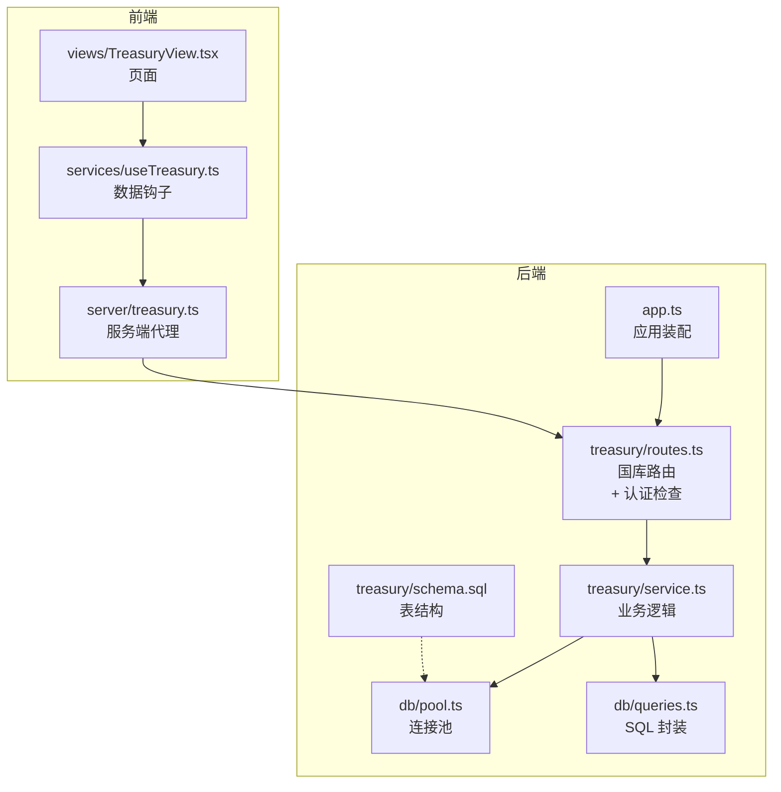
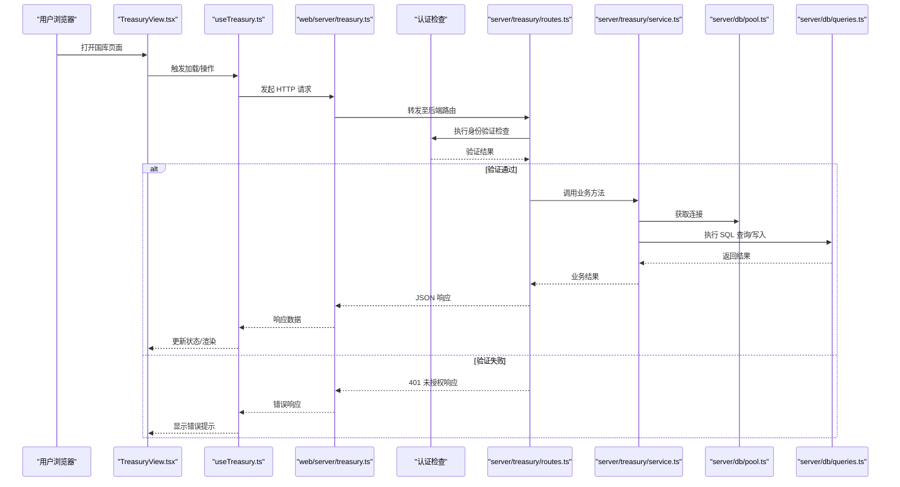
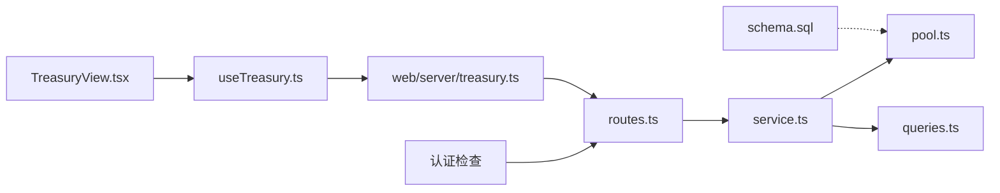

# 国库管理系统

<cite>
**本文引用的文件**   
- [server/src/treasury/routes.ts](file://server/src/treasury/routes.ts)
- [server/src/treasury/service.ts](file://server/src/treasury/service.ts)
- [server/src/treasury/schema.sql](file://server/src/treasury/schema.sql)
- [server/src/treasury/types.ts](file://server/src/treasury/types.ts)
- [server/src/db/pool.ts](file://server/src/db/pool.ts)
- [server/src/db/queries.ts](file://server/src/db/queries.ts)
- [server/src/app.ts](file://server/src/app.ts)
- [web/server/treasury.ts](file://web/server/treasury.ts)
- [web/src/services/useTreasury.ts](file://web/src/services/useTreasury.ts)
- [web/src/views/TreasuryView.tsx](file://web/src/views/TreasuryView.tsx)
</cite>

## 更新摘要
**所做更改**   
- 增强了认证检查功能，在访问国库相关功能前增加身份验证机制
- 更新了路由层以集成认证中间件
- 完善了安全访问控制流程

## 目录
1. [简介](#简介)
2. [项目结构](#项目结构)
3. [核心组件](#核心组件)
4. [架构总览](#架构总览)
5. [详细组件分析](#详细组件分析)
6. [依赖关系分析](#依赖关系分析)
7. [性能考虑](#性能考虑)
8. [故障排查指南](#故障排查指南)
9. [结论](#结论)
10. [附录](#附录)

## 简介
本仓库包含一个"国库管理系统"的完整实现，涵盖后端服务、数据库模型与迁移、以及前端可视化界面。系统围绕"国库（Treasury）"这一核心概念，提供资产登记、余额查询、交易流水记录等能力，并通过 REST API 暴露给前端使用。**现已增强认证检查功能，确保在访问国库相关功能前的身份验证**。后端采用 Node.js + TypeScript 技术栈，数据库层通过连接池管理 SQL 执行；前端基于 React 构建页面与服务端交互。

## 项目结构
本项目由前后端两部分组成：
- server：后端服务，包含应用入口、路由、数据库连接与查询、以及国库模块（routes、service、types、schema）。
- web：前端应用，包含视图、服务层与适配器等。

图表来源
- [server/src/app.ts](file://server/src/app.ts)
- [server/src/treasury/routes.ts](file://server/src/treasury/routes.ts)
- [server/src/treasury/service.ts](file://server/src/treasury/service.ts)
- [server/src/db/pool.ts](file://server/src/db/pool.ts)
- [server/src/db/queries.ts](file://server/src/db/queries.ts)
- [server/src/treasury/schema.sql](file://server/src/treasury/schema.sql)
- [web/src/views/TreasuryView.tsx](file://web/src/views/TreasuryView.tsx)
- [web/src/services/useTreasury.ts](file://web/src/services/useTreasury.ts)
- [web/server/treasury.ts](file://web/server/treasury.ts)

章节来源
- [server/src/app.ts](file://server/src/app.ts)
- [server/src/treasury/routes.ts](file://server/src/treasury/routes.ts)
- [server/src/treasury/service.ts](file://server/src/treasury/service.ts)
- [server/src/db/pool.ts](file://server/src/db/pool.ts)
- [server/src/db/queries.ts](file://server/src/db/queries.ts)
- [server/src/treasury/schema.sql](file://server/src/treasury/schema.sql)
- [web/src/views/TreasuryView.tsx](file://web/src/views/TreasuryView.tsx)
- [web/src/services/useTreasury.ts](file://web/src/services/useTreasury.ts)
- [web/server/treasury.ts](file://web/server/treasury.ts)

## 核心组件
- 国库路由层：定义 HTTP 接口，负责参数校验、**身份验证检查**、调用业务层并返回响应。
- 国库服务层：封装国库相关业务流程，如资产登记、余额查询、交易流水写入等。
- 数据库层：通过连接池执行 SQL，提供统一查询封装。
- 前端视图与服务：React 页面展示国库信息，useTreasury 钩子封装请求，web/server/treasury.ts 作为服务端代理转发到后端。

章节来源
- [server/src/treasury/routes.ts](file://server/src/treasury/routes.ts)
- [server/src/treasury/service.ts](file://server/src/treasury/service.ts)
- [server/src/db/pool.ts](file://server/src/db/pool.ts)
- [server/src/db/queries.ts](file://server/src/db/queries.ts)
- [web/src/views/TreasuryView.tsx](file://web/src/views/TreasuryView.tsx)
- [web/src/services/useTreasury.ts](file://web/src/services/useTreasury.ts)
- [web/server/treasury.ts](file://web/server/treasury.ts)

## 架构总览
整体架构遵循分层设计：前端 UI → 前端服务代理 → **认证检查** → 后端路由 → 业务服务 → 数据库。

图表来源
- [web/src/views/TreasuryView.tsx](file://web/src/views/TreasuryView.tsx)
- [web/src/services/useTreasury.ts](file://web/src/services/useTreasury.ts)
- [web/server/treasury.ts](file://web/server/treasury.ts)
- [server/src/treasury/routes.ts](file://server/src/treasury/routes.ts)
- [server/src/treasury/service.ts](file://server/src/treasury/service.ts)
- [server/src/db/pool.ts](file://server/src/db/pool.ts)
- [server/src/db/queries.ts](file://server/src/db/queries.ts)

## 详细组件分析

### 国库路由层（server/src/treasury/routes.ts）
- 职责：注册国库相关 HTTP 路由，解析请求体与路径参数，**执行身份验证检查**，调用 service 层完成业务处理，返回标准响应。
- 关注点：
  - 输入校验与错误包装
  - **身份验证中间件集成**
  - 与 service 层的解耦
  - 统一的响应格式与状态码

**已更新** 增加了认证检查功能，确保所有国库相关 API 访问前都经过身份验证。

章节来源
- [server/src/treasury/routes.ts](file://server/src/treasury/routes.ts)

### 国库服务层（server/src/treasury/service.ts）
- 职责：实现国库领域逻辑，包括资产登记、余额计算、交易流水记录等。
- 关注点：
  - 事务边界与一致性保障
  - 对 db/queries.ts 的调用封装
  - 异常处理与日志记录

章节来源
- [server/src/treasury/service.ts](file://server/src/treasury/service.ts)

### 数据库层（server/src/db/pool.ts, server/src/db/queries.ts）
- pool.ts：维护数据库连接池，提供连接的获取与释放策略。
- queries.ts：将常用 SQL 操作封装为函数，屏蔽底层细节，便于复用与维护。
- 关注点：
  - 连接生命周期管理
  - SQL 注入防护（参数化查询）
  - 错误传播与重试策略（如有）

章节来源
- [server/src/db/pool.ts](file://server/src/db/pool.ts)
- [server/src/db/queries.ts](file://server/src/db/queries.ts)

### 数据模型与迁移（server/src/treasury/schema.sql）
- 内容：定义国库相关的表结构与约束，例如资产表、交易流水表等。
- 关注点：
  - 主键与外键设计
  - 索引优化
  - 字段类型与精度选择

章节来源
- [server/src/treasury/schema.sql](file://server/src/treasury/schema.sql)

### 类型定义（server/src/treasury/types.ts）
- 内容：定义国库领域的数据类型与接口契约，供路由与服务层共享。
- 关注点：
  - 类型安全与可维护性
  - 前后端类型对齐（可选）

章节来源
- [server/src/treasury/types.ts](file://server/src/treasury/types.ts)

### 前端视图（web/src/views/TreasuryView.tsx）
- 职责：展示国库概览、资产列表、交易流水等，并提供交互操作入口。
- 关注点：
  - 状态管理与副作用处理
  - 错误提示与加载态反馈
  - **认证状态处理**

**已更新** 需要处理认证失败时的用户反馈和重定向逻辑。

章节来源
- [web/src/views/TreasuryView.tsx](file://web/src/views/TreasuryView.tsx)

### 前端服务钩子（web/src/services/useTreasury.ts）
- 职责：封装国库相关请求，提供 hooks 形式的 API 调用与状态管理。
- 关注点：
  - 请求缓存与去抖
  - 错误重试与降级
  - **认证令牌管理**

**已更新** 需要集成认证令牌管理和自动刷新机制。

章节来源
- [web/src/services/useTreasury.ts](file://web/src/services/useTreasury.ts)

### 前端服务端代理（web/server/treasury.ts）
- 职责：作为前端与后端之间的代理层，转发国库相关请求至后端路由。
- 关注点：
  - 跨域与安全头配置
  - 请求转发与响应透传
  - **认证信息传递**

**已更新** 需要在转发请求时携带认证信息。

章节来源
- [web/server/treasury.ts](file://web/server/treasury.ts)

### 应用装配（server/src/app.ts）
- 职责：初始化中间件、挂载路由、启动服务。
- 关注点：
  - 全局错误处理
  - 健康检查与监控埋点（如有）
  - **认证中间件注册**

**已更新** 需要注册全局认证中间件。

章节来源
- [server/src/app.ts](file://server/src/app.ts)

## 依赖关系分析
- 路由层依赖服务层，服务层依赖数据库层。
- 前端视图依赖 useTreasury 钩子，钩子依赖 web/server/treasury.ts 代理，最终访问后端路由。
- schema.sql 为数据库层提供结构依据。
- **新增** 认证检查作为路由层的前置依赖。

图表来源
- [server/src/treasury/routes.ts](file://server/src/treasury/routes.ts)
- [server/src/treasury/service.ts](file://server/src/treasury/service.ts)
- [server/src/db/pool.ts](file://server/src/db/pool.ts)
- [server/src/db/queries.ts](file://server/src/db/queries.ts)
- [server/src/treasury/schema.sql](file://server/src/treasury/schema.sql)
- [web/src/views/TreasuryView.tsx](file://web/src/views/TreasuryView.tsx)
- [web/src/services/useTreasury.ts](file://web/src/services/useTreasury.ts)
- [web/server/treasury.ts](file://web/server/treasury.ts)

章节来源
- [server/src/treasury/routes.ts](file://server/src/treasury/routes.ts)
- [server/src/treasury/service.ts](file://server/src/treasury/service.ts)
- [server/src/db/pool.ts](file://server/src/db/pool.ts)
- [server/src/db/queries.ts](file://server/src/db/queries.ts)
- [server/src/treasury/schema.sql](file://server/src/treasury/schema.sql)
- [web/src/views/TreasuryView.tsx](file://web/src/views/TreasuryView.tsx)
- [web/src/services/useTreasury.ts](file://web/src/services/useTreasury.ts)
- [web/server/treasury.ts](file://web/server/treasury.ts)

## 性能考虑
- 连接池大小与超时：根据并发量调整连接池上限与空闲回收时间，避免连接泄漏与等待。
- SQL 优化：在高频查询字段建立合适索引，减少全表扫描。
- 批量操作：对于批量写入场景，尽量合并为单次事务以减少往返开销。
- 前端缓存：对只读数据启用合理缓存策略，降低重复请求压力。
- **认证性能**：认证检查应尽可能轻量，避免成为性能瓶颈。

[本节为通用指导，不直接分析具体文件]

## 故障排查指南
- 数据库连接失败：检查连接池配置与数据库可用性，确认网络与认证信息。
- 路由未命中或 404：核对路由注册与 URL 路径是否一致。
- **认证失败**：检查认证中间件配置、令牌验证逻辑和用户权限设置。
- 业务逻辑异常：查看服务层日志与错误堆栈，定位具体 SQL 或业务分支。
- 前端请求失败：检查代理转发是否正确、跨域设置、认证信息传递与后端响应格式。

**新增** 认证相关问题排查步骤。

章节来源
- [server/src/db/pool.ts](file://server/src/db/pool.ts)
- [server/src/treasury/routes.ts](file://server/src/treasury/routes.ts)
- [server/src/treasury/service.ts](file://server/src/treasury/service.ts)
- [web/server/treasury.ts](file://web/server/treasury.ts)

## 结论
该国库管理系统采用清晰的分层架构，前后端职责明确，数据库层通过连接池与查询封装提升可维护性与稳定性。**现已增强认证检查功能，确保所有国库相关操作的访问安全性**。建议在生产环境中完善监控与告警，并对关键路径进行压测与容量规划，同时持续优化认证流程的性能表现。

[本节为总结性内容，不直接分析具体文件]

## 附录
- 术语说明：
  - 国库：用于集中管理资产与交易流水的核心模块。
  - 连接池：复用数据库连接以提升性能的机制。
  - 代理：在前端与后端之间转发请求的服务层。
  - **认证检查：在访问敏感资源前验证用户身份的安全机制**。

**新增** 认证检查相关术语说明。

[本节为补充说明，不直接分析具体文件]