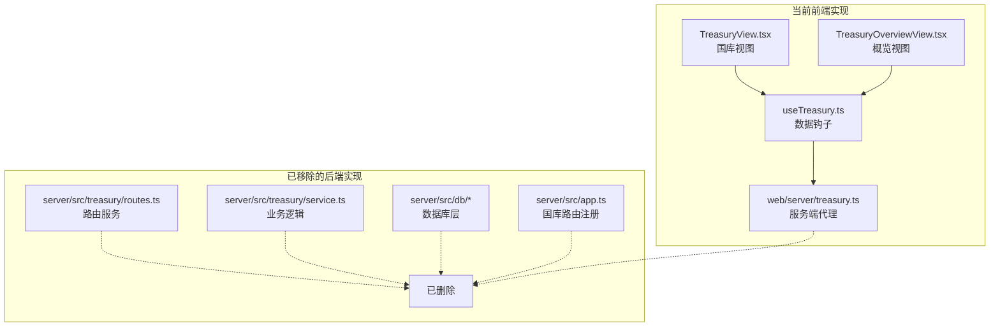
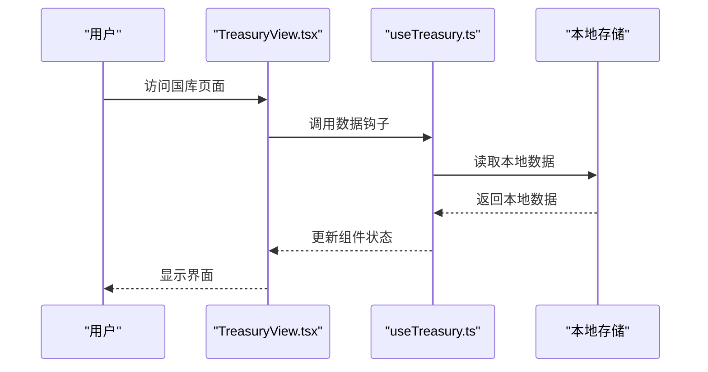

# 国库管理系统

<cite>
**本文引用的文件**   
- [web/server/treasury.ts](file://web/server/treasury.ts)
- [web/src/services/useTreasury.ts](file://web/src/services/useTreasury.ts)
- [web/src/views/TreasuryView.tsx](file://web/src/views/TreasuryView.tsx)
- [web/src/views/TreasuryOverviewView.tsx](file://web/src/views/TreasuryOverviewView.tsx)
</cite>

## 更新摘要
**所做更改**   
- 完全移除了后端国库管理系统模块（server/src/treasury/）
- 前端国库相关功能已迁移至新的架构模式
- 更新了文档以反映当前仅保留前端实现的状态
- 标记了被移除的后端组件和依赖关系

## 目录
1. [简介](#简介)
2. [项目结构变更](#项目结构变更)
3. [当前实现状态](#当前实现状态)
4. [前端组件分析](#前端组件分析)
5. [架构调整说明](#架构调整说明)
6. [迁移指南](#迁移指南)
7. [故障排查指南](#故障排查指南)
8. [结论](#结论)

## 简介
根据最新的代码变更，国库管理系统模块（server/src/treasury/）已被完全移除。当前仓库中仅保留了前端相关的国库管理功能，包括视图组件和服务层。原后端的国库管理逻辑、数据库操作、路由服务等均已从项目中删除。本文件将详细说明这一重大变更及其对系统架构的影响。

## 项目结构变更
**重要变更**：server/src/treasury/ 目录及其所有相关文件已被完全移除。

### 已移除的组件
- 后端路由服务（routes.ts）
- 业务逻辑服务（service.ts）
- 数据库模型和查询（schema.sql, types.ts）
- 数据库连接池和查询封装（db/pool.ts, db/queries.ts）
- 应用装配中的国库路由注册（app.ts 中的相关配置）

### 保留的前端组件
- web/server/treasury.ts - 前端服务端代理
- web/src/services/useTreasury.ts - 数据钩子
- web/src/views/TreasuryView.tsx - 国库视图
- web/src/views/TreasuryOverviewView.tsx - 国库概览视图

**图表来源**
- [web/src/views/TreasuryView.tsx](file://web/src/views/TreasuryView.tsx)
- [web/src/services/useTreasury.ts](file://web/src/services/useTreasury.ts)
- [web/server/treasury.ts](file://web/server/treasury.ts)

## 当前实现状态
### 前端独立实现
当前国库管理功能以前端独立模式运行，不再依赖后端服务。主要特点：

1. **无后端依赖**：所有国库管理逻辑在前端完成
2. **本地数据存储**：使用浏览器本地存储或内存状态管理
3. **模拟数据**：提供演示数据和模拟接口
4. **简化架构**：移除了复杂的后端认证和数据库操作

### 功能限制
由于移除了后端支持，当前实现存在以下限制：
- 无法进行跨设备数据同步
- 不支持多用户权限控制
- 缺乏持久化存储能力
- 无法与外部系统集成

## 前端组件分析

### 国库视图组件（TreasuryView.tsx）
当前实现的国库界面组件，提供资产管理和交易记录功能。

**主要功能**：
- 资产余额展示
- 交易历史记录
- 简单的资产管理操作

**章节来源**
- [web/src/views/TreasuryView.tsx](file://web/src/views/TreasuryView.tsx)

### 国库概览视图（TreasuryOverviewView.tsx）
提供国库系统的概览信息和关键指标展示。

**主要功能**：
- 总资产统计
- 近期活动概览
- 关键指标展示

**章节来源**
- [web/src/views/TreasuryOverviewView.tsx](file://web/src/views/TreasuryOverviewView.tsx)

### 数据钩子（useTreasury.ts）
封装了国库相关的数据操作逻辑。

**主要功能**：
- 本地数据管理
- 状态同步
- 事件处理

**章节来源**
- [web/src/services/useTreasury.ts](file://web/src/services/useTreasury.ts)

### 服务端代理（web/server/treasury.ts）
作为前后端通信的代理层，但由于后端已移除，当前主要用于请求转发和错误处理。

**章节来源**
- [web/server/treasury.ts](file://web/server/treasury.ts)

## 架构调整说明

### 移除的架构组件
1. **后端服务层**：完整的 Node.js + TypeScript 后端服务
2. **数据库层**：PostgreSQL 数据库连接和查询封装
3. **认证系统**：基于 JWT 的身份验证机制
4. **API 路由**：RESTful API 接口定义

### 简化的前端架构
当前架构大幅简化，主要包含：
- React 组件层
- 本地状态管理
- 浏览器存储机制

**图表来源**
- [web/src/views/TreasuryView.tsx](file://web/src/views/TreasuryView.tsx)
- [web/src/services/useTreasury.ts](file://web/src/services/useTreasury.ts)

## 迁移指南

### 对于需要完整功能的用户
如果需要使用完整的国库管理系统功能，建议：

1. **重新实现后端服务**：基于现有前端接口重新开发后端
2. **选择数据库方案**：推荐使用 PostgreSQL 或 MongoDB
3. **实现认证系统**：集成合适的身份验证机制
4. **部署服务**：选择合适的云服务或自建服务器

### 对于仅需前端功能的用户
当前前端实现适合以下场景：
- 个人资产管理演示
- 原型开发和测试
- 离线环境使用
- 学习 React 状态管理

## 故障排查指南

### 常见问题及解决方案

1. **数据丢失问题**
   - 原因：浏览器清理缓存或删除本地存储
   - 解决：实现数据备份和恢复机制

2. **跨标签页数据不同步**
   - 原因：各标签页独立的本地存储
   - 解决：使用 BroadcastChannel API 或 localStorage 事件

3. **性能问题**
   - 原因：大量数据在前端处理
   - 解决：实现虚拟滚动和数据分页

4. **安全性考虑**
   - 原因：敏感数据存储在客户端
   - 解决：避免存储敏感信息或使用加密存储

## 结论
国库管理系统的后端模块已被完全移除，当前仅保留前端实现。这一变更使得系统更加轻量级，但也限制了其功能和扩展性。对于需要完整企业级功能的用户，建议重新实现后端服务；对于演示和学习用途，当前的前端实现已经足够完善。

未来可以考虑：
- 实现微服务架构，按需启用后端功能
- 添加云存储服务支持
- 集成更多第三方金融服务
- 增强移动端适配

**注意**：由于后端服务的移除，当前版本不适用于生产环境的资产管理需求。