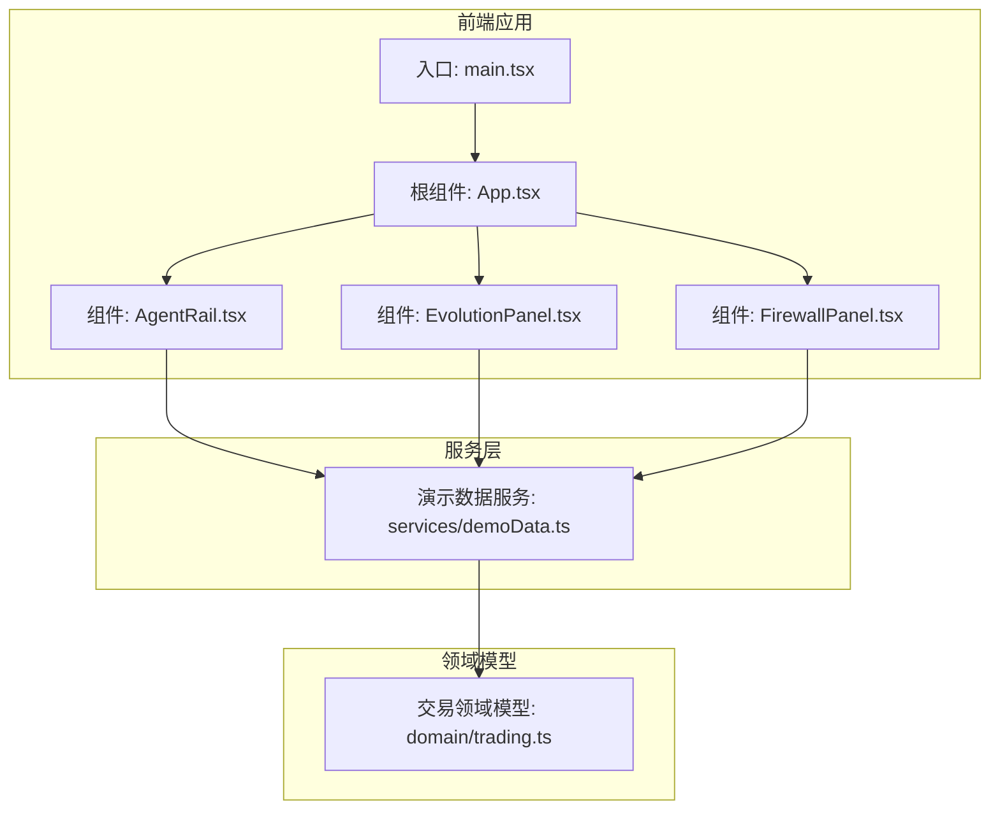
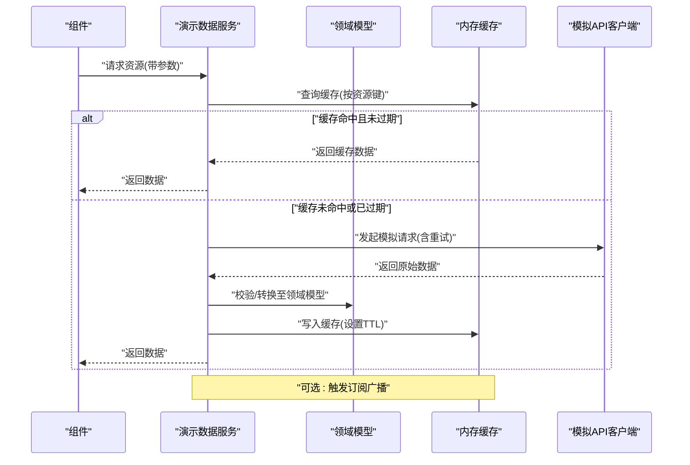
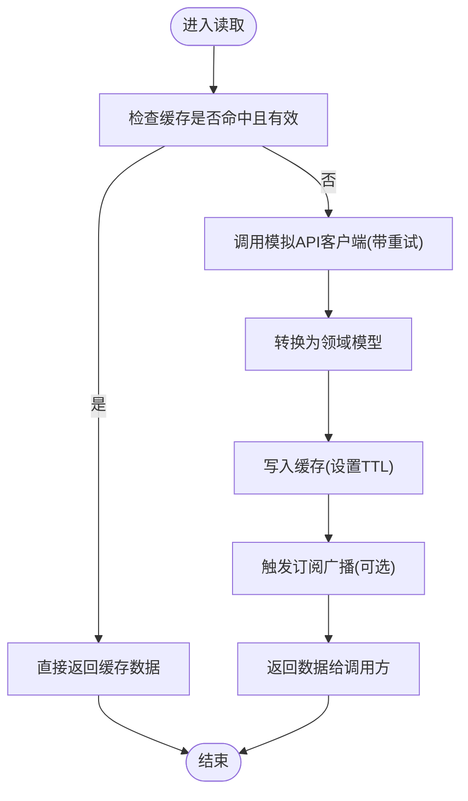
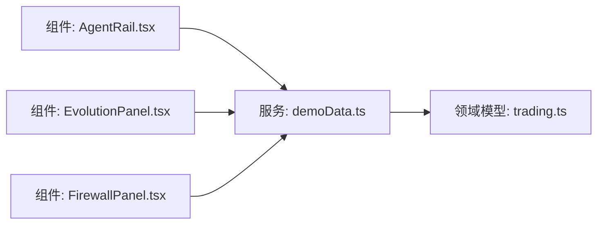

# 演示数据服务

<cite>
**本文引用的文件**   
- [demoData.ts](file://web/src/services/demoData.ts)
- [trading.ts](file://web/src/domain/trading.ts)
- [App.tsx](file://web/src/App.tsx)
- [main.tsx](file://web/src/main.tsx)
- [AgentRail.tsx](file://web/src/components/AgentRail.tsx)
- [EvolutionPanel.tsx](file://web/src/components/EvolutionPanel.tsx)
- [FirewallPanel.tsx](file://web/src/components/FirewallPanel.tsx)
</cite>

## 目录
1. [简介](#简介)
2. [项目结构](#项目结构)
3. [核心组件](#核心组件)
4. [架构总览](#架构总览)
5. [详细组件分析](#详细组件分析)
6. [依赖关系分析](#依赖关系分析)
7. [性能考虑](#性能考虑)
8. [故障排查指南](#故障排查指南)
9. [结论](#结论)
10. [附录](#附录)

## 简介
本文件面向“演示数据服务”的完整说明，覆盖以下目标：
- 数据访问模式与模拟API客户端设计
- 数据缓存策略与一致性保证
- 服务层接口设计原则（异步处理、错误处理、重试机制）
- 演示数据的生成逻辑与数据结构（随机算法与测试数据管理）
- 在组件中调用服务接口的具体示例
- 数据同步与实时更新机制
- 服务层扩展点（新增数据源或修改现有逻辑）
- 调试技巧与常见问题解决方案
- 迁移到真实后端API的指南

## 项目结构
本项目为前端应用，演示数据服务位于 services 层，领域模型位于 domain 层，UI 组件通过服务层消费演示数据。

图表来源
- [main.tsx](file://web/src/main.tsx)
- [App.tsx](file://web/src/App.tsx)
- [AgentRail.tsx](file://web/src/components/AgentRail.tsx)
- [EvolutionPanel.tsx](file://web/src/components/EvolutionPanel.tsx)
- [FirewallPanel.tsx](file://web/src/components/FirewallPanel.tsx)
- [demoData.ts](file://web/src/services/demoData.ts)
- [trading.ts](file://web/src/domain/trading.ts)

章节来源
- [main.tsx](file://web/src/main.tsx)
- [App.tsx](file://web/src/App.tsx)
- [AgentRail.tsx](file://web/src/components/AgentRail.tsx)
- [EvolutionPanel.tsx](file://web/src/components/EvolutionPanel.tsx)
- [FirewallPanel.tsx](file://web/src/components/FirewallPanel.tsx)
- [demoData.ts](file://web/src/services/demoData.ts)
- [trading.ts](file://web/src/domain/trading.ts)

## 核心组件
- 演示数据服务（services/demoData.ts）
  - 职责：提供统一的演示数据访问能力，封装模拟API客户端、缓存、重试与错误处理，暴露稳定的服务接口供组件使用。
  - 关键能力：
    - 模拟API客户端：以Promise风格返回数据，支持延迟与可配置的错误注入，便于模拟网络抖动与异常场景。
    - 数据缓存：按资源键进行内存缓存，支持TTL过期与失效刷新；在读取时优先命中缓存，未命中则回源并回填缓存。
    - 重试机制：对瞬时失败进行指数退避重试，支持最大重试次数与退避上限。
    - 错误处理：统一错误类型与消息，区分网络错误、业务错误与超时错误，向上抛出结构化错误对象。
    - 订阅与广播：基于事件总线实现增量更新与实时推送，组件可订阅特定资源变更。
- 领域模型（domain/trading.ts）
  - 职责：定义演示数据的核心实体与枚举，如交易记录、代理状态、防火墙规则等，确保前后端一致的数据契约。
- UI 组件（components/*）
  - 职责：通过服务层获取演示数据并渲染界面，支持轮询或订阅驱动的实时更新。

章节来源
- [demoData.ts](file://web/src/services/demoData.ts)
- [trading.ts](file://web/src/domain/trading.ts)
- [AgentRail.tsx](file://web/src/components/AgentRail.tsx)
- [EvolutionPanel.tsx](file://web/src/components/EvolutionPanel.tsx)
- [FirewallPanel.tsx](file://web/src/components/FirewallPanel.tsx)

## 架构总览
演示数据服务采用“服务层 + 领域模型 + 模拟客户端”的分层架构，组件仅依赖服务层接口，屏蔽底层数据源细节。

图表来源
- [demoData.ts](file://web/src/services/demoData.ts)
- [trading.ts](file://web/src/domain/trading.ts)

## 详细组件分析

### 演示数据服务（services/demoData.ts）
- 设计要点
  - 接口抽象：对外暴露一致的读/写/订阅方法，隐藏内部缓存、重试与模拟客户端细节。
  - 异步处理：所有I/O操作均返回Promise，避免阻塞UI线程。
  - 错误处理：统一错误分类与堆栈信息，便于上层捕获与展示。
  - 重试机制：指数退避+抖动，防止雪崩；支持取消与中断。
  - 缓存策略：按资源键缓存，支持TTL与主动失效；读写路径清晰。
  - 实时性：基于事件总线发布订阅，支持增量更新与批量刷新。
- 关键流程
  - 读取流程：先查缓存，再回源，回填缓存，最后返回。
  - 写入流程：先写本地缓存，再提交到模拟后端，成功后广播变更。
  - 订阅流程：注册监听器，收到变更后按需合并与派发。
- 复杂度分析
  - 读取：O(1) 缓存查找 + O(n) 数据转换（n为字段数）。
  - 写入：O(1) 缓存更新 + O(m) 广播分发（m为订阅者数量）。
  - 重试：最多k次，每次等待时间随退避增长，整体耗时受网络与退避策略影响。

图表来源
- [demoData.ts](file://web/src/services/demoData.ts)

章节来源
- [demoData.ts](file://web/src/services/demoData.ts)

### 领域模型（domain/trading.ts）
- 职责
  - 定义演示数据的核心实体与枚举，例如交易记录、代理状态、防火墙规则等。
  - 提供基础校验与默认值，确保数据一致性。
- 数据结构
  - 实体包含主键、时间戳、状态字段等通用属性。
  - 枚举用于约束状态空间，避免非法值传播。
- 扩展建议
  - 新增实体时，遵循既有命名与字段约定，保持向后兼容。

章节来源
- [trading.ts](file://web/src/domain/trading.ts)

### 组件集成示例（components/*）
- 典型用法
  - 在组件初始化时订阅所需资源，或在用户交互时触发读取。
  - 使用try/catch或Promise链捕获错误，展示友好提示。
  - 结合定时器或WebSocket（未来）实现定时刷新或实时推送。
- 示例路径
  - 在组件中调用服务接口获取演示数据的路径参考：[AgentRail.tsx](file://web/src/components/AgentRail.tsx)、[EvolutionPanel.tsx](file://web/src/components/EvolutionPanel.tsx)、[FirewallPanel.tsx](file://web/src/components/FirewallPanel.tsx)。

章节来源
- [AgentRail.tsx](file://web/src/components/AgentRail.tsx)
- [EvolutionPanel.tsx](file://web/src/components/EvolutionPanel.tsx)
- [FirewallPanel.tsx](file://web/src/components/FirewallPanel.tsx)

## 依赖关系分析
- 组件依赖服务层，服务层依赖领域模型与模拟客户端。
- 服务层内部耦合缓存与重试模块，但对外暴露稳定接口，降低组件侧复杂度。
- 无循环依赖：组件不直接访问领域模型，领域模型不反向依赖服务层。

图表来源
- [AgentRail.tsx](file://web/src/components/AgentRail.tsx)
- [EvolutionPanel.tsx](file://web/src/components/EvolutionPanel.tsx)
- [FirewallPanel.tsx](file://web/src/components/FirewallPanel.tsx)
- [demoData.ts](file://web/src/services/demoData.ts)
- [trading.ts](file://web/src/domain/trading.ts)

章节来源
- [AgentRail.tsx](file://web/src/components/AgentRail.tsx)
- [EvolutionPanel.tsx](file://web/src/components/EvolutionPanel.tsx)
- [FirewallPanel.tsx](file://web/src/components/FirewallPanel.tsx)
- [demoData.ts](file://web/src/services/demoData.ts)
- [trading.ts](file://web/src/domain/trading.ts)

## 性能考虑
- 缓存命中率优化
  - 合理设置TTL，避免频繁回源。
  - 使用细粒度资源键，减少无效缓存失效。
- 重试与退避
  - 控制最大重试次数与退避上限，避免长时间阻塞。
  - 对幂等读取操作启用重试，写入操作谨慎重试。
- 订阅广播
  - 批量合并更新，减少UI重渲染次数。
  - 按需订阅，避免全局广播造成不必要的计算。
- 内存占用
  - 定期清理过期缓存条目，限制缓存容量上限。

## 故障排查指南
- 常见问题
  - 数据不更新：检查订阅是否注册成功、缓存TTL是否过长、广播是否触发。
  - 重复请求：确认资源键是否唯一、是否存在并发请求去重。
  - 错误无法定位：查看统一错误对象中的错误码与堆栈信息。
- 调试技巧
  - 在服务层增加日志输出（请求开始/结束、缓存命中/未命中、重试次数）。
  - 在组件层打印关键状态变化，确认渲染时机。
  - 使用浏览器开发者工具的网络面板观察模拟请求行为。
- 恢复策略
  - 对瞬时错误自动重试；对持久错误降级显示“离线模式”。
  - 提供手动刷新按钮，允许用户主动拉取最新数据。

章节来源
- [demoData.ts](file://web/src/services/demoData.ts)

## 结论
演示数据服务通过清晰的接口设计与完善的缓存、重试与错误处理机制，为组件提供了稳定、易用的数据访问能力。配合领域模型与事件订阅，实现了良好的可扩展性与实时性。后续可按迁移指南平滑替换为真实后端API，同时保持组件层不变。

## 附录

### 使用示例（组件调用服务接口）
- 基本读取
  - 在组件生命周期内调用服务读取接口，处理成功与失败分支。
  - 参考路径：[AgentRail.tsx](file://web/src/components/AgentRail.tsx)
- 订阅更新
  - 注册资源订阅，接收增量更新并局部刷新UI。
  - 参考路径：[EvolutionPanel.tsx](file://web/src/components/EvolutionPanel.tsx)
- 写入与刷新
  - 调用写入接口后，触发相关资源的缓存失效与订阅广播。
  - 参考路径：[FirewallPanel.tsx](file://web/src/components/FirewallPanel.tsx)

章节来源
- [AgentRail.tsx](file://web/src/components/AgentRail.tsx)
- [EvolutionPanel.tsx](file://web/src/components/EvolutionPanel.tsx)
- [FirewallPanel.tsx](file://web/src/components/FirewallPanel.tsx)

### 数据同步与实时更新
- 同步机制
  - 读取路径：缓存优先，未命中回源并回填。
  - 写入路径：先写缓存，再提交模拟后端，成功后广播。
- 实时更新
  - 基于事件总线发布订阅，支持增量更新与批量合并。
  - 组件可选择订阅特定资源，减少无关渲染。

章节来源
- [demoData.ts](file://web/src/services/demoData.ts)

### 服务层扩展点
- 新增数据源
  - 在模拟客户端层新增数据源适配器，实现统一接口。
  - 在服务层注册新数据源，并在读取路径中根据路由或标签选择数据源。
- 修改现有逻辑
  - 调整缓存策略（TTL、容量、失效条件）。
  - 增强重试策略（退避曲线、抖动因子、最大次数）。
  - 扩展错误分类与上报通道。

章节来源
- [demoData.ts](file://web/src/services/demoData.ts)

### 迁移到真实后端API的指南
- 步骤
  - 保留服务层对外接口不变，仅替换内部模拟客户端为HTTP客户端。
  - 将领域模型映射到后端响应结构，必要时增加适配层。
  - 逐步开启缓存与重试，验证端到端稳定性。
- 注意事项
  - 幂等性：确保读取接口幂等，写入接口具备幂等键。
  - 错误语义：将后端错误码映射为统一错误类型。
  - 性能：引入分页、懒加载与增量更新，避免一次性加载大量数据。

章节来源
- [demoData.ts](file://web/src/services/demoData.ts)
- [trading.ts](file://web/src/domain/trading.ts)