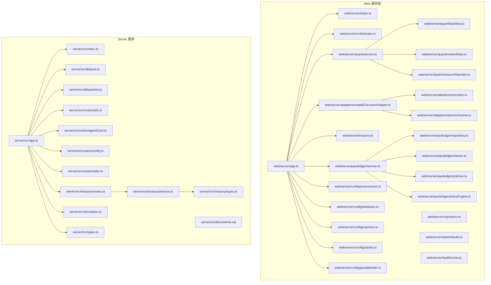
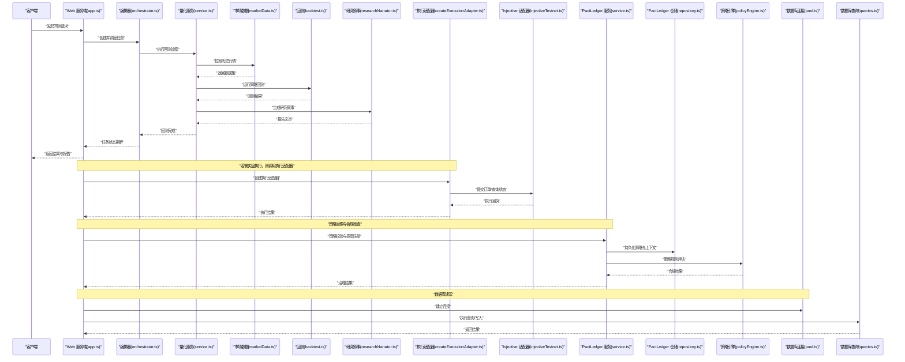
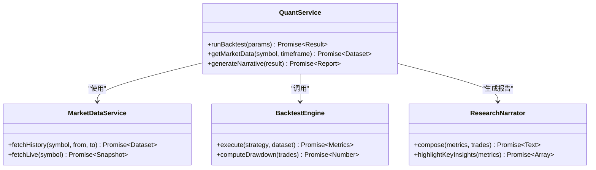
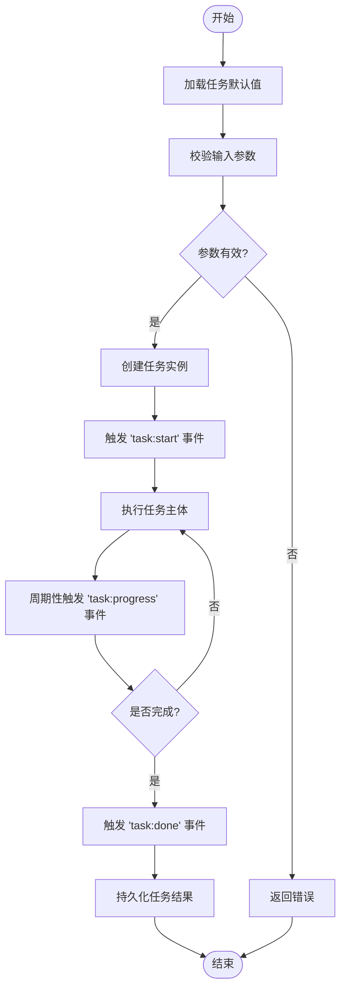
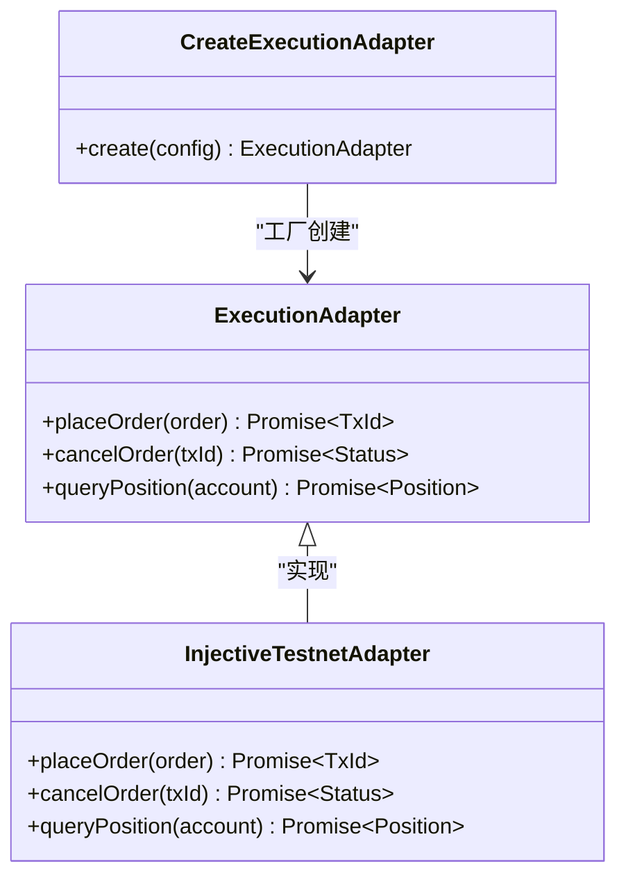
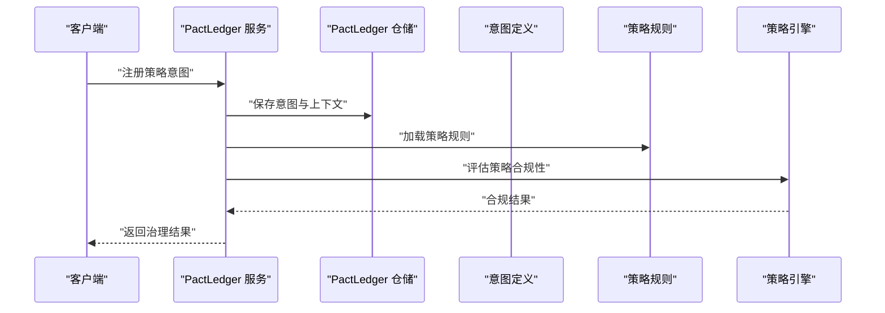
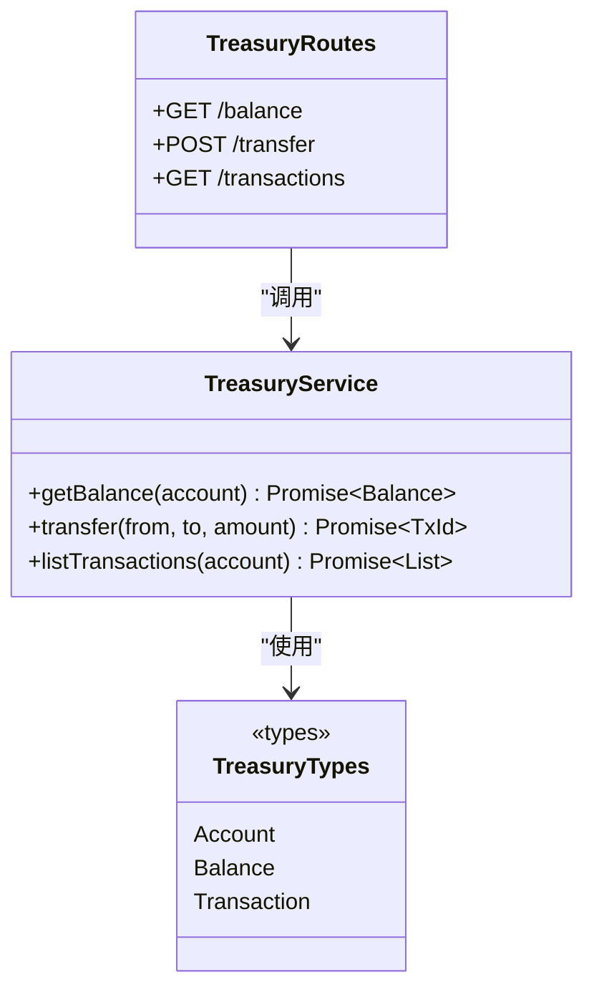
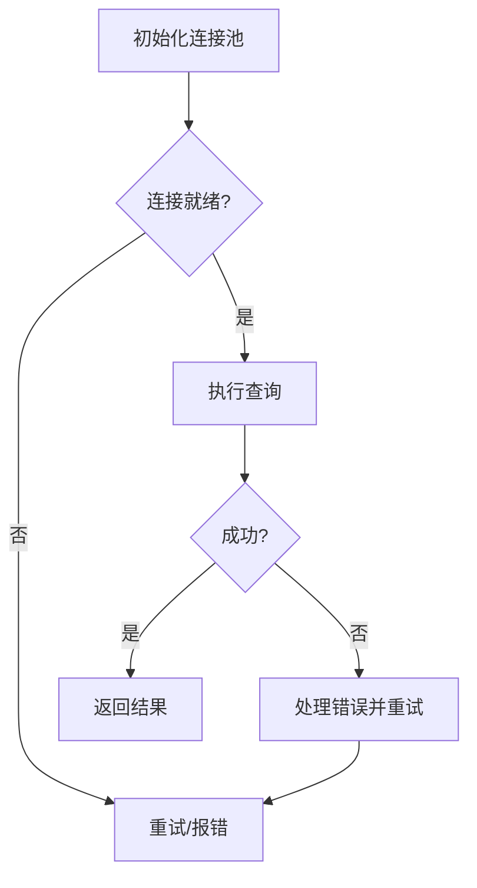
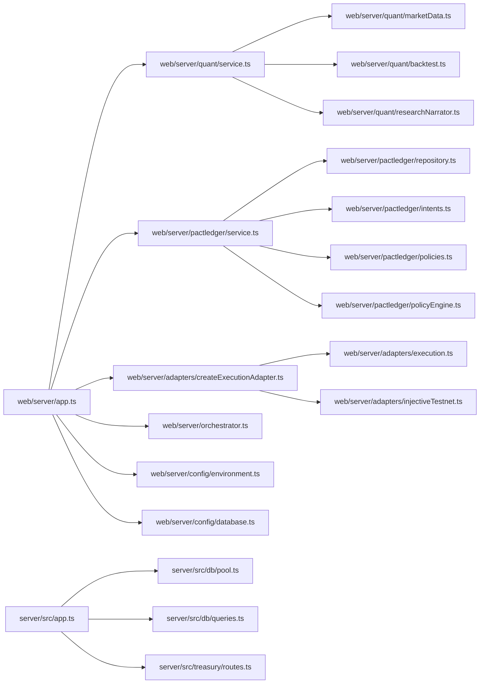

# 量化研究系统

<cite>
**本文引用的文件**   
- [server/src/app.ts](file://server/src/app.ts)
- [server/src/index.ts](file://server/src/index.ts)
- [server/src/simulation.ts](file://server/src/simulation.ts)
- [server/src/types.ts](file://server/src/types.ts)
- [server/src/db/pool.ts](file://server/src/db/pool.ts)
- [server/src/db/queries.ts](file://server/src/db/queries.ts)
- [server/src/db/schema.sql](file://server/src/db/schema.sql)
- [server/src/routes/a2a.ts](file://server/src/routes/a2a.ts)
- [server/src/routes/agentCard.ts](file://server/src/routes/agentCard.ts)
- [server/src/routes/config.ts](file://server/src/routes/config.ts)
- [server/src/routes/tasks.ts](file://server/src/routes/tasks.ts)
- [server/src/treasury/service.ts](file://server/src/treasury/service.ts)
- [server/src/treasury/types.ts](file://server/src/treasury/types.ts)
- [server/src/treasury/routes.ts](file://server/src/treasury/routes.ts)
- [web/server/app.ts](file://web/server/app.ts)
- [web/server/index.ts](file://web/server/index.ts)
- [web/server/orchestrator.ts](file://web/server/orchestrator.ts)
- [web/server/repository.ts](file://web/server/repository.ts)
- [web/server/taskDefaults.ts](file://web/server/taskDefaults.ts)
- [web/server/taskEvents.ts](file://web/server/taskEvents.ts)
- [web/server/treasury.ts](file://web/server/treasury.ts)
- [web/server/adapters/createExecutionAdapter.ts](file://web/server/adapters/createExecutionAdapter.ts)
- [web/server/adapters/execution.ts](file://web/server/adapters/execution.ts)
- [web/server/adapters/injectiveTestnet.ts](file://web/server/adapters/injectiveTestnet.ts)
- [web/server/config/database.ts](file://web/server/config/database.ts)
- [web/server/config/environment.ts](file://web/server/config/environment.ts)
- [web/server/config/injective.ts](file://web/server/config/injective.ts)
- [web/server/config/panda.ts](file://web/server/config/panda.ts)
- [web/server/config/pandaModel.ts](file://web/server/config/pandaModel.ts)
- [web/server/pactledger/service.ts](file://web/server/pactledger/service.ts)
- [web/server/pactledger/repository.ts](file://web/server/pactledger/repository.ts)
- [web/server/pactledger/intents.ts](file://web/server/pactledger/intents.ts)
- [web/server/pactledger/policies.ts](file://web/server/pactledger/policies.ts)
- [web/server/pactledger/policyEngine.ts](file://web/server/pactledger/policyEngine.ts)
- [web/server/quant/service.ts](file://web/server/quant/service.ts)
- [web/server/quant/backtest.ts](file://web/server/quant/backtest.ts)
- [web/server/quant/marketData.ts](file://web/server/quant/marketData.ts)
- [web/server/quant/researchNarrator.ts](file://web/server/quant/researchNarrator.ts)
- [web/server/quant/types.ts](file://web/server/quant/types.ts)
</cite>

## 目录
1. [简介](#简介)
2. [项目结构](#项目结构)
3. [核心组件](#核心组件)
4. [架构总览](#架构总览)
5. [详细组件分析](#详细组件分析)
6. [依赖分析](#依赖分析)
7. [性能考虑](#性能考虑)
8. [故障排查指南](#故障排查指南)
9. [结论](#结论)
10. [附录](#附录)

## 简介
本仓库实现了一个面向量化研究与策略回测的“量化研究系统”。系统采用前后端分离与多服务协作的架构：
- web/server：提供 Web 应用后端、任务编排、量化研究（市场数据、回测、叙事报告）、PactLedger 策略执行与治理、以及交易适配器（如 Injective Testnet）。
- server：提供轻量 API 网关与数据库连接、基础路由、资金库（Treasury）等能力。
- 前端位于 web/src，用于可视化策略实验室、任务流、资金库概览等。

系统强调可插拔的适配器与策略引擎，支持从数据采集到回测、再到策略执行的端到端流程，并通过 PactLedger 进行意图与策略治理。

## 项目结构
整体结构按功能域划分，核心模块包括：
- 配置与环境：环境变量、数据库、Injective、Panda 模型等
- 量化研究：市场数据、回测、研究叙事
- 任务编排：任务默认值、事件总线、编排器
- 适配器层：执行适配器、交易所适配器（Injective Testnet）
- PactLedger：策略意图、策略规则、策略引擎与仓储
- Treasury：资金库服务与类型定义
- 路由与服务：Web 后端主入口、API 路由、数据库连接与查询

图表来源
- [web/server/app.ts](file://web/server/app.ts)
- [web/server/index.ts](file://web/server/index.ts)
- [web/server/orchestrator.ts](file://web/server/orchestrator.ts)
- [web/server/repository.ts](file://web/server/repository.ts)
- [web/server/taskDefaults.ts](file://web/server/taskDefaults.ts)
- [web/server/taskEvents.ts](file://web/server/taskEvents.ts)
- [web/server/quant/service.ts](file://web/server/quant/service.ts)
- [web/server/quant/backtest.ts](file://web/server/quant/backtest.ts)
- [web/server/quant/marketData.ts](file://web/server/quant/marketData.ts)
- [web/server/quant/researchNarrator.ts](file://web/server/quant/researchNarrator.ts)
- [web/server/adapters/execution.ts](file://web/server/adapters/execution.ts)
- [web/server/adapters/createExecutionAdapter.ts](file://web/server/adapters/createExecutionAdapter.ts)
- [web/server/adapters/injectiveTestnet.ts](file://web/server/adapters/injectiveTestnet.ts)
- [web/server/pactledger/service.ts](file://web/server/pactledger/service.ts)
- [web/server/pactledger/repository.ts](file://web/server/pactledger/repository.ts)
- [web/server/pactledger/intents.ts](file://web/server/pactledger/intents.ts)
- [web/server/pactledger/policies.ts](file://web/server/pactledger/policies.ts)
- [web/server/pactledger/policyEngine.ts](file://web/server/pactledger/policyEngine.ts)
- [web/server/config/database.ts](file://web/server/config/database.ts)
- [web/server/config/environment.ts](file://web/server/config/environment.ts)
- [web/server/config/injective.ts](file://web/server/config/injective.ts)
- [web/server/config/panda.ts](file://web/server/config/panda.ts)
- [web/server/config/pandaModel.ts](file://web/server/config/pandaModel.ts)
- [web/server/treasury.ts](file://web/server/treasury.ts)
- [server/src/app.ts](file://server/src/app.ts)
- [server/src/index.ts](file://server/src/index.ts)
- [server/src/simulation.ts](file://server/src/simulation.ts)
- [server/src/types.ts](file://server/src/types.ts)
- [server/src/db/pool.ts](file://server/src/db/pool.ts)
- [server/src/db/queries.ts](file://server/src/db/queries.ts)
- [server/src/db/schema.sql](file://server/src/db/schema.sql)
- [server/src/routes/a2a.ts](file://server/src/routes/a2a.ts)
- [server/src/routes/agentCard.ts](file://server/src/routes/agentCard.ts)
- [server/src/routes/config.ts](file://server/src/routes/config.ts)
- [server/src/routes/tasks.ts](file://server/src/routes/tasks.ts)
- [server/src/treasury/service.ts](file://server/src/treasury/service.ts)
- [server/src/treasury/types.ts](file://server/src/treasury/types.ts)
- [server/src/treasury/routes.ts](file://server/src/treasury/routes.ts)

章节来源
- [web/server/app.ts](file://web/server/app.ts)
- [server/src/app.ts](file://server/src/app.ts)

## 核心组件
- 配置与环境
  - 环境加载与校验：集中管理运行时配置项，为各模块提供统一配置访问。
  - 数据库连接：封装连接池与基本查询操作，供持久化读写使用。
  - 外部集成配置：Injective 网络参数、Panda 模型相关设置。
- 量化研究
  - 市场数据：获取历史与实时行情，支撑回测与研究。
  - 回测引擎：基于历史数据进行策略回测，输出绩效指标与交易记录。
  - 研究叙事：将回测结果与关键洞察生成可读性报告。
- 任务编排
  - 任务默认值：标准化任务输入参数与缺省行为。
  - 事件总线：解耦任务生命周期事件，便于扩展监听与审计。
  - 编排器：协调任务执行顺序、重试与状态同步。
- 适配器层
  - 执行适配器：抽象交易执行接口，屏蔽底层差异。
  - 交易所适配器：以 Injective Testnet 为例，实现具体下单、查询逻辑。
- PactLedger 策略治理
  - 意图与策略：定义策略意图与约束规则。
  - 策略引擎：对策略进行合规检查与决策辅助。
  - 仓储：持久化策略与执行上下文。
- Treasury 资金库
  - 资金账户与流水：维护资产余额、出入金与交易流水。
  - 路由与服务：对外暴露资金库查询与操作接口。

章节来源
- [web/server/config/environment.ts](file://web/server/config/environment.ts)
- [web/server/config/database.ts](file://web/server/config/database.ts)
- [web/server/config/injective.ts](file://web/server/config/injective.ts)
- [web/server/config/panda.ts](file://web/server/config/panda.ts)
- [web/server/config/pandaModel.ts](file://web/server/config/pandaModel.ts)
- [web/server/quant/marketData.ts](file://web/server/quant/marketData.ts)
- [web/server/quant/backtest.ts](file://web/server/quant/backtest.ts)
- [web/server/quant/researchNarrator.ts](file://web/server/quant/researchNarrator.ts)
- [web/server/taskDefaults.ts](file://web/server/taskDefaults.ts)
- [web/server/taskEvents.ts](file://web/server/taskEvents.ts)
- [web/server/orchestrator.ts](file://web/server/orchestrator.ts)
- [web/server/adapters/execution.ts](file://web/server/adapters/execution.ts)
- [web/server/adapters/injectiveTestnet.ts](file://web/server/adapters/injectiveTestnet.ts)
- [web/server/pactledger/intents.ts](file://web/server/pactledger/intents.ts)
- [web/server/pactledger/policies.ts](file://web/server/pactledger/policies.ts)
- [web/server/pactledger/policyEngine.ts](file://web/server/pactledger/policyEngine.ts)
- [web/server/pactledger/repository.ts](file://web/server/pactledger/repository.ts)
- [web/server/pactledger/service.ts](file://web/server/pactledger/service.ts)
- [server/src/treasury/service.ts](file://server/src/treasury/service.ts)
- [server/src/treasury/types.ts](file://server/src/treasury/types.ts)
- [server/src/treasury/routes.ts](file://server/src/treasury/routes.ts)

## 架构总览
系统由 Web 服务端与 Server 服务组成，前者承载量化研究、策略治理与交易适配，后者提供通用 API 与数据库能力。两者通过 HTTP 或进程内调用协同工作。

图表来源
- [web/server/app.ts](file://web/server/app.ts)
- [web/server/orchestrator.ts](file://web/server/orchestrator.ts)
- [web/server/quant/service.ts](file://web/server/quant/service.ts)
- [web/server/quant/marketData.ts](file://web/server/quant/marketData.ts)
- [web/server/quant/backtest.ts](file://web/server/quant/backtest.ts)
- [web/server/quant/researchNarrator.ts](file://web/server/quant/researchNarrator.ts)
- [web/server/adapters/createExecutionAdapter.ts](file://web/server/adapters/createExecutionAdapter.ts)
- [web/server/adapters/injectiveTestnet.ts](file://web/server/adapters/injectiveTestnet.ts)
- [web/server/pactledger/service.ts](file://web/server/pactledger/service.ts)
- [web/server/pactledger/repository.ts](file://web/server/pactledger/repository.ts)
- [web/server/pactledger/policyEngine.ts](file://web/server/pactledger/policyEngine.ts)
- [server/src/db/pool.ts](file://server/src/db/pool.ts)
- [server/src/db/queries.ts](file://server/src/db/queries.ts)

## 详细组件分析

### 量化研究服务（Quant Service）
负责串联市场数据、回测与研究叙事，提供统一的回测执行入口与结果聚合。

图表来源
- [web/server/quant/service.ts](file://web/server/quant/service.ts)
- [web/server/quant/marketData.ts](file://web/server/quant/marketData.ts)
- [web/server/quant/backtest.ts](file://web/server/quant/backtest.ts)
- [web/server/quant/researchNarrator.ts](file://web/server/quant/researchNarrator.ts)

章节来源
- [web/server/quant/service.ts](file://web/server/quant/service.ts)
- [web/server/quant/marketData.ts](file://web/server/quant/marketData.ts)
- [web/server/quant/backtest.ts](file://web/server/quant/backtest.ts)
- [web/server/quant/researchNarrator.ts](file://web/server/quant/researchNarrator.ts)

### 任务编排与事件（Task Orchestration & Events）
通过编排器统一管理任务生命周期，结合任务默认值与事件总线实现可扩展的任务流。

图表来源
- [web/server/taskDefaults.ts](file://web/server/taskDefaults.ts)
- [web/server/taskEvents.ts](file://web/server/taskEvents.ts)
- [web/server/orchestrator.ts](file://web/server/orchestrator.ts)

章节来源
- [web/server/taskDefaults.ts](file://web/server/taskDefaults.ts)
- [web/server/taskEvents.ts](file://web/server/taskEvents.ts)
- [web/server/orchestrator.ts](file://web/server/orchestrator.ts)

### 执行适配器与交易所集成（Execution Adapter & Injective）
通过适配器模式抽象交易执行，注入具体交易所实现（如 Injective Testnet），便于替换与扩展。

图表来源
- [web/server/adapters/execution.ts](file://web/server/adapters/execution.ts)
- [web/server/adapters/injectiveTestnet.ts](file://web/server/adapters/injectiveTestnet.ts)
- [web/server/adapters/createExecutionAdapter.ts](file://web/server/adapters/createExecutionAdapter.ts)

章节来源
- [web/server/adapters/execution.ts](file://web/server/adapters/execution.ts)
- [web/server/adapters/injectiveTestnet.ts](file://web/server/adapters/injectiveTestnet.ts)
- [web/server/adapters/createExecutionAdapter.ts](file://web/server/adapters/createExecutionAdapter.ts)

### PactLedger 策略治理（Intent, Policy, Engine）
围绕策略意图与规则进行治理，确保策略在合规范围内执行。

图表来源
- [web/server/pactledger/service.ts](file://web/server/pactledger/service.ts)
- [web/server/pactledger/repository.ts](file://web/server/pactledger/repository.ts)
- [web/server/pactledger/intents.ts](file://web/server/pactledger/intents.ts)
- [web/server/pactledger/policies.ts](file://web/server/pactledger/policies.ts)
- [web/server/pactledger/policyEngine.ts](file://web/server/pactledger/policyEngine.ts)

章节来源
- [web/server/pactledger/service.ts](file://web/server/pactledger/service.ts)
- [web/server/pactledger/repository.ts](file://web/server/pactledger/repository.ts)
- [web/server/pactledger/intents.ts](file://web/server/pactledger/intents.ts)
- [web/server/pactledger/policies.ts](file://web/server/pactledger/policies.ts)
- [web/server/pactledger/policyEngine.ts](file://web/server/pactledger/policyEngine.ts)

### 资金库（Treasury）
提供资金账户、流水与查询能力，服务于策略与交易的生命周期管理。

图表来源
- [server/src/treasury/service.ts](file://server/src/treasury/service.ts)
- [server/src/treasury/types.ts](file://server/src/treasury/types.ts)
- [server/src/treasury/routes.ts](file://server/src/treasury/routes.ts)

章节来源
- [server/src/treasury/service.ts](file://server/src/treasury/service.ts)
- [server/src/treasury/types.ts](file://server/src/treasury/types.ts)
- [server/src/treasury/routes.ts](file://server/src/treasury/routes.ts)

### 数据库与查询（Database Pool & Queries）
封装数据库连接池与常用查询，为上层服务提供稳定的数据访问能力。

图表来源
- [server/src/db/pool.ts](file://server/src/db/pool.ts)
- [server/src/db/queries.ts](file://server/src/db/queries.ts)
- [server/src/db/schema.sql](file://server/src/db/schema.sql)

章节来源
- [server/src/db/pool.ts](file://server/src/db/pool.ts)
- [server/src/db/queries.ts](file://server/src/db/queries.ts)
- [server/src/db/schema.sql](file://server/src/db/schema.sql)

## 依赖分析
- 模块耦合
  - Web 服务端依赖配置、量化服务、PactLedger、适配器与编排器，形成高内聚低耦合的分层结构。
  - Server 服务聚焦于通用 API、数据库与资金库，避免与业务细节强耦合。
- 外部依赖
  - 交易所适配器对接 Injective Testnet，便于测试与验证。
  - Panda 模型与数据库作为外部资源，通过配置注入。
- 潜在循环依赖
  - 当前分层清晰，未见明显循环依赖；建议保持适配器与策略引擎的单向依赖关系。

图表来源
- [web/server/app.ts](file://web/server/app.ts)
- [web/server/quant/service.ts](file://web/server/quant/service.ts)
- [web/server/pactledger/service.ts](file://web/server/pactledger/service.ts)
- [web/server/adapters/createExecutionAdapter.ts](file://web/server/adapters/createExecutionAdapter.ts)
- [web/server/orchestrator.ts](file://web/server/orchestrator.ts)
- [web/server/config/environment.ts](file://web/server/config/environment.ts)
- [web/server/config/database.ts](file://web/server/config/database.ts)
- [web/server/quant/marketData.ts](file://web/server/quant/marketData.ts)
- [web/server/quant/backtest.ts](file://web/server/quant/backtest.ts)
- [web/server/quant/researchNarrator.ts](file://web/server/quant/researchNarrator.ts)
- [web/server/pactledger/repository.ts](file://web/server/pactledger/repository.ts)
- [web/server/pactledger/intents.ts](file://web/server/pactledger/intents.ts)
- [web/server/pactledger/policies.ts](file://web/server/pactledger/policies.ts)
- [web/server/pactledger/policyEngine.ts](file://web/server/pactledger/policyEngine.ts)
- [web/server/adapters/execution.ts](file://web/server/adapters/execution.ts)
- [web/server/adapters/injectiveTestnet.ts](file://web/server/adapters/injectiveTestnet.ts)
- [server/src/app.ts](file://server/src/app.ts)
- [server/src/db/pool.ts](file://server/src/db/pool.ts)
- [server/src/db/queries.ts](file://server/src/db/queries.ts)
- [server/src/treasury/routes.ts](file://server/src/treasury/routes.ts)

章节来源
- [web/server/app.ts](file://web/server/app.ts)
- [server/src/app.ts](file://server/src/app.ts)

## 性能考虑
- 批量数据拉取：市场数据应支持分页与批处理，减少网络往返与内存占用。
- 回测并行度：根据 CPU 与 I/O 特性调整并发度，避免阻塞事件循环。
- 缓存策略：对热点行情与策略元数据进行缓存，降低重复计算与外部依赖压力。
- 数据库连接池：合理设置最大连接数与超时，避免连接泄漏与拥塞。
- 适配器限流：交易所适配器需遵循速率限制与退避策略，防止被限流或封禁。

[本节为通用指导，不直接分析具体文件]

## 故障排查指南
- 配置与环境
  - 检查环境变量是否正确加载，确认数据库、Injective、Panda 等外部依赖配置无误。
- 数据库连接
  - 观察连接池日志，确认连接建立与释放正常；排查 SQL 错误与锁等待。
- 量化回测
  - 核对数据时间范围与频率，确认缺失数据与异常值的处理逻辑。
- 适配器与交易所
  - 查看网络请求与签名错误，确认密钥与网络连通性；关注限流与重试策略。
- 策略治理
  - 审查策略规则与意图定义，定位合规失败原因；必要时调整策略参数。

章节来源
- [web/server/config/environment.ts](file://web/server/config/environment.ts)
- [web/server/config/database.ts](file://web/server/config/database.ts)
- [web/server/config/injective.ts](file://web/server/config/injective.ts)
- [web/server/config/panda.ts](file://web/server/config/panda.ts)
- [web/server/config/pandaModel.ts](file://web/server/config/pandaModel.ts)
- [server/src/db/pool.ts](file://server/src/db/pool.ts)
- [server/src/db/queries.ts](file://server/src/db/queries.ts)
- [web/server/quant/marketData.ts](file://web/server/quant/marketData.ts)
- [web/server/adapters/injectiveTestnet.ts](file://web/server/adapters/injectiveTestnet.ts)
- [web/server/pactledger/policyEngine.ts](file://web/server/pactledger/policyEngine.ts)

## 结论
该量化研究系统通过模块化与适配器设计，实现了从数据采集、回测到策略治理与交易执行的完整链路。其清晰的职责划分与可扩展的插件机制，使得策略开发与部署更加高效与安全。建议在后续迭代中持续优化性能与稳定性，完善监控与告警体系，提升系统的可观测性与运维效率。

[本节为总结性内容，不直接分析具体文件]

## 附录
- 快速启动
  - 安装依赖并配置环境变量后，分别启动 web/server 与 server 服务。
- 示例流程
  - 在策略实验室中选择标的与时间范围，运行回测并查看研究叙事；如需实盘验证，启用适配器并提交订单。
- 参考文档
  - 开发指南与支付交接说明见 docs 目录。

[本节为补充信息，不直接分析具体文件]