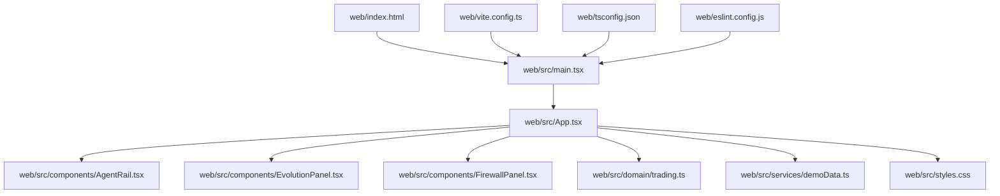
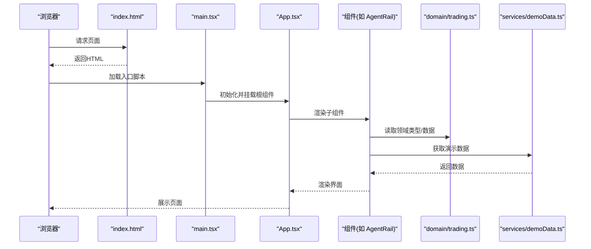
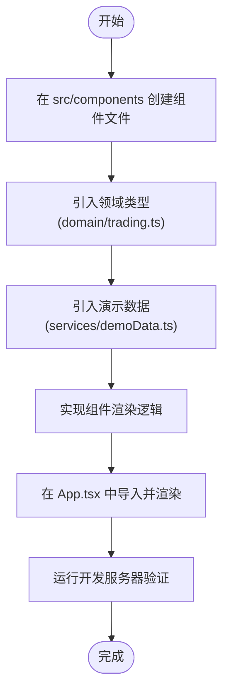
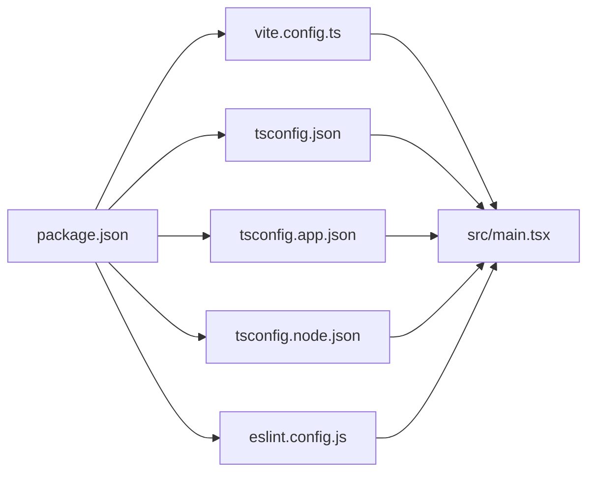

# 快速开始

<cite>
**本文引用的文件**   
- [package.json](file://web/package.json)
- [vite.config.ts](file://web/vite.config.ts)
- [tsconfig.json](file://web/tsconfig.json)
- [tsconfig.app.json](file://web/tsconfig.app.json)
- [tsconfig.node.json](file://web/tsconfig.node.json)
- [eslint.config.js](file://web/eslint.config.js)
- [index.html](file://web/index.html)
- [main.tsx](file://web/src/main.tsx)
- [App.tsx](file://web/src/App.tsx)
- [styles.css](file://web/src/styles.css)
- [AgentRail.tsx](file://web/src/components/AgentRail.tsx)
- [EvolutionPanel.tsx](file://web/src/components/EvolutionPanel.tsx)
- [FirewallPanel.tsx](file://web/src/components/FirewallPanel.tsx)
- [trading.ts](file://web/src/domain/trading.ts)
- [demoData.ts](file://web/src/services/demoData.ts)
- [README.md](file://web/README.md)
</cite>

## 目录
1. [简介](#简介)
2. [项目结构](#项目结构)
3. [核心组件](#核心组件)
4. [架构总览](#架构总览)
5. [详细组件分析](#详细组件分析)
6. [依赖分析](#依赖分析)
7. [性能考虑](#性能考虑)
8. [故障排查指南](#故障排查指南)
9. [结论](#结论)
10. [附录](#附录)

## 简介
本快速开始指南面向首次接触 AdventureX 的开发者，目标是帮助你在最短时间内完成环境准备、安装依赖、启动开发服务器、构建产物与基础调试，并通过一个简单示例了解如何添加新的 UI 组件。本项目为基于 Vite + React + TypeScript 的前端工程，采用模块化目录组织与现代化工具链。

## 项目结构
AdventureX 前端位于 web 目录下，主要结构与职责如下：
- 入口与配置
  - index.html：应用 HTML 模板
  - vite.config.ts：Vite 构建与开发服务器配置
  - tsconfig*.json：TypeScript 编译与检查配置
  - eslint.config.js：代码风格与静态检查规则
  - package.json：依赖与脚本命令定义
- 源码
  - src/main.tsx：应用挂载与初始化
  - src/App.tsx：根组件与页面布局
  - src/styles.css：全局样式
  - src/components/*：UI 组件（如 AgentRail、EvolutionPanel、FirewallPanel）
  - src/domain/trading.ts：领域模型与类型定义
  - src/services/demoData.ts：演示数据服务
- 测试
  - tests/smoke.py：冒烟测试脚本
- 其他
  - README.md：项目说明文档

图表来源
- [index.html:1-20](file://web/index.html#L1-L20)
- [main.tsx:1-30](file://web/src/main.tsx#L1-L30)
- [App.tsx:1-40](file://web/src/App.tsx#L1-L40)
- [vite.config.ts:1-40](file://web/vite.config.ts#L1-L40)
- [tsconfig.json:1-20](file://web/tsconfig.json#L1-L20)
- [eslint.config.js:1-20](file://web/eslint.config.js#L1-L20)

章节来源
- [package.json:1-60](file://web/package.json#L1-L60)
- [vite.config.ts:1-40](file://web/vite.config.ts#L1-L40)
- [tsconfig.json:1-20](file://web/tsconfig.json#L1-L20)
- [tsconfig.app.json:1-20](file://web/tsconfig.app.json#L1-L20)
- [tsconfig.node.json:1-20](file://web/tsconfig.node.json#L1-L20)
- [eslint.config.js:1-20](file://web/eslint.config.js#L1-L20)
- [index.html:1-20](file://web/index.html#L1-L20)
- [main.tsx:1-30](file://web/src/main.tsx#L1-L30)
- [App.tsx:1-40](file://web/src/App.tsx#L1-L40)
- [styles.css:1-20](file://web/src/styles.css#L1-L20)
- [README.md:1-40](file://web/README.md#L1-L40)

## 核心组件
- main.tsx：负责创建 React 根节点并挂载到 DOM，是应用的启动入口
- App.tsx：根组件，组合页面布局与子组件，承载业务视图
- components/*：可复用的 UI 组件，例如 AgentRail、EvolutionPanel、FirewallPanel
- domain/trading.ts：领域层类型与数据结构定义，供组件与服务使用
- services/demoData.ts：提供演示数据，便于本地开发与联调

章节来源
- [main.tsx:1-30](file://web/src/main.tsx#L1-L30)
- [App.tsx:1-40](file://web/src/App.tsx#L1-L40)
- [AgentRail.tsx:1-40](file://web/src/components/AgentRail.tsx#L1-L40)
- [EvolutionPanel.tsx:1-40](file://web/src/components/EvolutionPanel.tsx#L1-L40)
- [FirewallPanel.tsx:1-40](file://web/src/components/FirewallPanel.tsx#L1-L40)
- [trading.ts:1-40](file://web/src/domain/trading.ts#L1-L40)
- [demoData.ts:1-40](file://web/src/services/demoData.ts#L1-L40)

## 架构总览
下图展示了从 HTML 模板到 React 应用加载、组件渲染以及数据流向的整体流程。

图表来源
- [index.html:1-20](file://web/index.html#L1-L20)
- [main.tsx:1-30](file://web/src/main.tsx#L1-L30)
- [App.tsx:1-40](file://web/src/App.tsx#L1-L40)
- [AgentRail.tsx:1-40](file://web/src/components/AgentRail.tsx#L1-L40)
- [trading.ts:1-40](file://web/src/domain/trading.ts#L1-L40)
- [demoData.ts:1-40](file://web/src/services/demoData.ts#L1-L40)

## 详细组件分析
本节以“新增一个 UI 组件”为例，说明在现有架构下如何快速集成新组件。

### 新增组件的标准流程
- 在 src/components 下新建组件文件（例如 NewPanel.tsx），遵循现有组件的组织方式
- 在组件中引入必要的领域类型（来自 domain/trading.ts）与演示数据（来自 services/demoData.ts）
- 在 App.tsx 中导入并渲染该组件，确保其与其他组件协同工作
- 通过开发服务器验证组件渲染与交互是否正常

图表来源
- [AgentRail.tsx:1-40](file://web/src/components/AgentRail.tsx#L1-L40)
- [EvolutionPanel.tsx:1-40](file://web/src/components/EvolutionPanel.tsx#L1-L40)
- [FirewallPanel.tsx:1-40](file://web/src/components/FirewallPanel.tsx#L1-L40)
- [trading.ts:1-40](file://web/src/domain/trading.ts#L1-L40)
- [demoData.ts:1-40](file://web/src/services/demoData.ts#L1-L40)
- [App.tsx:1-40](file://web/src/App.tsx#L1-L40)

章节来源
- [AgentRail.tsx:1-40](file://web/src/components/AgentRail.tsx#L1-L40)
- [EvolutionPanel.tsx:1-40](file://web/src/components/EvolutionPanel.tsx#L1-L40)
- [FirewallPanel.tsx:1-40](file://web/src/components/FirewallPanel.tsx#L1-L40)
- [trading.ts:1-40](file://web/src/domain/trading.ts#L1-L40)
- [demoData.ts:1-40](file://web/src/services/demoData.ts#L1-L40)
- [App.tsx:1-40](file://web/src/App.tsx#L1-L40)

## 依赖分析
- 包管理与脚本
  - package.json：集中管理依赖与脚本命令（如开发、构建、校验等）
- 构建与开发服务器
  - vite.config.ts：Vite 配置，控制开发服务器、插件与构建输出
- 类型与编译
  - tsconfig.json、tsconfig.app.json、tsconfig.node.json：分别用于通用、应用与 Node 环境的 TS 配置
- 代码质量
  - eslint.config.js：统一代码风格与静态检查

图表来源
- [package.json:1-60](file://web/package.json#L1-L60)
- [vite.config.ts:1-40](file://web/vite.config.ts#L1-L40)
- [tsconfig.json:1-20](file://web/tsconfig.json#L1-L20)
- [tsconfig.app.json:1-20](file://web/tsconfig.app.json#L1-L20)
- [tsconfig.node.json:1-20](file://web/tsconfig.node.json#L1-L20)
- [eslint.config.js:1-20](file://web/eslint.config.js#L1-L20)
- [main.tsx:1-30](file://web/src/main.tsx#L1-L30)

章节来源
- [package.json:1-60](file://web/package.json#L1-L60)
- [vite.config.ts:1-40](file://web/vite.config.ts#L1-L40)
- [tsconfig.json:1-20](file://web/tsconfig.json#L1-L20)
- [tsconfig.app.json:1-20](file://web/tsconfig.app.json#L1-L20)
- [tsconfig.node.json:1-20](file://web/tsconfig.node.json#L1-L20)
- [eslint.config.js:1-20](file://web/eslint.config.js#L1-L20)

## 性能考虑
- 使用 Vite 的开发服务器以获得更快的冷启动与热更新体验
- 合理拆分组件与模块，避免单文件过大导致打包体积膨胀
- 按需引入第三方库，减少运行时开销
- 利用浏览器缓存与生产构建优化（如代码分割、资源压缩）

[本节为通用建议，不直接分析具体文件]

## 故障排查指南
- 端口占用或无法启动
  - 检查开发服务器端口是否被占用，必要时修改 vite.config.ts 中的端口设置
- TypeScript 报错
  - 确认 tsconfig.* 配置正确，检查类型定义与导入路径
- ESLint 报错
  - 根据 eslint.config.js 的规则修复代码风格问题
- 组件未渲染或样式异常
  - 检查组件是否在 App.tsx 中正确导入与渲染，确认 styles.css 是否引入
- 依赖缺失或版本冲突
  - 清理 node_modules 后重新安装依赖，确保 Node.js 版本满足要求

章节来源
- [vite.config.ts:1-40](file://web/vite.config.ts#L1-L40)
- [tsconfig.json:1-20](file://web/tsconfig.json#L1-L20)
- [eslint.config.js:1-20](file://web/eslint.config.js#L1-L20)
- [App.tsx:1-40](file://web/src/App.tsx#L1-L40)
- [styles.css:1-20](file://web/src/styles.css#L1-L20)

## 结论
通过以上步骤，你可以在最短时间内完成 AdventureX 的环境搭建、依赖安装、开发服务器启动与基础调试，并掌握新增 UI 组件的标准流程。建议在后续迭代中遵循现有的目录结构与配置约定，保持代码质量与可维护性。

## 附录
- 环境要求
  - Node.js：建议使用当前长期支持版本（请根据 package.json 中的引擎要求选择）
  - 包管理器：npm 或 yarn（任选其一）
- 常用命令
  - 安装依赖：在项目根目录执行包管理器的安装命令
  - 启动开发服务器：执行开发脚本（参考 package.json 中的 scripts）
  - 构建生产产物：执行构建脚本（参考 package.json 中的 scripts）
  - 代码检查：执行 ESLint 检查（参考 package.json 中的 scripts）
- 第一个组件示例
  - 在 src/components 下新建组件文件，按“新增组件的标准流程”集成并在 App.tsx 中渲染
- 最佳实践
  - 保持组件职责单一，合理划分 domain 与 services
  - 使用 TypeScript 严格模式提升类型安全
  - 提交前运行 lint 与构建，确保代码质量

章节来源
- [package.json:1-60](file://web/package.json#L1-L60)
- [README.md:1-40](file://web/README.md#L1-L40)