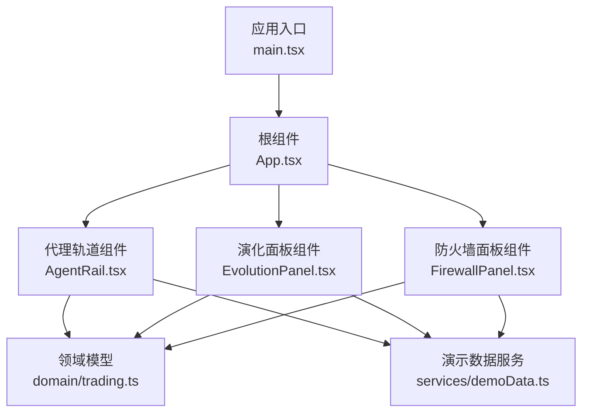
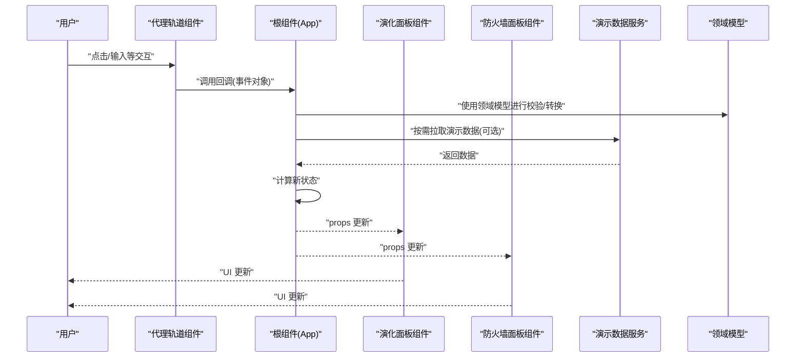
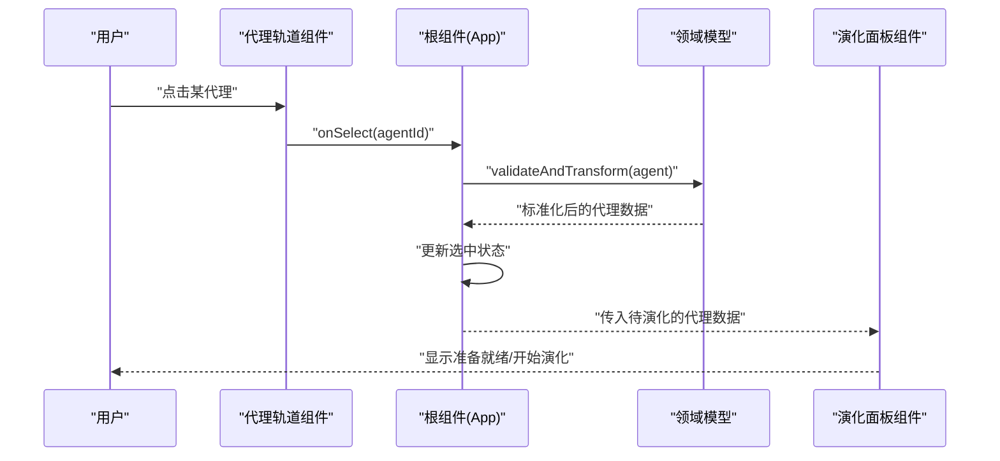
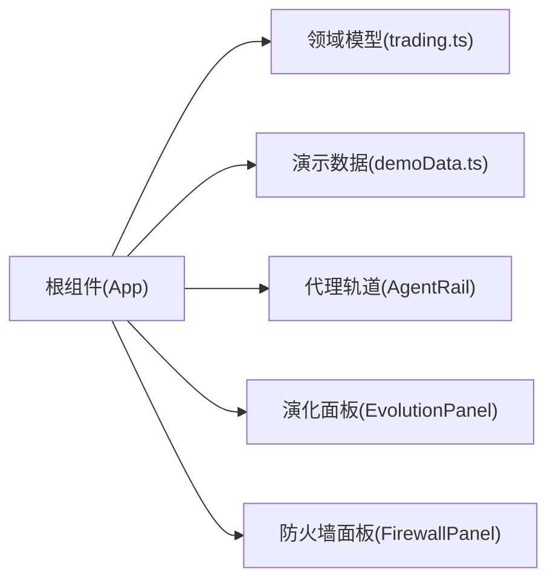

# 数据流与状态管理

<cite>
**本文引用的文件**   
- [App.tsx](file://web/src/App.tsx)
- [main.tsx](file://web/src/main.tsx)
- [AgentRail.tsx](file://web/src/components/AgentRail.tsx)
- [EvolutionPanel.tsx](file://web/src/components/EvolutionPanel.tsx)
- [FirewallPanel.tsx](file://web/src/components/FirewallPanel.tsx)
- [trading.ts](file://web/src/domain/trading.ts)
- [demoData.ts](file://web/src/services/demoData.ts)
- [package.json](file://web/package.json)
- [vite.config.ts](file://web/vite.config.ts)
</cite>

## 目录
1. [简介](#简介)
2. [项目结构](#项目结构)
3. [核心组件](#核心组件)
4. [架构总览](#架构总览)
5. [详细组件分析](#详细组件分析)
6. [依赖关系分析](#依赖关系分析)
7. [性能考虑](#性能考虑)
8. [故障排查指南](#故障排查指南)
9. [结论](#结论)
10. [附录](#附录)

## 简介
本文件面向AdventureX前端工程，聚焦“数据流与状态管理”。目标包括：
- 解释从用户交互到UI更新的完整数据流路径（事件处理、状态更新、组件重新渲染）
- 说明组件间数据传递机制与状态共享策略
- 描述异步数据处理、错误处理与缓存策略的实现要点
- 提供数据流可视化图表，展示模块间的数据依赖关系
- 总结最佳实践、性能优化技巧与调试方法，帮助开发者理解与扩展数据流

## 项目结构
本项目采用基于功能域的前端分层组织方式：
- 应用入口与根组件负责挂载与顶层布局
- 业务领域定义在 domain 层，承载领域模型与规则
- 服务层 services 提供演示数据或外部数据接入能力
- UI 组件位于 components，按功能划分
- 构建配置位于 vite.config.ts，包信息位于 package.json

图示来源
- [main.tsx:1-50](file://web/src/main.tsx#L1-L50)
- [App.tsx:1-120](file://web/src/App.tsx#L1-L120)
- [AgentRail.tsx:1-200](file://web/src/components/AgentRail.tsx#L1-L200)
- [EvolutionPanel.tsx:1-200](file://web/src/components/EvolutionPanel.tsx#L1-L200)
- [FirewallPanel.tsx:1-200](file://web/src/components/FirewallPanel.tsx#L1-L200)
- [trading.ts:1-200](file://web/src/domain/trading.ts#L1-L200)
- [demoData.ts:1-200](file://web/src/services/demoData.ts#L1-L200)

章节来源
- [main.tsx:1-50](file://web/src/main.tsx#L1-L50)
- [App.tsx:1-120](file://web/src/App.tsx#L1-L120)
- [package.json:1-50](file://web/package.json#L1-L50)
- [vite.config.ts:1-50](file://web/vite.config.ts#L1-L50)

## 核心组件
- 根组件 App.tsx
  - 职责：应用初始化、全局状态容器、跨组件数据分发
  - 关键流程：读取演示数据、组装领域模型、向子组件下发状态与回调
- 代理轨道 AgentRail.tsx
  - 职责：展示代理列表与状态，响应点击等交互，触发上层状态变更
- 演化面板 EvolutionPanel.tsx
  - 职责：展示演化过程与结果，接收来自上层的指令并反馈
- 防火墙面板 FirewallPanel.tsx
  - 职责：展示防火墙相关视图，处理开关、阈值等交互
- 领域模型 trading.ts
  - 职责：定义交易相关的类型、校验与转换逻辑，作为跨组件共享的“单一事实源”
- 演示数据服务 demoData.ts
  - 职责：提供本地模拟数据，便于快速验证数据流与UI联动

章节来源
- [App.tsx:1-120](file://web/src/App.tsx#L1-L120)
- [AgentRail.tsx:1-200](file://web/src/components/AgentRail.tsx#L1-L200)
- [EvolutionPanel.tsx:1-200](file://web/src/components/EvolutionPanel.tsx#L1-L200)
- [FirewallPanel.tsx:1-200](file://web/src/components/FirewallPanel.tsx#L1-L200)
- [trading.ts:1-200](file://web/src/domain/trading.ts#L1-L200)
- [demoData.ts:1-200](file://web/src/services/demoData.ts#L1-L200)

## 架构总览
整体数据流遵循“单向数据流 + 集中式状态”的模式：
- 数据源：演示数据服务提供初始数据
- 状态容器：根组件持有全局状态，并通过 props 向下分发
- 事件冒泡：子组件通过回调将用户操作上报至根组件
- 状态更新：根组件根据事件计算新状态，驱动子组件重新渲染
- 领域模型：所有与交易相关的结构与规则集中在领域层，保证一致性

图示来源
- [App.tsx:1-120](file://web/src/App.tsx#L1-L120)
- [AgentRail.tsx:1-200](file://web/src/components/AgentRail.tsx#L1-L200)
- [EvolutionPanel.tsx:1-200](file://web/src/components/EvolutionPanel.tsx#L1-L200)
- [FirewallPanel.tsx:1-200](file://web/src/components/FirewallPanel.tsx#L1-L200)
- [demoData.ts:1-200](file://web/src/services/demoData.ts#L1-L200)
- [trading.ts:1-200](file://web/src/domain/trading.ts#L1-L200)

## 详细组件分析

### 根组件 App.tsx
- 角色定位：全局状态容器与协调者
- 主要职责：
  - 初始化状态（从演示数据服务加载或构造默认值）
  - 维护跨组件共享的状态（如当前选中项、运行态、错误信息等）
  - 提供事件处理器，统一处理来自子组件的交互
  - 调用领域模型对数据进行校验与转换
  - 将最新状态以 props 形式下发给子组件
- 数据流关键点：
  - 状态更新后，React 自动触发受控子组件的重新渲染
  - 对于耗时操作，建议结合异步处理与错误边界，避免阻塞主线程

章节来源
- [App.tsx:1-120](file://web/src/App.tsx#L1-L120)

### 代理轨道组件 AgentRail.tsx
- 角色定位：代理列表与状态展示，承载用户选择与批量操作
- 主要职责：
  - 接收来自父组件的代理集合与选中状态
  - 响应用户点击、多选等操作，向上抛出事件
  - 根据领域模型对输入进行基础校验（如必填字段）
- 数据流关键点：
  - 通过回调函数将事件对象传递给父组件
  - 父组件处理后回写状态，子组件仅做展示与事件转发

章节来源
- [AgentRail.tsx:1-200](file://web/src/components/AgentRail.tsx#L1-L200)

### 演化面板组件 EvolutionPanel.tsx
- 角色定位：展示演化过程与结果，支持参数调节与执行控制
- 主要职责：
  - 接收演化参数与运行状态
  - 触发执行、暂停、重置等动作
  - 将中间结果与最终结果回传给父组件
- 数据流关键点：
  - 长耗时任务应使用异步处理，并在过程中更新进度状态
  - 错误分支需将错误信息上报至根组件，用于统一提示

章节来源
- [EvolutionPanel.tsx:1-200](file://web/src/components/EvolutionPanel.tsx#L1-L200)

### 防火墙面板组件 FirewallPanel.tsx
- 角色定位：展示防火墙策略与开关，支持阈值与规则调整
- 主要职责：
  - 接收策略配置与生效状态
  - 处理开关切换、阈值修改等交互
  - 将变更事件上报至父组件
- 数据流关键点：
  - 对数值型输入进行范围校验，必要时借助领域模型进行规范化

章节来源
- [FirewallPanel.tsx:1-200](file://web/src/components/FirewallPanel.tsx#L1-L200)

### 领域模型 trading.ts
- 角色定位：交易领域的“单一事实源”，定义数据结构、约束与转换
- 主要职责：
  - 定义交易实体、枚举与派生状态
  - 提供校验器与转换器，确保跨组件数据一致性
  - 暴露纯函数供根组件在处理事件时复用
- 设计要点：
  - 保持无副作用，便于测试与复用
  - 对外暴露稳定的接口，内部实现可演进

章节来源
- [trading.ts:1-200](file://web/src/domain/trading.ts#L1-L200)

### 演示数据服务 demoData.ts
- 角色定位：提供本地模拟数据，加速开发联调
- 主要职责：
  - 导出静态数据或延迟返回 Promise 的异步数据
  - 为根组件提供初始状态填充
- 集成建议：
  - 后续替换为真实 API 时，保持相同接口契约，降低侵入性

章节来源
- [demoData.ts:1-200](file://web/src/services/demoData.ts#L1-L200)

### 典型交互序列：用户点击代理并触发演化

图示来源
- [AgentRail.tsx:1-200](file://web/src/components/AgentRail.tsx#L1-L200)
- [App.tsx:1-120](file://web/src/App.tsx#L1-L120)
- [trading.ts:1-200](file://web/src/domain/trading.ts#L1-L200)
- [EvolutionPanel.tsx:1-200](file://web/src/components/EvolutionPanel.tsx#L1-L200)

## 依赖关系分析
- 组件依赖
  - 根组件依赖领域模型与演示数据服务
  - 各面板组件依赖根组件下发的 props 与回调
- 数据依赖
  - 领域模型是跨组件共享的结构与规则中心
  - 演示数据服务为初始状态提供数据源
- 可能的循环依赖风险
  - 组件之间应避免直接相互引用，统一通过根组件协调

图示来源
- [App.tsx:1-120](file://web/src/App.tsx#L1-L120)
- [trading.ts:1-200](file://web/src/domain/trading.ts#L1-L200)
- [demoData.ts:1-200](file://web/src/services/demoData.ts#L1-L200)
- [AgentRail.tsx:1-200](file://web/src/components/AgentRail.tsx#L1-L200)
- [EvolutionPanel.tsx:1-200](file://web/src/components/EvolutionPanel.tsx#L1-L200)
- [FirewallPanel.tsx:1-200](file://web/src/components/FirewallPanel.tsx#L1-L200)

## 性能考虑
- 最小化重渲染
  - 将稳定不变的 props 用常量或 useMemo 包裹
  - 对大型列表使用虚拟滚动或分页
- 异步与并发
  - 长耗时任务使用异步处理，避免阻塞主线程
  - 对频繁触发的输入使用防抖/节流
- 状态粒度
  - 合理拆分状态，减少不必要的广播式更新
- 缓存策略
  - 对演示数据或只读数据做内存缓存，避免重复计算
  - 后续接入网络请求时，引入请求去重与失效策略

[本节为通用指导，不直接分析具体文件]

## 故障排查指南
- 常见问题定位
  - 检查根组件是否正确接收并转发事件回调
  - 确认领域模型的校验是否过于严格导致数据被拒绝
  - 验证演示数据服务的返回格式是否与消费方一致
- 调试建议
  - 在关键状态变更处添加日志输出
  - 使用浏览器开发者工具观察组件 props/state 变化
  - 对复杂计算路径增加断点，逐步验证中间结果
- 错误处理
  - 在异步链路中捕获异常并上报至根组件
  - 提供友好的用户提示与降级展示

章节来源
- [App.tsx:1-120](file://web/src/App.tsx#L1-L120)
- [trading.ts:1-200](file://web/src/domain/trading.ts#L1-L200)
- [demoData.ts:1-200](file://web/src/services/demoData.ts#L1-L200)

## 结论
本项目采用“集中式状态 + 单向数据流”的架构模式，通过根组件统一管理全局状态，利用领域模型保障数据一致性，配合演示数据服务快速验证。该模式清晰、可扩展，适合在后续演进中引入更复杂的异步与缓存策略。

[本节为总结性内容，不直接分析具体文件]

## 附录

### 数据流最佳实践清单
- 明确单一事实源：领域模型集中定义结构与规则
- 单向数据流：子组件仅通过回调上报事件，不直接修改父级状态
- 小步快跑：将大状态拆分为细粒度状态，减少不必要渲染
- 可观测性：关键路径加日志与埋点，便于问题定位
- 可测试性：领域模型与数据处理逻辑尽量纯函数化

[本节为通用指导，不直接分析具体文件]

### 环境信息与构建配置
- 包管理与依赖：参见 package.json
- 构建与开发服务器：参见 vite.config.ts

章节来源
- [package.json:1-50](file://web/package.json#L1-L50)
- [vite.config.ts:1-50](file://web/vite.config.ts#L1-L50)