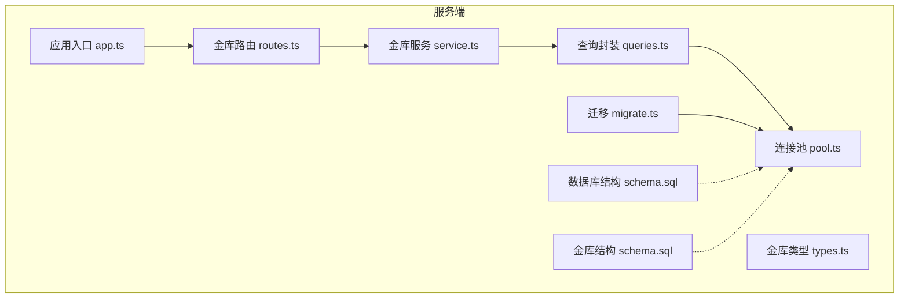
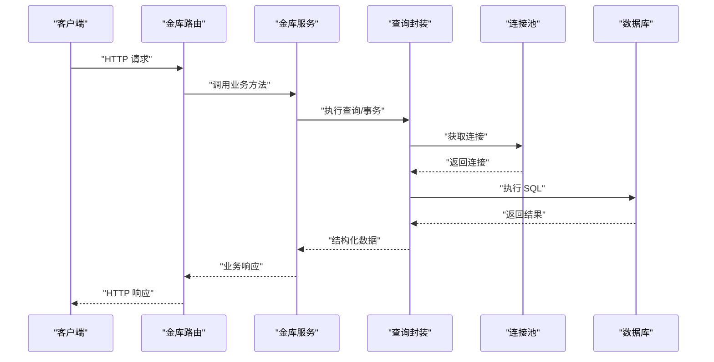
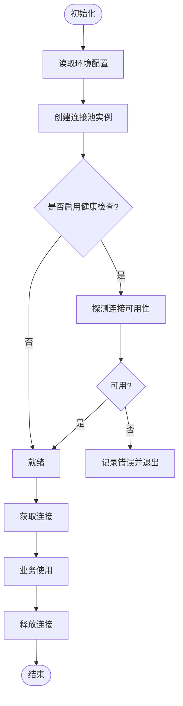
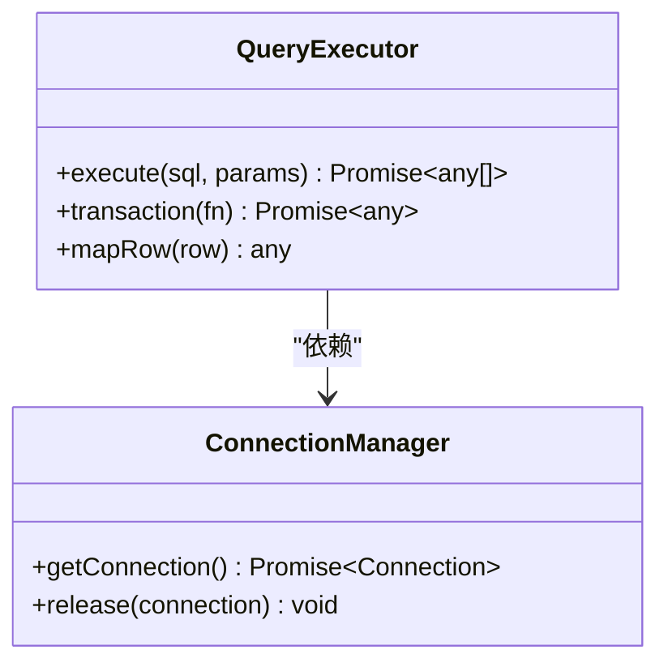
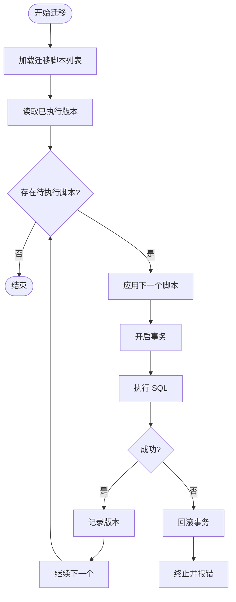
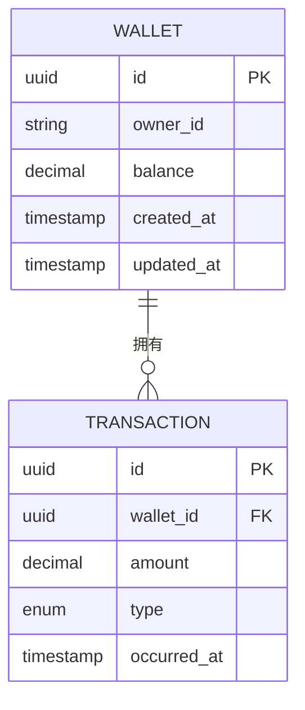
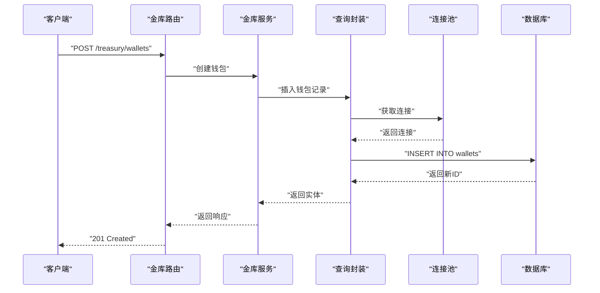
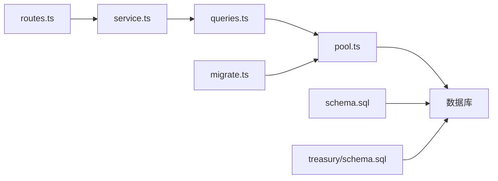

# 数据持久化层

<cite>
**本文引用的文件**   
- [server/src/db/pool.ts](file://server/src/db/pool.ts)
- [server/src/db/queries.ts](file://server/src/db/queries.ts)
- [server/src/db/schema.sql](file://server/src/db/schema.sql)
- [server/src/db/migrate.ts](file://server/src/db/migrate.ts)
- [server/src/treasury/service.ts](file://server/src/treasury/service.ts)
- [server/src/treasury/types.ts](file://server/src/treasury/types.ts)
- [server/src/treasury/routes.ts](file://server/src/treasury/routes.ts)
- [server/src/treasury/schema.sql](file://server/src/treasury/schema.sql)
- [server/src/app.ts](file://server/src/app.ts)
</cite>

## 目录
1. [简介](#简介)
2. [项目结构](#项目结构)
3. [核心组件](#核心组件)
4. [架构总览](#架构总览)
5. [详细组件分析](#详细组件分析)
6. [依赖关系分析](#依赖关系分析)
7. [性能考量](#性能考量)
8. [故障排查指南](#故障排查指南)
9. [结论](#结论)
10. [附录](#附录) 

## 简介
本文件聚焦于项目的数据持久化层，涵盖数据库连接池、SQL 查询封装、迁移脚本以及金库（Treasury）域的数据访问与接口。目标是帮助读者理解：
- 如何建立并复用数据库连接
- 如何通过统一的查询模块访问数据
- 如何通过迁移脚本维护数据库结构
- 金库域的数据模型、服务层与路由的协作方式

## 项目结构
持久化相关代码主要分布在 server 子项目中：
- db 目录：数据库连接池、查询封装、DDL/DML SQL、迁移入口
- treasury 目录：金库域的数据库 schema、类型定义、服务层与路由

图表来源 
- [server/src/app.ts](file://server/src/app.ts)
- [server/src/db/pool.ts](file://server/src/db/pool.ts)
- [server/src/db/queries.ts](file://server/src/db/queries.ts)
- [server/src/db/migrate.ts](file://server/src/db/migrate.ts)
- [server/src/db/schema.sql](file://server/src/db/schema.sql)
- [server/src/treasury/service.ts](file://server/src/treasury/service.ts)
- [server/src/treasury/types.ts](file://server/src/treasury/types.ts)
- [server/src/treasury/routes.ts](file://server/src/treasury/routes.ts)
- [server/src/treasury/schema.sql](file://server/src/treasury/schema.sql)

章节来源
- [server/src/app.ts](file://server/src/app.ts)
- [server/src/db/pool.ts](file://server/src/db/pool.ts)
- [server/src/db/queries.ts](file://server/src/db/queries.ts)
- [server/src/db/migrate.ts](file://server/src/db/migrate.ts)
- [server/src/db/schema.sql](file://server/src/db/schema.sql)
- [server/src/treasury/service.ts](file://server/src/treasury/service.ts)
- [server/src/treasury/types.ts](file://server/src/treasury/types.ts)
- [server/src/treasury/routes.ts](file://server/src/treasury/routes.ts)
- [server/src/treasury/schema.sql](file://server/src/treasury/schema.sql)

## 核心组件
- 连接池管理：集中创建与维护数据库连接池，提供获取连接的统一入口，支持连接生命周期管理与错误处理。
- 查询封装：对底层驱动进行封装，提供参数化查询、事务支持、结果映射等能力，屏蔽 SQL 细节。
- 迁移工具：在应用启动或独立任务中执行数据库结构变更，确保版本一致性与可回滚性。
- 金库域数据访问：围绕金库业务实体，定义类型、服务方法与路由，完成读写操作与对外暴露。

章节来源
- [server/src/db/pool.ts](file://server/src/db/pool.ts)
- [server/src/db/queries.ts](file://server/src/db/queries.ts)
- [server/src/db/migrate.ts](file://server/src/db/migrate.ts)
- [server/src/treasury/service.ts](file://server/src/treasury/service.ts)
- [server/src/treasury/types.ts](file://server/src/treasury/types.ts)
- [server/src/treasury/routes.ts](file://server/src/treasury/routes.ts)

## 架构总览
数据持久化层采用“连接池 + 查询封装 + 迁移”的分层设计，业务侧通过服务层调用查询封装，最终落到数据库。

图表来源 
- [server/src/treasury/routes.ts](file://server/src/treasury/routes.ts)
- [server/src/treasury/service.ts](file://server/src/treasury/service.ts)
- [server/src/db/queries.ts](file://server/src/db/queries.ts)
- [server/src/db/pool.ts](file://server/src/db/pool.ts)

## 详细组件分析

### 连接池（pool.ts）
职责与要点：
- 初始化连接池：根据环境变量配置主机、端口、用户、密码、数据库名、最大连接数等。
- 连接生命周期：提供获取连接、释放连接、关闭连接的方法；在异常时回收资源。
- 健康检查：可选地实现连接可用性探测，避免将不可用连接分配给上层。
- 错误处理：捕获连接失败、网络异常、认证失败等场景，向上抛出明确错误信息。

图表来源 
- [server/src/db/pool.ts](file://server/src/db/pool.ts)

章节来源
- [server/src/db/pool.ts](file://server/src/db/pool.ts)

### 查询封装（queries.ts）
职责与要点：
- 参数化查询：统一封装 SELECT/INSERT/UPDATE/DELETE，防止 SQL 注入。
- 事务支持：提供 begin/commit/rollback 包装，简化多语句一致性控制。
- 结果映射：将行对象映射为领域类型，便于上层消费。
- 错误传播：将底层错误转换为统一错误类型，包含上下文信息。

图表来源 
- [server/src/db/queries.ts](file://server/src/db/queries.ts)
- [server/src/db/pool.ts](file://server/src/db/pool.ts)

章节来源
- [server/src/db/queries.ts](file://server/src/db/queries.ts)

### 迁移（migrate.ts）
职责与要点：
- 版本管理：按顺序执行迁移脚本，记录已执行版本，避免重复执行。
- 幂等性：保证同一版本不会重复生效，支持回滚策略。
- 启动集成：可在应用启动时自动执行未应用的迁移。
- 错误恢复：失败时中断并保留状态，便于人工干预。

图表来源 
- [server/src/db/migrate.ts](file://server/src/db/migrate.ts)
- [server/src/db/schema.sql](file://server/src/db/schema.sql)

章节来源
- [server/src/db/migrate.ts](file://server/src/db/migrate.ts)
- [server/src/db/schema.sql](file://server/src/db/schema.sql)

### 金库域（service.ts / types.ts / routes.ts / schema.sql）
职责与要点：
- 类型定义：明确金库实体字段、约束与枚举值，作为服务与路由的类型契约。
- 服务层：封装金库相关的增删改查、余额计算、流水记录等业务逻辑。
- 路由层：暴露 HTTP 接口，负责参数校验、权限检查、调用服务层并返回响应。
- 数据模型：通过 schema.sql 定义表结构与索引，保障数据完整性与查询性能。

图表来源 
- [server/src/treasury/schema.sql](file://server/src/treasury/schema.sql)
- [server/src/treasury/types.ts](file://server/src/treasury/types.ts)

图表来源 
- [server/src/treasury/routes.ts](file://server/src/treasury/routes.ts)
- [server/src/treasury/service.ts](file://server/src/treasury/service.ts)
- [server/src/db/queries.ts](file://server/src/db/queries.ts)
- [server/src/db/pool.ts](file://server/src/db/pool.ts)

章节来源
- [server/src/treasury/service.ts](file://server/src/treasury/service.ts)
- [server/src/treasury/types.ts](file://server/src/treasury/types.ts)
- [server/src/treasury/routes.ts](file://server/src/treasury/routes.ts)
- [server/src/treasury/schema.sql](file://server/src/treasury/schema.sql)

## 依赖关系分析
- 路由层依赖服务层，服务层依赖查询封装，查询封装依赖连接池，连接池依赖数据库。
- 迁移模块独立于运行时，但在应用启动时可被触发以同步数据库结构。
- 金库域的类型定义贯穿路由、服务与查询层，保证类型安全与契约一致性。

图表来源 
- [server/src/treasury/routes.ts](file://server/src/treasury/routes.ts)
- [server/src/treasury/service.ts](file://server/src/treasury/service.ts)
- [server/src/db/queries.ts](file://server/src/db/queries.ts)
- [server/src/db/pool.ts](file://server/src/db/pool.ts)
- [server/src/db/migrate.ts](file://server/src/db/migrate.ts)
- [server/src/db/schema.sql](file://server/src/db/schema.sql)
- [server/src/treasury/schema.sql](file://server/src/treasury/schema.sql)

章节来源
- [server/src/treasury/routes.ts](file://server/src/treasury/routes.ts)
- [server/src/treasury/service.ts](file://server/src/treasury/service.ts)
- [server/src/db/queries.ts](file://server/src/db/queries.ts)
- [server/src/db/pool.ts](file://server/src/db/pool.ts)
- [server/src/db/migrate.ts](file://server/src/db/migrate.ts)
- [server/src/db/schema.sql](file://server/src/db/schema.sql)
- [server/src/treasury/schema.sql](file://server/src/treasury/schema.sql)

## 性能考量
- 连接池大小：根据并发量与数据库承载能力调整最大连接数，避免过多连接导致数据库压力过大。
- 查询优化：合理使用索引、避免 N+1 查询、批量写入减少往返次数。
- 事务边界：尽量缩小事务范围，降低锁持有时间，提高吞吐。
- 超时与重试：为连接与查询设置合理超时，必要时实现幂等重试。
- 监控与指标：采集连接池使用率、慢查询、错误率等关键指标。

[本节为通用指导，不直接分析具体文件]

## 故障排查指南
常见问题与定位步骤：
- 连接失败：检查数据库地址、端口、用户名、密码、防火墙规则；查看连接池日志与错误码。
- 查询缓慢：确认是否存在缺失索引、复杂 JOIN、全表扫描；使用 EXPLAIN 分析执行计划。
- 事务死锁：缩短事务时长，统一加锁顺序，避免循环依赖。
- 迁移失败：核对脚本顺序与幂等性，查看迁移记录表，必要时手动修复状态。
- 金库数据不一致：核对事务提交点、补偿机制与对账流程。

章节来源
- [server/src/db/pool.ts](file://server/src/db/pool.ts)
- [server/src/db/queries.ts](file://server/src/db/queries.ts)
- [server/src/db/migrate.ts](file://server/src/db/migrate.ts)
- [server/src/treasury/service.ts](file://server/src/treasury/service.ts)

## 结论
本持久化层通过连接池、查询封装与迁移工具形成稳定可靠的数据访问基础，配合金库域的类型与服务层，实现了清晰的分层与良好的可维护性。建议在生产环境中完善监控、告警与容量规划，持续优化查询与事务策略，确保系统在高并发与高可用场景下的稳定性。

[本节为总结性内容，不直接分析具体文件]

## 附录
- 环境变量参考：数据库连接参数、连接池上限、超时时间等应在环境变量中配置，避免硬编码。
- 最佳实践：
  - 所有 SQL 必须参数化，禁止字符串拼接。
  - 敏感信息（如密码）不得进入代码仓库。
  - 迁移脚本需具备幂等性与回滚能力。
  - 服务层应返回明确的领域类型，避免泄露内部结构。

[本节为补充说明，不直接分析具体文件]