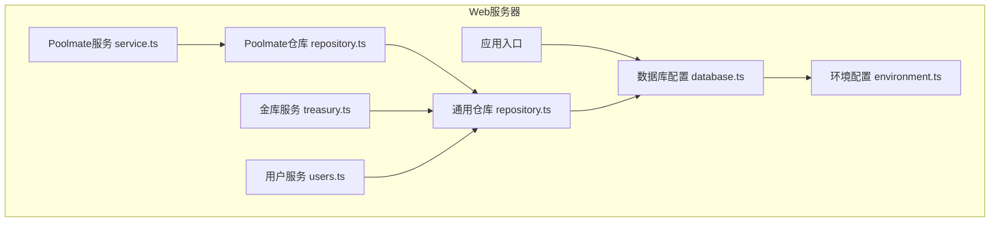
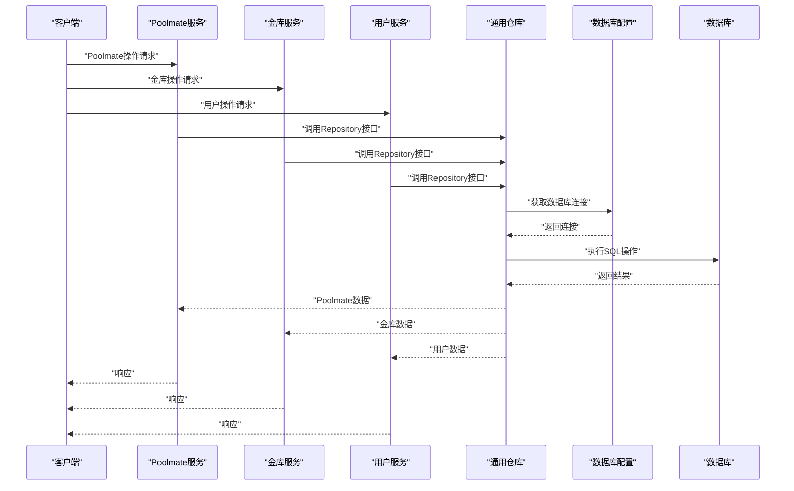
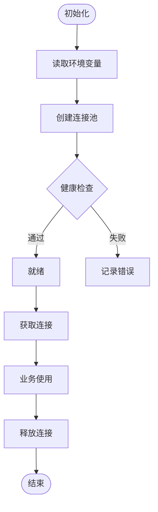
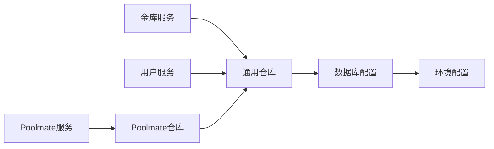

# 数据持久化层

<cite>
**本文引用的文件**   
- [web/server/config/database.ts](file://web/server/config/database.ts)
- [web/server/config/environment.ts](file://web/server/config/environment.ts)
- [web/server/repository.ts](file://web/server/repository.ts)
- [web/server/poolmate/service.ts](file://web/server/poolmate/service.ts)
- [web/server/poolmate/repository.ts](file://web/server/poolmate/repository.ts)
- [web/server/treasury.ts](file://web/server/treasury.ts)
- [web/server/users.ts](file://web/server/users.ts)
</cite>

## 更新摘要
**变更内容**   
- 原server/src/db/目录下的数据库相关文件已被移除，数据库实现已迁移至web/server/config/database.ts
- 新的架构采用集中式配置管理，数据库连接和查询逻辑统一在config目录下管理
- 更新了数据访问层的组织结构，将repository模式应用于各个业务模块
- 简化了项目结构，移除了冗余的数据库抽象层

## 目录
1. [简介](#简介)
2. [项目结构](#项目结构)
3. [核心组件](#核心组件)
4. [架构总览](#架构总览)
5. [详细组件分析](#详细组件分析)
6. [Poolmate模块数据访问层](#poolmate模块数据访问层)
7. [用户数据访问层](#用户数据访问层)
8. [依赖关系分析](#依赖关系分析)
9. [性能考量](#性能考量)
10. [故障排查指南](#故障排查指南)
11. [结论](#结论)
12. [附录](#附录) 

## 简介
本文件聚焦于项目的数据持久化层，涵盖新的集中式数据库配置、Repository模式的数据访问以及各业务模块的数据操作。目标是帮助读者理解：
- 如何通过统一的配置模块管理数据库连接
- 如何通过Repository模式进行数据访问
- 各业务模块（Poolmate、Treasury、Users）的数据持久化实现
- 新架构下的数据流和依赖关系

## 项目结构
持久化相关代码主要分布在 web/server 子项目中：
- config 目录：集中式的数据库配置和环境变量管理
- repository.ts：通用的数据访问接口定义
- poolmate 目录：Poolmate模块的数据访问和服务层
- treasury.ts：金库域的数据访问和业务逻辑
- users.ts：用户数据访问层

图表来源 
- [web/server/config/database.ts](file://web/server/config/database.ts)
- [web/server/config/environment.ts](file://web/server/config/environment.ts)
- [web/server/repository.ts](file://web/server/repository.ts)
- [web/server/poolmate/service.ts](file://web/server/poolmate/service.ts)
- [web/server/poolmate/repository.ts](file://web/server/poolmate/repository.ts)
- [web/server/treasury.ts](file://web/server/treasury.ts)
- [web/server/users.ts](file://web/server/users.ts)

章节来源
- [web/server/config/database.ts](file://web/server/config/database.ts)
- [web/server/config/environment.ts](file://web/server/config/environment.ts)
- [web/server/repository.ts](file://web/server/repository.ts)
- [web/server/poolmate/service.ts](file://web/server/poolmate/service.ts)
- [web/server/poolmate/repository.ts](file://web/server/poolmate/repository.ts)
- [web/server/treasury.ts](file://web/server/treasury.ts)
- [web/server/users.ts](file://web/server/users.ts)

## 核心组件
- 集中式数据库配置：统一管理数据库连接参数、连接池配置和环境变量
- Repository模式：提供统一的数据访问接口，封装CRUD操作
- Poolmate数据访问：为机器人状态管理和用户数据提供专门的数据持久化支持
- Treasury数据访问：处理金库相关的业务逻辑和数据操作
- Users数据访问：管理用户数据的CRUD操作

章节来源
- [web/server/config/database.ts](file://web/server/config/database.ts)
- [web/server/repository.ts](file://web/server/repository.ts)
- [web/server/poolmate/service.ts](file://web/server/poolmate/service.ts)
- [web/server/poolmate/repository.ts](file://web/server/poolmate/repository.ts)
- [web/server/treasury.ts](file://web/server/treasury.ts)
- [web/server/users.ts](file://web/server/users.ts)

## 架构总览
新的数据持久化层采用"集中配置 + Repository模式"的设计，通过统一的数据库配置模块管理连接，各业务模块通过Repository接口进行数据访问。

图表来源 
- [web/server/poolmate/service.ts](file://web/server/poolmate/service.ts)
- [web/server/treasury.ts](file://web/server/treasury.ts)
- [web/server/users.ts](file://web/server/users.ts)
- [web/server/repository.ts](file://web/server/repository.ts)
- [web/server/config/database.ts](file://web/server/config/database.ts)

## 详细组件分析

### 数据库配置（database.ts）
职责与要点：
- 环境变量读取：从环境变量中获取数据库连接参数
- 连接池管理：创建和维护数据库连接池实例
- 健康检查：提供连接可用性检测机制
- 错误处理：统一的错误处理和日志记录

**Section sources**   
- [web/server/config/database.ts](file://web/server/config/database.ts)

### 环境配置（environment.ts）
职责与要点：
- 环境变量验证：确保必需的环境变量存在且格式正确
- 默认值设置：为可选配置提供合理的默认值
- 类型安全：确保环境变量值的类型正确性

**Section sources**   
- [web/server/config/environment.ts](file://web/server/config/environment.ts)

### 通用仓库（repository.ts）
职责与要点：
- 接口定义：定义统一的数据访问接口规范
- CRUD操作：提供基础的增删改查方法
- 事务支持：支持数据库事务操作
- 错误处理：统一的错误处理机制

**Section sources**   
- [web/server/repository.ts](file://web/server/repository.ts)

### Poolmate模块数据访问层

#### Poolmate服务（service.ts）
职责与要点：
- 业务逻辑：协调机器人状态管理、用户数据处理和交易记录操作
- 数据验证：对输入数据进行验证和业务规则检查
- 错误处理：处理业务异常和异常情况

#### Poolmate仓库（repository.ts）
职责与要点：
- 数据访问：实现具体的数据库操作逻辑
- 查询优化：优化复杂查询和批量操作
- 数据映射：将数据库结果映射为领域对象

**Section sources**   
- [web/server/poolmate/service.ts](file://web/server/poolmate/service.ts)
- [web/server/poolmate/repository.ts](file://web/server/poolmate/repository.ts)

### 用户数据访问层

#### 用户服务（users.ts）
职责与要点：
- 用户CRUD：提供用户的创建、读取、更新、删除操作
- 数据验证：对用户数据进行格式和业务规则验证
- 权限控制：基于角色的数据访问控制

**Section sources**   
- [web/server/users.ts](file://web/server/users.ts)

## 依赖关系分析
- 所有业务模块都依赖通用Repository接口
- Repository模块依赖数据库配置模块
- 数据库配置模块依赖环境配置模块
- 业务模块之间保持松耦合，通过接口进行交互

图表来源 
- [web/server/poolmate/service.ts](file://web/server/poolmate/service.ts)
- [web/server/poolmate/repository.ts](file://web/server/poolmate/repository.ts)
- [web/server/treasury.ts](file://web/server/treasury.ts)
- [web/server/users.ts](file://web/server/users.ts)
- [web/server/repository.ts](file://web/server/repository.ts)
- [web/server/config/database.ts](file://web/server/config/database.ts)
- [web/server/config/environment.ts](file://web/server/config/environment.ts)

章节来源
- [web/server/poolmate/service.ts](file://web/server/poolmate/service.ts)
- [web/server/poolmate/repository.ts](file://web/server/poolmate/repository.ts)
- [web/server/treasury.ts](file://web/server/treasury.ts)
- [web/server/users.ts](file://web/server/users.ts)
- [web/server/repository.ts](file://web/server/repository.ts)
- [web/server/config/database.ts](file://web/server/config/database.ts)
- [web/server/config/environment.ts](file://web/server/config/environment.ts)

## 性能考量
- 连接池优化：合理配置连接池大小，避免连接泄漏
- 查询优化：使用合适的索引和查询策略
- 缓存策略：考虑对频繁访问的数据添加缓存
- 事务管理：合理使用事务，避免长时间持有锁
- 监控指标：收集关键性能指标进行监控

## 故障排查指南
常见问题与定位步骤：
- 连接失败：检查环境变量配置、网络连接和数据库状态
- 查询缓慢：分析慢查询日志，检查索引使用情况
- 内存泄漏：监控连接池使用情况，检查连接是否正确释放
- 数据不一致：检查事务边界和数据一致性约束
- 性能问题：分析系统资源使用情况，识别瓶颈点

## 结论
新的数据持久化层通过集中式配置和Repository模式实现了更清晰的分层架构，提高了代码的可维护性和可测试性。相比原有的server/src/db/结构，新架构更加简洁，减少了不必要的抽象层次。建议在生产环境中完善监控和日志记录，持续优化性能和稳定性。

## 附录
- 环境变量配置：数据库连接参数、连接池配置等应在环境变量中配置
- 最佳实践：
  - 使用Repository模式进行数据访问
  - 实现适当的错误处理和日志记录
  - 编写单元测试覆盖关键业务逻辑
  - 定期审查和优化数据库查询
  - 实施适当的安全措施保护敏感数据