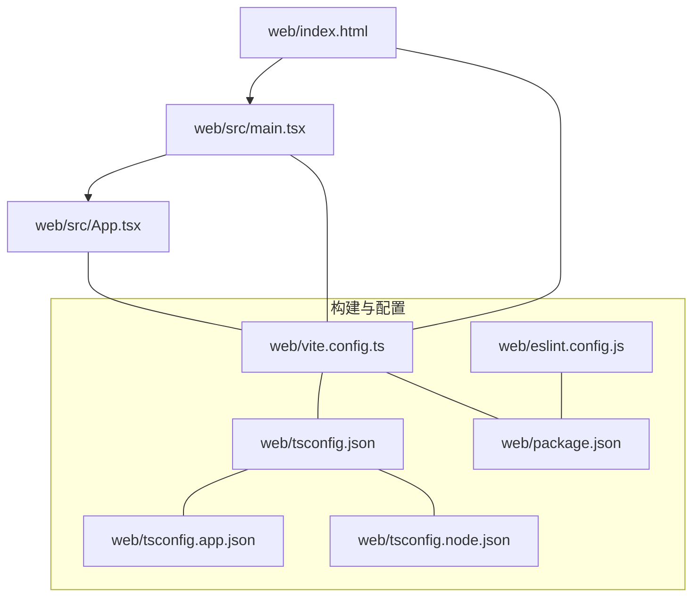
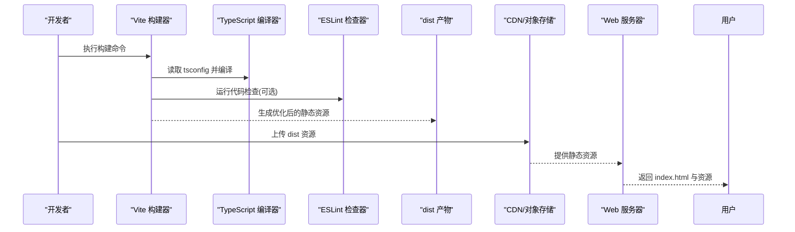
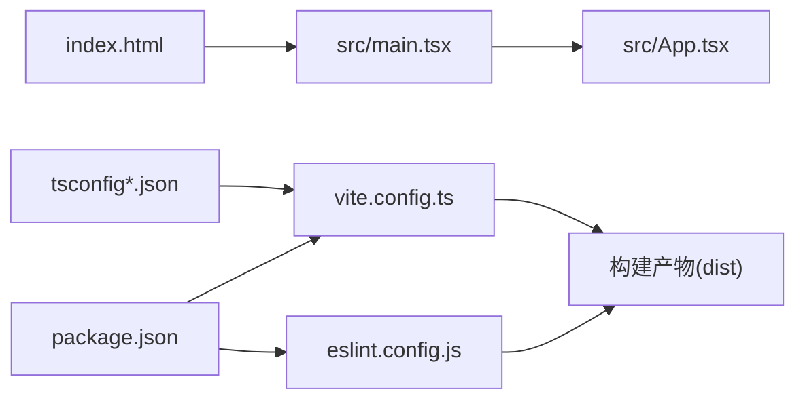

# 构建与部署

<cite>
**本文引用的文件**   
- [package.json](file://web/package.json)
- [vite.config.ts](file://web/vite.config.ts)
- [tsconfig.json](file://web/tsconfig.json)
- [tsconfig.app.json](file://web/tsconfig.app.json)
- [tsconfig.node.json](file://web/tsconfig.node.json)
- [eslint.config.js](file://web/eslint.config.js)
- [index.html](file://web/index.html)
- [main.tsx](file://web/src/main.tsx)
- [App.tsx](file://web/src/App.tsx)
</cite>

## 目录
1. [简介](#简介)
2. [项目结构](#项目结构)
3. [核心组件](#核心组件)
4. [架构总览](#架构总览)
5. [详细组件分析](#详细组件分析)
6. [依赖分析](#依赖分析)
7. [性能考虑](#性能考虑)
8. [故障排查指南](#故障排查指南)
9. [结论](#结论)
10. [附录](#附录)

## 简介
本指南面向运维与工程团队，提供 AdventureX 前端项目的构建与生产部署完整方案。内容覆盖 Vite 构建配置、TypeScript 编译、ESLint 检查、测试集成、生产优化（资源压缩、代码分割、缓存策略）、Docker 容器化、静态托管与 CDN、环境变量与安全、监控与可观测性、CI/CD 流水线与自动化部署等。目标是让读者在不深入源码细节的情况下，也能顺利完成本地开发、构建与上线。

## 项目结构
本项目位于 web 子目录，采用现代前端工程化实践：Vite 作为构建工具，TypeScript 作为语言与类型系统，ESLint 进行代码质量检查，React 为 UI 框架。入口 HTML 与 React 应用入口分别位于根目录与 src 下。

图表来源
- [index.html:1-200](file://web/index.html#L1-L200)
- [main.tsx:1-200](file://web/src/main.tsx#L1-L200)
- [App.tsx:1-200](file://web/src/App.tsx#L1-L200)
- [vite.config.ts:1-200](file://web/vite.config.ts#L1-L200)
- [tsconfig.json:1-200](file://web/tsconfig.json#L1-L200)
- [tsconfig.app.json:1-200](file://web/tsconfig.app.json#L1-L200)
- [tsconfig.node.json:1-200](file://web/tsconfig.node.json#L1-L200)
- [eslint.config.js:1-200](file://web/eslint.config.js#L1-L200)
- [package.json:1-200](file://web/package.json#L1-L200)

章节来源
- [index.html:1-200](file://web/index.html#L1-L200)
- [main.tsx:1-200](file://web/src/main.tsx#L1-L200)
- [App.tsx:1-200](file://web/src/App.tsx#L1-L200)
- [vite.config.ts:1-200](file://web/vite.config.ts#L1-L200)
- [tsconfig.json:1-200](file://web/tsconfig.json#L1-L200)
- [tsconfig.app.json:1-200](file://web/tsconfig.app.json#L1-L200)
- [tsconfig.node.json:1-200](file://web/tsconfig.node.json#L1-L200)
- [eslint.config.js:1-200](file://web/eslint.config.js#L1-L200)
- [package.json:1-200](file://web/package.json#L1-L200)

## 核心组件
- 构建系统：Vite（开发服务器、打包、插件生态）
- 语言与类型：TypeScript（多 tsconfig 分离应用与 Node 环境）
- 代码质量：ESLint（统一规范与规则）
- 运行时：React + TypeScript 应用入口
- 包管理：npm/yarn/pnpm（以 package.json 脚本为准）

章节来源
- [package.json:1-200](file://web/package.json#L1-L200)
- [vite.config.ts:1-200](file://web/vite.config.ts#L1-L200)
- [tsconfig.json:1-200](file://web/tsconfig.json#L1-L200)
- [eslint.config.js:1-200](file://web/eslint.config.js#L1-L200)

## 架构总览
下图展示了从源码到生产产物的关键路径：HTML 入口加载 main.tsx，应用初始化后挂载 App；Vite 负责解析、转换、优化与输出；TypeScript 与 ESLint 在开发与构建阶段参与类型检查与代码质量校验。

图表来源
- [vite.config.ts:1-200](file://web/vite.config.ts#L1-L200)
- [tsconfig.json:1-200](file://web/tsconfig.json#L1-L200)
- [eslint.config.js:1-200](file://web/eslint.config.js#L1-L200)
- [index.html:1-200](file://web/index.html#L1-L200)
- [main.tsx:1-200](file://web/src/main.tsx#L1-L200)
- [App.tsx:1-200](file://web/src/App.tsx#L1-L200)

## 详细组件分析

### Vite 构建配置与插件
- 构建目标与环境：通过配置文件定义开发/生产模式、基础路径、输出目录、资源命名策略等。
- 插件体系：按需引入 React、TypeScript、路径别名、代理、压缩、分包、图片处理等插件。
- 开发体验：热更新、内联源映射、Mock 与代理、快速增量构建。
- 生产优化：代码压缩、Tree Shaking、预加载/预取、资源哈希、公共模块提取、按需加载。

建议关注点
- 明确 base 与 build.outDir，确保与 CDN/服务器路径一致。
- 合理设置 build.rollupOptions.output.manualChunks 或 splitChunks 策略，平衡首屏与并行下载。
- 开启生产环境的 sourcemap 策略（如 hidden-sourcemap），便于线上定位问题。
- 使用插件对第三方库进行外部化或预构建，减少包体。

章节来源
- [vite.config.ts:1-200](file://web/vite.config.ts#L1-L200)

### TypeScript 编译配置
- 多 tsconfig 拆分：tsconfig.json 聚合通用选项，tsconfig.app.json 用于浏览器端应用，tsconfig.node.json 用于 Node/Vite 内部脚本。
- 严格性与兼容性：启用严格类型检查、模块解析策略、目标与库版本匹配。
- 路径别名与声明：配合 Vite 的 alias 提升可读性与构建效率。

最佳实践
- 将仅 Node 使用的类型与 API 放入 node 配置，避免污染浏览器构建。
- 保持 lib/target 与目标浏览器矩阵一致，必要时使用 polyfill 策略。
- 在 CI 中单独运行类型检查，保证提交质量。

章节来源
- [tsconfig.json:1-200](file://web/tsconfig.json#L1-L200)
- [tsconfig.app.json:1-200](file://web/tsconfig.app.json#L1-L200)
- [tsconfig.node.json:1-200](file://web/tsconfig.node.json#L1-L200)

### ESLint 代码检查
- 规则集：基于官方推荐与团队规范，统一风格与潜在错误检测。
- 集成方式：在开发时自动检查，或在构建/CI 中强制阻断。
- 与编辑器联动：VS Code 等编辑器实时提示。

建议
- 将 lint 作为独立任务，支持 --fix 自动修复。
- 在 pre-commit 钩子中运行轻量检查，全量检查放在 CI。

章节来源
- [eslint.config.js:1-200](file://web/eslint.config.js#L1-L200)

### 应用入口与页面结构
- index.html：应用壳，注入构建产物脚本。
- main.tsx：创建 React 根节点、挂载应用、全局初始化逻辑。
- App.tsx：顶层路由与布局、全局状态与上下文。

章节来源
- [index.html:1-200](file://web/index.html#L1-L200)
- [main.tsx:1-200](file://web/src/main.tsx#L1-L200)
- [App.tsx:1-200](file://web/src/App.tsx#L1-L200)

### 构建与脚本
- 开发：启动本地开发服务器、热重载、调试。
- 构建：生成生产静态资源至 dist。
- 检查：运行 ESLint 与类型检查。
- 测试：按测试框架约定执行单测/端到端。

说明
- 具体命令以 package.json 中的 scripts 为准。建议在 CI 中复用相同脚本，保证一致性。

章节来源
- [package.json:1-200](file://web/package.json#L1-L200)

## 依赖分析
下图展示主要依赖关系：应用入口依赖 Vite 构建流程，构建流程依赖 TypeScript 与 ESLint 工具链，最终产出静态资源供 Web 服务器与 CDN 分发。

图表来源
- [main.tsx:1-200](file://web/src/main.tsx#L1-L200)
- [App.tsx:1-200](file://web/src/App.tsx#L1-L200)
- [index.html:1-200](file://web/index.html#L1-L200)
- [vite.config.ts:1-200](file://web/vite.config.ts#L1-L200)
- [tsconfig.json:1-200](file://web/tsconfig.json#L1-L200)
- [tsconfig.app.json:1-200](file://web/tsconfig.app.json#L1-L200)
- [tsconfig.node.json:1-200](file://web/tsconfig.node.json#L1-L200)
- [eslint.config.js:1-200](file://web/eslint.config.js#L1-L200)
- [package.json:1-200](file://web/package.json#L1-L200)

章节来源
- [package.json:1-200](file://web/package.json#L1-L200)
- [vite.config.ts:1-200](file://web/vite.config.ts#L1-L200)
- [tsconfig.json:1-200](file://web/tsconfig.json#L1-L200)
- [eslint.config.js:1-200](file://web/eslint.config.js#L1-L200)

## 性能考虑
- 资源体积控制
  - 启用 Tree Shaking 与按需引入，移除未使用代码。
  - 对大体积第三方库进行外部化或懒加载。
  - 图片与字体使用合适格式与尺寸，启用压缩与懒加载。
- 代码分割
  - 按路由或功能模块拆分 chunk，减少首屏负载。
  - 合理使用预加载/预取策略，提升交互响应。
- 缓存策略
  - 利用文件名哈希实现长期缓存，配合 HTTP 头 Cache-Control。
  - 对 index.html 禁用强缓存，确保新版本及时生效。
- 传输优化
  - 启用 gzip/brotli 压缩（由服务器或 CDN 层完成）。
  - 使用 HTTP/2 或多路复用，提高并发能力。
- 构建优化
  - 关闭不必要的 sourcemap 或采用隐藏映射。
  - 调整并行度与缓存命中，缩短构建时间。

[本节为通用指导，不直接分析具体文件]

## 故障排查指南
- 构建失败
  - 检查 TypeScript 类型错误与 ESLint 报错，优先修复阻塞项。
  - 确认 Vite 配置中的路径别名、代理与插件顺序。
  - 清理缓存与 node_modules 后重试。
- 运行时白屏
  - 检查 base 路径与资源路径是否正确。
  - 查看浏览器控制台网络请求是否 404。
  - 确认 index.html 正确引用了构建产物。
- 性能问题
  - 使用浏览器性能面板分析首屏瓶颈。
  - 检查大包与重复依赖，优化分包策略。
- 日志与监控
  - 接入前端错误上报与性能埋点，结合后端日志定位问题。

[本节为通用指导，不直接分析具体文件]

## 结论
通过合理的 Vite 配置、严格的 TypeScript 与 ESLint 规范、完善的构建与发布流程，以及容器化与 CDN 的协同，AdventureX 可以在保证开发体验的同时，获得稳定高效的生产交付能力。建议将上述实践固化为团队标准并在 CI/CD 中强制执行。

[本节为总结性内容，不直接分析具体文件]

## 附录

### 本地开发
- 安装依赖
- 启动开发服务器
- 访问本地地址进行调试

章节来源
- [package.json:1-200](file://web/package.json#L1-L200)

### 生产构建
- 执行生产构建命令，生成 dist 目录
- 验证产物结构与大小
- 本地预览构建结果

章节来源
- [package.json:1-200](file://web/package.json#L1-L200)

### Docker 容器化部署
- 镜像选择：使用轻量级静态资源镜像（如 Nginx 或 Caddy）
- 构建阶段：在镜像中执行依赖安装与构建，或将本地构建产物复制进镜像
- 运行阶段：暴露端口，挂载配置，启用 HTTPS
- 健康检查：返回 200 的健康接口
- 环境变量：通过环境变量注入 API 基址、特性开关等

章节来源
- [vite.config.ts:1-200](file://web/vite.config.ts#L1-L200)
- [package.json:1-200](file://web/package.json#L1-L200)

### 静态资源托管与 CDN
- 托管平台：对象存储或静态站点服务
- 缓存策略：资源长缓存，HTML 短缓存或无缓存
- 回源与预热：配置 CDN 回源与预热策略
- 安全：启用 HTTPS、CSP、HSTS、防盗链

章节来源
- [vite.config.ts:1-200](file://web/vite.config.ts#L1-L200)

### 环境变量管理
- 开发/测试/生产区分
- 敏感信息不入仓库，使用密钥管理服务
- 构建期注入与运行期读取分离

章节来源
- [vite.config.ts:1-200](file://web/vite.config.ts#L1-L200)
- [package.json:1-200](file://web/package.json#L1-L200)

### 安全配置
- 最小权限原则：容器只读文件系统、非 root 运行
- 输入校验与输出编码
- 依赖漏洞扫描与许可证合规

章节来源
- [eslint.config.js:1-200](file://web/eslint.config.js#L1-L200)

### 监控与可观测性
- 前端错误上报与堆栈还原
- 性能指标采集（FCP/LCP/CLS/TTFB）
- 日志收集与告警

章节来源
- [main.tsx:1-200](file://web/src/main.tsx#L1-L200)
- [App.tsx:1-200](file://web/src/App.tsx#L1-L200)

### CI/CD 流水线示例
- 触发条件：推送或合并请求
- 步骤：安装依赖、类型检查、代码检查、单元测试、构建、制品归档、部署
- 缓存：依赖与构建缓存
- 回滚：保留历史制品，支持一键回滚

章节来源
- [package.json:1-200](file://web/package.json#L1-L200)
- [vite.config.ts:1-200](file://web/vite.config.ts#L1-L200)