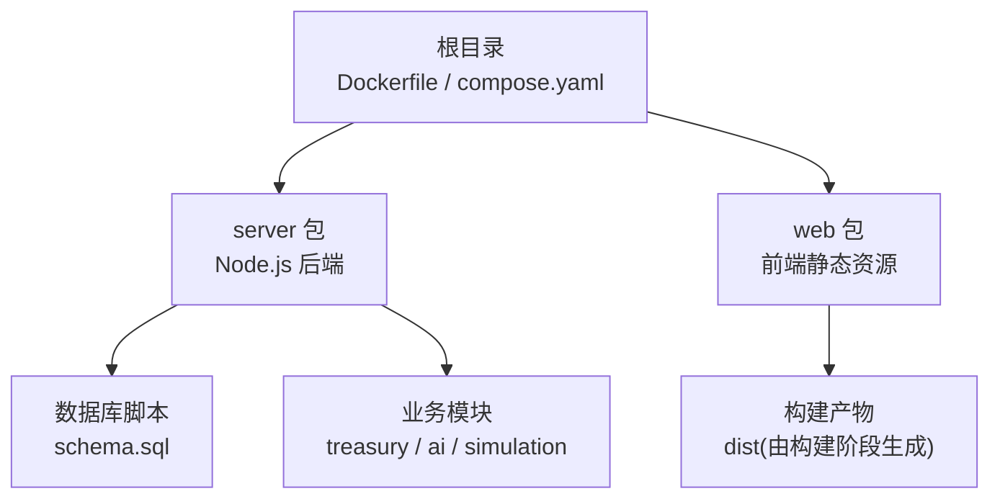
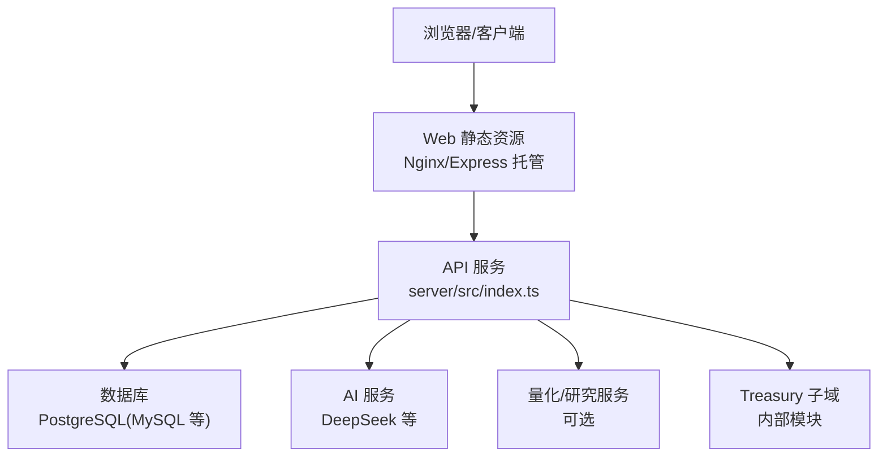
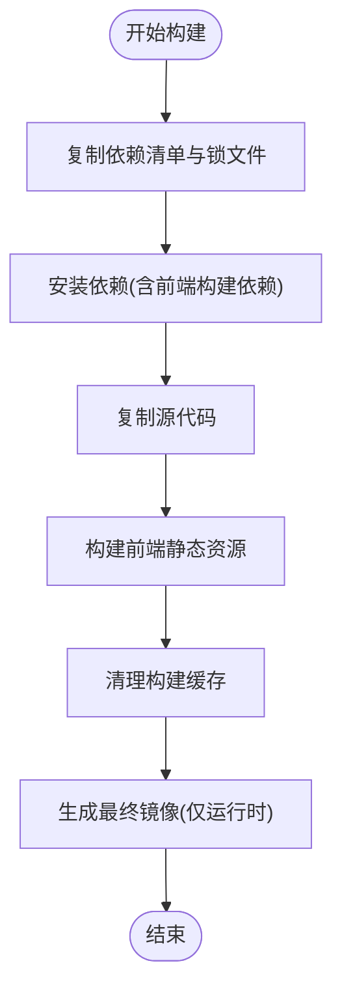
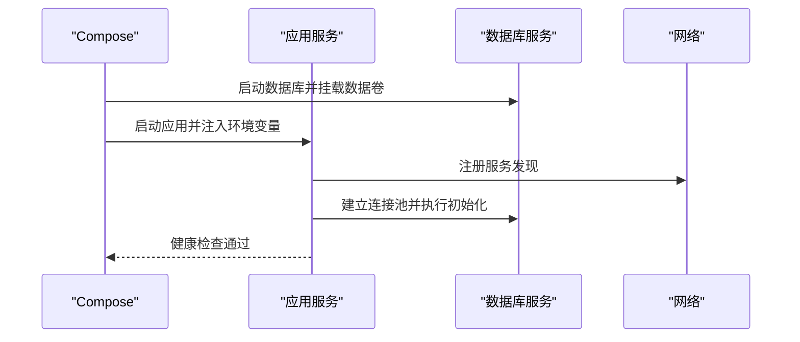
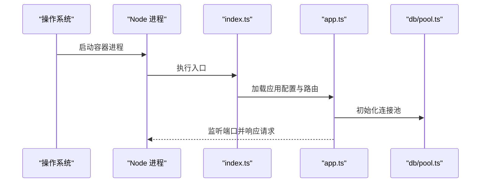
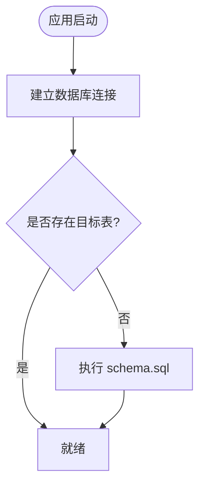
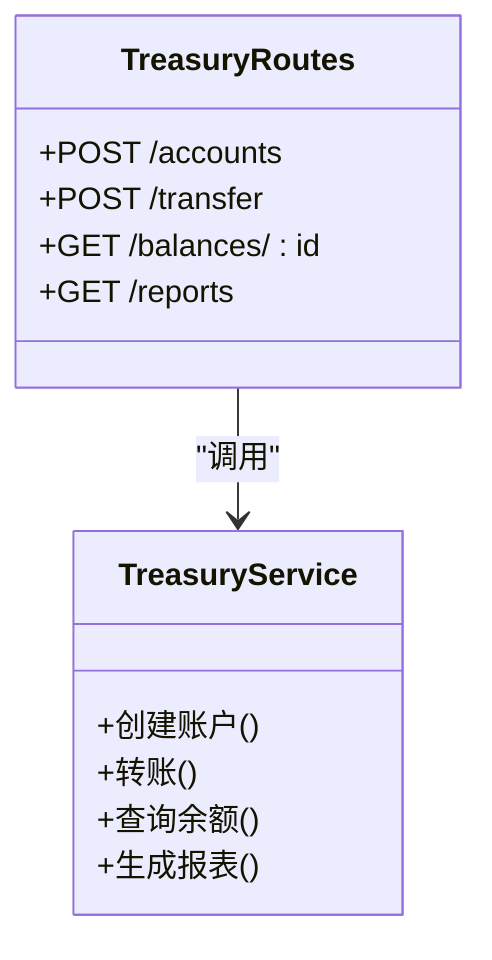
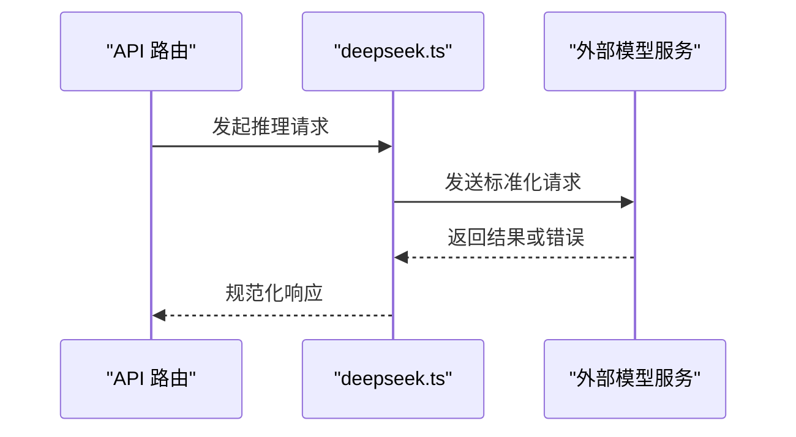
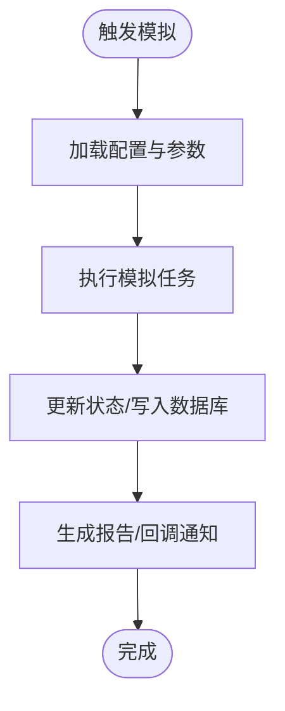
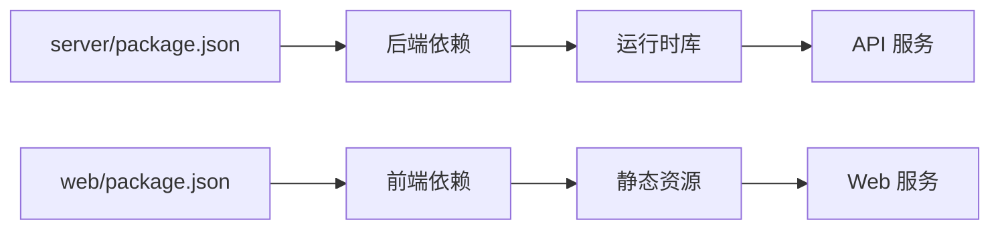

# Docker容器化部署

<cite>
**本文引用的文件**   
- [Dockerfile](file://Dockerfile)
- [compose.yaml](file://compose.yaml)
- [.dockerignore](file://.dockerignore)
- [server/package.json](file://server/package.json)
- [web/package.json](file://web/package.json)
- [server/src/index.ts](file://server/src/index.ts)
- [server/src/app.ts](file://server/src/app.ts)
- [server/src/db/pool.ts](file://server/src/db/pool.ts)
- [server/src/db/schema.sql](file://server/src/db/schema.sql)
- [server/src/treasury/service.ts](file://server/src/treasury/service.ts)
- [server/src/treasury/routes.ts](file://server/src/treasury/routes.ts)
- [server/src/ai/deepseek.ts](file://server/src/ai/deepseek.ts)
- [server/src/simulation.ts](file://server/src/simulation.ts)
- [deploy/agent-treasury.service](file://deploy/agent-treasury.service)
</cite>

## 目录
1. [简介](#简介)
2. [项目结构](#项目结构)
3. [核心组件](#核心组件)
4. [架构总览](#架构总览)
5. [详细组件分析](#详细组件分析)
6. [依赖关系分析](#依赖关系分析)
7. [性能与可伸缩性](#性能与可伸缩性)
8. [故障排查指南](#故障排查指南)
9. [结论](#结论)
10. [附录](#附录)

## 简介
本文件面向运维与开发者，提供 AdventureX 项目的 Docker 容器化部署方案。内容涵盖镜像构建、服务编排、运行时配置、数据库初始化、外部依赖集成（AI、量化、Treasury）以及 systemd 服务化部署建议。文档以“从源码到运行”的视角组织，既给出高层架构图，也深入到关键源文件的职责与交互，帮助读者快速完成本地验证与生产部署。

## 项目结构
仓库采用多包结构：后端服务位于 server，前端静态资源位于 web，根目录包含 Docker 构建与编排文件。

图表来源
- [Dockerfile:1-200](file://Dockerfile#L1-L200)
- [compose.yaml:1-200](file://compose.yaml#L1-L200)

章节来源
- [Dockerfile:1-200](file://Dockerfile#L1-L200)
- [compose.yaml:1-200](file://compose.yaml#L1-L200)
- [server/package.json:1-200](file://server/package.json#L1-L200)
- [web/package.json:1-200](file://web/package.json#L1-L200)

## 核心组件
- 镜像构建层
  - 多阶段构建：使用 Node 镜像安装依赖并构建前端静态资源；最终镜像仅包含运行时依赖与编译产物，减小体积。
  - 构建缓存优化：优先复制 package.json 与 lock 文件，利用层缓存加速重复构建。
  - 非 root 用户运行：提升安全性。
- 服务编排层
  - 通过 compose 定义应用服务、环境变量、端口映射、数据卷挂载等。
  - 支持按环境切换配置（开发/测试/生产）。
- 运行时入口
  - 后端入口为 server/src/index.ts，加载 server/src/app.ts 中的路由与中间件。
  - 数据库连接池在 server/src/db/pool.ts 中初始化，并在启动时执行 schema.sql 进行表结构初始化。
- 业务子系统
  - Treasury 子域：service.ts 实现核心逻辑，routes.ts 暴露 HTTP 接口。
  - AI 集成：deepseek.ts 封装外部模型调用。
  - Simulation：simulation.ts 提供模拟任务或策略执行能力。

章节来源
- [Dockerfile:1-200](file://Dockerfile#L1-L200)
- [compose.yaml:1-200](file://compose.yaml#L1-L200)
- [server/src/index.ts:1-200](file://server/src/index.ts#L1-L200)
- [server/src/app.ts:1-200](file://server/src/app.ts#L1-L200)
- [server/src/db/pool.ts:1-200](file://server/src/db/pool.ts#L1-L200)
- [server/src/db/schema.sql:1-200](file://server/src/db/schema.sql#L1-L200)
- [server/src/treasury/service.ts:1-200](file://server/src/treasury/service.ts#L1-L200)
- [server/src/treasury/routes.ts:1-200](file://server/src/treasury/routes.ts#L1-L200)
- [server/src/ai/deepseek.ts:1-200](file://server/src/ai/deepseek.ts#L1-L200)
- [server/src/simulation.ts:1-200](file://server/src/simulation.ts#L1-L200)

## 架构总览
下图展示容器内外的主要组件与数据流：客户端访问 Web 前端与 API 网关，API 服务连接数据库与外部 AI/量化/Treasury 服务。

图表来源
- [server/src/index.ts:1-200](file://server/src/index.ts#L1-L200)
- [server/src/app.ts:1-200](file://server/src/app.ts#L1-L200)
- [server/src/db/pool.ts:1-200](file://server/src/db/pool.ts#L1-L200)
- [server/src/ai/deepseek.ts:1-200](file://server/src/ai/deepseek.ts#L1-L200)
- [server/src/treasury/service.ts:1-200](file://server/src/treasury/service.ts#L1-L200)

## 详细组件分析

### 镜像构建流程
- 构建阶段
  - 选择轻量 Node 基础镜像，设置工作目录。
  - 复制依赖清单与锁文件，执行依赖安装。
  - 复制源代码，执行前端构建（产出静态资源）。
  - 清理构建缓存，仅保留必要文件。
- 运行阶段
  - 创建非 root 用户，拷贝运行时依赖与构建产物。
  - 暴露服务端口，设置健康检查与启动命令。

图表来源
- [Dockerfile:1-200](file://Dockerfile#L1-L200)

章节来源
- [Dockerfile:1-200](file://Dockerfile#L1-L200)

### 服务编排与环境变量
- 服务定义
  - 应用服务：指定镜像、端口映射、环境变量、数据卷、重启策略与健康检查。
  - 数据库服务：持久化数据卷、初始化脚本挂载、凭据注入。
- 环境变量
  - 数据库连接串、认证凭据、第三方服务密钥（AI、量化等）。
  - 日志级别、调试开关、功能特性开关。
- 网络与存储
  - 自定义网络隔离服务间通信。
  - 命名卷持久化数据库与日志。

图表来源
- [compose.yaml:1-200](file://compose.yaml#L1-L200)

章节来源
- [compose.yaml:1-200](file://compose.yaml#L1-L200)

### 运行时入口与路由
- 入口文件
  - server/src/index.ts 负责进程启动、监听端口、加载中间件与路由。
- 应用装配
  - server/src/app.ts 集中注册路由、错误处理、CORS、请求体解析等。
- 生命周期
  - 启动时初始化数据库连接池、加载配置、预热缓存（如有）。
  - 优雅关闭：停止接收新请求、释放连接池、保存状态。

图表来源
- [server/src/index.ts:1-200](file://server/src/index.ts#L1-L200)
- [server/src/app.ts:1-200](file://server/src/app.ts#L1-L200)
- [server/src/db/pool.ts:1-200](file://server/src/db/pool.ts#L1-L200)

章节来源
- [server/src/index.ts:1-200](file://server/src/index.ts#L1-L200)
- [server/src/app.ts:1-200](file://server/src/app.ts#L1-L200)
- [server/src/db/pool.ts:1-200](file://server/src/db/pool.ts#L1-L200)

### 数据库初始化与迁移
- 初始化脚本
  - server/src/db/schema.sql 定义表结构与初始数据。
- 连接池
  - server/src/db/pool.ts 管理连接参数、重试与错误处理。
- 迁移策略
  - 建议在启动前执行一次性迁移，或在应用内按版本控制执行增量迁移。

图表来源
- [server/src/db/schema.sql:1-200](file://server/src/db/schema.sql#L1-L200)
- [server/src/db/pool.ts:1-200](file://server/src/db/pool.ts#L1-L200)

章节来源
- [server/src/db/schema.sql:1-200](file://server/src/db/schema.sql#L1-L200)
- [server/src/db/pool.ts:1-200](file://server/src/db/pool.ts#L1-L200)

### Treasury 子域
- 服务层
  - server/src/treasury/service.ts 实现资金管理与交易结算的核心逻辑。
- 路由层
  - server/src/treasury/routes.ts 暴露 REST 接口，校验输入、调用服务层、返回结果。
- 事务与一致性
  - 对关键操作使用事务包裹，确保数据一致性与幂等性。

图表来源
- [server/src/treasury/service.ts:1-200](file://server/src/treasury/service.ts#L1-L200)
- [server/src/treasury/routes.ts:1-200](file://server/src/treasury/routes.ts#L1-L200)

章节来源
- [server/src/treasury/service.ts:1-200](file://server/src/treasury/service.ts#L1-L200)
- [server/src/treasury/routes.ts:1-200](file://server/src/treasury/routes.ts#L1-L200)

### AI 集成（DeepSeek）
- 封装外部模型调用，统一超时、重试与错误码。
- 支持按环境切换端点与密钥。
- 与业务模块解耦，便于替换其他模型供应商。

图表来源
- [server/src/ai/deepseek.ts:1-200](file://server/src/ai/deepseek.ts#L1-L200)

章节来源
- [server/src/ai/deepseek.ts:1-200](file://server/src/ai/deepseek.ts#L1-L200)

### 模拟与任务执行
- simulation.ts 提供模拟任务或策略执行的入口，常用于测试与演示。
- 可与 Treasury 与 AI 模块组合，形成端到端流水线。

图表来源
- [server/src/simulation.ts:1-200](file://server/src/simulation.ts#L1-L200)

章节来源
- [server/src/simulation.ts:1-200](file://server/src/simulation.ts#L1-L200)

### 系统服务化（systemd）
- deploy/agent-treasury.service 提供 systemd 单元文件示例，用于将应用作为系统服务运行。
- 适用于裸机或云主机场景，配合容器运行时或二进制直接运行。

章节来源
- [deploy/agent-treasury.service:1-200](file://deploy/agent-treasury.service#L1-L200)

## 依赖关系分析
- 构建期依赖
  - server/package.json 与 web/package.json 分别声明后端与前端依赖。
  - 锁文件用于保证构建可重现。
- 运行期依赖
  - 数据库驱动、HTTP 框架、AI SDK、量化库等。
- 外部集成
  - AI 服务、量化平台、Treasury 内部模块。

图表来源
- [server/package.json:1-200](file://server/package.json#L1-L200)
- [web/package.json:1-200](file://web/package.json#L1-L200)

章节来源
- [server/package.json:1-200](file://server/package.json#L1-L200)
- [web/package.json:1-200](file://web/package.json#L1-L200)

## 性能与可伸缩性
- 镜像体积
  - 多阶段构建与非 root 用户运行降低攻击面与镜像大小。
- 并发与连接池
  - 合理设置数据库连接池大小，避免连接耗尽。
- 缓存与预热
  - 对热点数据引入内存缓存，减少数据库压力。
- 水平扩展
  - 无状态服务设计，结合负载均衡与副本数调整提升吞吐。
- 资源限制
  - 在编排层设置 CPU/内存上限，防止单实例占用过多资源。

[本节为通用指导，不直接分析具体文件]

## 故障排查指南
- 启动失败
  - 检查环境变量是否完整（数据库连接串、密钥等）。
  - 查看容器日志定位异常堆栈。
- 数据库连接问题
  - 确认网络连通、凭据正确、防火墙放行。
  - 检查 schema.sql 是否成功执行。
- 外部服务不可用
  - 验证 AI/量化服务可达性与鉴权。
  - 增加重试与退避策略。
- 性能瓶颈
  - 监控 CPU/内存/IO，评估是否需要扩容或优化 SQL。
- 权限与安全
  - 确保非 root 运行，最小权限原则。
  - 定期轮换密钥与证书。

章节来源
- [compose.yaml:1-200](file://compose.yaml#L1-L200)
- [server/src/db/pool.ts:1-200](file://server/src/db/pool.ts#L1-L200)
- [server/src/ai/deepseek.ts:1-200](file://server/src/ai/deepseek.ts#L1-L200)

## 结论
本方案通过多阶段构建与编排文件实现了可复现、可移植的容器化部署。结合环境变量与数据卷，可在不同环境中快速拉起服务。针对 Treasury、AI 与模拟模块的职责划分清晰，便于独立演进与扩展。建议在生产环境引入健康检查、指标采集与告警机制，进一步提升稳定性与可观测性。

[本节为总结性内容，不直接分析具体文件]

## 附录
- 常用命令
  - 构建镜像：参考 Dockerfile 指令
  - 启动服务：参考 compose.yaml 服务定义
  - 查看日志：使用编排工具或容器运行时日志命令
- 安全建议
  - 使用密钥管理服务注入敏感信息
  - 启用 TLS 与最小权限网络策略
- 备份与恢复
  - 定期备份数据库卷与配置文件
  - 制定回滚与灾难恢复预案

[本节为补充说明，不直接分析具体文件]