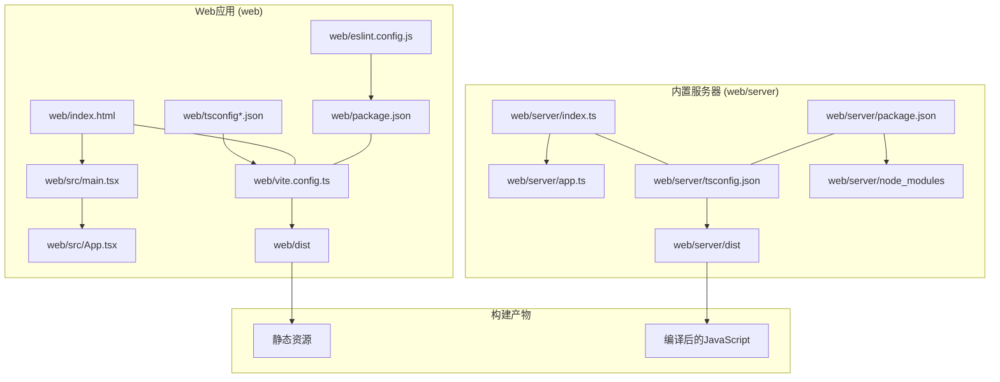
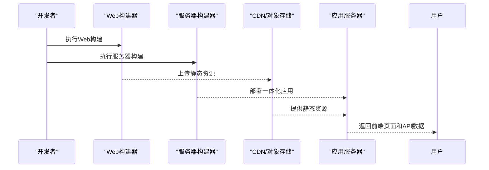
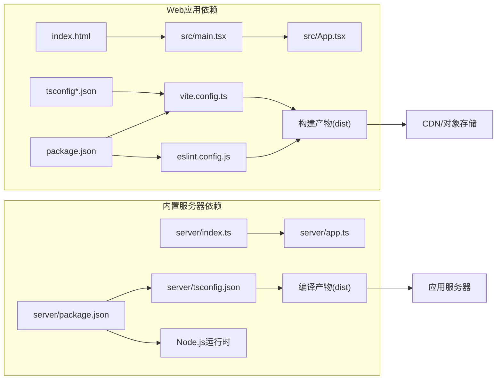

# 构建与部署

<cite>
**本文引用的文件**   
- [package.json](file://web/package.json)
- [vite.config.ts](file://web/vite.config.ts)
- [tsconfig.json](file://web/tsconfig.json)
- [tsconfig.app.json](file://web/tsconfig.app.json)
- [tsconfig.node.json](file://web/tsconfig.node.json)
- [eslint.config.js](file://web/eslint.config.js)
- [index.html](file://web/index.html)
- [main.tsx](file://web/src/main.tsx)
- [App.tsx](file://web/src/App.tsx)
- [server/app.ts](file://web/server/app.ts)
- [server/index.ts](file://web/server/index.ts)
- [Dockerfile](file://Dockerfile)
- [compose.yaml](file://compose.yaml)
</cite>

## 更新摘要
**变更内容**   
- 项目架构从独立server目录迁移到web/server一体化结构
- 更新构建流程以支持新的web/server一体化项目结构
- 简化依赖管理，统一前后端依赖处理
- 优化Docker容器化部署配置，支持一体化部署
- 调整CI/CD流水线以适应新的项目结构

## 目录
1. [简介](#简介)
2. [项目结构](#项目结构)
3. [核心组件](#核心组件)
4. [架构总览](#架构总览)
5. [详细组件分析](#详细组件分析)
6. [依赖分析](#依赖分析)
7. [性能考虑](#性能考虑)
8. [故障排查指南](#故障排查指南)
9. [结论](#结论)
10. [附录](#附录)

## 简介
本指南面向运维与工程团队，提供 AdventureX 项目的完整构建与生产部署方案。项目现已采用web/server一体化架构，前端React应用和后端API服务统一在web目录下管理。内容覆盖Vite构建配置、TypeScript编译、ESLint检查、测试集成、生产优化、Docker容器化、静态托管与CDN、环境变量与安全、监控与可观测性、CI/CD流水线与自动化部署等。目标是让读者在不深入源码细节的情况下，也能顺利完成本地开发、构建与上线。

## 项目结构
AdventureX项目采用现代化的web/server一体化架构：
- **web/**: 包含前端React应用和后端Node.js API服务的统一项目
- **web/server/**: 后端API服务代码，使用TypeScript开发
- **根目录**: 项目级配置和脚本，包括Docker部署配置



**图表来源**
- [web/package.json:1-200](file://web/package.json#L1-L200)
- [web/vite.config.ts:1-200](file://web/vite.config.ts#L1-L200)
- [web/server/index.ts:1-200](file://web/server/index.ts#L1-L200)
- [web/server/app.ts:1-200](file://web/server/app.ts#L1-L200)

**章节来源**
- [web/package.json:1-200](file://web/package.json#L1-L200)
- [web/vite.config.ts:1-200](file://web/vite.config.ts#L1-L200)
- [web/server/index.ts:1-200](file://web/server/index.ts#L1-L200)
- [web/server/app.ts:1-200](file://web/server/app.ts#L1-L200)

## 核心组件
- **前端构建系统**: Vite（开发服务器、打包、插件生态）
- **内置服务器**: Node.js + TypeScript（Express框架，位于web/server）
- **语言与类型**: TypeScript（前后端统一类型系统）
- **代码质量**: ESLint（统一规范检查）
- **包管理**: npm/yarn/pnpm（统一管理依赖）
- **容器化**: Docker（一体化镜像部署）

**章节来源**
- [web/package.json:1-200](file://web/package.json#L1-L200)
- [web/vite.config.ts:1-200](file://web/vite.config.ts#L1-L200)
- [web/server/index.ts:1-200](file://web/server/index.ts#L1-L200)

## 架构总览
下图展示了web/server一体化架构的完整构建和部署流程：



**图表来源**
- [web/vite.config.ts:1-200](file://web/vite.config.ts#L1-L200)
- [web/server/index.ts:1-200](file://web/server/index.ts#L1-L200)
- [web/server/app.ts:1-200](file://web/server/app.ts#L1-L200)

## 详细组件分析

### 前端Vite构建配置与插件
- **构建目标与环境**: 通过配置文件定义开发/生产模式、基础路径、输出目录、资源命名策略等
- **插件体系**: React、TypeScript、路径别名、代理、压缩、分包、图片处理等插件
- **开发体验**: 热更新、内联源映射、Mock与代理、快速增量构建
- **生产优化**: 代码压缩、Tree Shaking、预加载/预取、资源哈希、公共模块提取、按需加载

**建议关注点**
- 明确base与build.outDir，确保与CDN/服务器路径一致
- 合理设置代码分割策略，平衡首屏与并行下载
- 开启生产环境的sourcemap策略，便于线上定位问题
- 使用插件对第三方库进行外部化或预构建，减少包体

**章节来源**
- [web/vite.config.ts:1-200](file://web/vite.config.ts#L1-L200)

### 内置服务器TypeScript编译配置
- **编译选项**: 严格类型检查、模块解析策略、目标与库版本匹配
- **路径映射**: 支持模块路径别名，提升代码可读性
- **输出配置**: 编译到dist目录，保持源代码整洁
- **开发调试**: 支持source map和热重载

**最佳实践**
- 启用严格的类型检查，确保API接口一致性
- 使用模块化设计，按功能划分路由和服务
- 在CI中运行类型检查，保证代码质量

**章节来源**
- [web/server/tsconfig.json:1-200](file://web/server/tsconfig.json#L1-L200)
- [web/server/package.json:1-200](file://web/server/package.json#L1-L200)

### web/server一体化架构配置
- **统一入口**: 前端静态资源和后端API服务在同一应用中提供
- **通信协议**: RESTful API，无需跨域配置
- **部署简化**: 单一服务部署，降低运维复杂度
- **资源共享**: 前后端可以共享类型定义和工具函数

**架构优势**
- 简化部署流程，单一服务管理
- 减少跨域配置和安全策略复杂性
- 提高开发和调试效率
- 降低运维成本和故障排查难度

**章节来源**
- [web/server/index.ts:1-200](file://web/server/index.ts#L1-L200)
- [web/server/app.ts:1-200](file://web/server/app.ts#L1-L200)

### TypeScript编译配置详解
- **多tsconfig拆分**: tsconfig.json聚合通用选项，tsconfig.app.json用于浏览器端应用，tsconfig.node.json用于Node/Vite内部脚本
- **严格性与兼容性**: 启用严格类型检查、模块解析策略、目标与库版本匹配
- **路径别名与声明**: 配合Vite的alias提升可读性与构建效率

**最佳实践**
- 将仅Node使用的类型与API放入node配置，避免污染浏览器构建
- 保持lib/target与目标浏览器矩阵一致，必要时使用polyfill策略
- 在CI中单独运行类型检查，保证提交质量

**章节来源**
- [web/tsconfig.json:1-200](file://web/tsconfig.json#L1-L200)
- [web/tsconfig.app.json:1-200](file://web/tsconfig.app.json#L1-L200)
- [web/tsconfig.node.json:1-200](file://web/tsconfig.node.json#L1-L200)

### ESLint代码检查
- **规则集**: 基于官方推荐与团队规范，统一风格与潜在错误检测
- **集成方式**: 在开发时自动检查，或在构建/CI中强制阻断
- **与编辑器联动**: VS Code等编辑器实时提示

**建议**
- 将lint作为独立任务，支持--fix自动修复
- 在pre-commit钩子中运行轻量检查，全量检查放在CI

**章节来源**
- [web/eslint.config.js:1-200](file://web/eslint.config.js#L1-L200)

### 应用入口与页面结构
- **index.html**: 应用壳，注入构建产物脚本
- **main.tsx**: 创建React根节点、挂载应用、全局初始化逻辑
- **App.tsx**: 顶层路由与布局、全局状态与上下文

**章节来源**
- [web/index.html:1-200](file://web/index.html#L1-L200)
- [web/src/main.tsx:1-200](file://web/src/main.tsx#L1-L200)
- [web/src/App.tsx:1-200](file://web/src/App.tsx#L1-L200)

### 构建与脚本
- **开发**: 启动本地开发服务器、热重载、调试
- **构建**: 生成生产静态资源至dist
- **检查**: 运行ESLint与类型检查
- **测试**: 按测试框架约定执行单测/端到端

**说明**
- 具体命令以package.json中的scripts为准
- 建议在CI中复用相同脚本，保证一致性

**章节来源**
- [web/package.json:1-200](file://web/package.json#L1-L200)

## 依赖分析
下图展示主要依赖关系：web/server一体化结构的依赖管理，统一维护package.json和依赖树。



**图表来源**
- [web/package.json:1-200](file://web/package.json#L1-L200)
- [web/vite.config.ts:1-200](file://web/vite.config.ts#L1-L200)
- [web/server/index.ts:1-200](file://web/server/index.ts#L1-L200)
- [web/server/tsconfig.json:1-200](file://web/server/tsconfig.json#L1-L200)

**章节来源**
- [web/package.json:1-200](file://web/package.json#L1-L200)
- [web/vite.config.ts:1-200](file://web/vite.config.ts#L1-L200)

## 性能考虑
- **资源体积控制**
  - 启用Tree Shaking与按需引入，移除未使用代码
  - 对大体积第三方库进行外部化或懒加载
  - 图片与字体使用合适格式与尺寸，启用压缩与懒加载
- **代码分割**
  - 按路由或功能模块拆分chunk，减少首屏负载
  - 合理使用预加载/预取策略，提升交互响应
- **缓存策略**
  - 利用文件名哈希实现长期缓存，配合HTTP头Cache-Control
  - 对index.html禁用强缓存，确保新版本及时生效
- **传输优化**
  - 启用gzip/brotli压缩（由服务器或CDN层完成）
  - 使用HTTP/2或多路复用，提高并发能力
- **构建优化**
  - 关闭不必要的sourcemap或采用隐藏映射
  - 调整并行度与缓存命中，缩短构建时间

## 故障排查指南
- **构建失败**
  - 检查TypeScript类型错误与ESLint报错，优先修复阻塞项
  - 确认Vite配置中的路径别名、代理与插件顺序
  - 清理缓存与node_modules后重试
- **运行时白屏**
  - 检查base路径与资源路径是否正确
  - 查看浏览器控制台网络请求是否404
  - 确认index.html正确引用了构建产物
- **服务器通信问题**
  - 验证API端点地址和端口配置
  - 查看服务器日志和错误信息
  - 检查环境变量配置
- **性能问题**
  - 使用浏览器性能面板分析首屏瓶颈
  - 检查大包与重复依赖，优化分包策略
- **日志与监控**
  - 接入前端错误上报与性能埋点，结合服务器日志定位问题

## 结论
通过合理的Vite配置、严格的TypeScript与ESLint规范、完善的构建与发布流程，以及web/server一体化架构的简化部署，AdventureX可以在保证开发体验的同时，获得稳定高效的生产交付能力。建议将上述实践固化为团队标准并在CI/CD中强制执行。

## 附录

### 本地开发
- **安装依赖**
  ```bash
  cd web && npm install
  ```
- **启动开发服务器**
  ```bash
  cd web && npm run dev
  ```
- **访问本地地址进行调试**
  - 应用: http://localhost:5173

**章节来源**
- [web/package.json:1-200](file://web/package.json#L1-L200)

### 生产构建
- **执行生产构建命令**
  ```bash
  cd web && npm run build
  ```
- **验证产物结构与大小**
  - 检查web/dist目录的静态资源
  - 检查web/server/dist目录的编译产物
- **本地预览构建结果**
  ```bash
  cd web && npm run preview
  ```

**章节来源**
- [web/package.json:1-200](file://web/package.json#L1-L200)

### Docker容器化部署
- **镜像选择**: 使用轻量级镜像（如Alpine Linux）
- **多阶段构建**: 在前端使用Node.js构建，最终镜像只包含静态资源和编译后的服务器代码
- **环境变量**: 通过环境变量注入API基址、特性开关等
- **健康检查**: 返回200的健康接口
- **资源限制**: 设置CPU和内存限制

**Docker Compose示例**:
```yaml
version: '3.8'
services:
  app:
    build: .
    ports:
      - "80:80"
    environment:
      - NODE_ENV=production
      - PORT=80
    healthcheck:
      test: ["CMD", "curl", "-f", "http://localhost:80/health"]
      interval: 30s
      timeout: 10s
      retries: 3
```

**章节来源**
- [Dockerfile:1-200](file://Dockerfile#L1-L200)
- [compose.yaml:1-200](file://compose.yaml#L1-L200)

### 静态资源托管与CDN
- **托管平台**: 对象存储或静态站点服务
- **缓存策略**: 资源长缓存，HTML短缓存或无缓存
- **回源与预热**: 配置CDN回源与预热策略
- **安全**: 启用HTTPS、CSP、HSTS、防盗链

**章节来源**
- [web/vite.config.ts:1-200](file://web/vite.config.ts#L1-L200)

### 环境变量管理
- **开发/测试/生产区分**: 使用.env文件和环境变量前缀
- **敏感信息不入仓库**: 使用密钥管理服务
- **构建期注入与运行期读取分离**: 前端构建时注入，后端运行时读取

**章节来源**
- [web/vite.config.ts:1-200](file://web/vite.config.ts#L1-L200)
- [web/package.json:1-200](file://web/package.json#L1-L200)

### 安全配置
- **最小权限原则**: 容器只读文件系统、非root运行
- **输入校验与输出编码**: 前后端都进行输入验证
- **依赖漏洞扫描**: 定期扫描并更新依赖包
- **许可证合规**: 检查开源许可证兼容性

**章节来源**
- [web/eslint.config.js:1-200](file://web/eslint.config.js#L1-L200)

### 监控与可观测性
- **前端错误上报**: 集成Sentry或其他错误追踪服务
- **性能指标采集**: FCP/LCP/CLS/TTFB等核心指标
- **日志收集**: 结构化日志和集中式日志管理
- **告警**: 关键指标异常时发送告警通知

**章节来源**
- [web/src/main.tsx:1-200](file://web/src/main.tsx#L1-L200)
- [web/src/App.tsx:1-200](file://web/src/App.tsx#L1-L200)

### CI/CD流水线示例
- **触发条件**: 推送或合并请求
- **步骤**: 
  1. 安装依赖
  2. 类型检查和代码检查
  3. 单元测试和集成测试
  4. 构建Web应用和服务器
  5. 制品归档和部署
- **缓存**: 依赖与构建缓存
- **回滚**: 保留历史制品，支持一键回滚

**GitHub Actions示例**:
```yaml
name: Build and Deploy
on:
  push:
    branches: [main]
  pull_request:
    branches: [main]

jobs:
  build:
    runs-on: ubuntu-latest
    steps:
      - uses: actions/checkout@v3
      
      - name: Setup Node.js
        uses: actions/setup-node@v3
        with:
          node-version: '18'
      
      - name: Install dependencies
        run: |
          cd web && npm ci
      
      - name: Type check and lint
        run: |
          cd web && npm run type-check && npm run lint
      
      - name: Test
        run: |
          cd web && npm test
      
      - name: Build
        run: |
          cd web && npm run build
      
      - name: Upload artifacts
        uses: actions/upload-artifact@v3
        with:
          name: dist
          path: web/dist
```

**章节来源**
- [web/package.json:1-200](file://web/package.json#L1-L200)
- [web/vite.config.ts:1-200](file://web/vite.config.ts#L1-L200)