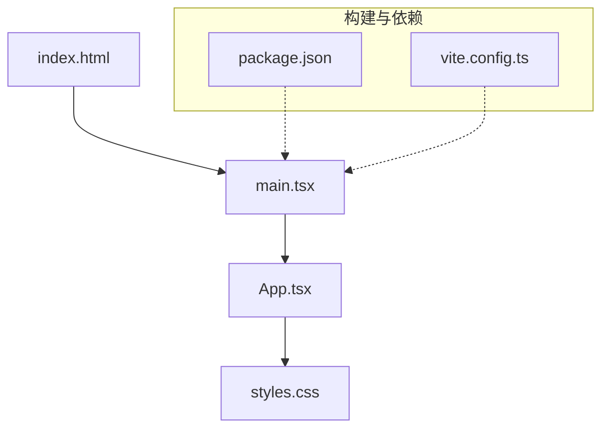
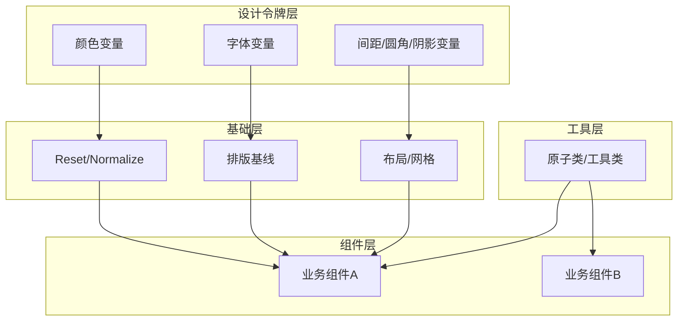
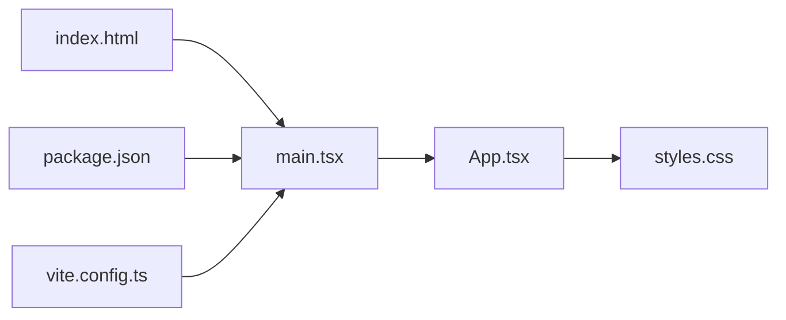

# 样式与主题系统

<cite>
**本文引用的文件**   
- [styles.css](file://web/src/styles.css)
- [App.tsx](file://web/src/App.tsx)
- [main.tsx](file://web/src/main.tsx)
- [index.html](file://web/index.html)
- [package.json](file://web/package.json)
- [vite.config.ts](file://web/vite.config.ts)
</cite>

## 目录
1. [简介](#简介)
2. [项目结构](#项目结构)
3. [核心组件](#核心组件)
4. [架构总览](#架构总览)
5. [详细组件分析](#详细组件分析)
6. [依赖分析](#依赖分析)
7. [性能考虑](#性能考虑)
8. [故障排查指南](#故障排查指南)
9. [结论](#结论)
10. [附录](#附录)

## 简介
本文件面向设计师与开发者，系统化阐述 AdventureX 项目的样式与主题体系。内容覆盖全局样式组织、命名约定、模块化策略、主题变量与颜色/字体规范、响应式实现、跨浏览器兼容、样式性能优化、CSS-in-JS 使用建议、主题定制流程、调试技巧以及协作规范。目标是建立统一的设计语言与工程化实践，提升可维护性与交付质量。

## 项目结构
当前仓库的样式相关资源集中在 web 子项目中，关键文件如下：
- 全局样式入口：web/src/styles.css
- 应用根组件：web/src/App.tsx
- 应用启动脚本：web/src/main.tsx
- 页面模板：web/index.html
- 构建与依赖配置：web/package.json、web/vite.config.ts

图示来源
- [index.html:1-200](file://web/index.html#L1-L200)
- [main.tsx:1-200](file://web/src/main.tsx#L1-L200)
- [App.tsx:1-200](file://web/src/App.tsx#L1-L200)
- [styles.css:1-200](file://web/src/styles.css#L1-L200)
- [package.json:1-200](file://web/package.json#L1-L200)
- [vite.config.ts:1-200](file://web/vite.config.ts#L1-L200)

章节来源
- [index.html:1-200](file://web/index.html#L1-L200)
- [main.tsx:1-200](file://web/src/main.tsx#L1-L200)
- [App.tsx:1-200](file://web/src/App.tsx#L1-L200)
- [styles.css:1-200](file://web/src/styles.css#L1-L200)
- [package.json:1-200](file://web/package.json#L1-L200)
- [vite.config.ts:1-200](file://web/vite.config.ts#L1-L200)

## 核心组件
- 全局样式层（styles.css）
  - 作用：定义 CSS 自定义属性（主题变量）、基础重置、排版基线、通用布局与工具类。
  - 建议组织：按“变量—重置—排版—布局—组件—工具”分层；通过 CSS 变量集中管理颜色、字号、间距、圆角、阴影等设计令牌。
- 应用根组件（App.tsx）
  - 作用：挂载全局样式、承载业务组件树、提供主题上下文（如需要）。
- 应用启动脚本（main.tsx）
  - 作用：初始化 React 应用、注入全局样式入口。
- 页面模板（index.html）
  - 作用：提供 HTML 骨架、引入构建产物、设置视口与基础 meta。
- 构建与依赖（package.json、vite.config.ts）
  - 作用：声明依赖、配置 Vite 插件与构建选项（如 CSS 处理、压缩、自动前缀等）。

章节来源
- [styles.css:1-200](file://web/src/styles.css#L1-L200)
- [App.tsx:1-200](file://web/src/App.tsx#L1-L200)
- [main.tsx:1-200](file://web/src/main.tsx#L1-L200)
- [index.html:1-200](file://web/index.html#L1-L200)
- [package.json:1-200](file://web/package.json#L1-L200)
- [vite.config.ts:1-200](file://web/vite.config.ts#L1-L200)

## 架构总览
样式架构采用“全局变量 + 组件级样式”的分层模式：
- 设计令牌层：在 styles.css 中通过 CSS 变量定义颜色、字体、间距、圆角、阴影等。
- 基础层：CSS Reset、排版基线、容器与网格。
- 组件层：各组件样式尽量局部化，必要时复用设计令牌。
- 工具层：常用原子类（间距、对齐、显示、可见性等），避免重复样式。
- 主题切换：通过数据属性或根节点 class 切换主题变量值，实现明暗主题或多品牌主题。

图示来源
- [styles.css:1-200](file://web/src/styles.css#L1-L200)

## 详细组件分析

### 全局样式与主题变量（styles.css）
- 主题变量建议
  - 颜色：语义化命名（如 --color-primary、--color-text、--color-bg、--color-border），区分明暗主题变体。
  - 字体：--font-family-base、--font-size-xs/s/m/l/xl、--line-height-*。
  - 间距：--space-*（基于 4px/8px 栅格）。
  - 圆角/阴影：--radius-*、--shadow-*。
- 命名约定
  - 使用 BEM 或类似约定：块-修饰符-元素（例如 card__title、btn--primary）。
  - 组件作用域：优先使用组件内样式文件或 CSS Modules，避免全局污染。
- 模块化策略
  - 将公共变量与工具类放在 styles.css；组件样式就近管理，按需导入。
  - 对大型项目可拆分多个模块文件，由入口统一聚合。

章节来源
- [styles.css:1-200](file://web/src/styles.css#L1-L200)

### 应用根组件（App.tsx）
- 职责
  - 引入全局样式入口。
  - 作为主题上下文提供者（如需动态切换主题）。
  - 组织业务组件树。
- 主题切换建议
  - 通过 document.documentElement.dataset.theme 或根节点 class 切换主题变量。
  - 将用户偏好持久化到 localStorage，并在首次渲染时恢复。

章节来源
- [App.tsx:1-200](file://web/src/App.tsx#L1-L200)

### 应用启动脚本（main.tsx）
- 职责
  - 初始化 React 应用并挂载到 DOM。
  - 确保全局样式在应用启动时加载。
- 注意事项
  - 避免在启动阶段执行重型同步任务，防止阻塞首屏样式渲染。

章节来源
- [main.tsx:1-200](file://web/src/main.tsx#L1-L200)

### 页面模板（index.html）
- 职责
  - 提供 HTML 骨架、视口设置、基础 meta。
  - 引入构建后的 JS/CSS 资源。
- 最佳实践
  - 预加载关键字体与图标资源。
  - 设置合适的 CSP 与安全头（由服务器侧控制）。

章节来源
- [index.html:1-200](file://web/index.html#L1-L200)

### 构建与依赖（package.json、vite.config.ts）
- 依赖管理
  - 明确列出样式相关依赖（如 autoprefixer、postcss 等）。
- Vite 配置
  - 启用 CSS 压缩与自动前缀。
  - 按需开启 CSS 代码分割与缓存策略。
  - 配置开发服务器代理与热更新。

章节来源
- [package.json:1-200](file://web/package.json#L1-L200)
- [vite.config.ts:1-200](file://web/vite.config.ts#L1-L200)

## 依赖分析
样式与构建链路的依赖关系如下：

图示来源
- [index.html:1-200](file://web/index.html#L1-L200)
- [main.tsx:1-200](file://web/src/main.tsx#L1-L200)
- [App.tsx:1-200](file://web/src/App.tsx#L1-L200)
- [styles.css:1-200](file://web/src/styles.css#L1-L200)
- [package.json:1-200](file://web/package.json#L1-L200)
- [vite.config.ts:1-200](file://web/vite.config.ts#L1-L200)

章节来源
- [index.html:1-200](file://web/index.html#L1-L200)
- [main.tsx:1-200](file://web/src/main.tsx#L1-L200)
- [App.tsx:1-200](file://web/src/App.tsx#L1-L200)
- [styles.css:1-200](file://web/src/styles.css#L1-L200)
- [package.json:1-200](file://web/package.json#L1-L200)
- [vite.config.ts:1-200](file://web/vite.config.ts#L1-L200)

## 性能考虑
- 减少重排与重绘
  - 避免频繁修改布局属性（width/height/top/left），优先使用 transform 与 opacity。
  - 合理使用 will-change 与 GPU 加速，但谨慎使用以避免内存占用过高。
- 样式体积与加载
  - 启用 CSS 压缩与 Tree Shaking（Vite 默认支持）。
  - 按需加载组件样式，避免一次性引入全部样式。
- 字体与图片
  - 使用 font-display: swap 提升首屏体验。
  - 图片使用现代格式（WebP/AVIF）与懒加载。
- 主题切换
  - 通过 CSS 变量切换主题，避免整页重新计算。
  - 将主题切换逻辑置于最小范围，避免触发大规模回流。

[本节为通用指导，不直接分析具体文件]

## 故障排查指南
- 样式未生效
  - 检查 styles.css 是否被正确引入与编译。
  - 确认选择器优先级冲突，必要时提高作用域或使用 CSS Modules。
- 主题切换无效
  - 检查根节点 data-theme/class 是否正确切换。
  - 确认 CSS 变量在对应主题下已定义且未被覆盖。
- 构建产物异常
  - 检查 vite.config.ts 与 package.json 中的依赖版本兼容性。
  - 清理 node_modules 与缓存后重试构建。
- 浏览器兼容问题
  - 确认 PostCSS/Autoprefixer 配置包含目标浏览器列表。
  - 针对旧浏览器降级方案（如回退到固定色值）。

章节来源
- [vite.config.ts:1-200](file://web/vite.config.ts#L1-L200)
- [package.json:1-200](file://web/package.json#L1-L200)
- [styles.css:1-200](file://web/src/styles.css#L1-L200)

## 结论
通过以 CSS 变量为核心的设计令牌体系、清晰的层级结构与严格的命名约定，AdventureX 的样式系统具备良好的可扩展性与可维护性。结合 Vite 构建优化与合理的主题切换策略，可在保证用户体验的同时降低开发与维护成本。建议在团队内推广统一的样式规范与协作流程，持续沉淀组件库与设计文档。

[本节为总结性内容，不直接分析具体文件]

## 附录

### 主题定制流程
- 新增主题
  - 在 styles.css 中新增主题变量集合（颜色、字体、间距等）。
  - 在 App.tsx 中增加主题切换逻辑，绑定至根节点 data-theme/class。
- 扩展组件外观
  - 优先复用设计令牌，避免硬编码数值。
  - 为组件提供可选修饰类（如 btn--large、card--outlined），保持向后兼容。
- 多品牌支持
  - 通过主题变量映射不同品牌的视觉资产（Logo、主色、辅助色）。
  - 在构建期或运行期注入品牌主题包。

章节来源
- [styles.css:1-200](file://web/src/styles.css#L1-L200)
- [App.tsx:1-200](file://web/src/App.tsx#L1-L200)

### 响应式设计实现方法
- 断点策略
  - 基于内容而非设备定义断点（如 480/768/1024/1280）。
  - 使用媒体查询包裹布局与排版规则。
- 弹性布局
  - 优先使用 Flexbox/Grid，配合 min/max 与 clamp() 实现自适应。
- 移动端优先
  - 先写小屏样式，再在大屏上增强。

章节来源
- [styles.css:1-200](file://web/src/styles.css#L1-L200)

### 跨浏览器兼容性处理
- 自动前缀
  - 在 vite.config.ts 中启用 Autoprefixer，并配置目标浏览器列表。
- 特性检测
  - 对高级特性进行降级处理（如 backdrop-filter、scroll-snap）。
- 测试矩阵
  - 在主流浏览器与设备上验证关键路径。

章节来源
- [vite.config.ts:1-200](file://web/vite.config.ts#L1-L200)
- [package.json:1-200](file://web/package.json#L1-L200)

### 样式性能优化最佳实践
- 选择器优化
  - 避免深层嵌套与通配符滥用，缩短匹配路径。
- 动画与过渡
  - 仅对必要元素启用动画，避免影响滚动性能。
- 资源优化
  - 字体子集化与预加载，图片懒加载与占位图。

[本节为通用指导，不直接分析具体文件]

### CSS-in-JS 使用建议
- 何时使用
  - 高度动态的主题、运行时状态驱动的样式、复杂交互场景。
- 推荐方案
  - 轻量方案：CSS 变量 + 少量 CSS-in-JS（如 styled-components 或 Emotion）。
  - 大型项目：优先 CSS Modules 或 Tailwind 等原子化工具，减少运行时开销。
- 注意事项
  - 避免在高频回调中创建样式对象。
  - 合并重复样式，利用缓存机制。

[本节为通用指导，不直接分析具体文件]

### 样式调试工具与开发技巧
- 浏览器 DevTools
  - 使用 Computed/Styles 面板查看最终样式与继承链。
  - 使用 Performance 面板定位重排/重绘热点。
- 本地调试
  - 使用 Vite 热更新快速验证样式变更。
  - 通过控制台切换 data-theme/class 验证主题效果。
- 自动化
  - 集成 ESLint 与 Stylelint 规范检查。
  - 在 CI 中执行样式快照对比，防止回归。

章节来源
- [vite.config.ts:1-200](file://web/vite.config.ts#L1-L200)

### 设计规范与协作指南
- 设计令牌
  - 颜色、字体、间距、圆角、阴影等统一抽象为变量。
- 命名规范
  - 组件类名遵循 BEM；变量命名语义化。
- 文档与示例
  - 为每个组件提供样式说明与使用示例。
- 评审流程
  - 样式变更需经过设计评审与交叉审查。

[本节为通用指导，不直接分析具体文件]