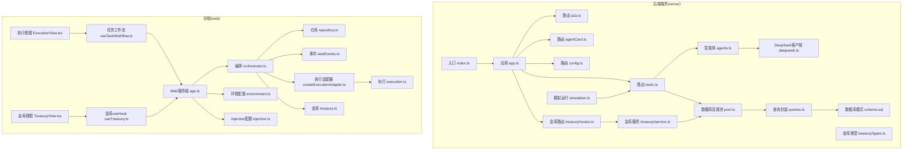
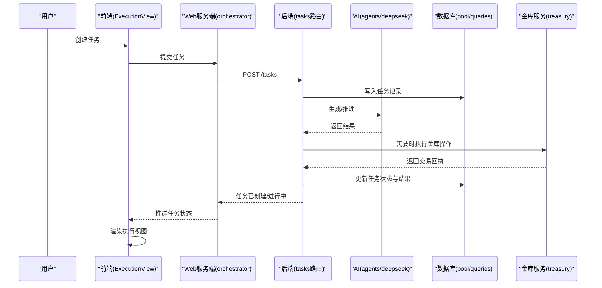
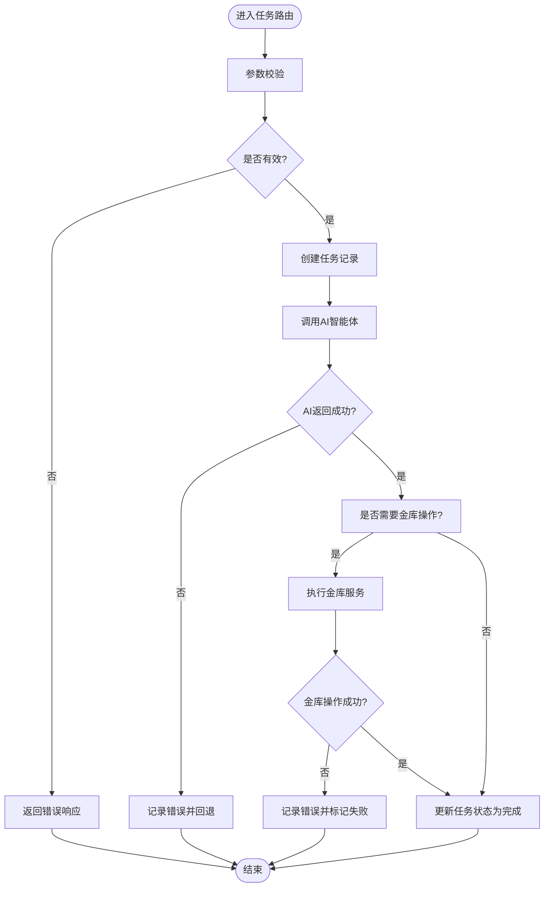
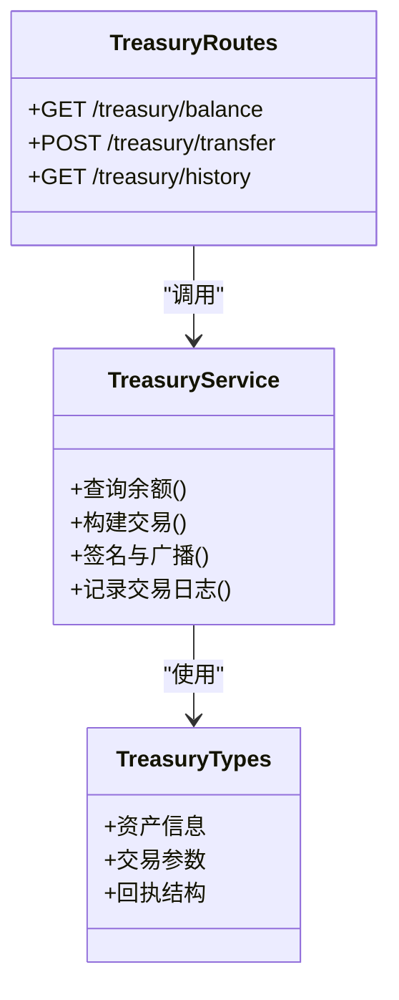
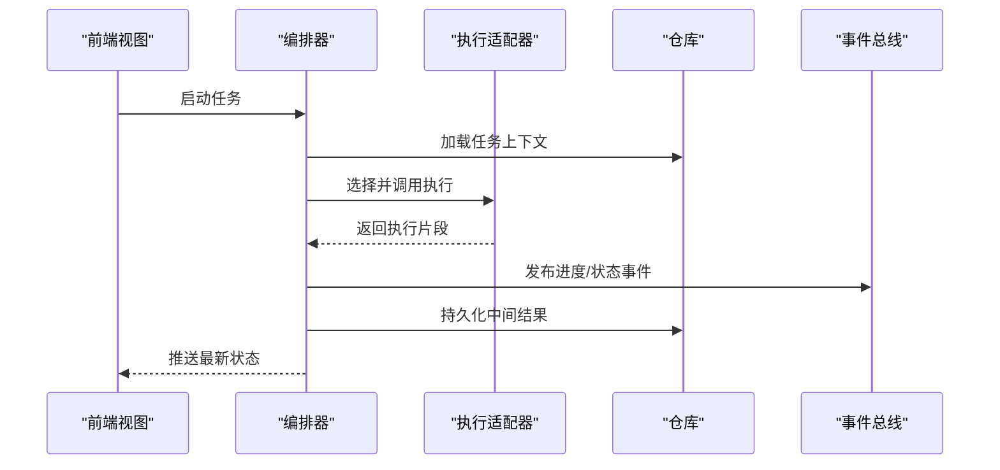
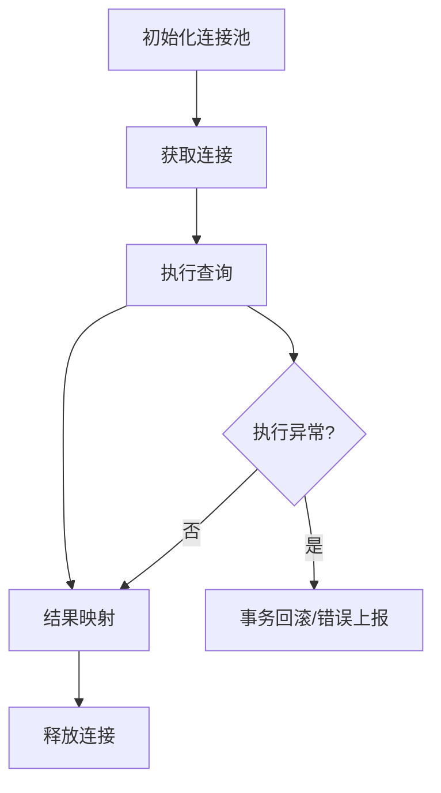
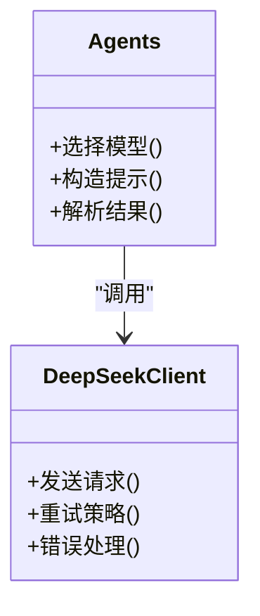
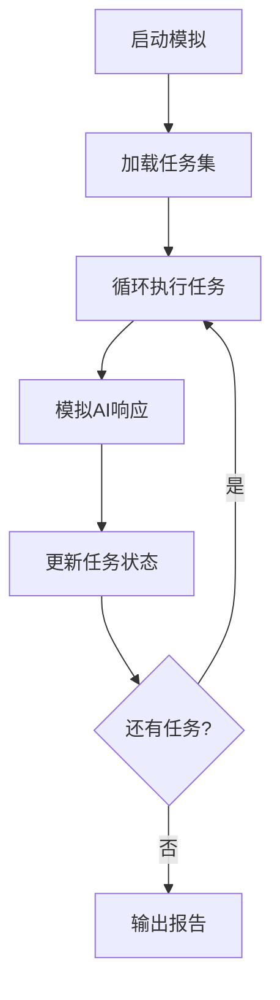
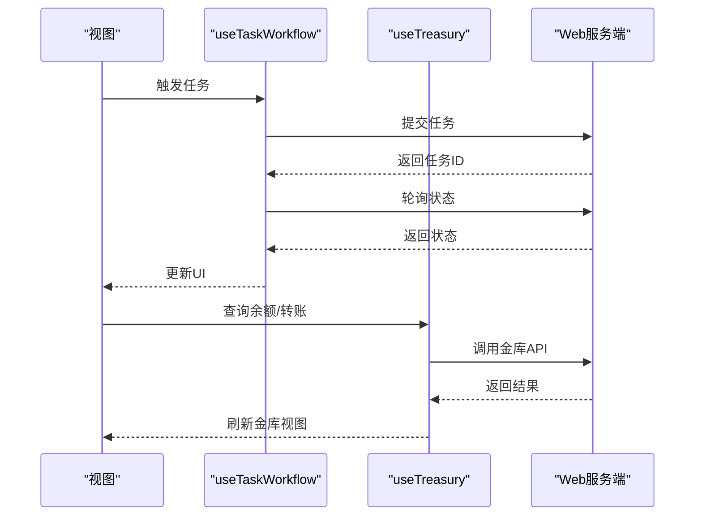
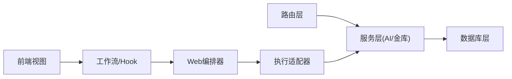

# AI智能体系统

<cite>
**本文引用的文件**   
- [server/src/index.ts](file://server/src/index.ts)
- [server/src/app.ts](file://server/src/app.ts)
- [server/src/ai/agents.ts](file://server/src/ai/agents.ts)
- [server/src/ai/deepseek.ts](file://server/src/ai/deepseek.ts)
- [server/src/db/pool.ts](file://server/src/db/pool.ts)
- [server/src/db/queries.ts](file://server/src/db/queries.ts)
- [server/src/db/schema.sql](file://server/src/db/schema.sql)
- [server/src/routes/a2a.ts](file://server/src/routes/a2a.ts)
- [server/src/routes/agentCard.ts](file://server/src/routes/agentCard.ts)
- [server/src/routes/config.ts](file://server/src/routes/config.ts)
- [server/src/routes/tasks.ts](file://server/src/routes/tasks.ts)
- [server/src/treasury/service.ts](file://server/src/treasury/service.ts)
- [server/src/treasury/types.ts](file://server/src/treasury/types.ts)
- [server/src/treasury/routes.ts](file://server/src/treasury/routes.ts)
- [server/src/simulation.ts](file://server/src/simulation.ts)
- [web/server/app.ts](file://web/server/app.ts)
- [web/server/orchestrator.ts](file://web/server/orchestrator.ts)
- [web/server/repository.ts](file://web/server/repository.ts)
- [web/server/taskEvents.ts](file://web/server/taskEvents.ts)
- [web/server/treasury.ts](file://web/server/treasury.ts)
- [web/server/adapters/createExecutionAdapter.ts](file://web/server/adapters/createExecutionAdapter.ts)
- [web/server/adapters/execution.ts](file://web/server/adapters/execution.ts)
- [web/server/config/environment.ts](file://web/server/config/environment.ts)
- [web/server/config/injective.ts](file://web/server/config/injective.ts)
- [web/src/services/useTaskWorkflow.ts](file://web/src/services/useTaskWorkflow.ts)
- [web/src/services/useTreasury.ts](file://web/src/services/useTreasury.ts)
- [web/src/views/ExecutionView.tsx](file://web/src/views/ExecutionView.tsx)
- [web/src/views/TreasuryView.tsx](file://web/src/views/TreasuryView.tsx)
</cite>

## 目录
1. [简介](#简介)
2. [项目结构](#项目结构)
3. [核心组件](#核心组件)
4. [架构总览](#架构总览)
5. [详细组件分析](#详细组件分析)
6. [依赖关系分析](#依赖关系分析)
7. [性能考虑](#性能考虑)
8. [故障排查指南](#故障排查指南)
9. [结论](#结论)
10. [附录](#附录)

## 简介
本仓库实现了一个“AI智能体系统”，包含后端服务、数据库与钱包金库（Treasury）模块，以及前端可视化与任务编排能力。系统围绕“任务驱动的智能体执行”展开：通过API创建与管理任务，调度AI智能体进行推理或行动，持久化状态到数据库，并通过金库模块管理链上资产与交易。Web端提供任务流、执行视图与金库管理等界面，便于用户观察与控制整个流程。

## 项目结构
整体采用前后端分离的架构：
- server：基于TypeScript的后端服务，负责HTTP路由、AI调用、数据库访问、任务编排与金库服务。
- web：前端应用与轻量服务端（用于适配与编排），提供UI与任务工作流集成。

图表来源
- [server/src/index.ts](file://server/src/index.ts)
- [server/src/app.ts](file://server/src/app.ts)
- [server/src/routes/a2a.ts](file://server/src/routes/a2a.ts)
- [server/src/routes/agentCard.ts](file://server/src/routes/agentCard.ts)
- [server/src/routes/config.ts](file://server/src/routes/config.ts)
- [server/src/routes/tasks.ts](file://server/src/routes/tasks.ts)
- [server/src/db/pool.ts](file://server/src/db/pool.ts)
- [server/src/db/queries.ts](file://server/src/db/queries.ts)
- [server/src/db/schema.sql](file://server/src/db/schema.sql)
- [server/src/ai/agents.ts](file://server/src/ai/agents.ts)
- [server/src/ai/deepseek.ts](file://server/src/ai/deepseek.ts)
- [server/src/treasury/service.ts](file://server/src/treasury/service.ts)
- [server/src/treasury/types.ts](file://server/src/treasury/types.ts)
- [server/src/treasury/routes.ts](file://server/src/treasury/routes.ts)
- [server/src/simulation.ts](file://server/src/simulation.ts)
- [web/server/app.ts](file://web/server/app.ts)
- [web/server/orchestrator.ts](file://web/server/orchestrator.ts)
- [web/server/repository.ts](file://web/server/repository.ts)
- [web/server/taskEvents.ts](file://web/server/taskEvents.ts)
- [web/server/treasury.ts](file://web/server/treasury.ts)
- [web/server/adapters/createExecutionAdapter.ts](file://web/server/adapters/createExecutionAdapter.ts)
- [web/server/adapters/execution.ts](file://web/server/adapters/execution.ts)
- [web/server/config/environment.ts](file://web/server/config/environment.ts)
- [web/server/config/injective.ts](file://web/server/config/injective.ts)
- [web/src/services/useTaskWorkflow.ts](file://web/src/services/useTaskWorkflow.ts)
- [web/src/services/useTreasury.ts](file://web/src/services/useTreasury.ts)
- [web/src/views/ExecutionView.tsx](file://web/src/views/ExecutionView.tsx)
- [web/src/views/TreasuryView.tsx](file://web/src/views/TreasuryView.tsx)

章节来源
- [server/src/index.ts](file://server/src/index.ts)
- [server/src/app.ts](file://server/src/app.ts)
- [web/server/app.ts](file://web/server/app.ts)

## 核心组件
- 路由层
  - 任务路由：负责任务的创建、查询、更新与生命周期控制。
  - 智能体卡片路由：暴露智能体的元数据与能力描述。
  - 配置路由：提供系统与环境配置读取。
  - A2A路由：支持Agent-to-Agent交互协议。
- AI层
  - 智能体编排：根据任务上下文选择并调用具体模型。
  - DeepSeek客户端：封装对外部大模型的请求与重试策略。
- 数据层
  - 连接池：管理数据库连接的生命周期与并发。
  - 查询封装：统一SQL执行与结果映射。
  - 模式定义：表结构与约束声明。
- 金库(Treasury)
  - 服务层：封装资产查询、转账、签名等业务流程。
  - 类型定义：明确数据结构与校验规则。
  - 路由：暴露金库相关API。
- 模拟运行
  - 提供离线演练与回归测试能力，驱动任务在内存中流转。
- Web端
  - 编排器：协调任务执行、事件广播与适配器调用。
  - 仓库：抽象数据访问接口，对接后端或本地存储。
  - 事件总线：发布订阅式任务状态变更通知。
  - 执行适配器：将不同执行引擎统一为一致接口。
  - 配置与环境：集中管理环境变量与外部服务地址。
  - UI视图：任务流、执行详情、金库管理等页面。

章节来源
- [server/src/routes/tasks.ts](file://server/src/routes/tasks.ts)
- [server/src/routes/agentCard.ts](file://server/src/routes/agentCard.ts)
- [server/src/routes/config.ts](file://server/src/routes/config.ts)
- [server/src/routes/a2a.ts](file://server/src/routes/a2a.ts)
- [server/src/ai/agents.ts](file://server/src/ai/agents.ts)
- [server/src/ai/deepseek.ts](file://server/src/ai/deepseek.ts)
- [server/src/db/pool.ts](file://server/src/db/pool.ts)
- [server/src/db/queries.ts](file://server/src/db/queries.ts)
- [server/src/db/schema.sql](file://server/src/db/schema.sql)
- [server/src/treasury/service.ts](file://server/src/treasury/service.ts)
- [server/src/treasury/types.ts](file://server/src/treasury/types.ts)
- [server/src/treasury/routes.ts](file://server/src/treasury/routes.ts)
- [server/src/simulation.ts](file://server/src/simulation.ts)
- [web/server/orchestrator.ts](file://web/server/orchestrator.ts)
- [web/server/repository.ts](file://web/server/repository.ts)
- [web/server/taskEvents.ts](file://web/server/taskEvents.ts)
- [web/server/adapters/createExecutionAdapter.ts](file://web/server/adapters/createExecutionAdapter.ts)
- [web/server/adapters/execution.ts](file://web/server/adapters/execution.ts)
- [web/server/config/environment.ts](file://web/server/config/environment.ts)
- [web/server/config/injective.ts](file://web/server/config/injective.ts)
- [web/src/services/useTaskWorkflow.ts](file://web/src/services/useTaskWorkflow.ts)
- [web/src/services/useTreasury.ts](file://web/src/services/useTreasury.ts)
- [web/src/views/ExecutionView.tsx](file://web/src/views/ExecutionView.tsx)
- [web/src/views/TreasuryView.tsx](file://web/src/views/TreasuryView.tsx)

## 架构总览
系统以“任务为中心”的编排模式组织：
- 前端通过工作流Hook发起任务，渲染执行视图与金库视图。
- Web服务端编排器接收任务，分发至执行适配器，必要时触发金库操作。
- 后端服务提供REST API，路由层调用AI与数据库，持久化任务与结果。
- 金库服务作为独立模块，统一管理资产与交易，供前后端复用。

图表来源
- [web/src/views/ExecutionView.tsx](file://web/src/views/ExecutionView.tsx)
- [web/server/orchestrator.ts](file://web/server/orchestrator.ts)
- [server/src/routes/tasks.ts](file://server/src/routes/tasks.ts)
- [server/src/ai/agents.ts](file://server/src/ai/agents.ts)
- [server/src/ai/deepseek.ts](file://server/src/ai/deepseek.ts)
- [server/src/db/pool.ts](file://server/src/db/pool.ts)
- [server/src/db/queries.ts](file://server/src/db/queries.ts)
- [server/src/treasury/service.ts](file://server/src/treasury/service.ts)

## 详细组件分析

### 任务路由与执行流程
任务路由承担任务CRUD与状态推进职责，并与AI与数据库协作完成一次完整的任务执行闭环。典型流程包括：
- 接收任务参数并进行基础校验
- 落库任务初始状态
- 触发AI推理或工具调用
- 处理结果并更新任务状态
- 可选地调用金库服务完成链上操作

图表来源
- [server/src/routes/tasks.ts](file://server/src/routes/tasks.ts)
- [server/src/ai/agents.ts](file://server/src/ai/agents.ts)
- [server/src/ai/deepseek.ts](file://server/src/ai/deepseek.ts)
- [server/src/db/queries.ts](file://server/src/db/queries.ts)
- [server/src/treasury/service.ts](file://server/src/treasury/service.ts)

章节来源
- [server/src/routes/tasks.ts](file://server/src/routes/tasks.ts)
- [server/src/ai/agents.ts](file://server/src/ai/agents.ts)
- [server/src/ai/deepseek.ts](file://server/src/ai/deepseek.ts)
- [server/src/db/queries.ts](file://server/src/db/queries.ts)
- [server/src/treasury/service.ts](file://server/src/treasury/service.ts)

### 金库服务与类型
金库服务负责资产与交易的领域逻辑，类型定义确保前后端数据一致性。关键职责包括：
- 资产余额与历史查询
- 交易构建、签名与广播
- 错误分类与重试策略
- 与数据库的持久化交互

图表来源
- [server/src/treasury/service.ts](file://server/src/treasury/service.ts)
- [server/src/treasury/types.ts](file://server/src/treasury/types.ts)
- [server/src/treasury/routes.ts](file://server/src/treasury/routes.ts)

章节来源
- [server/src/treasury/service.ts](file://server/src/treasury/service.ts)
- [server/src/treasury/types.ts](file://server/src/treasury/types.ts)
- [server/src/treasury/routes.ts](file://server/src/treasury/routes.ts)

### Web端编排器与执行适配器
编排器负责协调任务生命周期、事件广播与适配器选择；执行适配器屏蔽底层执行差异，提供统一接口。

图表来源
- [web/server/orchestrator.ts](file://web/server/orchestrator.ts)
- [web/server/adapters/createExecutionAdapter.ts](file://web/server/adapters/createExecutionAdapter.ts)
- [web/server/adapters/execution.ts](file://web/server/adapters/execution.ts)
- [web/server/repository.ts](file://web/server/repository.ts)
- [web/server/taskEvents.ts](file://web/server/taskEvents.ts)

章节来源
- [web/server/orchestrator.ts](file://web/server/orchestrator.ts)
- [web/server/adapters/createExecutionAdapter.ts](file://web/server/adapters/createExecutionAdapter.ts)
- [web/server/adapters/execution.ts](file://web/server/adapters/execution.ts)
- [web/server/repository.ts](file://web/server/repository.ts)
- [web/server/taskEvents.ts](file://web/server/taskEvents.ts)

### 数据库连接与查询封装
连接池负责连接的获取、释放与并发控制；查询封装统一SQL执行、参数绑定与结果映射。

图表来源
- [server/src/db/pool.ts](file://server/src/db/pool.ts)
- [server/src/db/queries.ts](file://server/src/db/queries.ts)
- [server/src/db/schema.sql](file://server/src/db/schema.sql)

章节来源
- [server/src/db/pool.ts](file://server/src/db/pool.ts)
- [server/src/db/queries.ts](file://server/src/db/queries.ts)
- [server/src/db/schema.sql](file://server/src/db/schema.sql)

### AI智能体与DeepSeek客户端
智能体根据任务上下文选择模型并构造提示；DeepSeek客户端封装网络请求、重试与超时控制。

图表来源
- [server/src/ai/agents.ts](file://server/src/ai/agents.ts)
- [server/src/ai/deepseek.ts](file://server/src/ai/deepseek.ts)

章节来源
- [server/src/ai/agents.ts](file://server/src/ai/agents.ts)
- [server/src/ai/deepseek.ts](file://server/src/ai/deepseek.ts)

### 模拟运行
模拟运行模块用于在无外部依赖的情况下验证任务流程与状态机，适合回归测试与演示。

图表来源
- [server/src/simulation.ts](file://server/src/simulation.ts)

章节来源
- [server/src/simulation.ts](file://server/src/simulation.ts)

### 前端工作流与金库Hook
- 任务工作流Hook：封装任务创建、轮询与状态聚合，供视图消费。
- 金库Hook：封装金库查询与操作，提供统一的异步状态管理。

图表来源
- [web/src/services/useTaskWorkflow.ts](file://web/src/services/useTaskWorkflow.ts)
- [web/src/services/useTreasury.ts](file://web/src/services/useTreasury.ts)
- [web/src/views/ExecutionView.tsx](file://web/src/views/ExecutionView.tsx)
- [web/src/views/TreasuryView.tsx](file://web/src/views/TreasuryView.tsx)

章节来源
- [web/src/services/useTaskWorkflow.ts](file://web/src/services/useTaskWorkflow.ts)
- [web/src/services/useTreasury.ts](file://web/src/services/useTreasury.ts)
- [web/src/views/ExecutionView.tsx](file://web/src/views/ExecutionView.tsx)
- [web/src/views/TreasuryView.tsx](file://web/src/views/TreasuryView.tsx)

## 依赖关系分析
- 低耦合高内聚：路由层仅关注HTTP契约，业务逻辑下沉至服务层与AI/金库模块。
- 明确的边界：Web端与服务端通过清晰的API交互，避免直接共享实现细节。
- 可插拔执行：执行适配器允许替换底层执行引擎而不影响上层编排。
- 数据一致性：数据库模式与类型定义贯穿前后端，减少不一致风险。

图表来源
- [server/src/routes/tasks.ts](file://server/src/routes/tasks.ts)
- [server/src/ai/agents.ts](file://server/src/ai/agents.ts)
- [server/src/treasury/service.ts](file://server/src/treasury/service.ts)
- [server/src/db/pool.ts](file://server/src/db/pool.ts)
- [web/server/orchestrator.ts](file://web/server/orchestrator.ts)
- [web/server/adapters/createExecutionAdapter.ts](file://web/server/adapters/createExecutionAdapter.ts)
- [web/src/services/useTaskWorkflow.ts](file://web/src/services/useTaskWorkflow.ts)

章节来源
- [server/src/routes/tasks.ts](file://server/src/routes/tasks.ts)
- [server/src/ai/agents.ts](file://server/src/ai/agents.ts)
- [server/src/treasury/service.ts](file://server/src/treasury/service.ts)
- [server/src/db/pool.ts](file://server/src/db/pool.ts)
- [web/server/orchestrator.ts](file://web/server/orchestrator.ts)
- [web/server/adapters/createExecutionAdapter.ts](file://web/server/adapters/createExecutionAdapter.ts)
- [web/src/services/useTaskWorkflow.ts](file://web/src/services/useTaskWorkflow.ts)

## 性能考虑
- 连接池优化：合理设置最大连接数与空闲回收策略，避免连接泄漏与过度等待。
- 批量与分页：对历史与列表类查询采用分页与索引优化，降低单次负载。
- 重试与退避：对外部AI与链上服务的调用应实现指数退避与熔断，防止雪崩。
- 缓存热点：对不频繁变动的配置与元数据引入短期缓存，减少重复IO。
- 异步与背压：在高并发场景下，使用队列与限流控制任务吞吐。

[本节为通用指导，无需特定文件引用]

## 故障排查指南
- 任务失败
  - 检查任务路由的参数校验与状态机转换是否正确。
  - 查看AI客户端的错误码与重试次数，确认外部服务可用性。
  - 核对数据库事务与回滚路径，确保数据一致性。
- 金库操作异常
  - 确认私钥与网络配置正确，交易参数符合合约要求。
  - 检查广播后的回执与区块确认状态。
- Web端无状态更新
  - 验证事件总线是否正常发布与订阅。
  - 检查编排器与适配器之间的错误传播链路。

章节来源
- [server/src/routes/tasks.ts](file://server/src/routes/tasks.ts)
- [server/src/ai/deepseek.ts](file://server/src/ai/deepseek.ts)
- [server/src/db/queries.ts](file://server/src/db/queries.ts)
- [server/src/treasury/service.ts](file://server/src/treasury/service.ts)
- [web/server/taskEvents.ts](file://web/server/taskEvents.ts)
- [web/server/orchestrator.ts](file://web/server/orchestrator.ts)

## 结论
该AI智能体系统以任务为核心，结合AI推理与金库操作，形成端到端的自动化执行链路。通过清晰的分层与适配器模式，系统在可扩展性与可维护性方面具备良好基础。建议在生产环境中完善监控告警、幂等设计与审计日志，进一步提升稳定性与可观测性。

[本节为总结性内容，无需特定文件引用]

## 附录
- 配置与环境
  - Web端环境配置与Injective网络参数集中管理，便于多环境切换。
- 参考视图
  - 执行视图与金库视图展示任务与资产的关键信息，辅助运维与调试。

章节来源
- [web/server/config/environment.ts](file://web/server/config/environment.ts)
- [web/server/config/injective.ts](file://web/server/config/injective.ts)
- [web/src/views/ExecutionView.tsx](file://web/src/views/ExecutionView.tsx)
- [web/src/views/TreasuryView.tsx](file://web/src/views/TreasuryView.tsx)