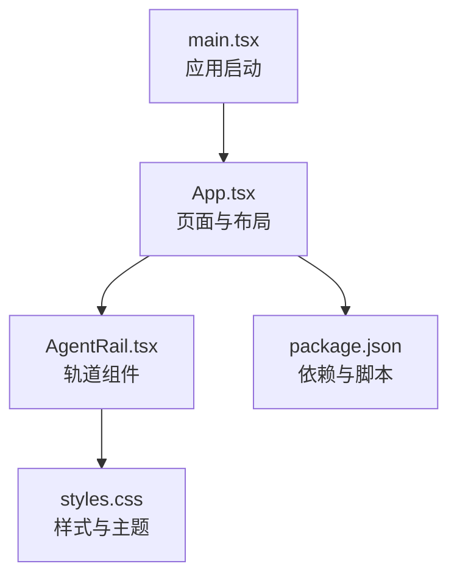
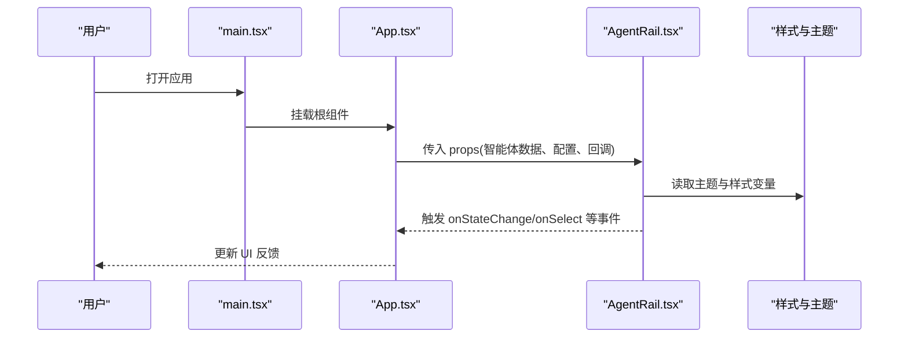
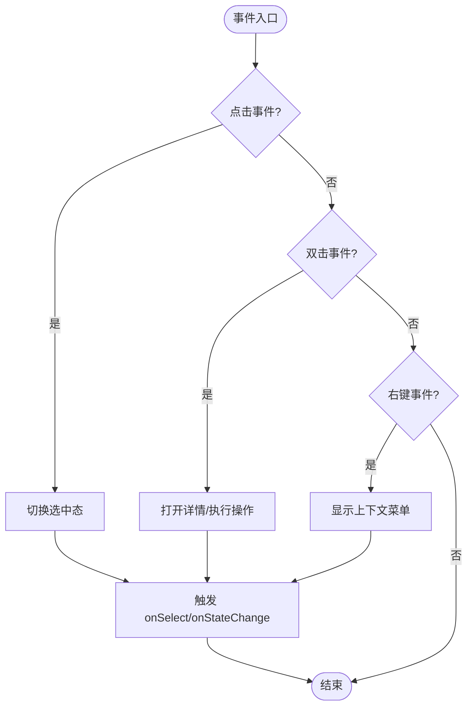
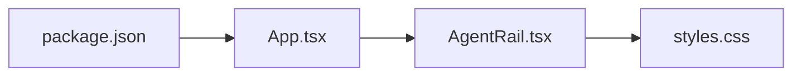

# AgentRail智能体轨道组件

<cite>
**本文引用的文件**   
- [AgentRail.tsx](file://web/src/components/AgentRail.tsx)
- [App.tsx](file://web/src/App.tsx)
- [main.tsx](file://web/src/main.tsx)
- [styles.css](file://web/src/styles.css)
- [package.json](file://web/package.json)
</cite>

## 目录
1. [简介](#简介)
2. [项目结构](#项目结构)
3. [核心组件](#核心组件)
4. [架构总览](#架构总览)
5. [详细组件分析](#详细组件分析)
6. [依赖关系分析](#依赖关系分析)
7. [性能考虑](#性能考虑)
8. [故障排查指南](#故障排查指南)
9. [结论](#结论)
10. [附录](#附录)

## 简介
本技术文档围绕 AgentRail 智能体轨道组件展开，聚焦以下目标：
- 解释组件的核心功能：智能体的可视化展示、状态监控与交互控制机制。
- 梳理 Props 接口定义：智能体数据模型、配置选项与样式定制参数。
- 说明事件处理机制：用户交互响应、状态更新与数据绑定。
- 提供集成与使用示例：基本用法、高级配置与自定义样式。
- 阐述状态管理模式、生命周期钩子与性能优化策略。
- 给出常见使用场景的实现示例与最佳实践指导。

## 项目结构
本项目采用前端单页应用结构，关键文件如下：
- web/src/components/AgentRail.tsx：轨道组件实现，负责渲染智能体列表、状态指示与交互逻辑。
- web/src/App.tsx：应用入口页面，演示如何引入并配置 AgentRail 组件。
- web/src/main.tsx：应用启动入口，挂载根组件到 DOM。
- web/src/styles.css：全局样式与组件主题变量。
- web/package.json：依赖与脚本配置。

图表来源
- [main.tsx](file://web/src/main.tsx)
- [App.tsx](file://web/src/App.tsx)
- [AgentRail.tsx](file://web/src/components/AgentRail.tsx)
- [styles.css](file://web/src/styles.css)
- [package.json](file://web/package.json)

章节来源
- [main.tsx](file://web/src/main.tsx)
- [App.tsx](file://web/src/App.tsx)
- [AgentRail.tsx](file://web/src/components/AgentRail.tsx)
- [styles.css](file://web/src/styles.css)
- [package.json](file://web/package.json)

## 核心组件
AgentRail 组件是“智能体轨道”的可视化容器，主要职责包括：
- 渲染智能体节点（头像/图标、名称、状态标签）。
- 维护轨道滚动与对齐行为（如自动滚动、吸附对齐）。
- 监听用户交互（点击、悬停、拖拽等）并触发回调。
- 暴露受控与非受控两种模式的状态管理接口。
- 支持主题与尺寸定制（颜色、间距、圆角、阴影等）。

典型能力
- 可视化：网格或线性轨道布局，支持缩放与分页。
- 状态监控：实时显示运行中、空闲、错误、离线等状态。
- 交互控制：选中、批量操作、右键菜单、快捷键。
- 可访问性：键盘导航、ARIA 属性、焦点管理。

章节来源
- [AgentRail.tsx](file://web/src/components/AgentRail.tsx)

## 架构总览
从调用链看，应用通过 App 页面将智能体数据与配置传入 AgentRail，组件内部维护本地状态并与外部进行双向数据绑定。

图表来源
- [main.tsx](file://web/src/main.tsx)
- [App.tsx](file://web/src/App.tsx)
- [AgentRail.tsx](file://web/src/components/AgentRail.tsx)
- [styles.css](file://web/src/styles.css)

## 详细组件分析

### 组件类型与 Props 接口
AgentRail 的 Props 通常包含以下维度：
- 数据模型
  - agents：智能体数组，每项包含 id、name、avatar、status、metadata 等字段。
  - selectedIds：当前选中的智能体 ID 集合（受控模式）。
- 配置选项
  - layout：布局类型（linear/grid）。
  - pageSize：每页数量。
  - autoScroll：是否自动滚动。
  - snapToCenter：是否吸附到中心。
  - showStatus：是否显示状态标签。
  - theme：主题对象（colors、spacing、radius、shadow）。
- 交互回调
  - onSelect：选中变更回调。
  - onDoubleClick：双击回调。
  - onContextMenu：右键菜单回调。
  - onStateChange：状态变化回调（用于受控模式同步）。
- 样式定制
  - className：外层容器类名。
  - style：内联样式覆盖。
  - itemClassName：单项类名。
  - statusColors：状态映射颜色。

建议的数据模型字段
- id：唯一标识。
- name：显示名称。
- avatar：头像 URL 或占位符。
- status：枚举值（running/idle/error/offline）。
- metadata：扩展信息（版本、资源占用、最后活跃时间等）。

章节来源
- [AgentRail.tsx](file://web/src/components/AgentRail.tsx)

### 状态管理与生命周期
- 受控模式
  - 由父组件通过 selectedIds 与 onStateChange 完全接管选中态与状态变更。
- 非受控模式
  - 组件内部维护默认选中态，适合快速集成与简单场景。
- 初始化与销毁
  - 在首次渲染时根据 props 初始化内部状态。
  - 在卸载时清理定时器、事件监听与动画帧。
- 更新策略
  - 当 agents 或配置变化时，按需重排与重绘。
  - 对大数据集采用虚拟滚动或分页以减少渲染压力。

章节来源
- [AgentRail.tsx](file://web/src/components/AgentRail.tsx)

### 事件处理机制
- 用户交互
  - 单击：选中/取消选中，触发 onSelect。
  - 双击：查看详情或执行快捷操作，触发 onDoubleClick。
  - 右键：弹出上下文菜单，触发 onContextMenu。
- 状态同步
  - 内部状态变更后，统一通过 onStateChange 通知父组件，保持数据一致性。
- 数据绑定
  - 受控模式下，父组件需确保 selectedIds 与内部状态一致。
  - 非受控模式下，组件自行维护选中态。

图表来源
- [AgentRail.tsx](file://web/src/components/AgentRail.tsx)

### 可视化与样式定制
- 布局
  - linear：线性轨道，适合横向滚动与时间线展示。
  - grid：网格布局，适合多列展示与密集信息。
- 主题
  - colors：主色、背景、文本、边框、状态色。
  - spacing：间距、行高、边距。
  - radius：圆角大小。
  - shadow：阴影强度。
- 状态色映射
  - 通过 statusColors 为不同状态指定颜色，便于语义化表达。
- 可访问性
  - 提供 aria-label、role、tabIndex 等属性，支持键盘导航与屏幕阅读器。

章节来源
- [AgentRail.tsx](file://web/src/components/AgentRail.tsx)
- [styles.css](file://web/src/styles.css)

### 集成与使用示例

#### 基本用法
- 在页面中引入 AgentRail，传入基础数据与最小配置。
- 使用非受控模式，组件内部维护选中态。
- 通过 className 或 style 进行简单样式覆盖。

章节来源
- [App.tsx](file://web/src/App.tsx)
- [AgentRail.tsx](file://web/src/components/AgentRail.tsx)

#### 高级配置
- 启用受控模式，通过 selectedIds 与 onStateChange 同步状态。
- 配置 layout、pageSize、autoScroll、snapToCenter 等行为。
- 自定义主题与状态色映射，适配品牌风格。

章节来源
- [App.tsx](file://web/src/App.tsx)
- [AgentRail.tsx](file://web/src/components/AgentRail.tsx)
- [styles.css](file://web/src/styles.css)

#### 自定义样式
- 通过 CSS 变量或主题对象覆盖默认样式。
- 针对特定状态添加视觉强调（如错误状态的闪烁效果）。
- 使用媒体查询适配移动端与高分屏。

章节来源
- [styles.css](file://web/src/styles.css)
- [AgentRail.tsx](file://web/src/components/AgentRail.tsx)

## 依赖关系分析
- 组件耦合
  - AgentRail 与 App 之间通过 props 与回调松耦合，便于替换与测试。
- 外部依赖
  - 样式与主题来自 styles.css，可通过 CSS 变量或主题对象注入。
- 潜在循环依赖
  - 避免在 AgentRail 中直接引用 App，确保单向数据流。

图表来源
- [package.json](file://web/package.json)
- [App.tsx](file://web/src/App.tsx)
- [AgentRail.tsx](file://web/src/components/AgentRail.tsx)
- [styles.css](file://web/src/styles.css)

章节来源
- [package.json](file://web/package.json)
- [App.tsx](file://web/src/App.tsx)
- [AgentRail.tsx](file://web/src/components/AgentRail.tsx)
- [styles.css](file://web/src/styles.css)

## 性能考虑
- 渲染优化
  - 大数据集采用虚拟滚动或分页，减少 DOM 节点数量。
  - 对静态内容使用 memo 或缓存，避免重复计算。
- 事件节流与防抖
  - 对高频事件（滚动、输入）进行节流或防抖，降低回调频率。
- 主题与样式
  - 使用 CSS 变量集中管理主题，减少运行时样式计算。
- 内存管理
  - 在组件卸载时清理定时器、事件监听与动画帧，防止内存泄漏。

[本节为通用性能建议，不直接分析具体文件]

## 故障排查指南
- 常见问题
  - 选中态不同步：检查受控模式下 selectedIds 与 onStateChange 是否正确配对。
  - 样式未生效：确认主题变量与 className 优先级，避免被全局样式覆盖。
  - 事件无响应：检查事件冒泡与阻止默认行为，确保回调已正确注册。
- 调试技巧
  - 在 onStateChange 中打印状态快照，定位状态不一致问题。
  - 使用浏览器开发者工具审查元素与样式计算过程。
  - 对大数据集开启性能面板，观察重排与重绘热点。

章节来源
- [AgentRail.tsx](file://web/src/components/AgentRail.tsx)
- [styles.css](file://web/src/styles.css)

## 结论
AgentRail 智能体轨道组件提供了完整的可视化、状态监控与交互控制能力。通过清晰的 Props 接口、灵活的主题与布局配置，以及完善的受控/非受控状态管理，该组件能够适配多种业务场景。遵循本文的最佳实践与性能建议，可在保证用户体验的同时提升系统的可维护性与可扩展性。

[本节为总结性内容，不直接分析具体文件]

## 附录

### 常见使用场景
- 实时监控面板
  - 使用 grid 布局与状态色映射，直观展示各智能体运行状况。
  - 结合 onStateChange 实现告警与自动刷新。
- 批量操作控制台
  - 通过 selectedIds 实现多选与批量启停。
  - 提供右键菜单与快捷键提升操作效率。
- 主题化与品牌定制
  - 通过主题对象与 CSS 变量统一视觉风格。
  - 针对不同环境（开发/生产）切换主题。

章节来源
- [AgentRail.tsx](file://web/src/components/AgentRail.tsx)
- [styles.css](file://web/src/styles.css)