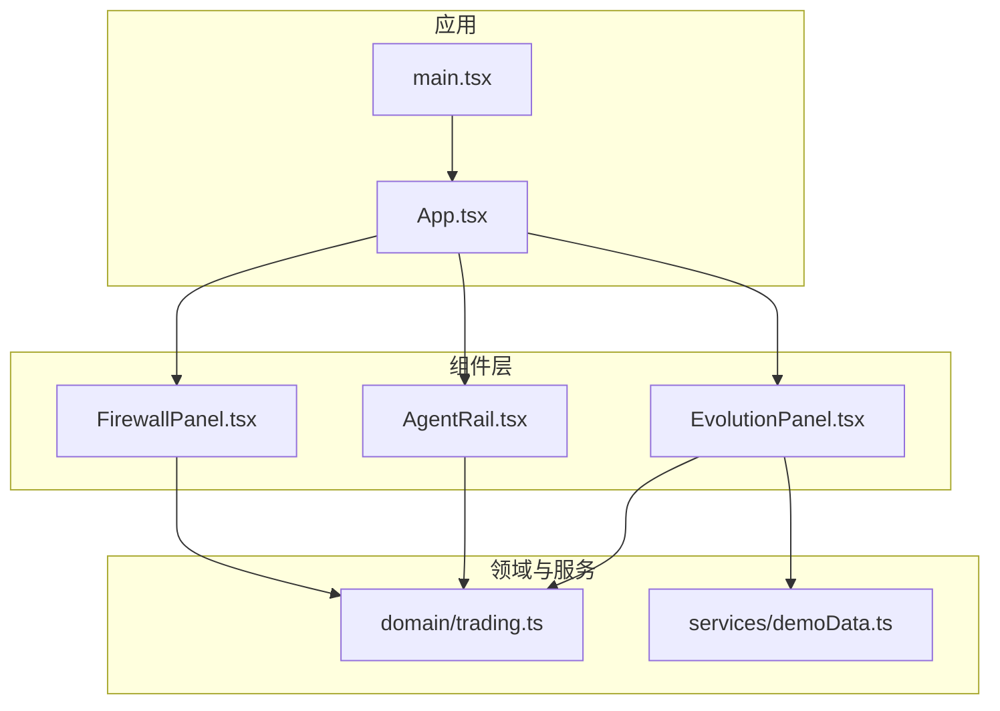
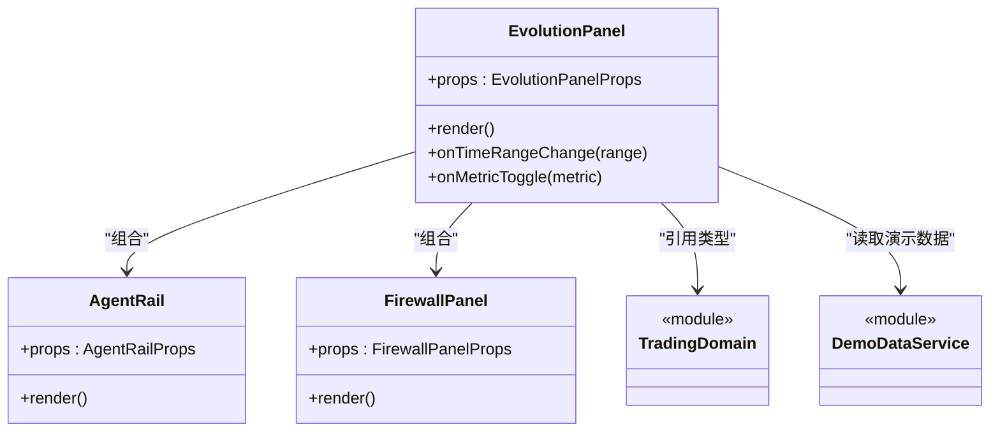
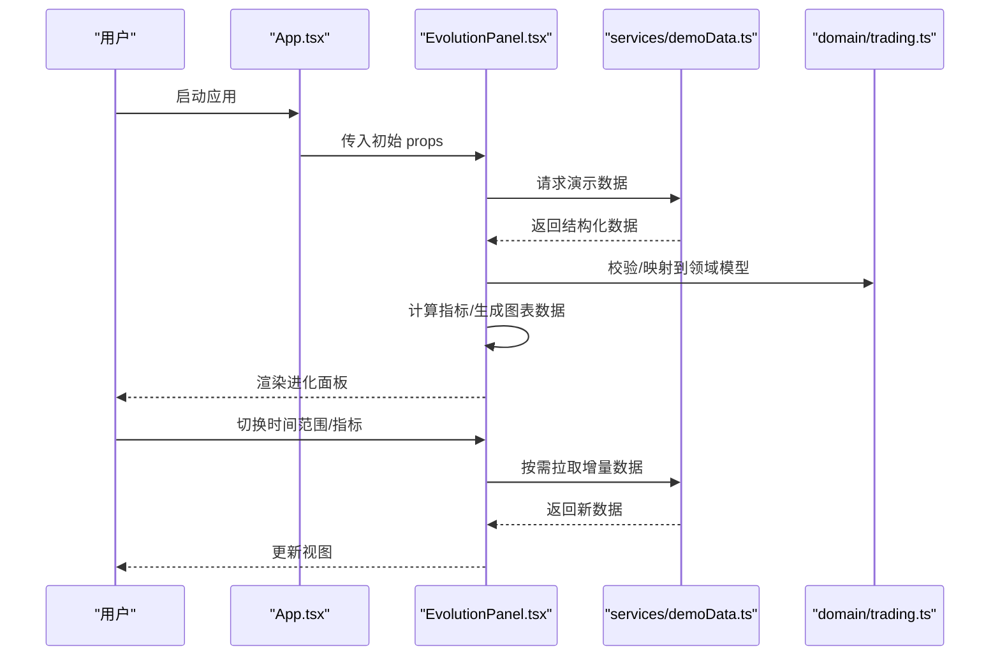
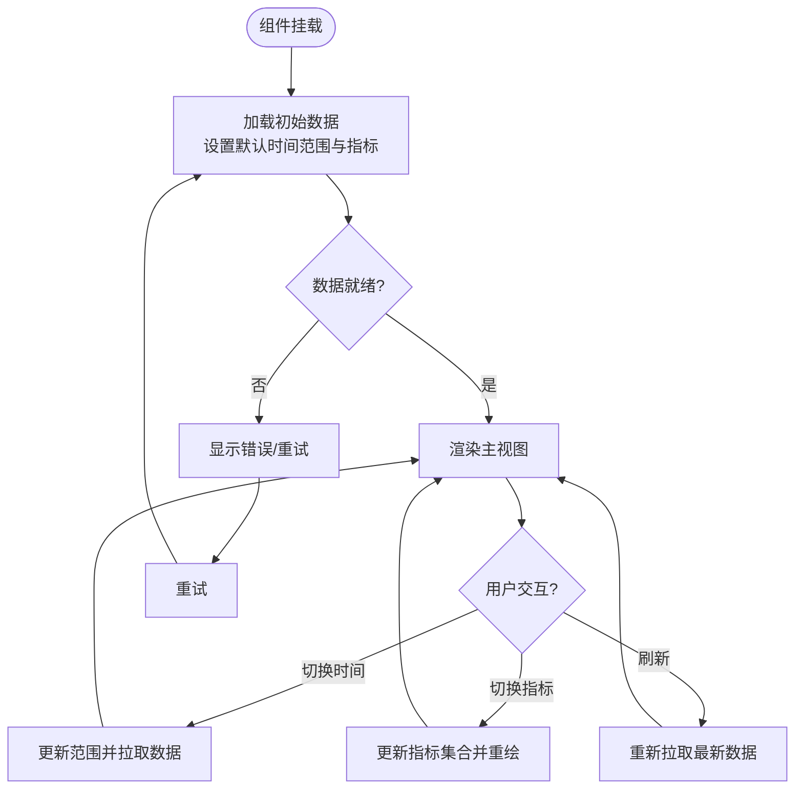
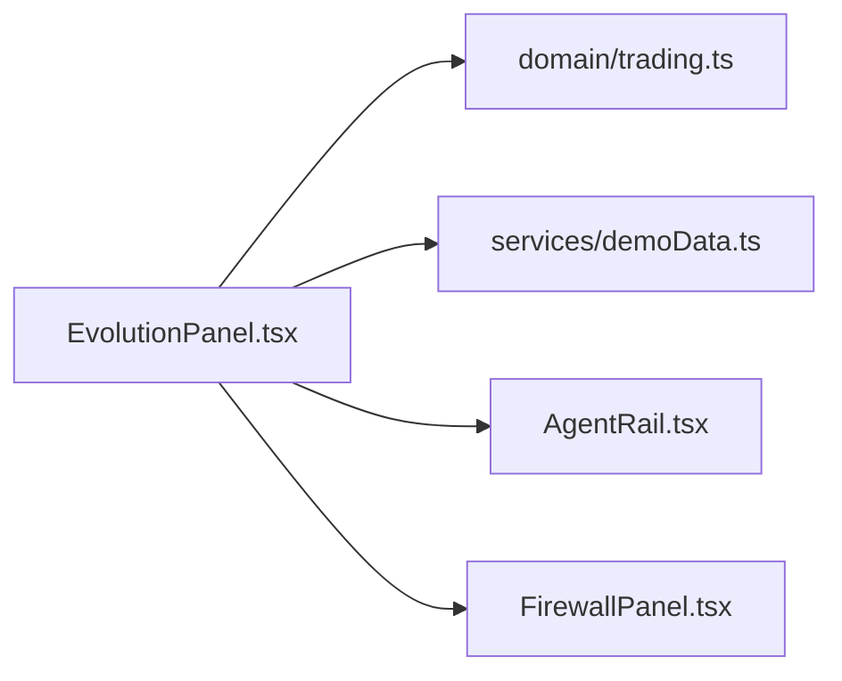

# EvolutionPanel进化面板组件

<cite>
**本文引用的文件**   
- [EvolutionPanel.tsx](file://web/src/components/EvolutionPanel.tsx)
- [AgentRail.tsx](file://web/src/components/AgentRail.tsx)
- [FirewallPanel.tsx](file://web/src/components/FirewallPanel.tsx)
- [trading.ts](file://web/src/domain/trading.ts)
- [demoData.ts](file://web/src/services/demoData.ts)
- [App.tsx](file://web/src/App.tsx)
- [main.tsx](file://web/src/main.tsx)
- [styles.css](file://web/src/styles.css)
</cite>

## 目录
1. [简介](#简介)
2. [项目结构](#项目结构)
3. [核心组件](#核心组件)
4. [架构总览](#架构总览)
5. [详细组件分析](#详细组件分析)
6. [依赖关系分析](#依赖关系分析)
7. [性能考虑](#性能考虑)
8. [故障排除指南](#故障排除指南)
9. [结论](#结论)
10. [附录](#附录)

## 简介
本技术文档围绕 EvolutionPanel 进化面板组件展开，聚焦其核心能力：系统进化的实时显示、历史追踪与性能指标监控。文档将系统化阐述该组件的 Props 接口定义（包括进化数据模型、时间范围配置与图表显示选项）、数据绑定机制（实时更新、状态同步与缓存策略），并提供集成与使用示例路径、动画与响应式体验优化建议，以及性能监控指标的展示方法与常见问题排查指引。

## 项目结构
本项目采用前端 React + TypeScript 工程组织方式，关键目录与职责如下：
- web/src/components：页面级与业务组件，包含 EvolutionPanel 及其相邻组件
- web/src/domain：领域模型与类型定义
- web/src/services：演示数据与服务层封装
- web/src：应用入口与全局样式

图示来源
- [App.tsx](file://web/src/App.tsx)
- [EvolutionPanel.tsx](file://web/src/components/EvolutionPanel.tsx)
- [AgentRail.tsx](file://web/src/components/AgentRail.tsx)
- [FirewallPanel.tsx](file://web/src/components/FirewallPanel.tsx)
- [trading.ts](file://web/src/domain/trading.ts)
- [demoData.ts](file://web/src/services/demoData.ts)
- [main.tsx](file://web/src/main.tsx)

章节来源
- [App.tsx](file://web/src/App.tsx)
- [main.tsx](file://web/src/main.tsx)
- [EvolutionPanel.tsx](file://web/src/components/EvolutionPanel.tsx)
- [AgentRail.tsx](file://web/src/components/AgentRail.tsx)
- [FirewallPanel.tsx](file://web/src/components/FirewallPanel.tsx)
- [trading.ts](file://web/src/domain/trading.ts)
- [demoData.ts](file://web/src/services/demoData.ts)

## 核心组件
EvolutionPanel 负责呈现“系统进化”的全景视图，包括：
- 实时进化进度与阶段指示
- 历史轨迹回放与时间轴控制
- 关键性能指标（如吞吐、延迟、资源占用）的可视化
- 与 AgentRail、FirewallPanel 等子面板联动展示

为便于理解，下图给出 EvolutionPanel 与其周边组件的关系概览：

图示来源
- [EvolutionPanel.tsx](file://web/src/components/EvolutionPanel.tsx)
- [AgentRail.tsx](file://web/src/components/AgentRail.tsx)
- [FirewallPanel.tsx](file://web/src/components/FirewallPanel.tsx)
- [trading.ts](file://web/src/domain/trading.ts)
- [demoData.ts](file://web/src/services/demoData.ts)

章节来源
- [EvolutionPanel.tsx](file://web/src/components/EvolutionPanel.tsx)
- [AgentRail.tsx](file://web/src/components/AgentRail.tsx)
- [FirewallPanel.tsx](file://web/src/components/FirewallPanel.tsx)
- [trading.ts](file://web/src/domain/trading.ts)
- [demoData.ts](file://web/src/services/demoData.ts)

## 架构总览
EvolutionPanel 的数据流遵循“服务提供 -> 组件消费 -> 视图渲染”的单向数据流模式：
- 数据源：通过 services/demoData.ts 获取演示数据或对接真实后端
- 领域模型：domain/trading.ts 定义统一的数据结构与约束
- 组件层：EvolutionPanel 聚合并展示数据，同时向子组件传递必要 props
- 交互：用户操作（如切换时间范围、选择指标）触发状态更新与重渲染

图示来源
- [App.tsx](file://web/src/App.tsx)
- [EvolutionPanel.tsx](file://web/src/components/EvolutionPanel.tsx)
- [demoData.ts](file://web/src/services/demoData.ts)
- [trading.ts](file://web/src/domain/trading.ts)

## 详细组件分析

### EvolutionPanel 组件
- 职责
  - 接收并管理“进化数据”、“时间范围”、“指标开关”等 props
  - 维护本地状态（当前选中时间窗口、可见指标集合、加载/错误状态）
  - 调用服务层获取数据，结合领域模型进行转换与聚合
  - 驱动图表与列表渲染，并与 AgentRail、FirewallPanel 联动
- 关键行为
  - 初始化时加载默认时间范围与指标
  - 监听外部状态变化（如父组件传入的新数据）
  - 处理用户交互（时间滑块、指标复选框、刷新按钮）
  - 错误边界与降级展示（网络异常、数据缺失）

图示来源
- [EvolutionPanel.tsx](file://web/src/components/EvolutionPanel.tsx)
- [demoData.ts](file://web/src/services/demoData.ts)
- [trading.ts](file://web/src/domain/trading.ts)

章节来源
- [EvolutionPanel.tsx](file://web/src/components/EvolutionPanel.tsx)
- [demoData.ts](file://web/src/services/demoData.ts)
- [trading.ts](file://web/src/domain/trading.ts)

### 数据模型与领域类型（domain/trading.ts）
- 作用
  - 定义统一的进化事件、指标项、时间序列等数据结构
  - 提供类型约束与可选字段说明，确保前后端/服务层数据一致性
- 典型字段（概念性说明）
  - 进化事件：时间戳、阶段标识、描述、关联指标快照
  - 指标项：名称、单位、数值、采样频率
  - 时间范围：起始时间、结束时间、粒度（秒/分/小时）
- 使用方式
  - EvolutionPanel 在接收原始数据后，将其映射为领域模型再用于渲染
  - 其他组件（AgentRail、FirewallPanel）复用相同类型，保证跨组件一致

章节来源
- [trading.ts](file://web/src/domain/trading.ts)

### 演示数据服务（services/demoData.ts）
- 作用
  - 提供模拟的进化数据与指标序列，便于快速验证 UI 与交互
  - 支持按时间范围过滤、分页或增量更新
- 关键点
  - 返回的数据需符合 domain/trading.ts 的类型约定
  - 可替换为真实 API 实现，保持对外接口不变

章节来源
- [demoData.ts](file://web/src/services/demoData.ts)

### 与相邻组件的协作
- AgentRail
  - 展示代理/智能体维度的演进情况，由 EvolutionPanel 根据当前时间范围筛选数据
- FirewallPanel
  - 展示防火墙规则/策略的变更历史与影响面，同样受时间范围与指标开关控制

章节来源
- [AgentRail.tsx](file://web/src/components/AgentRail.tsx)
- [FirewallPanel.tsx](file://web/src/components/FirewallPanel.tsx)
- [EvolutionPanel.tsx](file://web/src/components/EvolutionPanel.tsx)

## 依赖关系分析
- 内部依赖
  - EvolutionPanel 依赖 domain/trading.ts 的类型定义
  - EvolutionPanel 依赖 services/demoData.ts 的数据供给
  - EvolutionPanel 组合 AgentRail 与 FirewallPanel 以扩展展示维度
- 外部依赖
  - React 运行时与 Hooks（状态、副作用、上下文等）
  - 图表库（若使用）：需在项目中安装并正确引入
- 可能的循环依赖
  - 组件间仅通过 props 通信，避免直接相互导入，降低耦合

图示来源
- [EvolutionPanel.tsx](file://web/src/components/EvolutionPanel.tsx)
- [AgentRail.tsx](file://web/src/components/AgentRail.tsx)
- [FirewallPanel.tsx](file://web/src/components/FirewallPanel.tsx)
- [trading.ts](file://web/src/domain/trading.ts)
- [demoData.ts](file://web/src/services/demoData.ts)

章节来源
- [EvolutionPanel.tsx](file://web/src/components/EvolutionPanel.tsx)
- [AgentRail.tsx](file://web/src/components/AgentRail.tsx)
- [FirewallPanel.tsx](file://web/src/components/FirewallPanel.tsx)
- [trading.ts](file://web/src/domain/trading.ts)
- [demoData.ts](file://web/src/services/demoData.ts)

## 性能考虑
- 数据层面
  - 对大数据集进行降采样与分页加载，减少首屏渲染压力
  - 使用不可变数据结构与浅比较，避免不必要的重渲染
- 渲染层面
  - 对长列表与复杂图表启用虚拟滚动与按需绘制
  - 将频繁更新的指标拆分为独立小组件，配合 memo 优化
- 网络层面
  - 合理设置缓存策略（内存缓存 + 短期磁盘缓存）
  - 对重复请求去抖/节流，合并批量更新
- 交互层面
  - 时间范围切换时优先使用增量更新
  - 大任务后台执行，UI 保持响应

[本节为通用性能建议，不直接分析具体文件]

## 故障排除指南
- 数据为空或格式不符
  - 检查 services/demoData.ts 返回结构是否符合 domain/trading.ts 定义
  - 在 EvolutionPanel 中增加空值与类型守卫逻辑
- 图表不更新
  - 确认时间范围与指标开关的状态是否被正确提升与传播
  - 检查是否有竞态条件导致旧响应覆盖新响应
- 性能卡顿
  - 定位高频重渲染的组件，使用性能分析工具（如浏览器 Profiler）
  - 对大数据集启用分页/降采样/懒加载
- 样式错乱
  - 检查 styles.css 是否与组件层级匹配，必要时隔离样式作用域

章节来源
- [EvolutionPanel.tsx](file://web/src/components/EvolutionPanel.tsx)
- [trading.ts](file://web/src/domain/trading.ts)
- [demoData.ts](file://web/src/services/demoData.ts)
- [styles.css](file://web/src/styles.css)

## 结论
EvolutionPanel 作为系统进化的核心可视化组件，通过清晰的 Props 契约、稳定的数据流与良好的组件拆分，实现了实时显示、历史追踪与性能指标监控的统一入口。配合领域模型与演示数据服务，既能快速验证功能，也能平滑迁移至真实数据源。建议在后续迭代中持续完善错误边界、缓存策略与性能优化，以提升大规模数据场景下的用户体验。

[本节为总结性内容，不直接分析具体文件]

## 附录

### Props 接口与数据模型要点
- 进化数据模型
  - 基于 domain/trading.ts 中的类型定义，确保字段完整与语义清晰
- 时间范围配置
  - 支持预设区间与自定义起止时间；粒度可按秒/分/小时切换
- 图表显示选项
  - 指标多选、颜色主题、坐标轴刻度、提示框与图例位置等

章节来源
- [trading.ts](file://web/src/domain/trading.ts)
- [EvolutionPanel.tsx](file://web/src/components/EvolutionPanel.tsx)

### 数据绑定与缓存策略
- 数据绑定
  - 单向数据流：服务层 -> 领域模型 -> 组件状态 -> 视图
  - 事件驱动：用户交互触发状态更新与数据拉取
- 缓存策略
  - 内存缓存最近时间窗口的数据
  - 对热点指标做短时缓存，避免重复计算
  - 失效策略：时间范围切换或手动刷新时主动失效

章节来源
- [EvolutionPanel.tsx](file://web/src/components/EvolutionPanel.tsx)
- [demoData.ts](file://web/src/services/demoData.ts)

### 集成与使用示例路径
- 基础配置
  - 在 App.tsx 中引入并传入最小化 props（数据源、时间范围、指标开关）
- 数据源连接
  - 将 services/demoData.ts 替换为真实 API 调用，保持返回结构一致
- 自定义渲染
  - 通过插槽或回调函数定制指标卡片、趋势图与详情弹窗

章节来源
- [App.tsx](file://web/src/App.tsx)
- [demoData.ts](file://web/src/services/demoData.ts)
- [EvolutionPanel.tsx](file://web/src/components/EvolutionPanel.tsx)

### 动画效果与响应式设计
- 动画
  - 过渡动效用于时间范围切换与指标显隐，避免突兀跳变
  - 图表入场动画与增量更新动画分离，提升可读性
- 响应式
  - 在小屏设备上折叠次要指标，保留核心趋势
  - 自适应网格布局，保证多面板并列时的可读性

章节来源
- [EvolutionPanel.tsx](file://web/src/components/EvolutionPanel.tsx)
- [styles.css](file://web/src/styles.css)

### 性能监控指标展示方法
- 指标分类
  - 业务指标：吞吐量、成功率、错误率
  - 系统指标：CPU、内存、I/O、网络带宽
- 展示形式
  - 折线图用于趋势，柱状图用于对比，仪表盘用于阈值告警
  - 支持多指标叠加与分组聚合

章节来源
- [EvolutionPanel.tsx](file://web/src/components/EvolutionPanel.tsx)
- [trading.ts](file://web/src/domain/trading.ts)