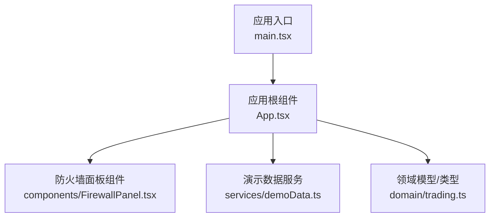
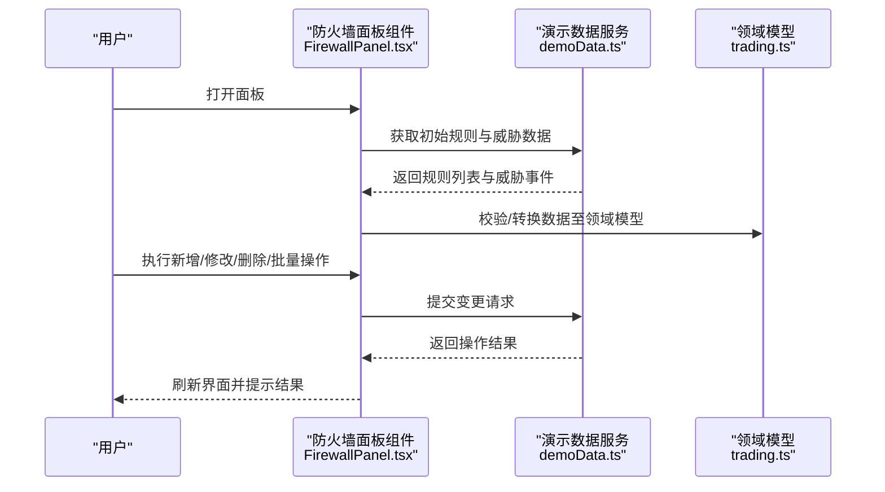
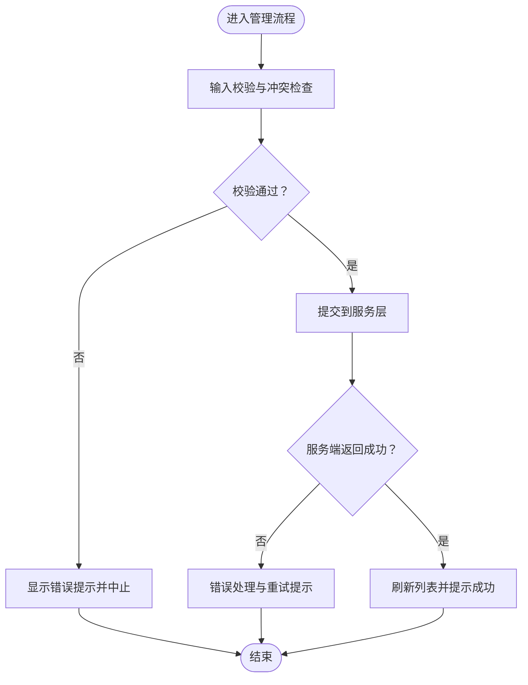
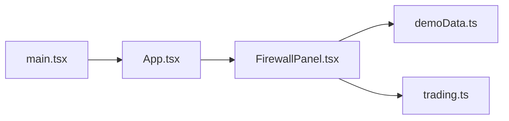

# FirewallPanel防火墙面板组件

<cite>
**本文引用的文件**   
- [FirewallPanel.tsx](file://web/src/components/FirewallPanel.tsx)
- [App.tsx](file://web/src/App.tsx)
- [main.tsx](file://web/src/main.tsx)
- [demoData.ts](file://web/src/services/demoData.ts)
- [trading.ts](file://web/src/domain/trading.ts)
</cite>

## 目录
1. [简介](#简介)
2. [项目结构](#项目结构)
3. [核心组件](#核心组件)
4. [架构总览](#架构总览)
5. [详细组件分析](#详细组件分析)
6. [依赖关系分析](#依赖关系分析)
7. [性能考虑](#性能考虑)
8. [故障排查指南](#故障排查指南)
9. [结论](#结论)
10. [附录](#附录)

## 简介
本技术文档围绕 FirewallPanel 防火墙面板组件，系统性阐述其核心功能与实现要点，包括：
- 防火墙策略的可视化管理
- 安全规则的配置与维护（增删改查、批量操作）
- 威胁检测结果的展示与联动
- Props 接口定义与数据结构约定
- 集成使用示例（基础配置、规则模板、自定义验证）
- 安全考量、权限控制与审计日志建议
- 常见安全策略配置示例与最佳实践

## 项目结构
本项目采用前端 React + TypeScript 工程组织方式。与 FirewallPanel 直接相关的代码位于 web/src 下，其中：
- components 目录包含 UI 组件，含 FirewallPanel.tsx
- services 目录提供演示数据与服务层封装
- domain 目录定义领域模型与类型
- App.tsx 为应用入口页面，负责组合与挂载组件
- main.tsx 为应用启动入口

图表来源
- [main.tsx](file://web/src/main.tsx)
- [App.tsx](file://web/src/App.tsx)
- [FirewallPanel.tsx](file://web/src/components/FirewallPanel.tsx)
- [demoData.ts](file://web/src/services/demoData.ts)
- [trading.ts](file://web/src/domain/trading.ts)

章节来源
- [main.tsx](file://web/src/main.tsx)
- [App.tsx](file://web/src/App.tsx)
- [FirewallPanel.tsx](file://web/src/components/FirewallPanel.tsx)
- [demoData.ts](file://web/src/services/demoData.ts)
- [trading.ts](file://web/src/domain/trading.ts)

## 核心组件
FirewallPanel 作为防火墙策略管理的前端可视化面板，承担以下职责：
- 渲染并维护防火墙规则列表
- 提供规则的添加、编辑、删除与批量操作能力
- 展示威胁检测结果与告警信息
- 通过 Props 接收外部配置与数据源，并与父级应用进行状态同步

关键关注点
- 数据契约：规则对象的结构、枚举值、必填字段
- 交互流程：新增/编辑/删除/批量操作的调用链与副作用
- 权限控制：基于角色或权限标志的可见性与可编辑性
- 错误处理：网络异常、校验失败、冲突处理的反馈机制

章节来源
- [FirewallPanel.tsx](file://web/src/components/FirewallPanel.tsx)

## 架构总览
从组件视角看，FirewallPanel 与父级应用及数据服务之间的交互如下：

图表来源
- [FirewallPanel.tsx](file://web/src/components/FirewallPanel.tsx)
- [demoData.ts](file://web/src/services/demoData.ts)
- [trading.ts](file://web/src/domain/trading.ts)

## 详细组件分析

### 组件属性（Props）与数据结构
- 规则数据结构
  - 标识与元信息：唯一标识、名称、描述、创建/更新时间
  - 匹配条件：协议、端口范围、源/目的地址段、域名或路径模式
  - 动作与优先级：允许/拒绝/拦截、优先级数值
  - 状态与标签：启用/禁用、标签集合、备注
- 策略配置选项
  - 默认策略：全局默认动作、是否开启严格模式
  - 排序与过滤：按时间、优先级、标签筛选
  - 批量操作开关：全选、批量启用/禁用/删除
- 操作权限控制
  - 只读/编辑/管理员三种视图
  - 按钮级权限：新增、编辑、删除、批量操作的可见性
  - 敏感操作二次确认与审计记录

章节来源
- [FirewallPanel.tsx](file://web/src/components/FirewallPanel.tsx)
- [trading.ts](file://web/src/domain/trading.ts)

### 管理功能与交互流程
- 新增规则
  - 触发入口：点击“新增”按钮
  - 表单校验：必填项、格式、冲突检测
  - 提交与回滚：成功后刷新列表，失败时保留输入并提示
- 修改规则
  - 行内编辑或弹窗编辑
  - 变更差异对比与版本快照（可选）
- 删除规则
  - 单条删除与批量删除
  - 删除前二次确认与影响面提示
- 批量操作
  - 全选/反选
  - 批量启用/禁用/删除
  - 进度反馈与错误汇总

图表来源
- [FirewallPanel.tsx](file://web/src/components/FirewallPanel.tsx)
- [demoData.ts](file://web/src/services/demoData.ts)

章节来源
- [FirewallPanel.tsx](file://web/src/components/FirewallPanel.tsx)
- [demoData.ts](file://web/src/services/demoData.ts)

### 威胁检测展示与联动
- 威胁事件列表
  - 事件类型、来源、目标、时间戳、严重等级
  - 支持按严重等级与时间范围筛选
- 与规则联动
  - 一键将威胁特征生成临时阻断规则
  - 对命中规则的事件进行溯源与统计
- 实时/轮询更新
  - 根据配置周期拉取最新威胁数据
  - 增量更新与去重逻辑

章节来源
- [FirewallPanel.tsx](file://web/src/components/FirewallPanel.tsx)
- [demoData.ts](file://web/src/services/demoData.ts)

### 集成与使用示例
- 基础配置
  - 在应用根组件中引入并挂载防火墙面板
  - 传入规则数据源、权限标志与回调函数
- 规则模板
  - 预置常用模板（如仅放行白名单、严格拦截未知流量）
  - 模板导入与导出
- 自定义验证
  - 扩展字段校验器
  - 自定义冲突检测策略（如端口重复、优先级覆盖）

章节来源
- [App.tsx](file://web/src/App.tsx)
- [FirewallPanel.tsx](file://web/src/components/FirewallPanel.tsx)

### 安全考量、权限控制与审计日志
- 安全考量
  - 最小权限原则：仅暴露必要操作
  - 输入清洗与输出编码：防止注入与XSS
  - 敏感操作二次确认与不可逆操作保护
- 权限控制
  - 基于角色的访问控制（RBAC）
  - 细粒度按钮级权限与字段级可见性
- 审计日志
  - 记录关键操作：谁、何时、做了什么、结果如何
  - 日志脱敏与留存策略

章节来源
- [FirewallPanel.tsx](file://web/src/components/FirewallPanel.tsx)

## 依赖关系分析
组件间的依赖关系如下：

图表来源
- [FirewallPanel.tsx](file://web/src/components/FirewallPanel.tsx)
- [demoData.ts](file://web/src/services/demoData.ts)
- [trading.ts](file://web/src/domain/trading.ts)
- [App.tsx](file://web/src/App.tsx)
- [main.tsx](file://web/src/main.tsx)

章节来源
- [FirewallPanel.tsx](file://web/src/components/FirewallPanel.tsx)
- [demoData.ts](file://web/src/services/demoData.ts)
- [trading.ts](file://web/src/domain/trading.ts)
- [App.tsx](file://web/src/App.tsx)
- [main.tsx](file://web/src/main.tsx)

## 性能考虑
- 大数据量渲染优化
  - 虚拟滚动与分页加载
  - 列表项惰性渲染与缓存
- 网络请求优化
  - 防抖与节流：搜索与筛选
  - 增量更新与合并策略
- 计算复杂度控制
  - 冲突检测与优先级排序的算法选择
  - 批量操作的批处理与分片提交

[本节为通用性能指导，不直接分析具体文件]

## 故障排查指南
- 常见问题定位
  - 规则无法保存：检查必填字段、格式校验与冲突检测
  - 批量操作失败：查看错误汇总与重试策略
  - 威胁数据不更新：检查轮询配置与服务端可用性
- 调试建议
  - 在关键分支打印状态变化与请求参数
  - 使用浏览器开发者工具监控网络与状态树
  - 对复杂校验逻辑编写单元测试

章节来源
- [FirewallPanel.tsx](file://web/src/components/FirewallPanel.tsx)
- [demoData.ts](file://web/src/services/demoData.ts)

## 结论
FirewallPanel 提供了直观的防火墙策略管理与威胁检测展示能力，结合清晰的 Props 契约与完善的交互流程，能够满足日常安全运维需求。建议在集成时遵循最小权限原则、完善审计日志与性能优化策略，以提升系统的安全性与稳定性。

[本节为总结性内容，不直接分析具体文件]

## 附录
- 常见安全策略配置示例
  - 白名单放行：仅允许已知可信源访问
  - 黑名单拦截：阻断已知恶意IP/域名
  - 区域限制：按地理区域或网段限制访问
  - 速率限制：对高频请求进行限流与降级
- 最佳实践
  - 规则命名规范与注释要求
  - 变更审批与灰度发布流程
  - 定期审查与清理过期规则
  - 建立告警阈值与自动化响应

[本节为概念性内容，不直接分析具体文件]