# KaleidoX产品故事

<cite>
**本文引用的文件**   
- [server/src/app.ts](file://server/src/app.ts)
- [server/src/index.ts](file://server/src/index.ts)
- [server/src/routes/a2a.ts](file://server/src/routes/a2a.ts)
- [server/src/routes/agentCard.ts](file://server/src/routes/agentCard.ts)
- [server/src/routes/config.ts](file://server/src/routes/config.ts)
- [server/src/routes/tasks.ts](file://server/src/routes/tasks.ts)
- [server/src/treasury/service.ts](file://server/src/treasury/service.ts)
- [server/src/treasury/routes.ts](file://server/src/treasury/routes.ts)
- [server/src/db/pool.ts](file://server/src/db/pool.ts)
- [server/src/db/queries.ts](file://server/src/db/queries.ts)
- [server/src/db/schema.sql](file://server/src/db/schema.sql)
- [web/server/app.ts](file://web/server/app.ts)
- [web/server/index.ts](file://web/server/index.ts)
- [web/server/orchestrator.ts](file://web/server/orchestrator.ts)
- [web/server/repository.ts](file://web/server/repository.ts)
- [web/server/taskEvents.ts](file://web/server/taskEvents.ts)
- [web/server/adapters/createExecutionAdapter.ts](file://web/server/adapters/createExecutionAdapter.ts)
- [web/server/adapters/execution.ts](file://web/server/adapters/execution.ts)
- [web/server/adapters/injectiveTestnet.ts](file://web/server/adapters/injectiveTestnet.ts)
- [web/server/config/database.ts](file://web/server/config/database.ts)
- [web/server/config/environment.ts](file://web/server/config/environment.ts)
- [web/server/config/injective.ts](file://web/server/config/injective.ts)
- [web/server/config/panda.ts](file://web/server/config/panda.ts)
- [web/server/config/pandaModel.ts](file://web/server/config/pandaModel.ts)
- [web/server/pactledger/service.ts](file://web/server/pactledger/service.ts)
- [web/server/pactledger/repository.ts](file://web/server/pactledger/repository.ts)
- [web/server/pactledger/intents.ts](file://web/server/pactledger/intents.ts)
- [web/server/pactledger/policies.ts](file://web/server/pactledger/policies.ts)
- [web/server/pactledger/policyEngine.ts](file://web/server/pactledger/policyEngine.ts)
- [web/server/quant/service.ts](file://web/server/quant/service.ts)
- [web/server/quant/marketData.ts](file://web/server/quant/marketData.ts)
- [web/server/quant/researchNarrator.ts](file://web/server/quant/researchNarrator.ts)
- [web/server/quant/backtest.ts](file://web/server/quant/backtest.ts)
- [web/server/quant/types.ts](file://web/server/quant/types.ts)
- [web/server/treasury.ts](file://web/server/treasury.ts)
- [web/server/users.ts](file://web/server/users.ts)
- [web/server/a2a.ts](file://web/server/a2a.ts)
- [web/src/App.tsx](file://web/src/App.tsx)
- [web/src/main.tsx](file://web/src/main.tsx)
- [web/src/views/ExecutionView.tsx](file://web/src/views/ExecutionView.tsx)
- [web/src/views/TreasuryOverviewView.tsx](file://web/src/views/TreasuryOverviewView.tsx)
- [web/src/services/useTaskWorkflow.ts](file://web/src/services/useTaskWorkflow.ts)
- [web/src/services/useTreasury.ts](file://web/src/services/useTreasury.ts)
- [web/src/services/useInjectiveConfig.ts](file://web/src/services/useInjectiveConfig.ts)
- [web/src/services/usePandaConfig.ts](file://web/src/services/usePandaConfig.ts)
- [web/src/services/authClient.ts](file://web/src/services/authClient.ts)
- [web/src/services/demoData.ts](file://web/src/services/demoData.ts)
- [web/src/services/injectiveClient.ts](file://web/src/services/injectiveClient.ts)
- [web/src/services/pactledgerClient.ts](file://web/src/services/pactledgerClient.ts)
- [web/src/services/taskClient.ts](file://web/src/services/taskClient.ts)
</cite>

## 目录
1. [简介](#简介)
2. [项目结构](#项目结构)
3. [核心组件](#核心组件)
4. [架构总览](#架构总览)
5. [详细组件分析](#详细组件分析)
6. [依赖关系分析](#依赖关系分析)
7. [性能与可扩展性](#性能与可扩展性)
8. [故障排查指南](#故障排查指南)
9. [结论](#结论)
10. [附录](#附录)

## 简介
KaleidoX 是一个面向“智能体驱动的交易与金库管理”的端到端系统。它通过任务编排、策略研究、回测、执行适配器和链上账本（Pact Ledger）等模块，将量化研究与自动化交易流程串联起来，并提供可视化的前端界面进行监控与交互。后端服务提供 REST API 与 A2A（Agent-to-Agent）能力，支持多环境配置、数据库迁移与持久化存储。

## 项目结构
仓库采用前后端分离的多包结构：
- server：轻量后端服务，负责路由、数据库连接、基础业务逻辑与金库子域。
- web：前端应用与内嵌服务端（用于本地开发或演示），包含编排器、适配器、量化研究、Pact Ledger 集成、配置与环境管理等。

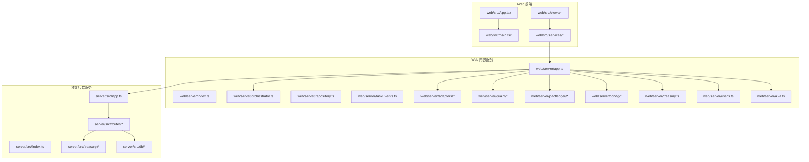

图表来源
- [web/server/app.ts](file://web/server/app.ts)
- [web/server/index.ts](file://web/server/index.ts)
- [server/src/app.ts](file://server/src/app.ts)
- [server/src/index.ts](file://server/src/index.ts)

章节来源
- [web/server/app.ts](file://web/server/app.ts)
- [web/server/index.ts](file://web/server/index.ts)
- [server/src/app.ts](file://server/src/app.ts)
- [server/src/index.ts](file://server/src/index.ts)

## 核心组件
- 任务编排与事件流
  - 编排器负责创建、调度与跟踪任务生命周期；事件总线用于发布订阅关键状态变更。
- 执行适配器
  - 统一抽象不同执行环境（如测试网），提供一致的执行接口。
- 量化研究
  - 市场数据获取、研究叙事生成、回测引擎与类型定义。
- Pact Ledger 集成
  - 意图、策略与策略引擎，结合仓储层实现策略执行与审计。
- 配置与环境
  - 数据库、注入网络、Panda 模型等外部依赖的配置加载与校验。
- 用户与认证
  - 用户管理与鉴权客户端。
- 金库服务
  - 资产视图、操作与审计，前后端均有实现。

章节来源
- [web/server/orchestrator.ts](file://web/server/orchestrator.ts)
- [web/server/taskEvents.ts](file://web/server/taskEvents.ts)
- [web/server/adapters/createExecutionAdapter.ts](file://web/server/adapters/createExecutionAdapter.ts)
- [web/server/adapters/execution.ts](file://web/server/adapters/execution.ts)
- [web/server/adapters/injectiveTestnet.ts](file://web/server/adapters/injectiveTestnet.ts)
- [web/server/quant/service.ts](file://web/server/quant/service.ts)
- [web/server/quant/marketData.ts](file://web/server/quant/marketData.ts)
- [web/server/quant/researchNarrator.ts](file://web/server/quant/researchNarrator.ts)
- [web/server/quant/backtest.ts](file://web/server/quant/backtest.ts)
- [web/server/quant/types.ts](file://web/server/quant/types.ts)
- [web/server/pactledger/service.ts](file://web/server/pactledger/service.ts)
- [web/server/pactledger/repository.ts](file://web/server/pactledger/repository.ts)
- [web/server/pactledger/intents.ts](file://web/server/pactledger/intents.ts)
- [web/server/pactledger/policies.ts](file://web/server/pactledger/policies.ts)
- [web/server/pactledger/policyEngine.ts](file://web/server/pactledger/policyEngine.ts)
- [web/server/config/database.ts](file://web/server/config/database.ts)
- [web/server/config/environment.ts](file://web/server/config/environment.ts)
- [web/server/config/injective.ts](file://web/server/config/injective.ts)
- [web/server/config/panda.ts](file://web/server/config/panda.ts)
- [web/server/config/pandaModel.ts](file://web/server/config/pandaModel.ts)
- [web/server/treasury.ts](file://web/server/treasury.ts)
- [web/server/users.ts](file://web/server/users.ts)
- [web/server/a2a.ts](file://web/server/a2a.ts)
- [server/src/treasury/service.ts](file://server/src/treasury/service.ts)
- [server/src/treasury/routes.ts](file://server/src/treasury/routes.ts)
- [server/src/db/pool.ts](file://server/src/db/pool.ts)
- [server/src/db/queries.ts](file://server/src/db/queries.ts)
- [server/src/db/schema.sql](file://server/src/db/schema.sql)

## 架构总览
KaleidoX 的整体架构围绕“任务驱动”的组织方式展开：前端发起任务，编排器协调各子系统完成研究、回测与执行，并通过 Pact Ledger 记录策略与意图，最终由执行适配器对接目标网络。

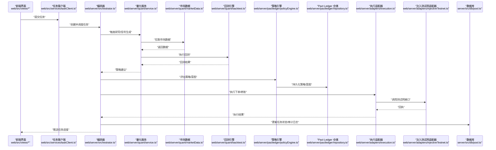

图表来源
- [web/server/orchestrator.ts](file://web/server/orchestrator.ts)
- [web/server/quant/service.ts](file://web/server/quant/service.ts)
- [web/server/quant/marketData.ts](file://web/server/quant/marketData.ts)
- [web/server/quant/backtest.ts](file://web/server/quant/backtest.ts)
- [web/server/pactledger/policyEngine.ts](file://web/server/pactledger/policyEngine.ts)
- [web/server/pactledger/repository.ts](file://web/server/pactledger/repository.ts)
- [web/server/adapters/execution.ts](file://web/server/adapters/execution.ts)
- [web/server/adapters/injectiveTestnet.ts](file://web/server/adapters/injectiveTestnet.ts)
- [server/src/db/pool.ts](file://server/src/db/pool.ts)

## 详细组件分析

### 任务编排与事件流
- 编排器负责任务的创建、状态推进与错误恢复；事件流用于跨模块通知任务进展。
- 典型流程包括：接收请求 -> 初始化任务上下文 -> 分派到量化/策略/执行阶段 -> 汇总结果 -> 持久化与回调。

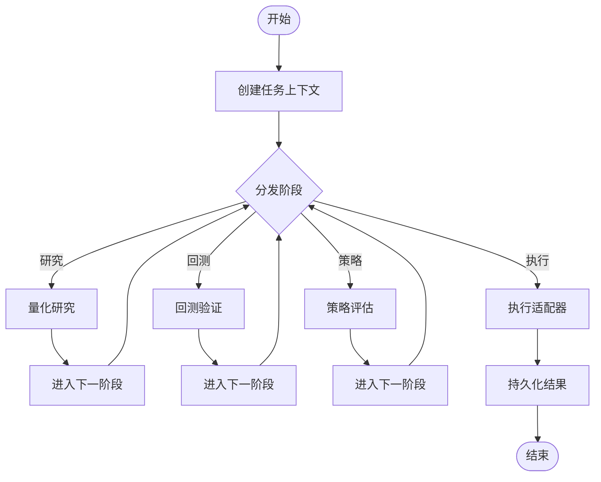

图表来源
- [web/server/orchestrator.ts](file://web/server/orchestrator.ts)
- [web/server/taskEvents.ts](file://web/server/taskEvents.ts)

章节来源
- [web/server/orchestrator.ts](file://web/server/orchestrator.ts)
- [web/server/taskEvents.ts](file://web/server/taskEvents.ts)

### 执行适配器体系
- 统一的执行接口抽象，便于扩展不同的执行环境（如测试网）。
- 注入测试网适配器封装了与链上网络的交互细节。

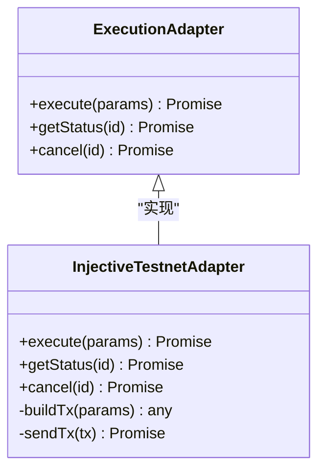

图表来源
- [web/server/adapters/execution.ts](file://web/server/adapters/execution.ts)
- [web/server/adapters/injectiveTestnet.ts](file://web/server/adapters/injectiveTestnet.ts)
- [web/server/adapters/createExecutionAdapter.ts](file://web/server/adapters/createExecutionAdapter.ts)

章节来源
- [web/server/adapters/execution.ts](file://web/server/adapters/execution.ts)
- [web/server/adapters/injectiveTestnet.ts](file://web/server/adapters/injectiveTestnet.ts)
- [web/server/adapters/createExecutionAdapter.ts](file://web/server/adapters/createExecutionAdapter.ts)

### 量化研究模块
- 市场数据：提供价格、成交量等数据的获取与缓存策略。
- 研究叙事：将研究过程与结论以结构化文本输出，便于审计与复盘。
- 回测引擎：基于历史数据进行策略验证，输出收益、回撤等指标。
- 类型定义：统一数据结构，确保前后端一致。

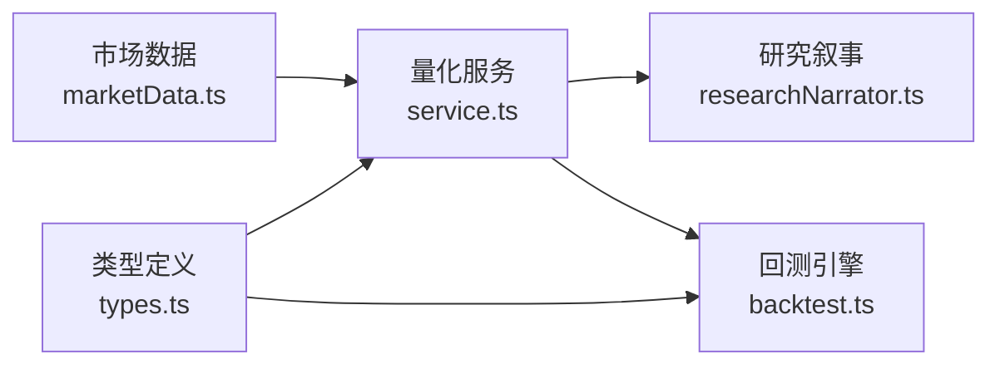

图表来源
- [web/server/quant/marketData.ts](file://web/server/quant/marketData.ts)
- [web/server/quant/service.ts](file://web/server/quant/service.ts)
- [web/server/quant/researchNarrator.ts](file://web/server/quant/researchNarrator.ts)
- [web/server/quant/backtest.ts](file://web/server/quant/backtest.ts)
- [web/server/quant/types.ts](file://web/server/quant/types.ts)

章节来源
- [web/server/quant/marketData.ts](file://web/server/quant/marketData.ts)
- [web/server/quant/service.ts](file://web/server/quant/service.ts)
- [web/server/quant/researchNarrator.ts](file://web/server/quant/researchNarrator.ts)
- [web/server/quant/backtest.ts](file://web/server/quant/backtest.ts)
- [web/server/quant/types.ts](file://web/server/quant/types.ts)

### Pact Ledger 集成
- 意图与策略：定义可执行的意图与策略规则。
- 策略引擎：对意图进行评估与决策，输出执行指令。
- 仓储层：持久化策略、意图与审计日志，保证可追溯性。

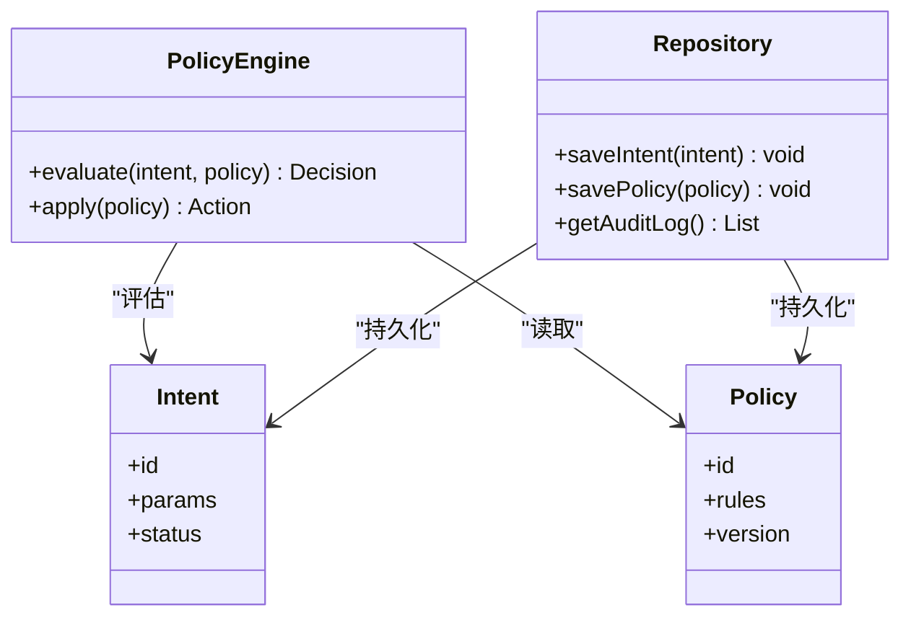

图表来源
- [web/server/pactledger/intents.ts](file://web/server/pactledger/intents.ts)
- [web/server/pactledger/policies.ts](file://web/server/pactledger/policies.ts)
- [web/server/pactledger/policyEngine.ts](file://web/server/pactledger/policyEngine.ts)
- [web/server/pactledger/repository.ts](file://web/server/pactledger/repository.ts)

章节来源
- [web/server/pactledger/intents.ts](file://web/server/pactledger/intents.ts)
- [web/server/pactledger/policies.ts](file://web/server/pactledger/policies.ts)
- [web/server/pactledger/policyEngine.ts](file://web/server/pactledger/policyEngine.ts)
- [web/server/pactledger/repository.ts](file://web/server/pactledger/repository.ts)

### 配置与环境管理
- 数据库配置：连接池、迁移脚本路径与重试策略。
- 注入网络配置：RPC、账户与签名参数。
- Panda 模型配置：模型路径、推理参数与缓存策略。
- 环境变量：集中加载与校验，避免运行时错误。

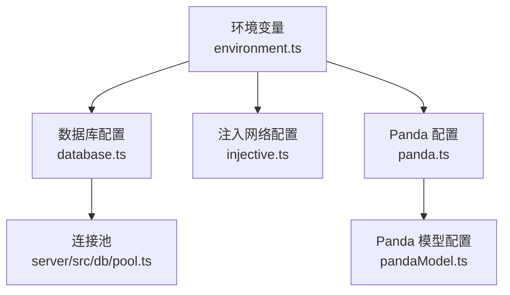

图表来源
- [web/server/config/environment.ts](file://web/server/config/environment.ts)
- [web/server/config/database.ts](file://web/server/config/database.ts)
- [web/server/config/injective.ts](file://web/server/config/injective.ts)
- [web/server/config/panda.ts](file://web/server/config/panda.ts)
- [web/server/config/pandaModel.ts](file://web/server/config/pandaModel.ts)
- [server/src/db/pool.ts](file://server/src/db/pool.ts)

章节来源
- [web/server/config/environment.ts](file://web/server/config/environment.ts)
- [web/server/config/database.ts](file://web/server/config/database.ts)
- [web/server/config/injective.ts](file://web/server/config/injective.ts)
- [web/server/config/panda.ts](file://web/server/config/panda.ts)
- [web/server/config/pandaModel.ts](file://web/server/config/pandaModel.ts)
- [server/src/db/pool.ts](file://server/src/db/pool.ts)

### 用户与认证
- 用户管理：用户信息、权限与角色。
- 认证客户端：登录、令牌刷新与会话管理。

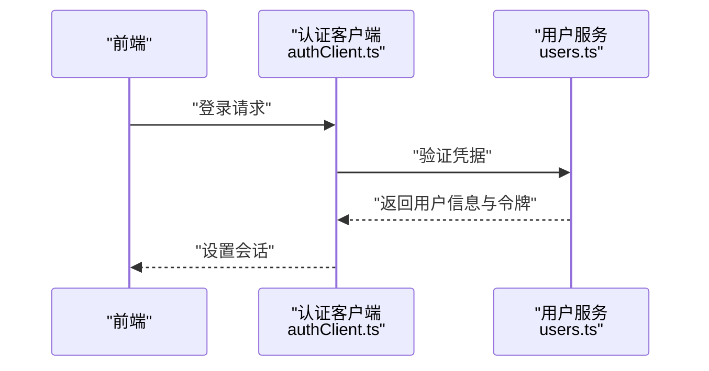

图表来源
- [web/src/services/authClient.ts](file://web/src/services/authClient.ts)
- [web/server/users.ts](file://web/server/users.ts)

章节来源
- [web/src/services/authClient.ts](file://web/src/services/authClient.ts)
- [web/server/users.ts](file://web/server/users.ts)

### 金库服务
- 资产视图：余额、持仓与净值。
- 操作与审计：转账、调仓与审计日志。
- 前后端协同：前端展示与后端持久化。

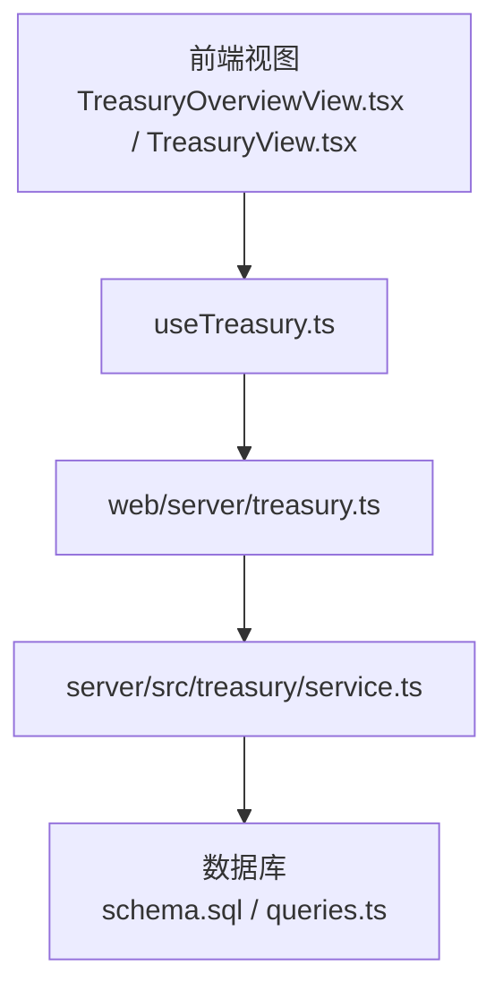

图表来源
- [web/src/views/TreasuryOverviewView.tsx](file://web/src/views/TreasuryOverviewView.tsx)
- [web/src/views/TreasuryView.tsx](file://web/src/views/TreasuryView.tsx)
- [web/src/services/useTreasury.ts](file://web/src/services/useTreasury.ts)
- [web/server/treasury.ts](file://web/server/treasury.ts)
- [server/src/treasury/service.ts](file://server/src/treasury/service.ts)
- [server/src/db/schema.sql](file://server/src/db/schema.sql)
- [server/src/db/queries.ts](file://server/src/db/queries.ts)

章节来源
- [web/src/views/TreasuryOverviewView.tsx](file://web/src/views/TreasuryOverviewView.tsx)
- [web/src/views/TreasuryView.tsx](file://web/src/views/TreasuryView.tsx)
- [web/src/services/useTreasury.ts](file://web/src/services/useTreasury.ts)
- [web/server/treasury.ts](file://web/server/treasury.ts)
- [server/src/treasury/service.ts](file://server/src/treasury/service.ts)
- [server/src/db/schema.sql](file://server/src/db/schema.sql)
- [server/src/db/queries.ts](file://server/src/db/queries.ts)

### A2A（Agent-to-Agent）通信
- 提供 Agent 间通信接口，支持任务委派与结果回传。
- 与路由层集成，暴露标准化 API。

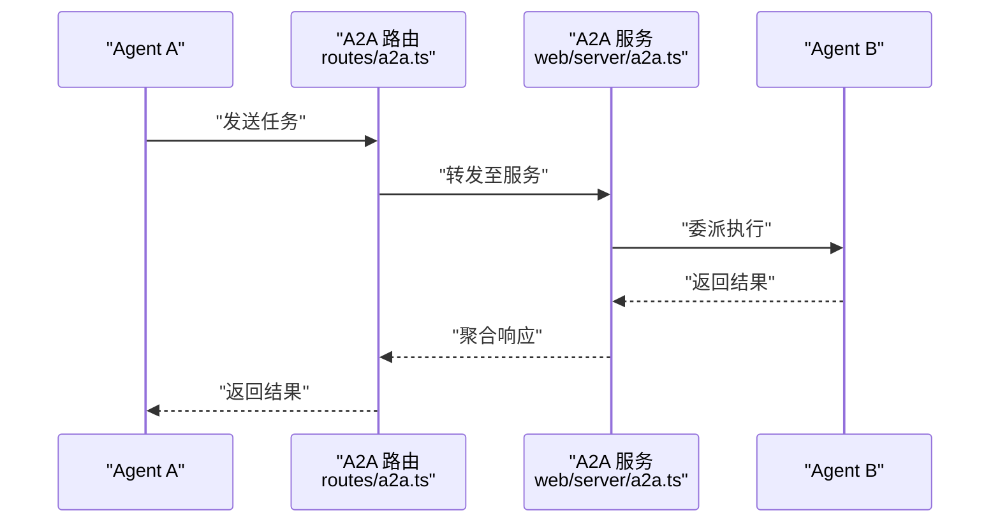

图表来源
- [server/src/routes/a2a.ts](file://server/src/routes/a2a.ts)
- [web/server/a2a.ts](file://web/server/a2a.ts)

章节来源
- [server/src/routes/a2a.ts](file://server/src/routes/a2a.ts)
- [web/server/a2a.ts](file://web/server/a2a.ts)

## 依赖关系分析
- 低耦合设计：通过适配器模式与仓储模式隔离外部依赖（网络、数据库、模型）。
- 明确边界：量化、策略、执行与持久化各自独立，便于替换与扩展。
- 可能的循环依赖风险：需关注编排器与各子系统的相互引用，建议使用事件解耦。

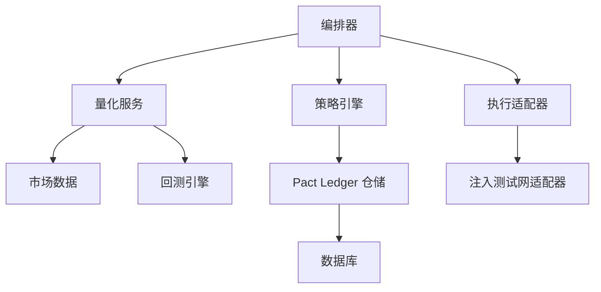

图表来源
- [web/server/orchestrator.ts](file://web/server/orchestrator.ts)
- [web/server/quant/service.ts](file://web/server/quant/service.ts)
- [web/server/quant/marketData.ts](file://web/server/quant/marketData.ts)
- [web/server/quant/backtest.ts](file://web/server/quant/backtest.ts)
- [web/server/pactledger/policyEngine.ts](file://web/server/pactledger/policyEngine.ts)
- [web/server/pactledger/repository.ts](file://web/server/pactledger/repository.ts)
- [web/server/adapters/execution.ts](file://web/server/adapters/execution.ts)
- [web/server/adapters/injectiveTestnet.ts](file://web/server/adapters/injectiveTestnet.ts)
- [server/src/db/pool.ts](file://server/src/db/pool.ts)

章节来源
- [web/server/orchestrator.ts](file://web/server/orchestrator.ts)
- [web/server/quant/service.ts](file://web/server/quant/service.ts)
- [web/server/quant/marketData.ts](file://web/server/quant/marketData.ts)
- [web/server/quant/backtest.ts](file://web/server/quant/backtest.ts)
- [web/server/pactledger/policyEngine.ts](file://web/server/pactledger/policyEngine.ts)
- [web/server/pactledger/repository.ts](file://web/server/pactledger/repository.ts)
- [web/server/adapters/execution.ts](file://web/server/adapters/execution.ts)
- [web/server/adapters/injectiveTestnet.ts](file://web/server/adapters/injectiveTestnet.ts)
- [server/src/db/pool.ts](file://server/src/db/pool.ts)

## 性能与可扩展性
- 连接池与并发：数据库连接池应合理设置最大连接数与超时，避免阻塞。
- 缓存策略：市场数据与研究结果可采用短期缓存，减少重复计算。
- 异步处理：任务编排与执行应使用异步队列，提升吞吐。
- 模块化扩展：新增执行环境或策略只需实现对应接口，无需改动核心流程。

[本节为通用指导，不直接分析具体文件]

## 故障排查指南
- 启动失败
  - 检查环境变量是否齐全，确认数据库与注入网络配置正确。
  - 查看服务日志定位端口占用或证书问题。
- 任务卡住
  - 检查事件流是否被消费，确认编排器状态机未陷入死锁。
  - 核对执行适配器返回值与错误码。
- 策略不生效
  - 审查策略规则与意图参数，确认策略引擎评估逻辑。
  - 查看 Pact Ledger 审计日志，定位策略版本与变更记录。
- 执行失败
  - 检查注入测试网 RPC 可达性与签名参数。
  - 确认交易构建与广播流程的异常分支。

章节来源
- [web/server/config/environment.ts](file://web/server/config/environment.ts)
- [web/server/config/database.ts](file://web/server/config/database.ts)
- [web/server/config/injective.ts](file://web/server/config/injective.ts)
- [web/server/orchestrator.ts](file://web/server/orchestrator.ts)
- [web/server/taskEvents.ts](file://web/server/taskEvents.ts)
- [web/server/pactledger/policyEngine.ts](file://web/server/pactledger/policyEngine.ts)
- [web/server/pactledger/repository.ts](file://web/server/pactledger/repository.ts)
- [web/server/adapters/injectiveTestnet.ts](file://web/server/adapters/injectiveTestnet.ts)

## 结论
KaleidoX 通过清晰的分层与模块化设计，实现了从研究到执行的闭环自动化。其适配器与仓储模式降低了外部依赖耦合，事件驱动的编排提升了系统的可观测性与可维护性。未来可在缓存、异步队列与策略版本管理方面进一步优化，以提升整体性能与稳定性。

[本节为总结性内容，不直接分析具体文件]

## 附录
- 前端入口与路由
  - 主应用与页面视图组织，服务层封装对外部 API 的调用。
- 后端路由与资源
  - 任务、配置、Agent 卡片与金库相关的路由实现。
- 数据库迁移与查询
  - 迁移脚本与常用查询封装，保障数据一致性。

章节来源
- [web/src/App.tsx](file://web/src/App.tsx)
- [web/src/main.tsx](file://web/src/main.tsx)
- [web/src/views/ExecutionView.tsx](file://web/src/views/ExecutionView.tsx)
- [web/src/services/useTaskWorkflow.ts](file://web/src/services/useTaskWorkflow.ts)
- [web/src/services/useInjectiveConfig.ts](file://web/src/services/useInjectiveConfig.ts)
- [web/src/services/usePandaConfig.ts](file://web/src/services/usePandaConfig.ts)
- [web/src/services/demoData.ts](file://web/src/services/demoData.ts)
- [web/src/services/injectiveClient.ts](file://web/src/services/injectiveClient.ts)
- [web/src/services/pactledgerClient.ts](file://web/src/services/pactledgerClient.ts)
- [web/src/services/taskClient.ts](file://web/src/services/taskClient.ts)
- [server/src/routes/agentCard.ts](file://server/src/routes/agentCard.ts)
- [server/src/routes/config.ts](file://server/src/routes/config.ts)
- [server/src/routes/tasks.ts](file://server/src/routes/tasks.ts)
- [server/src/treasury/routes.ts](file://server/src/treasury/routes.ts)
- [server/src/db/migrate.ts](file://server/src/db/migrate.ts)
- [server/src/db/queries.ts](file://server/src/db/queries.ts)
- [server/src/db/schema.sql](file://server/src/db/schema.sql)