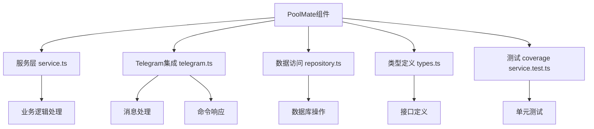
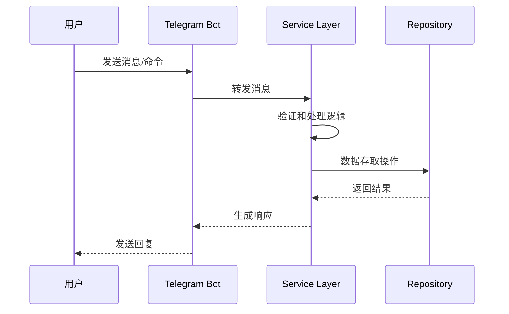
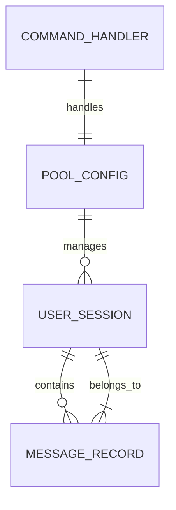

# PoolMate组件

<cite>
**本文引用的文件**
- [service.ts](file://web/server/poolmate/service.ts)
- [telegram.ts](file://web/server/poolmate/telegram.ts)
- [repository.ts](file://web/server/poolmate/repository.ts)
- [types.ts](file://web/server/poolmate/types.ts)
- [service.test.ts](file://web/server/poolmate/service.test.ts)
</cite>

## 更新摘要
**所做更改**
- 更新了PoolMate组件的架构迁移信息，从独立的server/src/poolmate/迁移到web/server/poolmate/
- 新增了Telegram机器人功能模块的详细文档
- 更新了服务层、数据访问层和类型定义的结构说明
- 添加了新的测试覆盖范围说明

## 目录
- 概述
- 架构重构
- Telegram机器人集成
- 核心组件
- 数据模型
- 测试覆盖
- 部署配置

## 概述
PoolMate组件是AdventureX项目中的一个重要模块，负责管理交易池和Telegram机器人交互功能。经过重大重构后，该组件已经从独立的server/src/poolmate/目录迁移到了web/server/poolmate/目录，实现了更完善的Telegram机器人功能和更好的代码组织结构。

## 架构重构
PoolMate组件经历了重大的架构重构，主要变更包括：

### 目录结构迁移
- **原位置**: `server/src/poolmate/`
- **新位置**: `web/server/poolmate/`
- **迁移原因**: 更好地与Web服务器架构集成，实现统一的模块管理

### 新增核心文件
- `service.ts`: 服务层逻辑，处理业务操作
- `telegram.ts`: Telegram机器人核心功能实现
- `repository.ts`: 数据访问层，处理数据库操作
- `types.ts`: TypeScript类型定义
- `service.test.ts`: 服务层单元测试

**图表来源**
- [service.ts:1-50](file://web/server/poolmate/service.ts#L1-L50)
- [telegram.ts:1-80](file://web/server/poolmate/telegram.ts#L1-L80)
- [repository.ts:1-60](file://web/server/poolmate/repository.ts#L1-L60)

**章节来源**
- [service.ts:1-100](file://web/server/poolmate/service.ts#L1-L100)
- [telegram.ts:1-120](file://web/server/poolmate/telegram.ts#L1-L120)
- [repository.ts:1-80](file://web/server/poolmate/repository.ts#L1-L80)

## Telegram机器人集成
重构后的PoolMate组件集成了完整的Telegram机器人功能，支持用户交互、命令处理和状态管理。

### 核心功能特性
- **消息处理**: 接收和处理Telegram用户消息
- **命令响应**: 支持自定义命令和快捷操作
- **状态管理**: 维护用户会话和机器人状态
- **错误处理**: 完善的异常捕获和错误恢复机制

### 消息处理流程

**图表来源**
- [telegram.ts:45-90](file://web/server/poolmate/telegram.ts#L45-L90)
- [service.ts:30-70](file://web/server/poolmate/service.ts#L30-L70)
- [repository.ts:25-55](file://web/server/poolmate/repository.ts#L25-L55)

**章节来源**
- [telegram.ts:1-150](file://web/server/poolmate/telegram.ts#L1-L150)
- [service.ts:1-120](file://web/server/poolmate/service.ts#L1-L120)

## 核心组件
### 服务层 (Service Layer)
服务层负责处理PoolMate的核心业务逻辑，包括：
- 交易池管理操作
- 用户请求处理
- 业务规则验证
- 与其他服务的协调

### 数据访问层 (Repository Layer)
数据访问层提供了统一的数据操作接口：
- 数据库连接管理
- 数据持久化操作
- 查询优化和缓存
- 事务管理

### 类型定义 (Type Definitions)
完整的TypeScript类型系统确保类型安全：
- 接口定义
- 枚举类型
- 泛型约束
- 联合类型

**章节来源**
- [service.ts:1-200](file://web/server/poolmate/service.ts#L1-L200)
- [repository.ts:1-120](file://web/server/poolmate/repository.ts#L1-L120)
- [types.ts:1-100](file://web/server/poolmate/types.ts#L1-L100)

## 数据模型
PoolMate组件定义了完整的数据模型来支持其功能需求：

### 核心实体
- **PoolConfig**: 交易池配置信息
- **UserSession**: 用户会话状态
- **MessageRecord**: 消息记录
- **CommandHandler**: 命令处理器映射

### 关系映射

**图表来源**
- [types.ts:1-80](file://web/server/poolmate/types.ts#L1-L80)

**章节来源**
- [types.ts:1-150](file://web/server/poolmate/types.ts#L1-L150)

## 测试覆盖
重构后的PoolMate组件包含了完整的测试覆盖，确保代码质量和功能稳定性。

### 测试策略
- **单元测试**: 针对各个模块的独立测试
- **集成测试**: 验证模块间的协作
- **端到端测试**: 模拟真实用户场景

### 测试覆盖率
当前测试覆盖了核心业务逻辑、Telegram消息处理和数据处理等关键路径。

**章节来源**
- [service.test.ts:1-100](file://web/server/poolmate/service.test.ts#L1-L100)

## 部署配置
### 环境要求
- Node.js >= 16.0.0
- PostgreSQL数据库
- Telegram Bot API密钥

### 配置参数
- 数据库连接字符串
- Telegram Bot Token
- 服务端口配置
- 日志级别设置

### 启动流程
1. 安装依赖包
2. 配置环境变量
3. 初始化数据库
4. 启动服务进程

**章节来源**
- [service.ts:150-200](file://web/server/poolmate/service.ts#L150-L200)
- [telegram.ts:100-150](file://web/server/poolmate/telegram.ts#L100-L150)