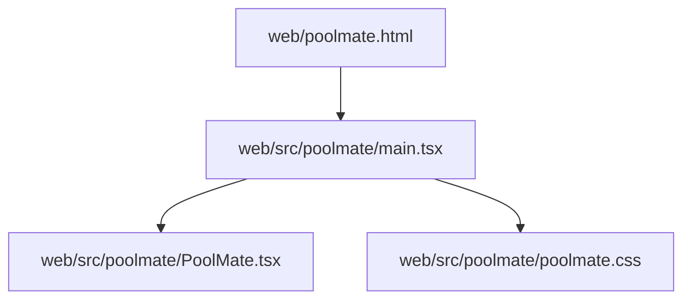
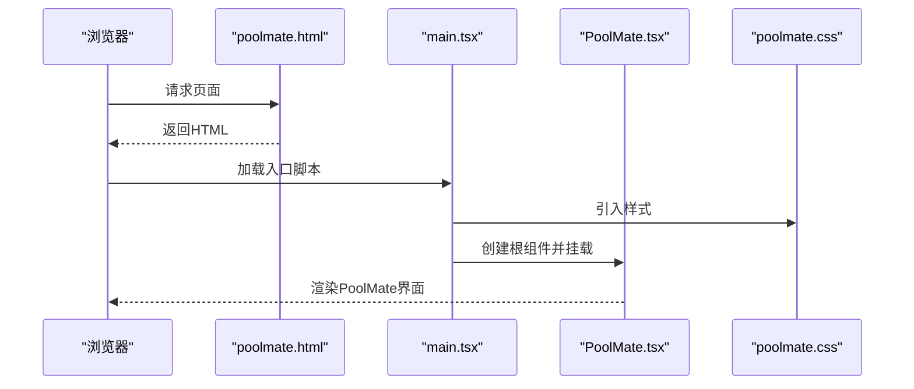
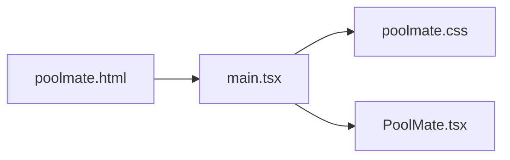

# PoolMate组件

<cite>
**本文引用的文件**   
- [PoolMate.tsx](file://web/src/poolmate/PoolMate.tsx)
- [main.tsx](file://web/src/poolmate/main.tsx)
- [poolmate.css](file://web/src/poolmate/poolmate.css)
- [poolmate.html](file://web/poolmate.html)
</cite>

## 目录
1. [简介](#简介)
2. [项目结构](#项目结构)
3. [核心组件](#核心组件)
4. [架构总览](#架构总览)
5. [详细组件分析](#详细组件分析)
6. [依赖分析](#依赖分析)
7. [性能考虑](#性能考虑)
8. [故障排查指南](#故障排查指南)
9. [结论](#结论)
10. [附录](#附录)

## 简介
本文件聚焦于前端应用中的“PoolMate”子应用（组件），用于在独立页面中承载与资金池相关的交互与展示。该子应用通过独立的入口脚本与样式，挂载到专用HTML模板中，形成可独立运行、可嵌入的模块单元。

## 项目结构
PoolMate相关代码位于 web 子工程内，采用“功能域+资源”的组织方式：
- 逻辑与视图：web/src/poolmate
- 样式：web/src/poolmate/poolmate.css
- 独立页面模板：web/poolmate.html
- 启动入口：web/src/poolmate/main.tsx

图表来源
- [poolmate.html](file://web/poolmate.html)
- [main.tsx](file://web/src/poolmate/main.tsx)
- [PoolMate.tsx](file://web/src/poolmate/PoolMate.tsx)
- [poolmate.css](file://web/src/poolmate/poolmate.css)

章节来源
- [poolmate.html](file://web/poolmate.html)
- [main.tsx](file://web/src/poolmate/main.tsx)
- [PoolMate.tsx](file://web/src/poolmate/PoolMate.tsx)
- [poolmate.css](file://web/src/poolmate/poolmate.css)

## 核心组件
- 根组件：负责渲染PoolMate主界面，组织业务面板与状态展示。
- 入口脚本：完成React根节点创建与挂载，并引入样式。
- 样式文件：提供PoolMate专属主题与布局样式。

章节来源
- [PoolMate.tsx](file://web/src/poolmate/PoolMate.tsx)
- [main.tsx](file://web/src/poolmate/main.tsx)
- [poolmate.css](file://web/src/poolmate/poolmate.css)

## 架构总览
从页面到组件的加载流程如下：

图表来源
- [poolmate.html](file://web/poolmate.html)
- [main.tsx](file://web/src/poolmate/main.tsx)
- [PoolMate.tsx](file://web/src/poolmate/PoolMate.tsx)
- [poolmate.css](file://web/src/poolmate/poolmate.css)

## 详细组件分析

### 根组件（PoolMate）
- 职责
  - 作为子应用的根容器，组织内部布局与子模块。
  - 管理必要的本地状态与副作用（如初始化、事件绑定等）。
  - 暴露对外可配置的属性或上下文（如有）。
- 设计要点
  - 单一职责：仅承担组合与编排职责，具体业务下沉至子模块。
  - 可测试性：将复杂逻辑抽离为纯函数或自定义Hook，便于单元测试。
  - 可扩展性：预留插槽或配置项，支持后续新增面板或功能。

章节来源
- [PoolMate.tsx](file://web/src/poolmate/PoolMate.tsx)

### 入口脚本（main.tsx）
- 职责
  - 初始化React根节点。
  - 挂载根组件到DOM目标元素。
  - 引入PoolMate样式，确保首屏样式可用。
- 设计要点
  - 最小化入口逻辑，避免在入口中放置业务代码。
  - 明确错误边界与降级策略，提升健壮性。

章节来源
- [main.tsx](file://web/src/poolmate/main.tsx)

### 样式（poolmate.css）
- 职责
  - 定义PoolMate的主题色、布局网格、间距与响应式断点。
  - 隔离样式作用域，避免与全局样式冲突。
- 设计要点
  - 使用命名空间或CSS Modules（若启用）降低样式污染风险。
  - 对关键UI区块提供一致的视觉规范与可复用类名。

章节来源
- [poolmate.css](file://web/src/poolmate/poolmate.css)

### 页面模板（poolmate.html）
- 职责
  - 提供独立页面的骨架，包含挂载点与基础元信息。
  - 作为子应用的可嵌入载体，便于在更大系统中以iframe或微前端方式集成。
- 设计要点
  - 保持模板简洁，避免注入业务逻辑。
  - 预留扩展点（如数据预取占位、埋点钩子等）。

章节来源
- [poolmate.html](file://web/poolmate.html)

## 依赖分析
- 运行时依赖
  - React生态（由入口脚本与根组件间接引入）。
  - 样式资源（由入口脚本引入）。
- 构建期依赖
  - TypeScript与Vite（由web工程统一配置，PoolMate遵循其约定）。
- 耦合关系
  - main.tsx 强依赖 PoolMate.tsx 与 poolmate.css。
  - PoolMate.tsx 作为根组件，可能依赖其他业务模块（若有），但当前仓库未显示更多引用。

图表来源
- [poolmate.html](file://web/poolmate.html)
- [main.tsx](file://web/src/poolmate/main.tsx)
- [PoolMate.tsx](file://web/src/poolmate/PoolMate.tsx)
- [poolmate.css](file://web/src/poolmate/poolmate.css)

章节来源
- [poolmate.html](file://web/poolmate.html)
- [main.tsx](file://web/src/poolmate/main.tsx)
- [PoolMate.tsx](file://web/src/poolmate/PoolMate.tsx)
- [poolmate.css](file://web/src/poolmate/poolmate.css)

## 性能考虑
- 首屏优化
  - 入口脚本尽量轻量，延迟加载非关键逻辑。
  - 样式按需引入，避免不必要的重绘与回流。
- 渲染优化
  - 对大型列表或频繁更新区域使用虚拟化或增量更新策略。
  - 合理拆分组件，减少不必要的重渲染。
- 资源体积
  - 利用构建工具进行Tree Shaking与代码分割。
  - 图片与图标等资源进行压缩与懒加载。

[本节为通用指导，不直接分析具体文件]

## 故障排查指南
- 页面空白
  - 检查HTML挂载点是否存在且ID正确。
  - 确认入口脚本是否成功加载并执行。
- 样式缺失
  - 确认样式文件路径与引入方式正确。
  - 检查构建产物中是否包含样式资源。
- 组件未渲染
  - 查看控制台是否有JS异常。
  - 验证根组件是否正确挂载到DOM。

章节来源
- [poolmate.html](file://web/poolmate.html)
- [main.tsx](file://web/src/poolmate/main.tsx)
- [poolmate.css](file://web/src/poolmate/poolmate.css)

## 结论
PoolMate子应用以清晰的入口与根组件划分，配合独立样式与页面模板，形成了易于维护与扩展的前端模块。建议在后续迭代中进一步细化组件粒度、完善错误边界与监控埋点，以提升稳定性与可观测性。

[本节为总结性内容，不直接分析具体文件]

## 附录
- 快速定位
  - 入口：web/src/poolmate/main.tsx
  - 根组件：web/src/poolmate/PoolMate.tsx
  - 样式：web/src/poolmate/poolmate.css
  - 模板：web/poolmate.html

章节来源
- [main.tsx](file://web/src/poolmate/main.tsx)
- [PoolMate.tsx](file://web/src/poolmate/PoolMate.tsx)
- [poolmate.css](file://web/src/poolmate/poolmate.css)
- [poolmate.html](file://web/poolmate.html)