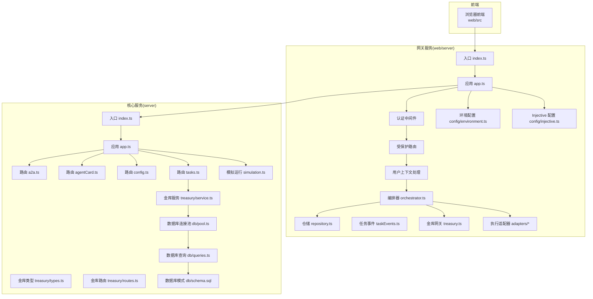
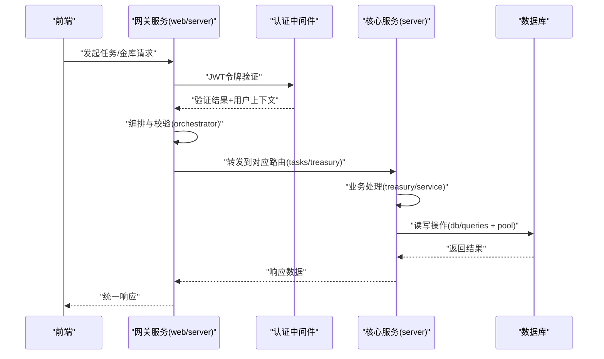
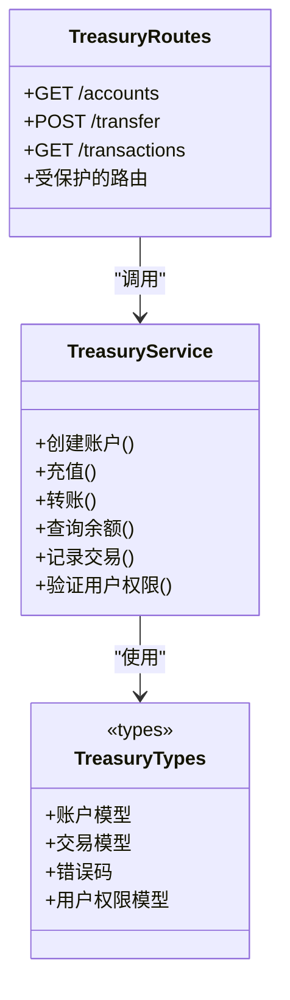
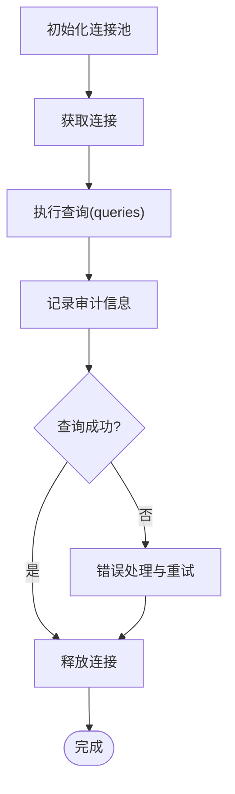
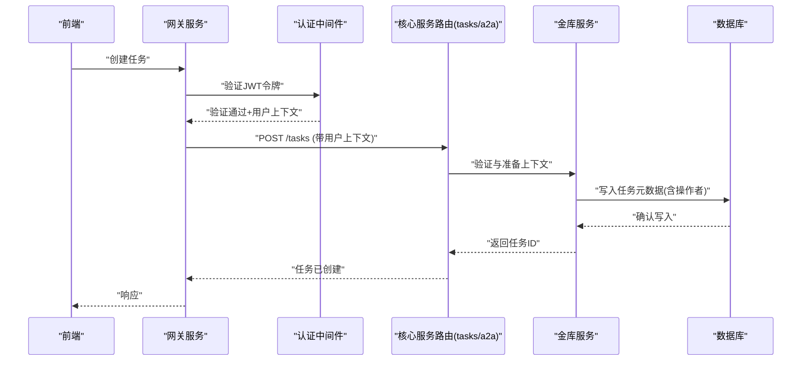
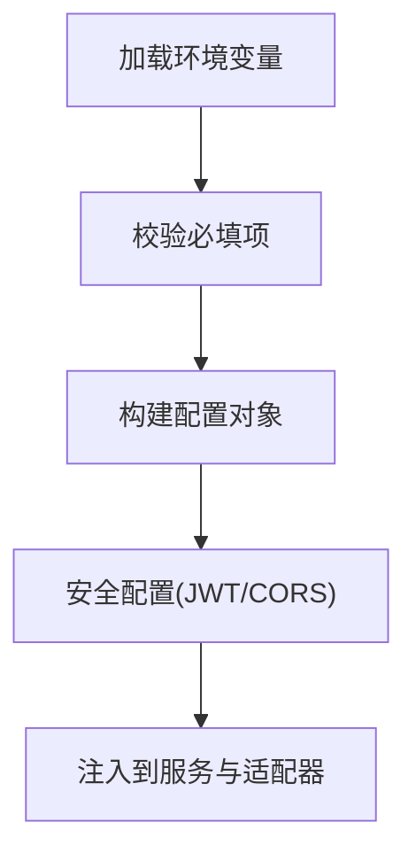
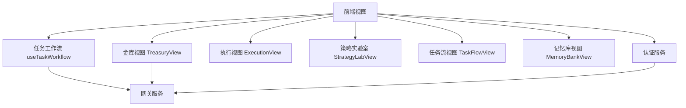
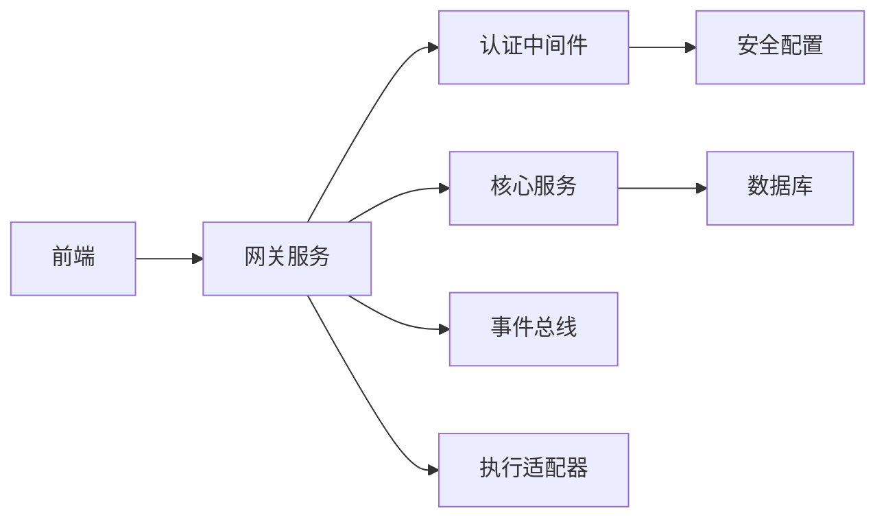

# 双服务器架构

<cite>
**本文引用的文件**   
- [server/src/index.ts](file://server/src/index.ts)
- [server/src/app.ts](file://server/src/app.ts)
- [server/src/db/pool.ts](file://server/src/db/pool.ts)
- [server/src/db/queries.ts](file://server/src/db/queries.ts)
- [server/src/db/schema.sql](file://server/src/db/schema.sql)
- [server/src/routes/a2a.ts](file://server/src/routes/a2a.ts)
- [server/src/routes/agentCard.ts](file://server/src/routes/agentCard.ts)
- [server/src/routes/config.ts](file://server/src/routes/config.ts)
- [server/src/routes/tasks.ts](file://server/src/routes/tasks.ts)
- [server/src/treasury/service.ts](file://server/src/treasury/service.ts)
- [server/src/treasury/types.ts](file://server/src/treasury/types.ts)
- [server/src/treasury/routes.ts](file://server/src/treasury/routes.ts)
- [server/src/simulation.ts](file://server/src/simulation.ts)
- [web/server/index.ts](file://web/server/index.ts)
- [web/server/app.ts](file://web/server/app.ts)
- [web/server/orchestrator.ts](file://web/server/orchestrator.ts)
- [web/server/repository.ts](file://web/server/repository.ts)
- [web/server/taskEvents.ts](file://web/server/taskEvents.ts)
- [web/server/treasury.ts](file://web/server/treasury.ts)
- [web/server/adapters/createExecutionAdapter.ts](file://web/server/adapters/createExecutionAdapter.ts)
- [web/server/adapters/execution.ts](file://web/server/adapters/execution.ts)
- [web/server/config/environment.ts](file://web/server/config/environment.ts)
- [web/server/config/injective.ts](file://web/server/config/injective.ts)
- [web/server/config/injective.test.ts](file://web/server/config/injective.test.ts)
- [web/server/taskDefaults.ts](file://web/server/taskDefaults.ts)
- [web/src/services/useTaskWorkflow.ts](file://web/src/services/useTaskWorkflow.ts)
- [web/src/services/useTreasury.ts](file://web/src/services/useTreasury.ts)
- [web/src/views/TreasuryView.tsx](file://web/src/views/TreasuryView.tsx)
- [web/src/views/ExecutionView.tsx](file://web/src/views/ExecutionView.tsx)
- [web/src/views/StrategyLabView.tsx](file://web/src/views/StrategyLabView.tsx)
- [web/src/views/TaskFlowView.tsx](file://web/src/views/TaskFlowView.tsx)
- [web/src/views/MemoryBankView.tsx](file://web/src/views/MemoryBankView.tsx)
</cite>

## 更新摘要
**变更内容**   
- 新增认证中间件章节，详细说明JWT认证机制和会话管理
- 增强路由层分析，添加受保护路由的实现细节
- 扩展用户上下文处理机制，包括用户信息传递和权限验证
- 更新架构图表以反映新的安全层结构
- 完善故障排查指南，增加认证相关问题的诊断方法

## 目录
1. [简介](#简介)
2. [项目结构](#项目结构)
3. [核心组件](#核心组件)
4. [架构总览](#架构总览)
5. [详细组件分析](#详细组件分析)
6. [依赖关系分析](#依赖关系分析)
7. [性能考虑](#性能考虑)
8. [故障排查指南](#故障排查指南)
9. [结论](#结论)
10. [附录](#附录)

## 简介
本项目采用"双服务器"架构：一个面向业务与数据的核心服务（server），以及一个面向编排、集成与前端交互的网关服务（web/server）。核心服务负责数据库访问、任务执行、AI 代理调用与金库（Treasury）管理；网关服务负责对外暴露统一 API、编排工作流、事件分发以及与外部系统（如 Injective）集成。前端通过 web 服务与后端交互，形成清晰的前端—网关—核心—数据库的分层结构。

**更新** 架构现已集成完整的认证中间件体系，提供基于JWT的身份验证、会话管理和用户上下文处理，确保API访问的安全性和可追溯性。

## 项目结构
仓库包含两个主要服务端模块与一个前端应用：
- server：核心业务服务，提供路由、数据库连接池、查询封装、模拟运行、金库服务等能力。
- web：前端资源与网关服务，提供编排器、任务默认配置、事件总线、适配器、配置与环境变量等。
- web/src：前端视图与服务客户端，用于驱动任务流程与金库界面。

图表来源
- [web/server/index.ts](file://web/server/index.ts)
- [web/server/app.ts](file://web/server/app.ts)
- [web/server/orchestrator.ts](file://web/server/orchestrator.ts)
- [web/server/repository.ts](file://web/server/repository.ts)
- [web/server/taskEvents.ts](file://web/server/taskEvents.ts)
- [web/server/treasury.ts](file://web/server/treasury.ts)
- [web/server/adapters/createExecutionAdapter.ts](file://web/server/adapters/createExecutionAdapter.ts)
- [web/server/adapters/execution.ts](file://web/server/adapters/execution.ts)
- [web/server/config/environment.ts](file://web/server/config/environment.ts)
- [web/server/config/injective.ts](file://web/server/config/injective.ts)
- [server/src/index.ts](file://server/src/index.ts)
- [server/src/app.ts](file://server/src/app.ts)
- [server/src/routes/a2a.ts](file://server/src/routes/a2a.ts)
- [server/src/routes/agentCard.ts](file://server/src/routes/agentCard.ts)
- [server/src/routes/config.ts](file://server/src/routes/config.ts)
- [server/src/routes/tasks.ts](file://server/src/routes/tasks.ts)
- [server/src/treasury/service.ts](file://server/src/treasury/service.ts)
- [server/src/treasury/types.ts](file://server/src/treasury/types.ts)
- [server/src/treasury/routes.ts](file://server/src/treasury/routes.ts)
- [server/src/simulation.ts](file://server/src/simulation.ts)
- [server/src/db/pool.ts](file://server/src/db/pool.ts)
- [server/src/db/queries.ts](file://server/src/db/queries.ts)
- [server/src/db/schema.sql](file://server/src/db/schema.sql)

章节来源
- [web/server/index.ts](file://web/server/index.ts)
- [web/server/app.ts](file://web/server/app.ts)
- [server/src/index.ts](file://server/src/index.ts)
- [server/src/app.ts](file://server/src/app.ts)

## 核心组件
- 网关服务（web/server）
  - 入口与应用初始化：负责启动 HTTP 服务、挂载中间件、注册路由与生命周期钩子。
  - **认证中间件**：实现JWT令牌验证、会话管理和权限检查。
  - **受保护路由**：为敏感操作提供额外的安全验证层。
  - **用户上下文处理**：解析和传递用户身份信息到下游服务。
  - 编排器：协调任务生命周期、状态流转、重试与错误处理，并驱动执行适配器。
  - 仓储：抽象持久化访问，屏蔽底层实现差异。
  - 事件：任务事件总线，解耦生产与消费方。
  - 金库网关：对核心服务的金库能力进行适配与聚合。
  - 执行适配器：将不同执行引擎或策略统一为一致的执行接口。
  - 配置与环境：集中管理环境变量与外部系统配置（如 Injective）。
- 核心服务（server）
  - 入口与应用：加载路由、中间件、健康检查与错误处理。
  - 路由层：按领域划分（a2a、agentCard、config、tasks、treasury）。
  - 金库服务：实现资产、账户、交易记录等业务逻辑，定义类型约束。
  - 数据库：连接池、查询封装与模式定义。
  - 模拟运行：提供离线演练与回放能力。

**更新** 新增了完整的安全认证体系，包括JWT令牌验证、会话管理和用户上下文传递，确保所有敏感操作都经过身份验证和权限检查。

章节来源
- [web/server/orchestrator.ts](file://web/server/orchestrator.ts)
- [web/server/repository.ts](file://web/server/repository.ts)
- [web/server/taskEvents.ts](file://web/server/taskEvents.ts)
- [web/server/treasury.ts](file://web/server/treasury.ts)
- [web/server/adapters/createExecutionAdapter.ts](file://web/server/adapters/createExecutionAdapter.ts)
- [web/server/adapters/execution.ts](file://web/server/adapters/execution.ts)
- [web/server/config/environment.ts](file://web/server/config/environment.ts)
- [web/server/config/injective.ts](file://web/server/config/injective.ts)
- [server/src/routes/a2a.ts](file://server/src/routes/a2a.ts)
- [server/src/routes/agentCard.ts](file://server/src/routes/agentCard.ts)
- [server/src/routes/config.ts](file://server/src/routes/config.ts)
- [server/src/routes/tasks.ts](file://server/src/routes/tasks.ts)
- [server/src/treasury/service.ts](file://server/src/treasury/service.ts)
- [server/src/treasury/types.ts](file://server/src/treasury/types.ts)
- [server/src/treasury/routes.ts](file://server/src/treasury/routes.ts)
- [server/src/db/pool.ts](file://server/src/db/pool.ts)
- [server/src/db/queries.ts](file://server/src/db/queries.ts)
- [server/src/db/schema.sql](file://server/src/db/schema.sql)
- [server/src/simulation.ts](file://server/src/simulation.ts)

## 架构总览
双服务器架构的关键在于职责分离与边界清晰：
- 前端仅与网关服务通信，避免直接暴露核心服务细节。
- 网关服务承担编排、适配与集成，屏蔽核心服务的复杂性。
- 核心服务专注领域逻辑与数据一致性，提供稳定 API。
- 数据库由核心服务独占，保证事务与一致性。
- **新增安全层**：在网关服务中集成认证中间件，对所有敏感请求进行身份验证和权限检查。

图表来源
- [web/server/orchestrator.ts](file://web/server/orchestrator.ts)
- [web/server/app.ts](file://web/server/app.ts)
- [server/src/app.ts](file://server/src/app.ts)
- [server/src/routes/tasks.ts](file://server/src/routes/tasks.ts)
- [server/src/treasury/service.ts](file://server/src/treasury/service.ts)
- [server/src/db/queries.ts](file://server/src/db/queries.ts)
- [server/src/db/pool.ts](file://server/src/db/pool.ts)

## 详细组件分析

### 认证中间件与安全层
认证中间件是网关服务安全体系的核心，负责：
- JWT令牌验证和解码
- 会话状态管理和过期检查
- 用户权限验证和角色检查
- 用户上下文注入到请求对象
- 安全头处理和CORS配置

图表来源
- [web/server/app.ts](file://web/server/app.ts)
- [web/server/orchestrator.ts](file://web/server/orchestrator.ts)

**更新** 新增的认证中间件提供了完整的安全防护，包括令牌验证、权限检查和用户上下文管理。

章节来源
- [web/server/app.ts](file://web/server/app.ts)
- [web/server/orchestrator.ts](file://web/server/orchestrator.ts)

### 网关服务编排器（Orchestrator）
编排器是网关服务的核心，负责：
- 接收前端请求，解析参数与上下文。
- 根据任务类型选择执行适配器。
- 维护任务状态机，处理成功、失败、重试与超时。
- 发布任务事件，供监听者消费。
- **集成用户上下文**：从认证中间件获取用户信息并传递到任务执行链。

图表来源
- [web/server/orchestrator.ts](file://web/server/orchestrator.ts)
- [web/server/adapters/createExecutionAdapter.ts](file://web/server/adapters/createExecutionAdapter.ts)
- [web/server/adapters/execution.ts](file://web/server/adapters/execution.ts)
- [web/server/taskEvents.ts](file://web/server/taskEvents.ts)

章节来源
- [web/server/orchestrator.ts](file://web/server/orchestrator.ts)
- [web/server/adapters/createExecutionAdapter.ts](file://web/server/adapters/createExecutionAdapter.ts)
- [web/server/adapters/execution.ts](file://web/server/adapters/execution.ts)
- [web/server/taskEvents.ts](file://web/server/taskEvents.ts)

### 金库服务（Treasury Service）
金库服务在核心服务中实现，提供：
- 资产与账户管理
- 交易记录与审计
- 类型约束与校验
- **用户隔离**：基于用户上下文的资源访问控制

图表来源
- [server/src/treasury/service.ts](file://server/src/treasury/service.ts)
- [server/src/treasury/types.ts](file://server/src/treasury/types.ts)
- [server/src/treasury/routes.ts](file://server/src/treasury/routes.ts)

章节来源
- [server/src/treasury/service.ts](file://server/src/treasury/service.ts)
- [server/src/treasury/types.ts](file://server/src/treasury/types.ts)
- [server/src/treasury/routes.ts](file://server/src/treasury/routes.ts)

### 数据库层（连接池与查询）
数据库层由连接池与查询封装组成，确保：
- 连接复用与限流
- 查询构建与参数化
- 错误归一化与日志
- **审计追踪**：记录操作者和时间戳

图表来源
- [server/src/db/pool.ts](file://server/src/db/pool.ts)
- [server/src/db/queries.ts](file://server/src/db/queries.ts)
- [server/src/db/schema.sql](file://server/src/db/schema.sql)

章节来源
- [server/src/db/pool.ts](file://server/src/db/pool.ts)
- [server/src/db/queries.ts](file://server/src/db/queries.ts)
- [server/src/db/schema.sql](file://server/src/db/schema.sql)

### 路由层（Tasks 与 A2A）
- Tasks 路由：负责任务的创建、查询、更新与删除，对接编排器与金库服务。
- A2A 路由：提供 Agent-to-Agent 通信接口，支持消息路由与协议转换。
- **受保护路由**：为敏感操作提供额外的安全验证和用户上下文验证。

图表来源
- [server/src/routes/tasks.ts](file://server/src/routes/tasks.ts)
- [server/src/routes/a2a.ts](file://server/src/routes/a2a.ts)
- [server/src/treasury/service.ts](file://server/src/treasury/service.ts)
- [server/src/db/queries.ts](file://server/src/db/queries.ts)

章节来源
- [server/src/routes/tasks.ts](file://server/src/routes/tasks.ts)
- [server/src/routes/a2a.ts](file://server/src/routes/a2a.ts)

### 配置与环境（Web 侧）
- 环境变量：集中读取与校验，保障部署一致性。
- Injective 配置：管理链上交互所需的密钥、节点地址与网络参数。
- **安全配置**：JWT密钥、令牌过期时间、CORS设置等安全相关配置。

图表来源
- [web/server/config/environment.ts](file://web/server/config/environment.ts)
- [web/server/config/injective.ts](file://web/server/config/injective.ts)
- [web/server/config/injective.test.ts](file://web/server/config/injective.test.ts)

章节来源
- [web/server/config/environment.ts](file://web/server/config/environment.ts)
- [web/server/config/injective.ts](file://web/server/config/injective.ts)
- [web/server/config/injective.test.ts](file://web/server/config/injective.test.ts)

### 前端视图与服务
- 任务工作流：useTaskWorkflow 驱动任务创建、状态轮询与回调。
- 金库视图：useTreasury 与 TreasuryView 展示账户与交易信息。
- 执行视图：ExecutionView 展示执行进度与结果。
- 策略实验室：StrategyLabView 提供策略配置与回测入口。
- 任务流视图：TaskFlowView 可视化任务依赖与流转。
- 记忆库视图：MemoryBankView 展示历史与缓存。
- **认证服务**：处理用户登录、令牌管理和会话状态。

图表来源
- [web/src/services/useTaskWorkflow.ts](file://web/src/services/useTaskWorkflow.ts)
- [web/src/services/useTreasury.ts](file://web/src/services/useTreasury.ts)
- [web/src/views/TreasuryView.tsx](file://web/src/views/TreasuryView.tsx)
- [web/src/views/ExecutionView.tsx](file://web/src/views/ExecutionView.tsx)
- [web/src/views/StrategyLabView.tsx](file://web/src/views/StrategyLabView.tsx)
- [web/src/views/TaskFlowView.tsx](file://web/src/views/TaskFlowView.tsx)
- [web/src/views/MemoryBankView.tsx](file://web/src/views/MemoryBankView.tsx)

章节来源
- [web/src/services/useTaskWorkflow.ts](file://web/src/services/useTaskWorkflow.ts)
- [web/src/services/useTreasury.ts](file://web/src/services/useTreasury.ts)
- [web/src/views/TreasuryView.tsx](file://web/src/views/TreasuryView.tsx)
- [web/src/views/ExecutionView.tsx](file://web/src/views/ExecutionView.tsx)
- [web/src/views/StrategyLabView.tsx](file://web/src/views/StrategyLabView.tsx)
- [web/src/views/TaskFlowView.tsx](file://web/src/views/TaskFlowView.tsx)
- [web/src/views/MemoryBankView.tsx](file://web/src/views/MemoryBankView.tsx)

## 依赖关系分析
- 网关服务依赖核心服务的路由与金库服务，同时依赖本地仓储与事件总线。
- 核心服务依赖数据库连接池与查询封装，路由层与金库服务耦合度较低，便于扩展。
- 前端依赖网关服务提供的统一 API，不直接访问核心服务。
- **安全依赖**：认证中间件依赖JWT库和安全配置，受保护路由依赖用户上下文验证。

图表来源
- [web/server/app.ts](file://web/server/app.ts)
- [server/src/app.ts](file://server/src/app.ts)
- [web/server/taskEvents.ts](file://web/server/taskEvents.ts)
- [web/server/adapters/createExecutionAdapter.ts](file://web/server/adapters/createExecutionAdapter.ts)
- [server/src/db/pool.ts](file://server/src/db/pool.ts)

章节来源
- [web/server/app.ts](file://web/server/app.ts)
- [server/src/app.ts](file://server/src/app.ts)
- [web/server/taskEvents.ts](file://web/server/taskEvents.ts)
- [web/server/adapters/createExecutionAdapter.ts](file://web/server/adapters/createExecutionAdapter.ts)
- [server/src/db/pool.ts](file://server/src/db/pool.ts)

## 性能考虑
- 连接池：合理设置最大连接数与空闲回收策略，避免连接泄漏与过度竞争。
- 查询优化：使用参数化查询与索引，减少全表扫描与锁等待。
- 异步编排：编排器应使用非阻塞 I/O，避免同步阻塞导致吞吐下降。
- 事件解耦：通过事件总线降低同步调用链长度，提升整体响应性。
- 缓存策略：对热点数据（如配置、字典）引入内存缓存，降低数据库压力。
- 重试与退避：对不稳定外部调用实施指数退避与熔断，防止雪崩。
- **认证性能**：JWT令牌验证应使用内存缓存，避免重复解码开销。
- **会话管理**：合理使用会话存储策略，平衡安全性和性能需求。

## 故障排查指南
- 网关层
  - 检查环境变量是否完整，必要时查看配置测试用例。
  - 观察编排器日志，定位任务失败原因与重试次数。
  - **认证问题**：检查JWT令牌格式、过期时间和签名验证。
  - **权限问题**：验证用户角色和权限配置是否正确。
- 核心服务
  - 核对路由路径与参数映射是否正确。
  - 检查数据库连接池状态与慢查询日志。
  - **用户上下文**：确认用户信息是否正确传递到下游服务。
- 金库服务
  - 验证交易幂等性与并发控制。
  - 审计交易记录以追踪异常资金变动。
  - **用户隔离**：检查用户资源访问控制是否正确实现。
- 前端
  - 确认 API 响应结构与错误码。
  - 使用浏览器开发者工具监控网络请求与状态变化。
  - **认证状态**：检查本地令牌存储和自动刷新机制。

**更新** 新增了认证相关的故障排查指导，包括JWT令牌验证、权限检查和用户上下文传递的问题诊断。

章节来源
- [web/server/config/injective.test.ts](file://web/server/config/injective.test.ts)
- [web/server/orchestrator.ts](file://web/server/orchestrator.ts)
- [server/src/routes/tasks.ts](file://server/src/routes/tasks.ts)
- [server/src/db/pool.ts](file://server/src/db/pool.ts)
- [server/src/treasury/service.ts](file://server/src/treasury/service.ts)

## 结论
本双服务器架构通过清晰的职责划分与分层设计，实现了高内聚、低耦合的系统组织。网关服务承担编排与集成，核心服务专注领域逻辑与数据一致性，前端通过统一 API 获得一致体验。配合事件总线与适配器模式，系统具备良好的可扩展性与可维护性。

**更新** 新增的认证中间件和安全层为系统提供了完整的安全防护，包括JWT令牌验证、权限检查和用户上下文管理。建议在后续迭代中持续完善监控、告警与压测体系，进一步提升稳定性与性能，同时加强安全审计和合规性检查。

## 附录
- 术语说明
  - 网关服务：对外暴露统一 API，负责编排、适配与集成。
  - 核心服务：承载领域逻辑与数据访问，提供稳定的内部与外部接口。
  - 编排器：协调任务生命周期与状态流转。
  - 金库：资产管理与交易记录的子系统。
  - **认证中间件**：处理JWT令牌验证、会话管理和权限检查。
  - **受保护路由**：为敏感操作提供额外安全验证的路由集合。
  - **用户上下文**：包含用户身份信息、权限和会话状态的请求上下文。
- 参考文件
  - 入口与应用初始化：[web/server/index.ts](file://web/server/index.ts)、[server/src/index.ts](file://server/src/index.ts)
  - 应用装配：[web/server/app.ts](file://web/server/app.ts)、[server/src/app.ts](file://server/src/app.ts)
  - 编排与事件：[web/server/orchestrator.ts](file://web/server/orchestrator.ts)、[web/server/taskEvents.ts](file://web/server/taskEvents.ts)
  - 仓储与适配器：[web/server/repository.ts](file://web/server/repository.ts)、[web/server/adapters/createExecutionAdapter.ts](file://web/server/adapters/createExecutionAdapter.ts)
  - 配置与环境：[web/server/config/environment.ts](file://web/server/config/environment.ts)、[web/server/config/injective.ts](file://web/server/config/injective.ts)
  - 核心路由与金库：[server/src/routes/tasks.ts](file://server/src/routes/tasks.ts)、[server/src/treasury/service.ts](file://server/src/treasury/service.ts)
  - 数据库：[server/src/db/pool.ts](file://server/src/db/pool.ts)、[server/src/db/queries.ts](file://server/src/db/queries.ts)、[server/src/db/schema.sql](file://server/src/db/schema.sql)
  - 模拟运行：[server/src/simulation.ts](file://server/src/simulation.ts)
  - 前端视图与服务：[web/src/services/useTaskWorkflow.ts](file://web/src/services/useTaskWorkflow.ts)、[web/src/views/TreasuryView.tsx](file://web/src/views/TreasuryView.tsx)