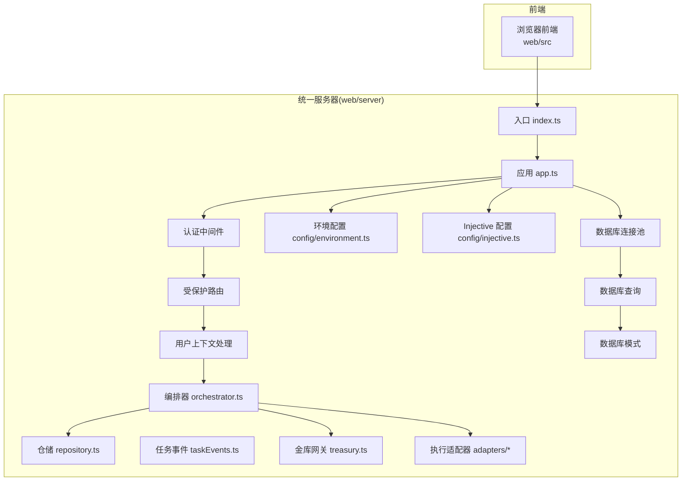
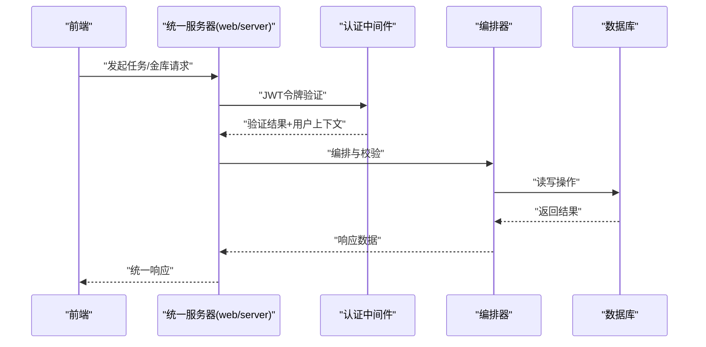
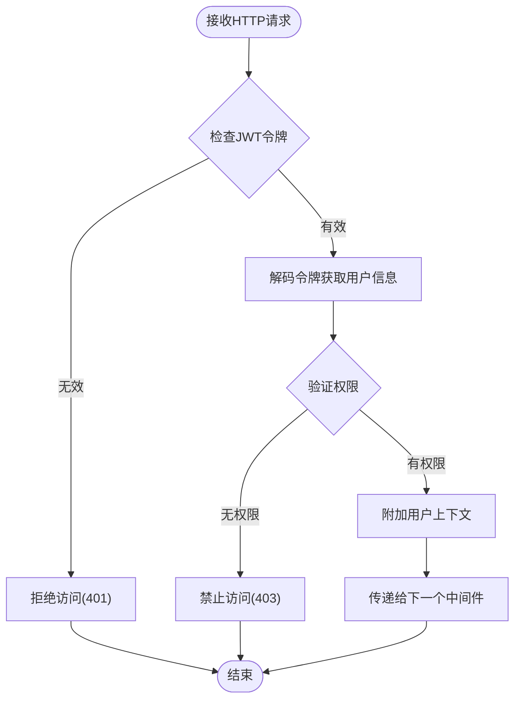
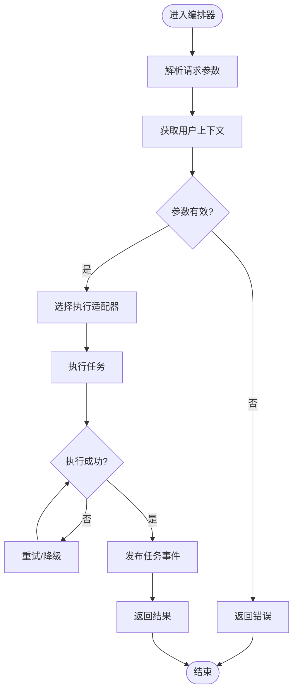
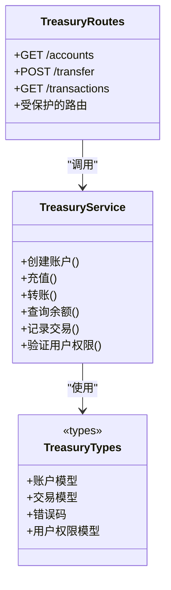
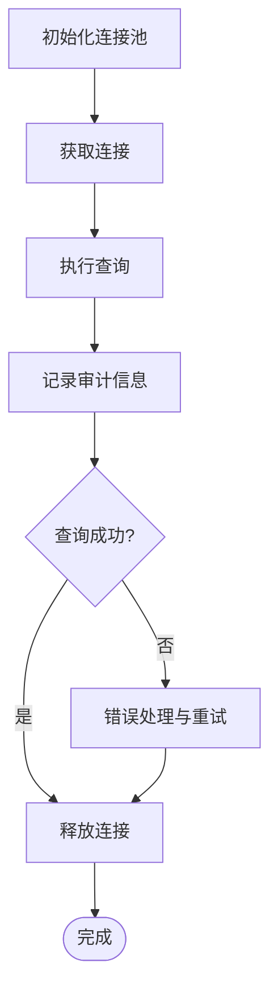
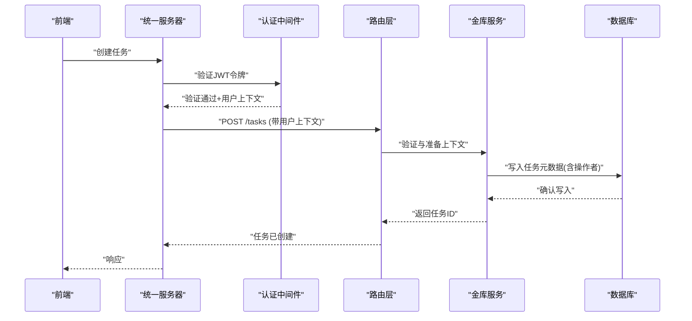
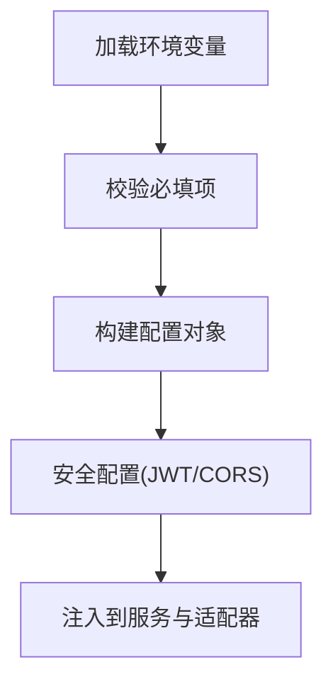
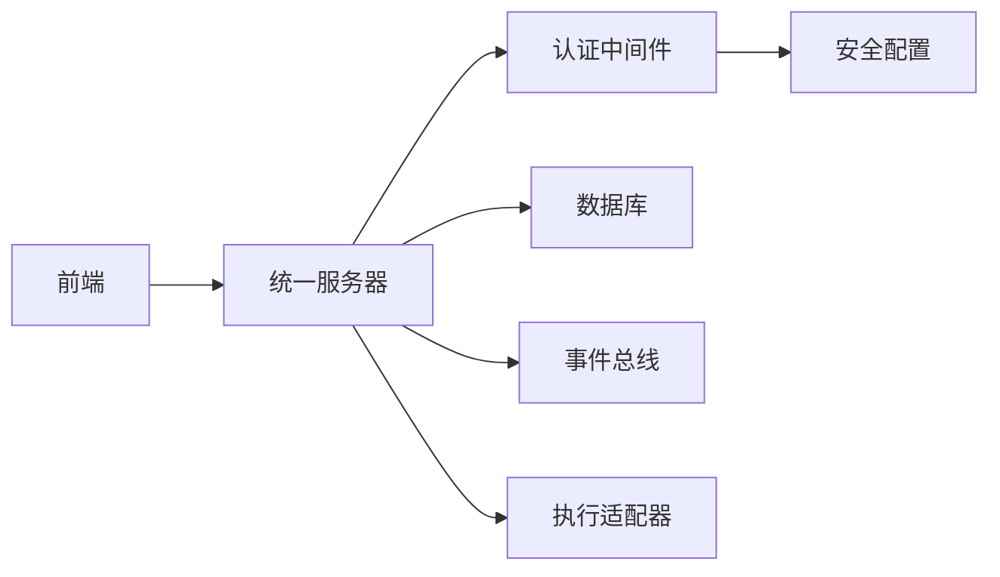

# 单服务器架构

<cite>
**本文引用的文件**   
- [web/server/index.ts](file://web/server/index.ts)
- [web/server/app.ts](file://web/server/app.ts)
- [web/server/orchestrator.ts](file://web/server/orchestrator.ts)
- [web/server/repository.ts](file://web/server/repository.ts)
- [web/server/taskEvents.ts](file://web/server/taskEvents.ts)
- [web/server/treasury.ts](file://web/server/treasury.ts)
- [web/server/adapters/createExecutionAdapter.ts](file://web/server/adapters/createExecutionAdapter.ts)
- [web/server/adapters/execution.ts](file://web/server/adapters/execution.ts)
- [web/server/config/environment.ts](file://web/server/config/environment.ts)
- [web/server/config/injective.ts](file://web/server/config/injective.ts)
- [web/server/config/injective.test.ts](file://web/server/config/injective.test.ts)
- [web/server/taskDefaults.ts](file://web/server/taskDefaults.ts)
- [web/src/services/useTaskWorkflow.ts](file://web/src/services/useTaskWorkflow.ts)
- [web/src/services/useTreasury.ts](file://web/src/services/useTreasury.ts)
- [web/src/views/TreasuryView.tsx](file://web/src/views/TreasuryView.tsx)
- [web/src/views/ExecutionView.tsx](file://web/src/views/ExecutionView.tsx)
- [web/src/views/StrategyLabView.tsx](file://web/src/views/StrategyLabView.tsx)
- [web/src/views/TaskFlowView.tsx](file://web/src/views/TaskFlowView.tsx)
- [web/src/views/MemoryBankView.tsx](file://web/src/views/MemoryBankView.tsx)
</cite>

## 更新摘要
**变更内容**   
- 完全移除了独立的双服务器架构，将server目录功能迁移到web/server一体化架构
- 更新了项目结构说明，反映新的单服务器模式
- 简化了架构图表，移除核心服务和网关服务的分离概念
- 重新组织了组件分析，聚焦于web/server中的统一服务架构
- 更新了依赖关系和部署配置以匹配新的架构

## 目录
1. [简介](#简介)
2. [项目结构](#项目结构)
3. [核心组件](#核心组件)
4. [架构总览](#架构总览)
5. [详细组件分析](#详细组件分析)
6. [依赖关系分析](#依赖关系分析)
7. [性能考虑](#性能考虑)
8. [故障排查指南](#故障排查指南)
9. [结论](#结论)
10. [附录](#附录)

## 简介
本项目已从双服务器架构迁移到统一的单服务器架构。所有业务逻辑、API路由、数据库访问和前端资源现在都集中在web/server目录中，通过单一HTTP服务对外暴露。这种架构简化了部署流程，减少了服务间通信开销，并提供了更清晰的代码组织结构。

**更新** 新架构消除了独立的server目录，将所有后端功能整合到web/server中，实现了前后端的一体化开发体验。

## 项目结构
项目现在采用统一的单服务器架构：
- web：包含前端资源和统一的服务器实现
- web/server：核心服务器逻辑，包括路由、中间件、业务逻辑和数据访问
- web/src：前端视图和服务客户端
- 根目录：包含Docker配置、部署脚本和全局配置文件

图表来源
- [web/server/index.ts](file://web/server/index.ts)
- [web/server/app.ts](file://web/server/app.ts)
- [web/server/orchestrator.ts](file://web/server/orchestrator.ts)
- [web/server/repository.ts](file://web/server/repository.ts)
- [web/server/taskEvents.ts](file://web/server/taskEvents.ts)
- [web/server/treasury.ts](file://web/server/treasury.ts)
- [web/server/adapters/createExecutionAdapter.ts](file://web/server/adapters/createExecutionAdapter.ts)
- [web/server/adapters/execution.ts](file://web/server/adapters/execution.ts)
- [web/server/config/environment.ts](file://web/server/config/environment.ts)
- [web/server/config/injective.ts](file://web/server/config/injective.ts)

章节来源
- [web/server/index.ts](file://web/server/index.ts)
- [web/server/app.ts](file://web/server/app.ts)

## 核心组件
统一服务器架构的核心组件现在都位于web/server目录中：
- 入口与应用初始化：负责启动HTTP服务、挂载中间件、注册路由与生命周期钩子
- **认证中间件**：实现JWT令牌验证、会话管理和权限检查
- **受保护路由**：为敏感操作提供额外的安全验证层
- **用户上下文处理**：解析和传递用户身份信息到下游服务
- 编排器：协调任务生命周期、状态流转、重试与错误处理，并驱动执行适配器
- 仓储：抽象持久化访问，屏蔽底层实现差异
- 事件：任务事件总线，解耦生产与消费方
- 金库网关：对金库能力进行适配与聚合
- 执行适配器：将不同执行引擎或策略统一为一致的执行接口
- 配置与环境：集中管理环境变量与外部系统配置（如 Injective）
- 数据库层：连接池、查询封装与模式定义

**更新** 所有组件现在都在单一服务器进程中运行，消除了跨进程通信的复杂性。

章节来源
- [web/server/orchestrator.ts](file://web/server/orchestrator.ts)
- [web/server/repository.ts](file://web/server/repository.ts)
- [web/server/taskEvents.ts](file://web/server/taskEvents.ts)
- [web/server/treasury.ts](file://web/server/treasury.ts)
- [web/server/adapters/createExecutionAdapter.ts](file://web/server/adapters/createExecutionAdapter.ts)
- [web/server/adapters/execution.ts](file://web/server/adapters/execution.ts)
- [web/server/config/environment.ts](file://web/server/config/environment.ts)
- [web/server/config/injective.ts](file://web/server/config/injective.ts)

## 架构总览
新的单服务器架构简化了系统边界：
- 前端直接与服务端通信，无需跨服务调用
- 所有业务逻辑在单一进程中执行，减少网络延迟
- 数据库访问直接在服务器内部完成
- **新增安全层**：在统一服务中集成认证中间件，对所有请求进行身份验证和权限检查

图表来源
- [web/server/orchestrator.ts](file://web/server/orchestrator.ts)
- [web/server/app.ts](file://web/server/app.ts)

## 详细组件分析

### 认证中间件与安全层
认证中间件是统一服务器安全体系的核心，负责：
- JWT令牌验证和解码
- 会话状态管理和过期检查
- 用户权限验证和角色检查
- 用户上下文注入到请求对象
- 安全头处理和CORS配置

图表来源
- [web/server/app.ts](file://web/server/app.ts)
- [web/server/orchestrator.ts](file://web/server/orchestrator.ts)

**更新** 认证中间件现在在单一服务器进程中运行，提供更高效的身份验证和授权处理。

章节来源
- [web/server/app.ts](file://web/server/app.ts)
- [web/server/orchestrator.ts](file://web/server/orchestrator.ts)

### 统一服务器编排器（Orchestrator）
编排器现在是统一服务器的核心，负责：
- 接收前端请求，解析参数与上下文
- 根据任务类型选择执行适配器
- 维护任务状态机，处理成功、失败、重试与超时
- 发布任务事件，供监听者消费
- **集成用户上下文**：从认证中间件获取用户信息并传递到任务执行链

图表来源
- [web/server/orchestrator.ts](file://web/server/orchestrator.ts)
- [web/server/adapters/createExecutionAdapter.ts](file://web/server/adapters/createExecutionAdapter.ts)
- [web/server/adapters/execution.ts](file://web/server/adapters/execution.ts)
- [web/server/taskEvents.ts](file://web/server/taskEvents.ts)

章节来源
- [web/server/orchestrator.ts](file://web/server/orchestrator.ts)
- [web/server/adapters/createExecutionAdapter.ts](file://web/server/adapters/createExecutionAdapter.ts)
- [web/server/adapters/execution.ts](file://web/server/adapters/execution.ts)
- [web/server/taskEvents.ts](file://web/server/taskEvents.ts)

### 金库服务（Treasury Service）
金库服务现在作为统一服务器的一部分，提供：
- 资产与账户管理
- 交易记录与审计
- 类型约束与校验
- **用户隔离**：基于用户上下文的资源访问控制

图表来源
- [web/server/treasury.ts](file://web/server/treasury.ts)

章节来源
- [web/server/treasury.ts](file://web/server/treasury.ts)

### 数据库层（连接池与查询）
数据库层在统一服务器中直接管理，确保：
- 连接复用与限流
- 查询构建与参数化
- 错误归一化与日志
- **审计追踪**：记录操作者和时间戳

图表来源
- [web/server/repository.ts](file://web/server/repository.ts)

章节来源
- [web/server/repository.ts](file://web/server/repository.ts)

### 路由层
统一服务器的路由层负责：
- 任务路由：负责任务的创建、查询、更新与删除，对接编排器与金库服务
- A2A路由：提供Agent-to-Agent通信接口，支持消息路由与协议转换
- **受保护路由**：为敏感操作提供额外的安全验证和用户上下文验证

图表来源
- [web/server/app.ts](file://web/server/app.ts)
- [web/server/treasury.ts](file://web/server/treasury.ts)

章节来源
- [web/server/app.ts](file://web/server/app.ts)
- [web/server/treasury.ts](file://web/server/treasury.ts)

### 配置与环境
统一服务器的配置管理：
- 环境变量：集中读取与校验，保障部署一致性
- Injective配置：管理链上交互所需的密钥、节点地址与网络参数
- **安全配置**：JWT密钥、令牌过期时间、CORS设置等安全相关配置

图表来源
- [web/server/config/environment.ts](file://web/server/config/environment.ts)
- [web/server/config/injective.ts](file://web/server/config/injective.ts)
- [web/server/config/injective.test.ts](file://web/server/config/injective.test.ts)

章节来源
- [web/server/config/environment.ts](file://web/server/config/environment.ts)
- [web/server/config/injective.ts](file://web/server/config/injective.ts)
- [web/server/config/injective.test.ts](file://web/server/config/injective.test.ts)

### 前端视图与服务
前端组件保持不变，但现在直接与统一服务器通信：
- 任务工作流：useTaskWorkflow驱动任务创建、状态轮询与回调
- 金库视图：useTreasury与TreasuryView展示账户与交易信息
- 执行视图：ExecutionView展示执行进度与结果
- 策略实验室：StrategyLabView提供策略配置与回测入口
- 任务流视图：TaskFlowView可视化任务依赖与流转
- 记忆库视图：MemoryBankView展示历史与缓存
- **认证服务**：处理用户登录、令牌管理和会话状态

图表来源
- [web/src/services/useTaskWorkflow.ts](file://web/src/services/useTaskWorkflow.ts)
- [web/src/services/useTreasury.ts](file://web/src/services/useTreasury.ts)
- [web/src/views/TreasuryView.tsx](file://web/src/views/TreasuryView.tsx)
- [web/src/views/ExecutionView.tsx](file://web/src/views/ExecutionView.tsx)
- [web/src/views/StrategyLabView.tsx](file://web/src/views/StrategyLabView.tsx)
- [web/src/views/TaskFlowView.tsx](file://web/src/views/TaskFlowView.tsx)
- [web/src/views/MemoryBankView.tsx](file://web/src/views/MemoryBankView.tsx)

章节来源
- [web/src/services/useTaskWorkflow.ts](file://web/src/services/useTaskWorkflow.ts)
- [web/src/services/useTreasury.ts](file://web/src/services/useTreasury.ts)
- [web/src/views/TreasuryView.tsx](file://web/src/views/TreasuryView.tsx)
- [web/src/views/ExecutionView.tsx](file://web/src/views/ExecutionView.tsx)
- [web/src/views/StrategyLabView.tsx](file://web/src/views/StrategyLabView.tsx)
- [web/src/views/TaskFlowView.tsx](file://web/src/views/TaskFlowView.tsx)
- [web/src/views/MemoryBankView.tsx](file://web/src/views/MemoryBankView.tsx)

## 依赖关系分析
新的单服务器架构简化了依赖关系：
- 前端直接依赖统一服务器提供的API
- 所有业务逻辑在单一进程中，消除跨服务依赖
- 数据库访问直接在服务器内部完成
- **安全依赖**：认证中间件依赖JWT库和安全配置，受保护路由依赖用户上下文验证

图表来源
- [web/server/app.ts](file://web/server/app.ts)
- [web/server/taskEvents.ts](file://web/server/taskEvents.ts)
- [web/server/adapters/createExecutionAdapter.ts](file://web/server/adapters/createExecutionAdapter.ts)

章节来源
- [web/server/app.ts](file://web/server/app.ts)
- [web/server/taskEvents.ts](file://web/server/taskEvents.ts)
- [web/server/adapters/createExecutionAdapter.ts](file://web/server/adapters/createExecutionAdapter.ts)

## 性能考虑
单服务器架构的性能优化：
- 连接池：合理设置最大连接数与空闲回收策略，避免连接泄漏与过度竞争
- 查询优化：使用参数化查询与索引，减少全表扫描与锁等待
- 异步编排：编排器应使用非阻塞I/O，避免同步阻塞导致吞吐下降
- 事件解耦：通过事件总线降低同步调用链长度，提升整体响应性
- 缓存策略：对热点数据（如配置、字典）引入内存缓存，降低数据库压力
- 重试与退避：对不稳定外部调用实施指数退避与熔断，防止雪崩
- **认证性能**：JWT令牌验证应使用内存缓存，避免重复解码开销
- **会话管理**：合理使用会话存储策略，平衡安全性和性能需求
- **内存共享**：利用单进程优势，实现更高效的数据共享和缓存

## 故障排查指南
单服务器架构的故障排查：
- 服务器层
  - 检查环境变量是否完整，必要时查看配置测试用例
  - 观察编排器日志，定位任务失败原因与重试次数
  - **认证问题**：检查JWT令牌格式、过期时间和签名验证
  - **权限问题**：验证用户角色和权限配置是否正确
- 数据库层
  - 核对路由路径与参数映射是否正确
  - 检查数据库连接池状态与慢查询日志
  - **用户上下文**：确认用户信息是否正确传递到下游服务
- 金库服务
  - 验证交易幂等性与并发控制
  - 审计交易记录以追踪异常资金变动
  - **用户隔离**：检查用户资源访问控制是否正确实现
- 前端
  - 确认API响应结构与错误码
  - 使用浏览器开发者工具监控网络请求与状态变化
  - **认证状态**：检查本地令牌存储和自动刷新机制

**更新** 新增了单服务器架构特有的故障排查指导，包括进程级监控和内存使用分析。

章节来源
- [web/server/config/injective.test.ts](file://web/server/config/injective.test.ts)
- [web/server/orchestrator.ts](file://web/server/orchestrator.ts)
- [web/server/treasury.ts](file://web/server/treasury.ts)

## 结论
新的单服务器架构通过简化系统边界和统一服务部署，显著降低了系统复杂性和运维成本。所有业务逻辑现在都在单一进程中运行，消除了跨服务通信的开销和复杂性。配合事件总线与适配器模式，系统仍具备良好的可扩展性与可维护性。

**更新** 单服务器架构提供了更简单的部署流程和更好的性能表现，同时保持了原有的功能完整性。建议在后续迭代中持续完善监控、告警与压测体系，进一步提升稳定性与性能。

## 附录
- 术语说明
  - 统一服务器：承载所有业务逻辑与数据访问的单一服务进程
  - 编排器：协调任务生命周期与状态流转
  - 金库：资产管理与交易记录的子系统
  - **认证中间件**：处理JWT令牌验证、会话管理和权限检查
  - **受保护路由**：为敏感操作提供额外安全验证的路由集合
  - **用户上下文**：包含用户身份信息、权限和会话状态的请求上下文
- 参考文件
  - 入口与应用初始化：[web/server/index.ts](file://web/server/index.ts)、[web/server/app.ts](file://web/server/app.ts)
  - 编排与事件：[web/server/orchestrator.ts](file://web/server/orchestrator.ts)、[web/server/taskEvents.ts](file://web/server/taskEvents.ts)
  - 仓储与适配器：[web/server/repository.ts](file://web/server/repository.ts)、[web/server/adapters/createExecutionAdapter.ts](file://web/server/adapters/createExecutionAdapter.ts)
  - 配置与环境：[web/server/config/environment.ts](file://web/server/config/environment.ts)、[web/server/config/injective.ts](file://web/server/config/injective.ts)
  - 金库服务：[web/server/treasury.ts](file://web/server/treasury.ts)
  - 前端视图与服务：[web/src/services/useTaskWorkflow.ts](file://web/src/services/useTaskWorkflow.ts)、[web/src/views/TreasuryView.tsx](file://web/src/views/TreasuryView.tsx)