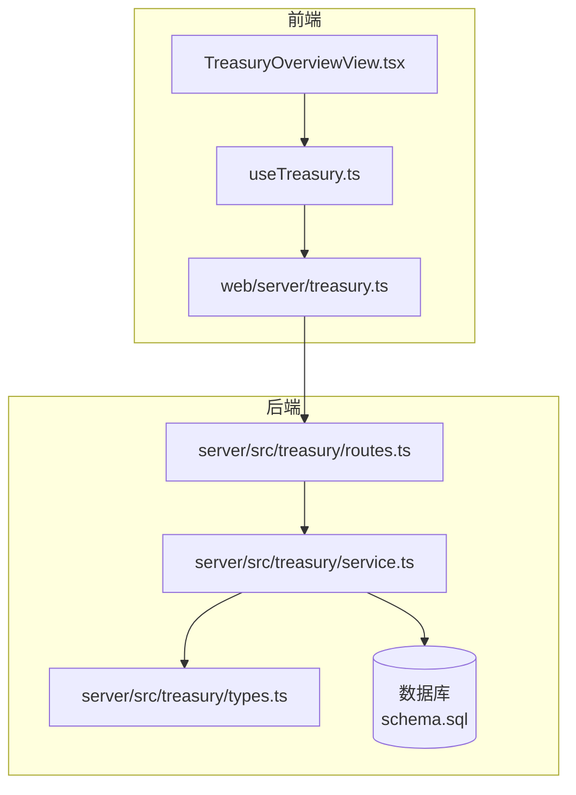
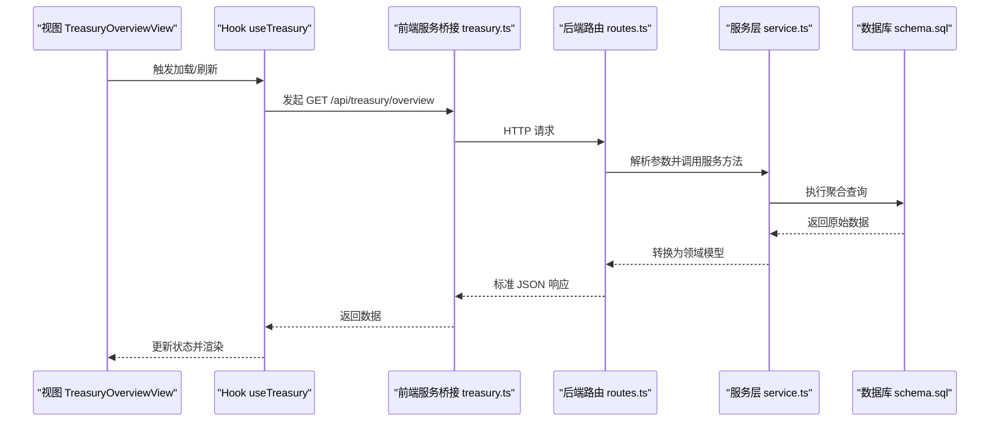
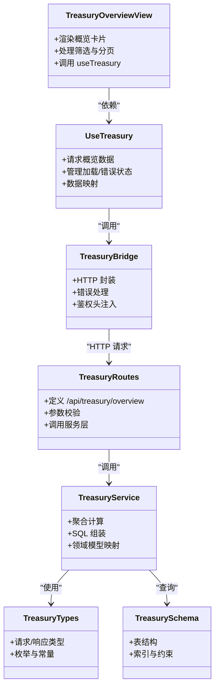

# 国库概览视图

<cite>
**本文引用的文件**   
- [TreasuryOverviewView.tsx](file://web/src/views/TreasuryOverviewView.tsx)
- [useTreasury.ts](file://web/src/services/useTreasury.ts)
- [treasury.ts](file://web/server/treasury.ts)
- [routes.ts](file://server/src/treasury/routes.ts)
- [service.ts](file://server/src/treasury/service.ts)
- [types.ts](file://server/src/treasury/types.ts)
- [schema.sql](file://server/src/treasury/schema.sql)
</cite>

## 目录
1. [简介](#简介)
2. [项目结构](#项目结构)
3. [核心组件](#核心组件)
4. [架构总览](#架构总览)
5. [详细组件分析](#详细组件分析)
6. [依赖关系分析](#依赖关系分析)
7. [性能考量](#性能考量)
8. [故障排查指南](#故障排查指南)
9. [结论](#结论)
10. [附录](#附录)

## 简介
本文件围绕“国库概览视图”展开，系统性梳理前端展示层、客户端 Hook、服务端路由与服务层之间的协作关系，解释数据从数据库到界面的完整流转路径。文档面向不同技术背景的读者，既提供高层架构图与流程图，也给出关键实现要点与排障建议。

## 项目结构
与“国库概览视图”相关的代码主要分布在以下位置：
- 前端视图：web/src/views/TreasuryOverviewView.tsx
- 前端数据获取：web/src/services/useTreasury.ts
- 前端服务桥接：web/server/treasury.ts
- 后端路由：server/src/treasury/routes.ts
- 后端服务：server/src/treasury/service.ts
- 类型定义：server/src/treasury/types.ts
- 数据库结构：server/src/treasury/schema.sql

图表来源
- [TreasuryOverviewView.tsx](file://web/src/views/TreasuryOverviewView.tsx)
- [useTreasury.ts](file://web/src/services/useTreasury.ts)
- [treasury.ts](file://web/server/treasury.ts)
- [routes.ts](file://server/src/treasury/routes.ts)
- [service.ts](file://server/src/treasury/service.ts)
- [types.ts](file://server/src/treasury/types.ts)
- [schema.sql](file://server/src/treasury/schema.sql)

章节来源
- [TreasuryOverviewView.tsx](file://web/src/views/TreasuryOverviewView.tsx)
- [useTreasury.ts](file://web/src/services/useTreasury.ts)
- [treasury.ts](file://web/server/treasury.ts)
- [routes.ts](file://server/src/treasury/routes.ts)
- [service.ts](file://server/src/treasury/service.ts)
- [types.ts](file://server/src/treasury/types.ts)
- [schema.sql](file://server/src/treasury/schema.sql)

## 核心组件
- 视图层（TreasuryOverviewView）：负责渲染国库概览的关键指标与列表，处理用户交互（如刷新、筛选），并调用 Hook 获取数据。
- Hook（useTreasury）：封装数据请求、状态管理与错误处理，向视图暴露统一的读取接口。
- 前端服务桥接（web/server/treasury.ts）：统一转发对后端的 HTTP 请求，集中管理基础 URL、超时与重试策略。
- 后端路由（routes.ts）：定义 REST 端点，解析请求参数，调用服务层并返回标准化响应。
- 服务层（service.ts）：实现业务逻辑，包括聚合计算、过滤与排序，访问数据库并映射为领域模型。
- 类型定义（types.ts）：前后端共享的领域类型，确保数据结构一致。
- 数据库结构（schema.sql）：定义国库相关表结构与索引，支撑查询性能与一致性。

章节来源
- [TreasuryOverviewView.tsx](file://web/src/views/TreasuryOverviewView.tsx)
- [useTreasury.ts](file://web/src/services/useTreasury.ts)
- [treasury.ts](file://web/server/treasury.ts)
- [routes.ts](file://server/src/treasury/routes.ts)
- [service.ts](file://server/src/treasury/service.ts)
- [types.ts](file://server/src/treasury/types.ts)
- [schema.sql](file://server/src/treasury/schema.sql)

## 架构总览
下图展示了从界面到数据库的端到端调用链，以及各层的职责边界。

图表来源
- [TreasuryOverviewView.tsx](file://web/src/views/TreasuryOverviewView.tsx)
- [useTreasury.ts](file://web/src/services/useTreasury.ts)
- [treasury.ts](file://web/server/treasury.ts)
- [routes.ts](file://server/src/treasury/routes.ts)
- [service.ts](file://server/src/treasury/service.ts)
- [schema.sql](file://server/src/treasury/schema.sql)

## 详细组件分析

### 视图层：TreasuryOverviewView
- 职责
  - 渲染概览卡片（总资产、可用余额、冻结金额等）与明细列表。
  - 支持时间范围选择、币种筛选、分页与刷新。
  - 将用户输入转化为查询参数，交由 Hook 拉取数据。
- 交互流程
  - 首次挂载时自动加载概览数据。
  - 用户变更筛选条件或翻页时重新请求。
  - 错误态与空态提示，保证用户体验。
- 关键点
  - 使用防抖/节流优化频繁筛选。
  - 对大列表采用虚拟滚动或分页加载。
  - 统一错误码映射与用户提示。

章节来源
- [TreasuryOverviewView.tsx](file://web/src/views/TreasuryOverviewView.tsx)

### Hook 层：useTreasury
- 职责
  - 封装对后端概览接口的请求。
  - 维护 loading、error、data 等状态。
  - 提供 refetch、reset 等方法。
- 数据流
  - 接收视图传入的查询参数。
  - 调用前端服务桥接获取数据。
  - 将响应数据映射为视图所需结构。
- 关键点
  - 失败重试与退避策略。
  - 缓存策略（可选）避免重复请求。
  - 类型安全：严格约束返回结构。

章节来源
- [useTreasury.ts](file://web/src/services/useTreasury.ts)

### 前端服务桥接：web/server/treasury.ts
- 职责
  - 统一封装对后端的 HTTP 调用。
  - 设置基础路径、超时、拦截器（鉴权头、错误处理）。
- 关键点
  - 错误分类（网络错误、业务错误）。
  - 可配置的重试与降级。
  - 日志记录便于定位问题。

章节来源
- [treasury.ts](file://web/server/treasury.ts)

### 后端路由：server/src/treasury/routes.ts
- 职责
  - 定义 /api/treasury/overview 等端点。
  - 校验请求参数（时间范围、币种、分页）。
  - 调用服务层并返回统一格式响应。
- 关键点
  - 参数校验与默认值处理。
  - 权限控制（如需）。
  - 限流与审计日志。

章节来源
- [routes.ts](file://server/src/treasury/routes.ts)

### 服务层：server/src/treasury/service.ts
- 职责
  - 实现概览聚合逻辑（资产汇总、币种分布、变动趋势等）。
  - 组合多条 SQL 或视图查询，进行内存二次加工。
  - 将数据库行对象映射为领域模型。
- 关键点
  - 复杂查询拆分与缓存。
  - 数值精度与单位换算。
  - 异常捕获与友好错误信息。

章节来源
- [service.ts](file://server/src/treasury/service.ts)

### 类型定义：server/src/treasury/types.ts
- 职责
  - 统一定义请求/响应结构、枚举与常量。
  - 前后端共享类型，减少不一致风险。
- 关键点
  - 严格的字段约束与必填项。
  - 扩展性设计（预留字段）。

章节来源
- [types.ts](file://server/src/treasury/types.ts)

### 数据库结构：server/src/treasury/schema.sql
- 职责
  - 定义国库相关表、字段、索引与约束。
  - 支撑高效聚合与范围查询。
- 关键点
  - 时间分区与归档策略。
  - 常用查询的覆盖索引。
  - 数据一致性约束（外键、唯一性）。

章节来源
- [schema.sql](file://server/src/treasury/schema.sql)

## 依赖关系分析

图表来源
- [TreasuryOverviewView.tsx](file://web/src/views/TreasuryOverviewView.tsx)
- [useTreasury.ts](file://web/src/services/useTreasury.ts)
- [treasury.ts](file://web/server/treasury.ts)
- [routes.ts](file://server/src/treasury/routes.ts)
- [service.ts](file://server/src/treasury/service.ts)
- [types.ts](file://server/src/treasury/types.ts)
- [schema.sql](file://server/src/treasury/schema.sql)

章节来源
- [TreasuryOverviewView.tsx](file://web/src/views/TreasuryOverviewView.tsx)
- [useTreasury.ts](file://web/src/services/useTreasury.ts)
- [treasury.ts](file://web/server/treasury.ts)
- [routes.ts](file://server/src/treasury/routes.ts)
- [service.ts](file://server/src/treasury/service.ts)
- [types.ts](file://server/src/treasury/types.ts)
- [schema.sql](file://server/src/treasury/schema.sql)

## 性能考量
- 前端
  - 列表虚拟化与分页加载，降低首屏压力。
  - 防抖/节流减少高频筛选带来的重复请求。
  - 合理缓存热点数据，缩短二次加载时间。
- 后端
  - 聚合查询尽量在数据库侧完成，减少内存计算。
  - 为常用过滤字段建立索引，提升查询效率。
  - 对慢查询进行采样与监控，必要时引入物化视图或预聚合表。
- 传输
  - 压缩响应体，按需返回字段。
  - 连接池与超时配置调优，避免雪崩。

[本节为通用指导，不直接分析具体文件]

## 故障排查指南
- 常见问题
  - 页面空白或加载失败：检查网络请求是否成功、Hook 的错误分支是否正确渲染。
  - 数据不更新：确认筛选参数变化是否触发 refetch，是否存在缓存未失效。
  - 后端报错：查看路由参数校验日志与服务层异常堆栈。
  - 数据库慢查询：通过慢查询日志定位，补充索引或改写 SQL。
- 定位步骤
  - 浏览器开发者工具 Network 面板核对请求与响应。
  - 前端控制台打印 Hook 的状态变化。
  - 后端日志输出关键参数与耗时。
  - 数据库执行计划分析慢查询。

章节来源
- [useTreasury.ts](file://web/src/services/useTreasury.ts)
- [treasury.ts](file://web/server/treasury.ts)
- [routes.ts](file://server/src/treasury/routes.ts)
- [service.ts](file://server/src/treasury/service.ts)

## 结论
“国库概览视图”通过清晰的分层设计与稳定的数据流，实现了从数据库到界面的高效渲染。前端以 Hook 为中心封装状态与请求，后端以路由与服务解耦业务与持久化。配合合理的索引与缓存策略，可在高并发场景下保持良好性能与稳定性。

[本节为总结性内容，不直接分析具体文件]

## 附录
- 术语
  - 国库：用于归集与管理资金的账户集合。
  - 概览：对资产总量、分布与变动的综合展示。
- 参考
  - 相关类型与接口定义见类型文件。
  - 数据库表结构与索引见 schema 文件。

[本节为补充说明，不直接分析具体文件]