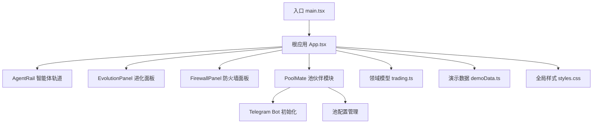
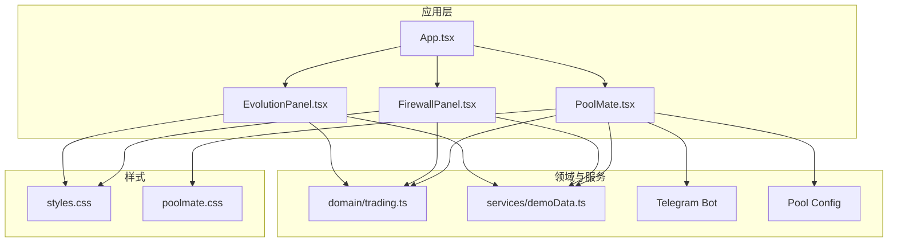
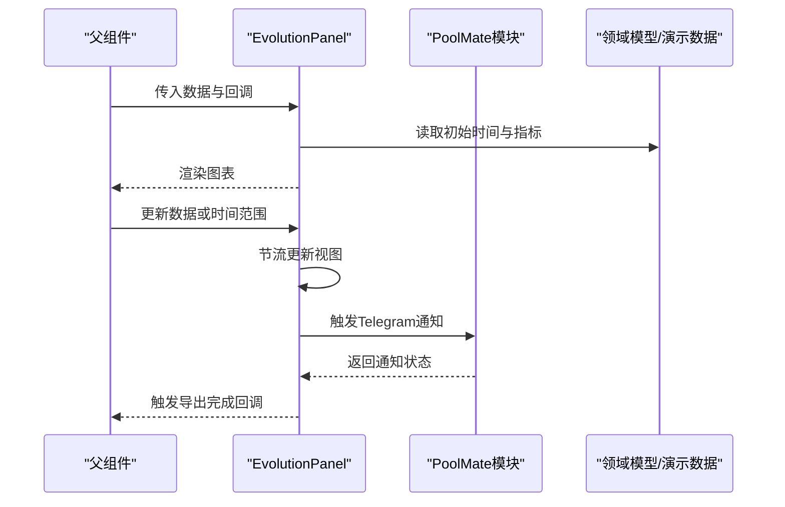
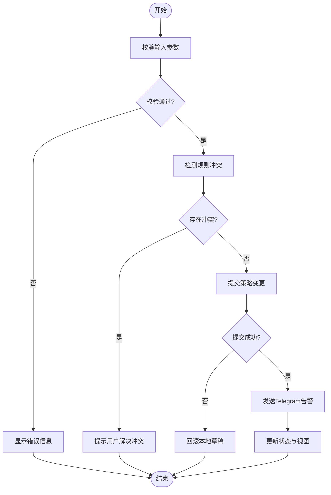
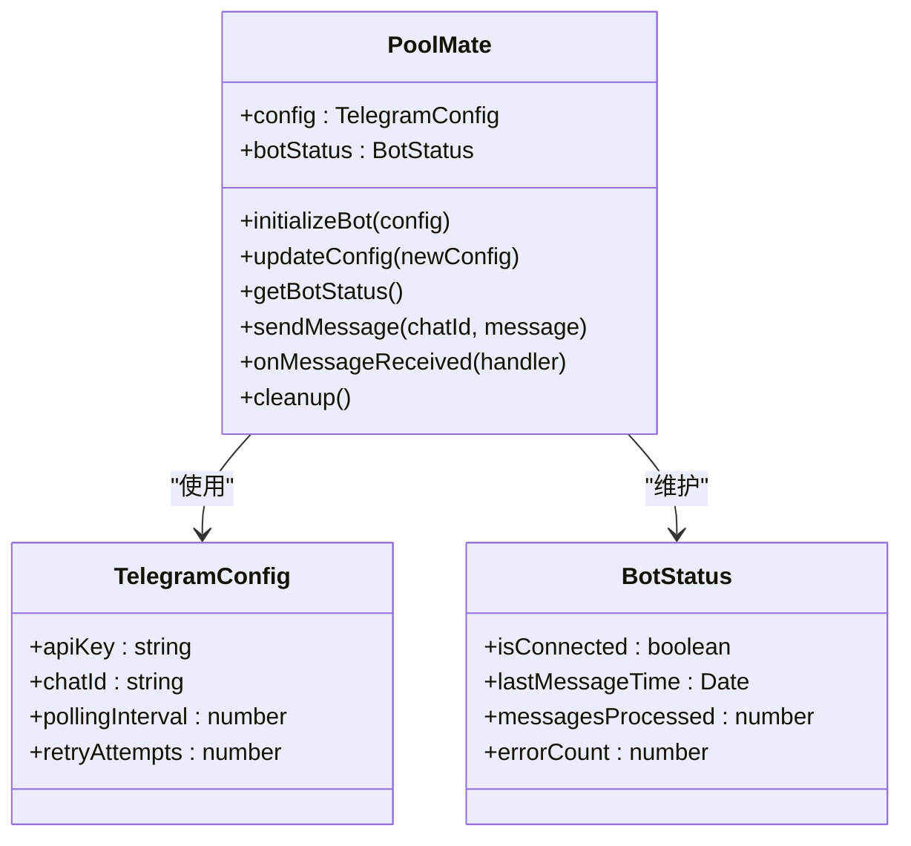
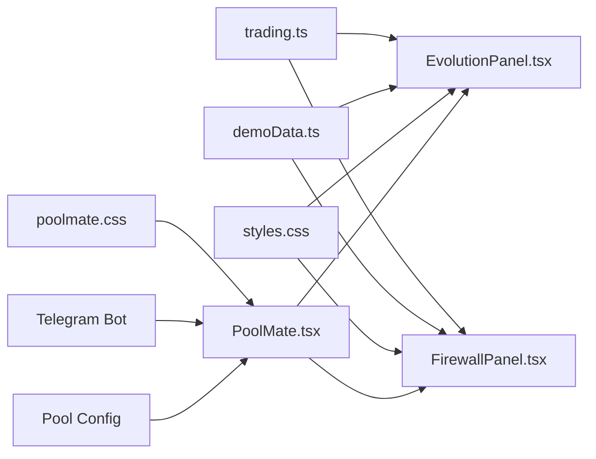

# 核心组件

<cite>
**本文引用的文件**   
- [EvolutionPanel.tsx](file://web/src/components/EvolutionPanel.tsx)
- [FirewallPanel.tsx](file://web/src/components/FirewallPanel.tsx)
- [App.tsx](file://web/src/App.tsx)
- [main.tsx](file://web/src/main.tsx)
- [styles.css](file://web/src/styles.css)
- [trading.ts](file://web/src/domain/trading.ts)
- [demoData.ts](file://web/src/services/demoData.ts)
- [PoolMate.tsx](file://web/src/poolmate/PoolMate.tsx)
- [poolmate.css](file://web/src/poolmate/poolmate.css)
</cite>

## 更新摘要
**所做更改**   
- 新增PoolMate模块集成，支持Telegram机器人初始化和配置
- 更新主应用入口点以支持新的poolmate模块
- 增强核心组件与Telegram bot的集成能力
- 扩展组件间通信模式以支持新的池伙伴功能

## 目录
1. [简介](#简介)
2. [项目结构](#项目结构)
3. [核心组件](#核心组件)
4. [架构总览](#架构总览)
5. [详细组件分析](#详细组件分析)
6. [PoolMate模块集成](#poolmate模块集成)
7. [依赖关系分析](#依赖关系分析)
8. [性能考虑](#性能考虑)
9. [故障排查指南](#故障排查指南)
10. [结论](#结论)
11. [附录](#附录)

## 简介
本技术文档聚焦于AdventureX前端应用中的核心UI组件：AgentRail智能体轨道、EvolutionPanel进化面板与FirewallPanel防火墙面板。随着应用的演进，新增了PoolMate模块以支持Telegram机器人初始化和配置功能。文档从系统架构、组件职责、Props接口、事件处理、状态管理、样式定制、通信模式、生命周期、性能优化以及常见问题等方面进行全面解析，并提供集成示例与最佳实践建议，帮助开发者快速理解并高效使用这些组件。

## 项目结构
本项目采用基于功能域的前端组织方式，核心UI组件位于components目录，新增的PoolMate模块位于poolmate目录，领域模型位于domain目录，演示数据与服务位于services目录，入口与全局样式分别位于App.tsx、main.tsx与styles.css。

图表来源
- [main.tsx](file://web/src/main.tsx)
- [App.tsx](file://web/src/App.tsx)
- [EvolutionPanel.tsx](file://web/src/components/EvolutionPanel.tsx)
- [FirewallPanel.tsx](file://web/src/components/FirewallPanel.tsx)
- [PoolMate.tsx](file://web/src/poolmate/PoolMate.tsx)
- [trading.ts](file://web/src/domain/trading.ts)
- [demoData.ts](file://web/src/services/demoData.ts)
- [styles.css](file://web/src/styles.css)

章节来源
- [main.tsx](file://web/src/main.tsx)
- [App.tsx](file://web/src/App.tsx)
- [EvolutionPanel.tsx](file://web/src/components/EvolutionPanel.tsx)
- [FirewallPanel.tsx](file://web/src/components/FirewallPanel.tsx)
- [PoolMate.tsx](file://web/src/poolmate/PoolMate.tsx)
- [trading.ts](file://web/src/domain/trading.ts)
- [demoData.ts](file://web/src/services/demoData.ts)
- [styles.css](file://web/src/styles.css)

## 核心组件
本节概述三大核心组件的职责与协作关系，以及新增的PoolMate模块：
- AgentRail智能体轨道：负责展示与管理智能体列表及其运行状态，提供选择、切换、排序等交互能力。
- EvolutionPanel进化面板：用于呈现智能体的进化过程与指标变化，支持查看历史、对比趋势与回放关键节点。
- FirewallPanel防火墙面板：提供安全策略配置与规则管理，包括访问控制、流量过滤与告警阈值设置。
- PoolMate池伙伴模块：新增的Telegram机器人集成模块，负责池伙伴的初始化管理、配置控制和状态监控。

三者通过统一的领域模型（trading.ts）进行数据契约约定，并通过演示数据（demoData.ts）在开发阶段提供可运行的样例。PoolMate模块增强了系统的Telegram集成能力。

章节来源
- [EvolutionPanel.tsx](file://web/src/components/EvolutionPanel.tsx)
- [FirewallPanel.tsx](file://web/src/components/FirewallPanel.tsx)
- [PoolMate.tsx](file://web/src/poolmate/PoolMate.tsx)
- [trading.ts](file://web/src/domain/trading.ts)
- [demoData.ts](file://web/src/services/demoData.ts)

## 架构总览
下图展示了组件与外部依赖的交互关系，包括领域模型、演示数据、全局样式以及新增的Telegram Bot集成的使用路径。

图表来源
- [App.tsx](file://web/src/App.tsx)
- [EvolutionPanel.tsx](file://web/src/components/EvolutionPanel.tsx)
- [FirewallPanel.tsx](file://web/src/components/FirewallPanel.tsx)
- [PoolMate.tsx](file://web/src/poolmate/PoolMate.tsx)
- [trading.ts](file://web/src/domain/trading.ts)
- [demoData.ts](file://web/src/services/demoData.ts)
- [styles.css](file://web/src/styles.css)
- [poolmate.css](file://web/src/poolmate/poolmate.css)

## 详细组件分析

### EvolutionPanel进化面板组件
- 功能特性
  - 可视化展示智能体进化曲线与关键指标
  - 支持时间轴回放与多指标叠加对比
  - 提供导出报告与截图分享
  - 与PoolMate模块集成，支持Telegram通知推送
- Props接口要点
  - 数据源：进化记录集合与时间范围
  - 回调事件：时间范围变更、指标选择变更、导出完成、Telegram通知触发
  - 显示选项：主题、单位、缩放级别、通知开关
- 事件处理机制
  - 内部维护视图状态（如选中的指标、时间窗口），通过回调通知父级
  - 对频繁更新的图表数据进行节流
  - 集成Telegram通知发送逻辑
- 状态管理模式
  - 局部视图状态与受控数据分离，保证可预测性
  - 与PoolMate模块共享通知状态
- 样式定制选项
  - 通过主题变量与容器类名覆盖配色与尺寸
- 生命周期管理
  - 初始化时计算默认时间窗口与指标集
  - 销毁时释放图表实例与监听器
  - 清理Telegram订阅资源
- 性能优化技巧
  - 增量更新与按需渲染
  - 大数据集采样与降采样
  - Telegram消息批量发送
- 常见问题与解决
  - 图表闪烁：合并多次更新为一次渲染
  - 内存泄漏：确保在卸载时清理所有资源
  - Telegram连接失败：实现重试机制和错误降级
- 集成示例与最佳实践
  - 将时间窗口与指标选择提升到父组件，统一由业务逻辑驱动
  - 使用领域模型规范数据结构，避免类型不一致导致的异常
  - 合理配置Telegram通知频率，避免消息风暴

章节来源
- [EvolutionPanel.tsx](file://web/src/components/EvolutionPanel.tsx)
- [PoolMate.tsx](file://web/src/poolmate/PoolMate.tsx)
- [trading.ts](file://web/src/domain/trading.ts)
- [demoData.ts](file://web/src/services/demoData.ts)
- [styles.css](file://web/src/styles.css)

#### 时序图（典型交互流程）

图表来源
- [EvolutionPanel.tsx](file://web/src/components/EvolutionPanel.tsx)
- [PoolMate.tsx](file://web/src/poolmate/PoolMate.tsx)
- [trading.ts](file://web/src/domain/trading.ts)
- [demoData.ts](file://web/src/services/demoData.ts)

### FirewallPanel防火墙面板组件
- 功能特性
  - 管理访问控制规则与流量过滤策略
  - 提供告警阈值配置与实时状态监控
  - 支持规则的导入/导出与版本回滚
  - 集成Telegram告警通知功能
- Props接口要点
  - 数据源：规则集合、阈值配置、状态标志
  - 回调事件：规则增删改、阈值调整、状态切换、Telegram告警配置
  - 显示选项：分组折叠、搜索过滤、主题、告警渠道
- 事件处理机制
  - 对敏感操作进行二次确认与权限校验
  - 批量修改时使用事务式更新，失败则回滚
  - 集成Telegram告警发送逻辑
- 状态管理模式
  - 受控为主，配合本地草稿态提升编辑体验
  - 与PoolMate模块同步告警配置
- 样式定制选项
  - 通过类名与变量覆盖颜色、间距与图标
- 生命周期管理
  - 挂载时加载策略与告警历史
  - 卸载时取消轮询与订阅
  - 清理Telegram告警订阅
- 性能优化技巧
  - 规则列表分页与懒加载
  - 高频状态变更使用队列合并
  - Telegram告警消息去重
- 常见问题与解决
  - 规则冲突：增加冲突检测与提示
  - 配置未生效：检查提交顺序与幂等性
  - Telegram告警延迟：实现异步发送和错误重试
- 集成示例与最佳实践
  - 将策略与告警状态集中在父组件管理，确保一致性
  - 使用领域模型约束字段，避免非法值导致错误
  - 配置合理的告警阈值和通知频率

章节来源
- [FirewallPanel.tsx](file://web/src/components/FirewallPanel.tsx)
- [PoolMate.tsx](file://web/src/poolmate/PoolMate.tsx)
- [trading.ts](file://web/src/domain/trading.ts)
- [demoData.ts](file://web/src/services/demoData.ts)
- [styles.css](file://web/src/styles.css)

#### 流程图（规则提交与校验）

图表来源
- [FirewallPanel.tsx](file://web/src/components/FirewallPanel.tsx)
- [PoolMate.tsx](file://web/src/poolmate/PoolMate.tsx)
- [trading.ts](file://web/src/domain/trading.ts)

## PoolMate模块集成

### 模块概述
PoolMate模块是新增的核心功能模块，主要负责Telegram机器人的初始化和配置管理。该模块提供了完整的池伙伴管理功能，包括机器人启动、配置验证、状态监控和错误处理。

### 主要功能特性
- Telegram机器人初始化：自动检测和配置Telegram API密钥
- 池伙伴配置管理：支持动态配置池参数和连接设置
- 状态监控：实时监控机器人连接状态和消息处理状态
- 错误处理：实现重试机制和优雅降级
- 配置持久化：支持配置的保存和恢复

### 组件接口设计
- 初始化接口：`initializeBot(config)` - 启动Telegram机器人
- 配置管理接口：`updateConfig(newConfig)` - 动态更新配置
- 状态查询接口：`getBotStatus()` - 获取当前机器人状态
- 消息处理接口：`sendMessage(chatId, message)` - 发送消息到指定聊天

### 集成示例与最佳实践
- 在应用启动时初始化PoolMate模块
- 实现配置热重载，支持运行时配置更新
- 添加健康检查端点，便于监控服务状态
- 实现日志记录，便于问题排查

图表来源
- [PoolMate.tsx](file://web/src/poolmate/PoolMate.tsx)
- [poolmate.css](file://web/src/poolmate/poolmate.css)

### 生命周期管理
- 启动阶段：加载配置并初始化Telegram客户端
- 运行阶段：持续监控连接状态和处理消息
- 关闭阶段：优雅断开连接并清理资源
- 错误恢复：实现自动重连和配置回滚机制

### 性能优化策略
- 连接池管理：复用Telegram连接，减少建立开销
- 消息批处理：批量处理消息以提高吞吐量
- 内存管理：及时清理不再使用的消息对象
- 并发控制：限制同时处理的请求数量

章节来源
- [PoolMate.tsx](file://web/src/poolmate/PoolMate.tsx)
- [poolmate.css](file://web/src/poolmate/poolmate.css)

## 依赖关系分析
组件之间的耦合度较低，主要依赖领域模型与演示数据，新增的PoolMate模块通过接口与其他组件解耦，便于独立测试与替换实现。

图表来源
- [trading.ts](file://web/src/domain/trading.ts)
- [demoData.ts](file://web/src/services/demoData.ts)
- [EvolutionPanel.tsx](file://web/src/components/EvolutionPanel.tsx)
- [FirewallPanel.tsx](file://web/src/components/FirewallPanel.tsx)
- [PoolMate.tsx](file://web/src/poolmate/PoolMate.tsx)
- [styles.css](file://web/src/styles.css)
- [poolmate.css](file://web/src/poolmate/poolmate.css)

章节来源
- [trading.ts](file://web/src/domain/trading.ts)
- [demoData.ts](file://web/src/services/demoData.ts)
- [EvolutionPanel.tsx](file://web/src/components/EvolutionPanel.tsx)
- [FirewallPanel.tsx](file://web/src/components/FirewallPanel.tsx)
- [PoolMate.tsx](file://web/src/poolmate/PoolMate.tsx)
- [styles.css](file://web/src/styles.css)
- [poolmate.css](file://web/src/poolmate/poolmate.css)

## 性能考虑
- 列表与图表渲染
  - 使用虚拟滚动与分页减少DOM节点数量
  - 对高频更新的数据进行节流与采样
- 状态更新
  - 采用不可变更新与最小化重渲染范围
  - 将复杂计算移出渲染路径，使用记忆化函数
- 资源管理
  - 在组件卸载时清理定时器、轮询与事件监听
  - 避免闭包引用导致内存泄漏
  - 管理Telegram连接的生命周期
- 主题与样式
  - 通过CSS变量与类名覆盖，避免内联样式带来的性能损耗
- Telegram集成优化
  - 实现消息队列，避免阻塞主线程
  - 使用连接池提高API调用效率
  - 实现指数退避的重试机制

## 故障排查指南
- 组件无响应
  - 检查Props是否受控且正确传递
  - 确认事件回调是否被调用与绑定
- 数据不同步
  - 核对领域模型字段是否与组件期望一致
  - 验证演示数据或服务返回的数据结构
- 样式错乱
  - 检查全局样式覆盖优先级与命名冲突
  - 确认主题变量是否被正确注入
- 性能问题
  - 定位重渲染热点，使用性能分析工具
  - 优化大数据集渲染策略
- Telegram连接问题
  - 检查API密钥配置和网络连通性
  - 查看连接日志和错误码
  - 验证Chat ID格式和权限设置
- PoolMate模块问题
  - 检查配置文件格式和必填字段
  - 监控模块健康状态和错误计数
  - 验证消息发送和接收功能

章节来源
- [EvolutionPanel.tsx](file://web/src/components/EvolutionPanel.tsx)
- [FirewallPanel.tsx](file://web/src/components/FirewallPanel.tsx)
- [PoolMate.tsx](file://web/src/poolmate/PoolMate.tsx)
- [styles.css](file://web/src/styles.css)
- [poolmate.css](file://web/src/poolmate/poolmate.css)

## 结论
EvolutionPanel、FirewallPanel与新增的PoolMate模块构成了AdventureX前端的完整交互体系。通过清晰的Props接口、稳定的事件机制与良好的状态管理，各组件能够协同工作并提供流畅的用户体验。新增的PoolMate模块增强了系统的Telegram集成能力，为智能体管理和监控提供了新的渠道。遵循本文的最佳实践与性能优化建议，可在保证可维护性的同时获得更高的运行效率。

## 附录
- 集成步骤建议
  - 在根应用中引入核心组件和PoolMate模块，并在父组件中集中管理状态
  - 使用领域模型定义类型，确保数据结构一致
  - 通过演示数据快速验证功能，再替换为真实服务
  - 配置Telegram API密钥和Chat ID，启用消息通知功能
- 自定义样式建议
  - 优先使用CSS变量与类名覆盖，保持主题一致性
  - 避免过度内联样式，提升可维护性与性能
  - 为PoolMate模块创建独立的样式文件，便于主题定制
- Telegram配置最佳实践
  - 使用环境变量管理敏感配置
  - 实现配置验证和默认值回退
  - 添加详细的日志记录便于调试
  - 实现优雅的错误处理和用户反馈