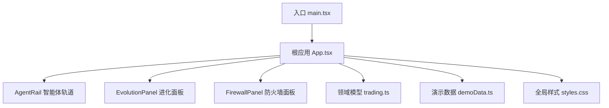
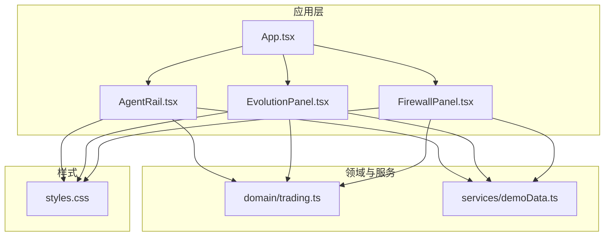
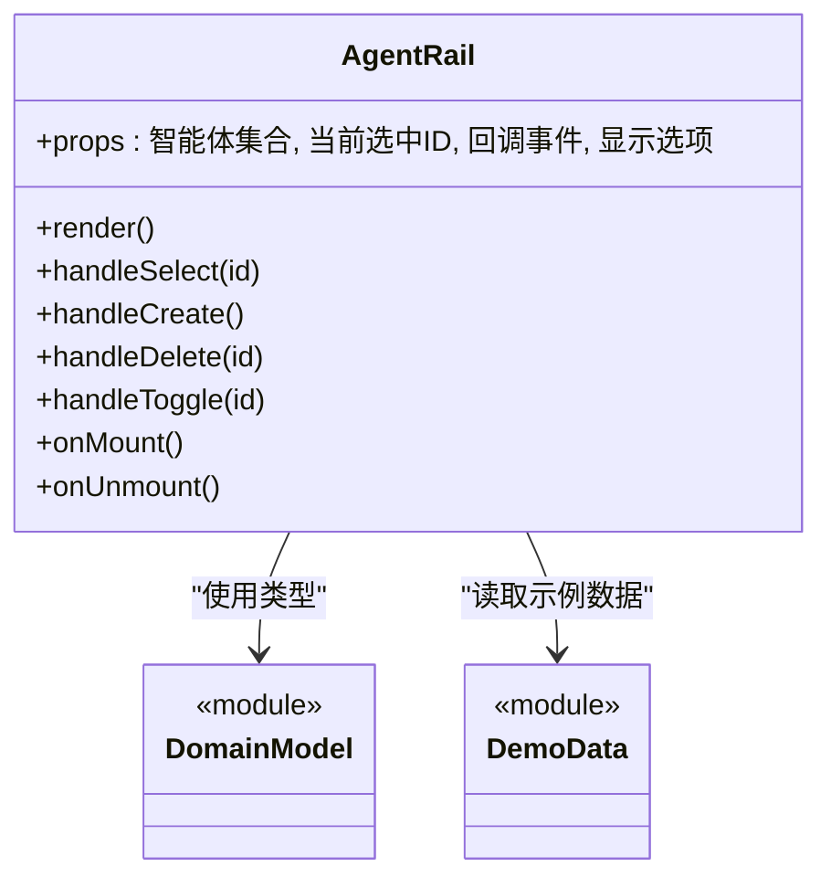
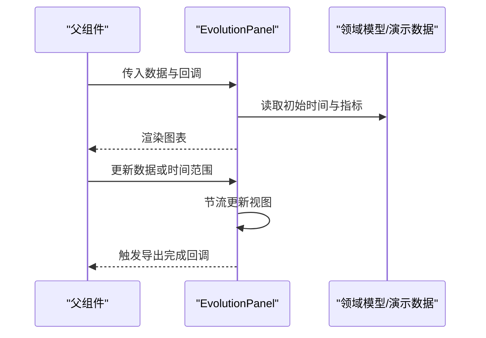
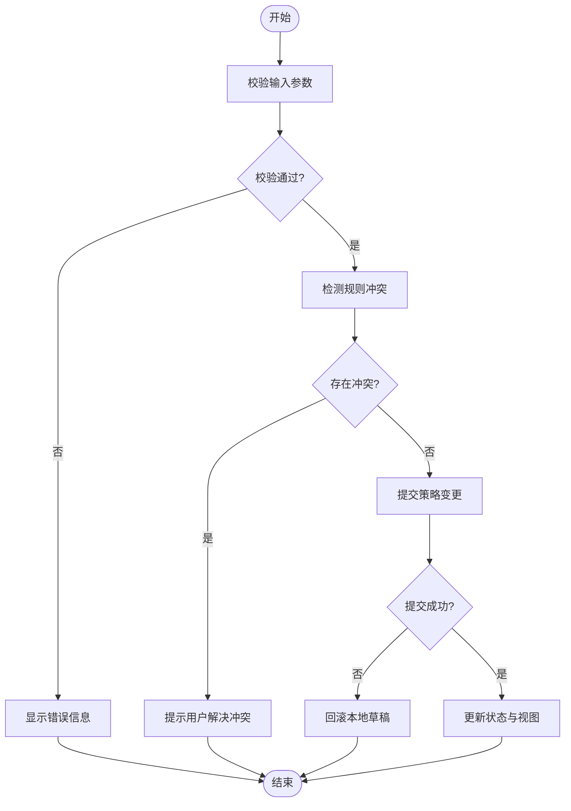
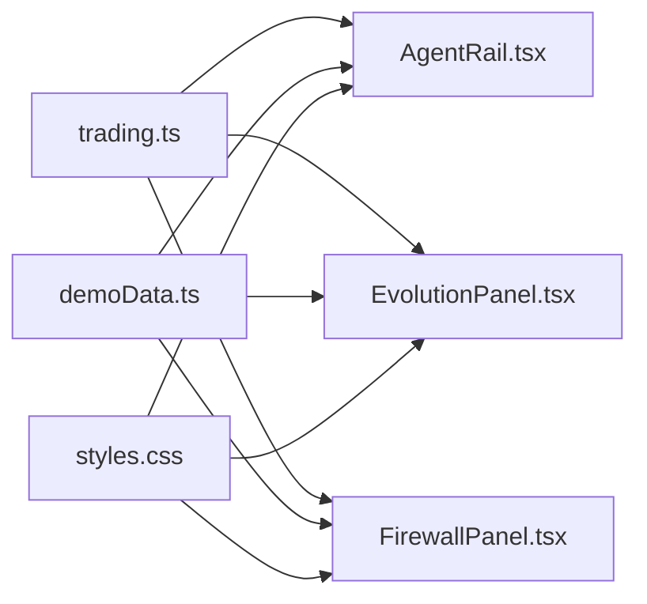

# 核心组件

<cite>
**本文引用的文件**   
- [AgentRail.tsx](file://web/src/components/AgentRail.tsx)
- [EvolutionPanel.tsx](file://web/src/components/EvolutionPanel.tsx)
- [FirewallPanel.tsx](file://web/src/components/FirewallPanel.tsx)
- [App.tsx](file://web/src/App.tsx)
- [main.tsx](file://web/src/main.tsx)
- [styles.css](file://web/src/styles.css)
- [trading.ts](file://web/src/domain/trading.ts)
- [demoData.ts](file://web/src/services/demoData.ts)
</cite>

## 目录
1. [简介](#简介)
2. [项目结构](#项目结构)
3. [核心组件](#核心组件)
4. [架构总览](#架构总览)
5. [详细组件分析](#详细组件分析)
6. [依赖关系分析](#依赖关系分析)
7. [性能考虑](#性能考虑)
8. [故障排查指南](#故障排查指南)
9. [结论](#结论)
10. [附录](#附录)

## 简介
本技术文档聚焦于AdventureX前端应用中的三个核心UI组件：AgentRail智能体轨道、EvolutionPanel进化面板与FirewallPanel防火墙面板。文档从系统架构、组件职责、Props接口、事件处理、状态管理、样式定制、通信模式、生命周期、性能优化以及常见问题等方面进行全面解析，并提供集成示例与最佳实践建议，帮助开发者快速理解并高效使用这些组件。

## 项目结构
本项目采用基于功能域的前端组织方式，核心UI组件位于components目录，领域模型位于domain目录，演示数据与服务位于services目录，入口与全局样式分别位于App.tsx、main.tsx与styles.css。

图表来源
- [main.tsx](file://web/src/main.tsx)
- [App.tsx](file://web/src/App.tsx)
- [AgentRail.tsx](file://web/src/components/AgentRail.tsx)
- [EvolutionPanel.tsx](file://web/src/components/EvolutionPanel.tsx)
- [FirewallPanel.tsx](file://web/src/components/FirewallPanel.tsx)
- [trading.ts](file://web/src/domain/trading.ts)
- [demoData.ts](file://web/src/services/demoData.ts)
- [styles.css](file://web/src/styles.css)

章节来源
- [main.tsx](file://web/src/main.tsx)
- [App.tsx](file://web/src/App.tsx)
- [AgentRail.tsx](file://web/src/components/AgentRail.tsx)
- [EvolutionPanel.tsx](file://web/src/components/EvolutionPanel.tsx)
- [FirewallPanel.tsx](file://web/src/components/FirewallPanel.tsx)
- [trading.ts](file://web/src/domain/trading.ts)
- [demoData.ts](file://web/src/services/demoData.ts)
- [styles.css](file://web/src/styles.css)

## 核心组件
本节概述三大组件的职责与协作关系：
- AgentRail智能体轨道：负责展示与管理智能体列表及其运行状态，提供选择、切换、排序等交互能力。
- EvolutionPanel进化面板：用于呈现智能体的进化过程与指标变化，支持查看历史、对比趋势与回放关键节点。
- FirewallPanel防火墙面板：提供安全策略配置与规则管理，包括访问控制、流量过滤与告警阈值设置。

三者通过统一的领域模型（trading.ts）进行数据契约约定，并通过演示数据（demoData.ts）在开发阶段提供可运行的样例。

章节来源
- [AgentRail.tsx](file://web/src/components/AgentRail.tsx)
- [EvolutionPanel.tsx](file://web/src/components/EvolutionPanel.tsx)
- [FirewallPanel.tsx](file://web/src/components/FirewallPanel.tsx)
- [trading.ts](file://web/src/domain/trading.ts)
- [demoData.ts](file://web/src/services/demoData.ts)

## 架构总览
下图展示了组件与外部依赖的交互关系，包括领域模型、演示数据与全局样式的使用路径。

图表来源
- [App.tsx](file://web/src/App.tsx)
- [AgentRail.tsx](file://web/src/components/AgentRail.tsx)
- [EvolutionPanel.tsx](file://web/src/components/EvolutionPanel.tsx)
- [FirewallPanel.tsx](file://web/src/components/FirewallPanel.tsx)
- [trading.ts](file://web/src/domain/trading.ts)
- [demoData.ts](file://web/src/services/demoData.ts)
- [styles.css](file://web/src/styles.css)

## 详细组件分析

### AgentRail智能体轨道组件
- 功能特性
  - 展示智能体列表与当前选中项
  - 支持按名称、状态或时间排序
  - 提供创建、删除、启用/禁用等操作
  - 与EvolutionPanel联动，点击后展示对应智能体的进化详情
- Props接口要点
  - 数据源：智能体集合与当前选中ID
  - 回调事件：选中变更、操作触发（创建/删除/启停）
  - 显示选项：排序字段、分页大小、主题开关
- 事件处理机制
  - 内部维护本地选中态，通过回调向父级同步
  - 对批量操作进行确认提示与防抖处理
- 状态管理模式
  - 受控模式为主，父组件持有真实状态；必要时使用本地缓存提升交互体验
- 样式定制选项
  - 通过CSS变量或类名覆盖实现主题化
  - 支持紧凑/宽松布局切换
- 生命周期管理
  - 挂载时加载演示数据或拉取远端数据
  - 卸载时清理定时器与订阅
- 性能优化技巧
  - 列表虚拟化渲染大列表
  - 使用不可变更新避免不必要的重渲染
- 常见问题与解决
  - 选中态不同步：检查受控Props是否正确传递
  - 大数据量卡顿：开启虚拟滚动与分页
- 集成示例与最佳实践
  - 在父组件中集中管理智能体状态，将回调作为Props传入
  - 结合领域模型定义类型约束，确保数据结构一致

章节来源
- [AgentRail.tsx](file://web/src/components/AgentRail.tsx)
- [trading.ts](file://web/src/domain/trading.ts)
- [demoData.ts](file://web/src/services/demoData.ts)
- [styles.css](file://web/src/styles.css)

#### 类图（代码结构示意）

图表来源
- [AgentRail.tsx](file://web/src/components/AgentRail.tsx)
- [trading.ts](file://web/src/domain/trading.ts)
- [demoData.ts](file://web/src/services/demoData.ts)

### EvolutionPanel进化面板组件
- 功能特性
  - 可视化展示智能体进化曲线与关键指标
  - 支持时间轴回放与多指标叠加对比
  - 提供导出报告与截图分享
- Props接口要点
  - 数据源：进化记录集合与时间范围
  - 回调事件：时间范围变更、指标选择变更、导出完成
  - 显示选项：主题、单位、缩放级别
- 事件处理机制
  - 内部维护视图状态（如选中的指标、时间窗口），通过回调通知父级
  - 对频繁更新的图表数据进行节流
- 状态管理模式
  - 局部视图状态与受控数据分离，保证可预测性
- 样式定制选项
  - 通过主题变量与容器类名覆盖配色与尺寸
- 生命周期管理
  - 初始化时计算默认时间窗口与指标集
  - 销毁时释放图表实例与监听器
- 性能优化技巧
  - 增量更新与按需渲染
  - 大数据集采样与降采样
- 常见问题与解决
  - 图表闪烁：合并多次更新为一次渲染
  - 内存泄漏：确保在卸载时清理所有资源
- 集成示例与最佳实践
  - 将时间窗口与指标选择提升到父组件，统一由业务逻辑驱动
  - 使用领域模型规范数据结构，避免类型不一致导致的异常

章节来源
- [EvolutionPanel.tsx](file://web/src/components/EvolutionPanel.tsx)
- [trading.ts](file://web/src/domain/trading.ts)
- [demoData.ts](file://web/src/services/demoData.ts)
- [styles.css](file://web/src/styles.css)

#### 时序图（典型交互流程）

图表来源
- [EvolutionPanel.tsx](file://web/src/components/EvolutionPanel.tsx)
- [trading.ts](file://web/src/domain/trading.ts)
- [demoData.ts](file://web/src/services/demoData.ts)

### FirewallPanel防火墙面板组件
- 功能特性
  - 管理访问控制规则与流量过滤策略
  - 提供告警阈值配置与实时状态监控
  - 支持规则的导入/导出与版本回滚
- Props接口要点
  - 数据源：规则集合、阈值配置、状态标志
  - 回调事件：规则增删改、阈值调整、状态切换
  - 显示选项：分组折叠、搜索过滤、主题
- 事件处理机制
  - 对敏感操作进行二次确认与权限校验
  - 批量修改时使用事务式更新，失败则回滚
- 状态管理模式
  - 受控为主，配合本地草稿态提升编辑体验
- 样式定制选项
  - 通过类名与变量覆盖颜色、间距与图标
- 生命周期管理
  - 挂载时加载策略与告警历史
  - 卸载时取消轮询与订阅
- 性能优化技巧
  - 规则列表分页与懒加载
  - 高频状态变更使用队列合并
- 常见问题与解决
  - 规则冲突：增加冲突检测与提示
  - 配置未生效：检查提交顺序与幂等性
- 集成示例与最佳实践
  - 将策略与告警状态集中在父组件管理，确保一致性
  - 使用领域模型约束字段，避免非法值导致错误

章节来源
- [FirewallPanel.tsx](file://web/src/components/FirewallPanel.tsx)
- [trading.ts](file://web/src/domain/trading.ts)
- [demoData.ts](file://web/src/services/demoData.ts)
- [styles.css](file://web/src/styles.css)

#### 流程图（规则提交与校验）

图表来源
- [FirewallPanel.tsx](file://web/src/components/FirewallPanel.tsx)
- [trading.ts](file://web/src/domain/trading.ts)

## 依赖关系分析
组件之间的耦合度较低，主要依赖领域模型与演示数据，便于独立测试与替换实现。

图表来源
- [trading.ts](file://web/src/domain/trading.ts)
- [demoData.ts](file://web/src/services/demoData.ts)
- [AgentRail.tsx](file://web/src/components/AgentRail.tsx)
- [EvolutionPanel.tsx](file://web/src/components/EvolutionPanel.tsx)
- [FirewallPanel.tsx](file://web/src/components/FirewallPanel.tsx)
- [styles.css](file://web/src/styles.css)

章节来源
- [trading.ts](file://web/src/domain/trading.ts)
- [demoData.ts](file://web/src/services/demoData.ts)
- [AgentRail.tsx](file://web/src/components/AgentRail.tsx)
- [EvolutionPanel.tsx](file://web/src/components/EvolutionPanel.tsx)
- [FirewallPanel.tsx](file://web/src/components/FirewallPanel.tsx)
- [styles.css](file://web/src/styles.css)

## 性能考虑
- 列表与图表渲染
  - 使用虚拟滚动与分页减少DOM节点数量
  - 对高频更新的数据进行节流与采样
- 状态更新
  - 采用不可变更新与最小化重渲染范围
  - 将复杂计算移出渲染路径，使用记忆化函数
- 资源管理
  - 在组件卸载时清理定时器、轮询与事件监听
  - 避免闭包引用导致内存泄漏
- 主题与样式
  - 通过CSS变量与类名覆盖，避免内联样式带来的性能损耗

[本节为通用指导，不直接分析具体文件]

## 故障排查指南
- 组件无响应
  - 检查Props是否受控且正确传递
  - 确认事件回调是否被调用与绑定
- 数据不同步
  - 核对领域模型字段是否与组件期望一致
  - 验证演示数据或服务返回的数据结构
- 样式错乱
  - 检查全局样式覆盖优先级与命名冲突
  - 确认主题变量是否被正确注入
- 性能问题
  - 定位重渲染热点，使用性能分析工具
  - 优化大数据集渲染策略

章节来源
- [AgentRail.tsx](file://web/src/components/AgentRail.tsx)
- [EvolutionPanel.tsx](file://web/src/components/EvolutionPanel.tsx)
- [FirewallPanel.tsx](file://web/src/components/FirewallPanel.tsx)
- [styles.css](file://web/src/styles.css)

## 结论
AgentRail、EvolutionPanel与FirewallPanel构成了AdventureX前端的核心交互面。通过清晰的Props接口、稳定的事件机制与良好的状态管理，三者能够协同工作并提供流畅的用户体验。遵循本文的最佳实践与性能优化建议，可在保证可维护性的同时获得更高的运行效率。

[本节为总结性内容，不直接分析具体文件]

## 附录
- 集成步骤建议
  - 在根应用中引入三大组件，并在父组件中集中管理状态
  - 使用领域模型定义类型，确保数据结构一致
  - 通过演示数据快速验证功能，再替换为真实服务
- 自定义样式建议
  - 优先使用CSS变量与类名覆盖，保持主题一致性
  - 避免过度内联样式，提升可维护性与性能

[本节为补充说明，不直接分析具体文件]