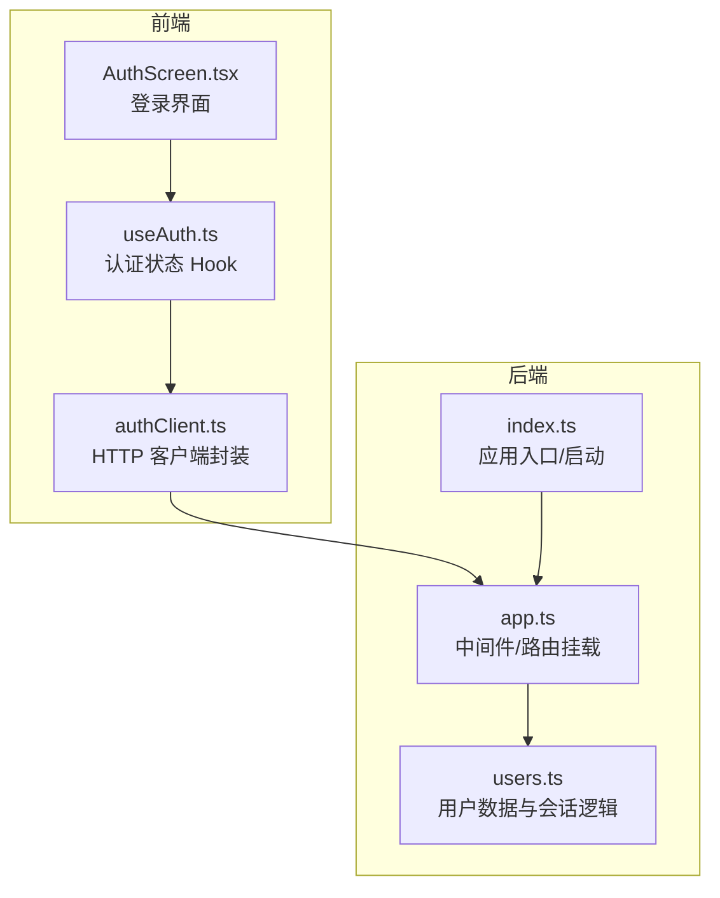
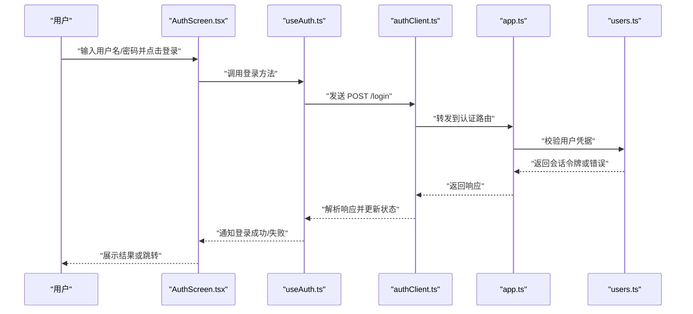
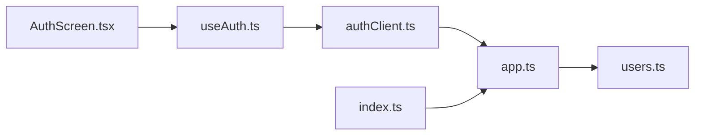
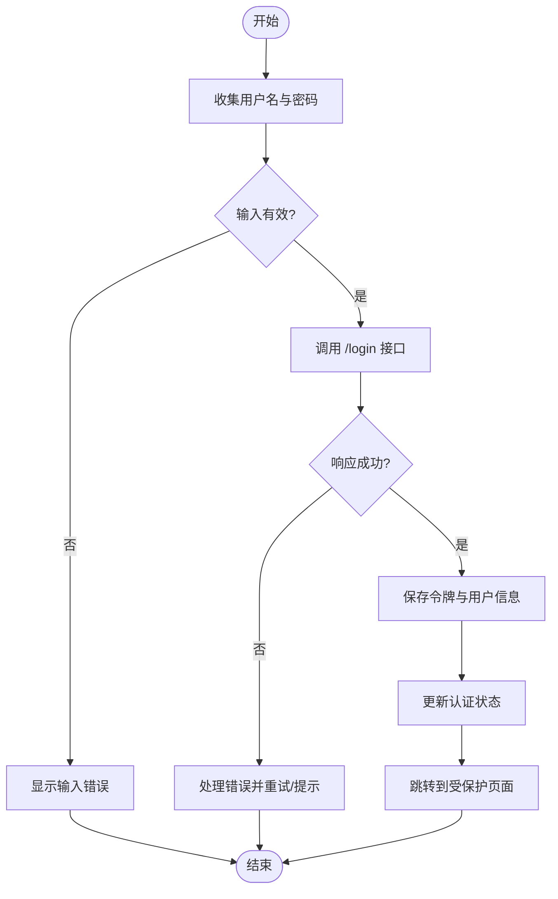

# 用户认证系统

<cite>
**本文引用的文件**   
- [AuthScreen.tsx](file://web/src/components/AuthScreen.tsx)
- [authClient.ts](file://web/src/services/authClient.ts)
- [useAuth.ts](file://web/src/services/useAuth.ts)
- [users.ts](file://web/server/users.ts)
- [app.ts](file://web/server/app.ts)
- [index.ts](file://web/server/index.ts)
</cite>

## 目录
1. [简介](#简介)
2. [项目结构](#项目结构)
3. [核心组件](#核心组件)
4. [架构总览](#架构总览)
5. [详细组件分析](#详细组件分析)
6. [依赖分析](#依赖分析)
7. [性能考虑](#性能考虑)
8. [故障排查指南](#故障排查指南)
9. [结论](#结论)
10. [附录](#附录)

## 简介
本仓库包含一个前后端分离的用户认证子系统。前端提供登录界面与认证状态管理，后端提供用户校验与会话相关接口。整体采用轻量级设计：前端通过 HTTP 客户端调用后端接口完成认证流程，并在本地维护认证状态；后端基于内存存储进行用户验证与会话管理，便于快速演示与开发调试。

## 项目结构
认证相关代码主要分布在以下位置：
- 前端组件与服务：位于 web/src/components 与 web/src/services
- 后端服务与路由：位于 web/server

图表来源
- [AuthScreen.tsx:1-200](file://web/src/components/AuthScreen.tsx#L1-L200)
- [useAuth.ts:1-200](file://web/src/services/useAuth.ts#L1-L200)
- [authClient.ts:1-200](file://web/src/services/authClient.ts#L1-L200)
- [index.ts:1-200](file://web/server/index.ts#L1-L200)
- [app.ts:1-200](file://web/server/app.ts#L1-L200)
- [users.ts:1-200](file://web/server/users.ts#L1-L200)

章节来源
- [AuthScreen.tsx:1-200](file://web/src/components/AuthScreen.tsx#L1-L200)
- [useAuth.ts:1-200](file://web/src/services/useAuth.ts#L1-L200)
- [authClient.ts:1-200](file://web/src/services/authClient.ts#L1-L200)
- [index.ts:1-200](file://web/server/index.ts#L1-L200)
- [app.ts:1-200](file://web/server/app.ts#L1-L200)
- [users.ts:1-200](file://web/server/users.ts#L1-L200)

## 核心组件
- 登录界面（AuthScreen）
  - 负责渲染用户名、密码输入框与登录按钮
  - 触发登录流程并展示错误信息
  - 在登录成功后跳转或切换视图
- 认证状态 Hook（useAuth）
  - 暴露当前认证状态、登录/登出方法
  - 在组件间共享认证上下文
- 认证客户端（authClient）
  - 封装对后端的认证相关 HTTP 请求
  - 统一处理请求头、错误码与响应解析
- 后端用户与会话（users）
  - 提供用户校验、会话创建与查询能力
  - 使用内存数据结构保存用户与会话
- 应用入口与路由（index、app）
  - 启动服务、加载中间件与挂载认证路由
  - 提供 /login、/logout、/me 等接口

章节来源
- [AuthScreen.tsx:1-200](file://web/src/components/AuthScreen.tsx#L1-L200)
- [useAuth.ts:1-200](file://web/src/services/useAuth.ts#L1-L200)
- [authClient.ts:1-200](file://web/src/services/authClient.ts#L1-L200)
- [users.ts:1-200](file://web/server/users.ts#L1-L200)
- [app.ts:1-200](file://web/server/app.ts#L1-L200)
- [index.ts:1-200](file://web/server/index.ts#L1-L200)

## 架构总览
认证流程从前端 UI 发起，经状态管理与 HTTP 客户端到达后端路由，最终由用户与会话模块完成校验与返回结果。

图表来源
- [AuthScreen.tsx:1-200](file://web/src/components/AuthScreen.tsx#L1-L200)
- [useAuth.ts:1-200](file://web/src/services/useAuth.ts#L1-L200)
- [authClient.ts:1-200](file://web/src/services/authClient.ts#L1-L200)
- [app.ts:1-200](file://web/server/app.ts#L1-L200)
- [users.ts:1-200](file://web/server/users.ts#L1-L200)

## 详细组件分析

### 登录界面（AuthScreen）
- 职责
  - 收集用户输入
  - 调用认证 Hook 执行登录
  - 根据结果更新界面状态
- 交互要点
  - 登录前禁用提交按钮防止重复提交
  - 登录失败时显示具体错误提示
  - 登录成功后可触发页面跳转或状态切换
- 关键路径参考
  - [登录表单与事件绑定:1-200](file://web/src/components/AuthScreen.tsx#L1-L200)

章节来源
- [AuthScreen.tsx:1-200](file://web/src/components/AuthScreen.tsx#L1-L200)

### 认证状态 Hook（useAuth）
- 职责
  - 维护 isAuth、token、user 等状态
  - 提供 login、logout、refresh 等方法
  - 在组件中通过 Context 或返回值共享
- 实现要点
  - 登录成功后持久化 token（如 localStorage）
  - 登出时清理本地状态与缓存
  - 提供统一的错误处理与重试策略
- 关键路径参考
  - [认证状态与方法定义:1-200](file://web/src/services/useAuth.ts#L1-L200)

章节来源
- [useAuth.ts:1-200](file://web/src/services/useAuth.ts#L1-L200)

### 认证客户端（authClient）
- 职责
  - 封装认证相关 API 调用
  - 统一设置请求头（如 Authorization）
  - 解析响应体与错误码
- 关键路径参考
  - [POST /login 调用:1-200](file://web/src/services/authClient.ts#L1-L200)
  - [GET /me 获取当前用户:1-200](file://web/src/services/authClient.ts#L1-L200)
  - [POST /logout 登出:1-200](file://web/src/services/authClient.ts#L1-L200)

章节来源
- [authClient.ts:1-200](file://web/src/services/authClient.ts#L1-L200)

### 后端用户与会话（users）
- 职责
  - 用户凭据校验
  - 会话创建、查询与失效
  - 提供内存存储的简单实现
- 数据结构
  - 用户表：id、username、passwordHash、role 等
  - 会话表：sessionId、userId、expiresAt、metadata 等
- 关键路径参考
  - [用户校验与会话创建:1-200](file://web/server/users.ts#L1-L200)

章节来源
- [users.ts:1-200](file://web/server/users.ts#L1-L200)

### 应用入口与路由（index、app）
- 职责
  - index.ts：启动服务、监听端口、打印日志
  - app.ts：注册中间件、挂载认证路由、统一错误处理
- 关键路径参考
  - [服务启动与配置:1-200](file://web/server/index.ts#L1-L200)
  - [认证路由挂载与中间件:1-200](file://web/server/app.ts#L1-L200)

章节来源
- [index.ts:1-200](file://web/server/index.ts#L1-L200)
- [app.ts:1-200](file://web/server/app.ts#L1-L200)

## 依赖分析
认证子系统的依赖关系如下：
- 前端层
  - AuthScreen 依赖 useAuth
  - useAuth 依赖 authClient
- 后端层
  - app 依赖 users
  - index 依赖 app

图表来源
- [AuthScreen.tsx:1-200](file://web/src/components/AuthScreen.tsx#L1-L200)
- [useAuth.ts:1-200](file://web/src/services/useAuth.ts#L1-L200)
- [authClient.ts:1-200](file://web/src/services/authClient.ts#L1-L200)
- [app.ts:1-200](file://web/server/app.ts#L1-L200)
- [users.ts:1-200](file://web/server/users.ts#L1-L200)
- [index.ts:1-200](file://web/server/index.ts#L1-L200)

章节来源
- [AuthScreen.tsx:1-200](file://web/src/components/AuthScreen.tsx#L1-L200)
- [useAuth.ts:1-200](file://web/src/services/useAuth.ts#L1-L200)
- [authClient.ts:1-200](file://web/src/services/authClient.ts#L1-L200)
- [app.ts:1-200](file://web/server/app.ts#L1-L200)
- [users.ts:1-200](file://web/server/users.ts#L1-L200)
- [index.ts:1-200](file://web/server/index.ts#L1-L200)

## 性能考虑
- 前端
  - 避免重复登录请求：在登录进行中禁用提交按钮
  - 合理缓存用户信息：减少不必要的 /me 请求
  - 错误重试与退避：在网络不稳定时增加重试与指数退避
- 后端
  - 会话存储优化：将内存存储替换为 Redis 以提升并发与持久性
  - 索引与查询优化：对用户表与会话表建立必要索引
  - 限流与防暴力破解：对 /login 接口实施速率限制与账户锁定策略

[本节为通用指导，不直接分析具体文件]

## 故障排查指南
- 常见问题
  - 登录失败：检查用户名/密码是否正确、后端用户数据是否初始化
  - 会话无效：确认 token 是否过期、是否被正确携带在请求头中
  - 跨域问题：确保后端已配置允许的源、方法与头部
- 定位步骤
  - 查看浏览器网络面板，确认请求 URL、状态码与响应体
  - 在后端日志中搜索对应时间段的认证请求记录
  - 检查本地存储中的 token 是否存在且格式正确
- 关键路径参考
  - [认证客户端错误处理:1-200](file://web/src/services/authClient.ts#L1-L200)
  - [后端统一错误处理:1-200](file://web/server/app.ts#L1-L200)

章节来源
- [authClient.ts:1-200](file://web/src/services/authClient.ts#L1-L200)
- [app.ts:1-200](file://web/server/app.ts#L1-L200)

## 结论
该认证子系统以简洁的前后端协作方式实现了基础的用户登录与会话管理。前端通过 Hook 与客户端封装简化了认证流程的使用，后端以内存存储提供了快速可用的实现。后续可在安全性（密码哈希、令牌签名）、可靠性（持久化会话、限流）与可扩展性（多租户、角色权限）方面持续增强。

[本节为总结性内容，不直接分析具体文件]

## 附录

### 认证流程图（算法视角）

图表来源
- [AuthScreen.tsx:1-200](file://web/src/components/AuthScreen.tsx#L1-L200)
- [useAuth.ts:1-200](file://web/src/services/useAuth.ts#L1-L200)
- [authClient.ts:1-200](file://web/src/services/authClient.ts#L1-L200)
- [app.ts:1-200](file://web/server/app.ts#L1-L200)
- [users.ts:1-200](file://web/server/users.ts#L1-L200)