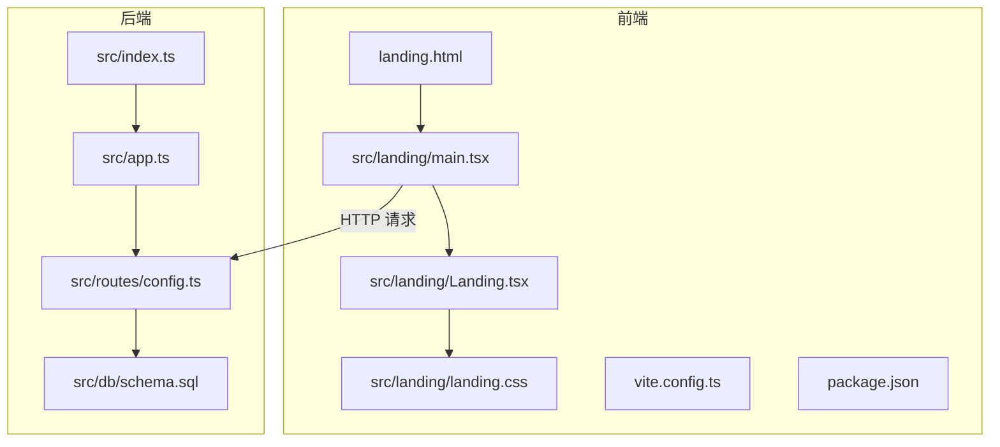
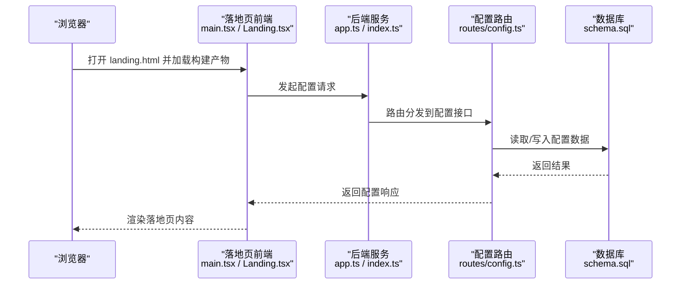
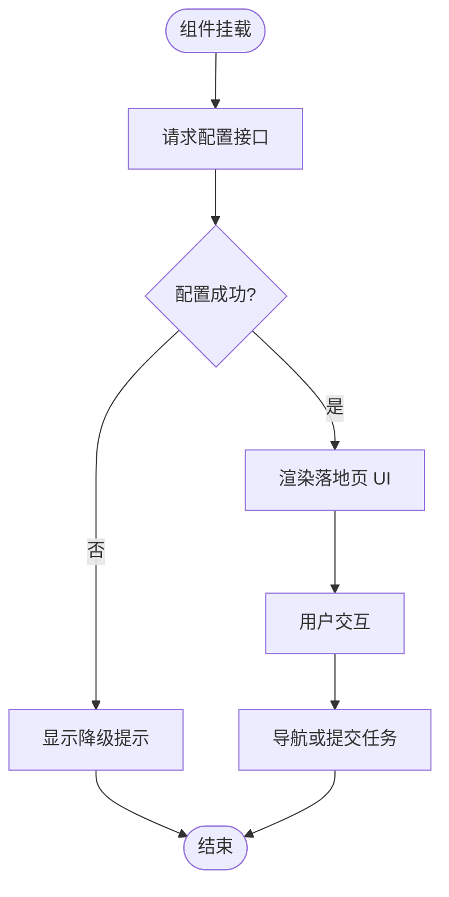
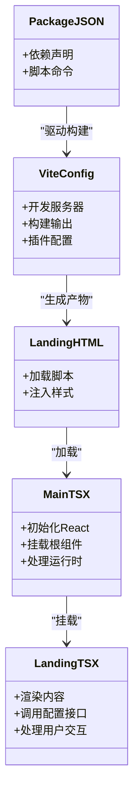
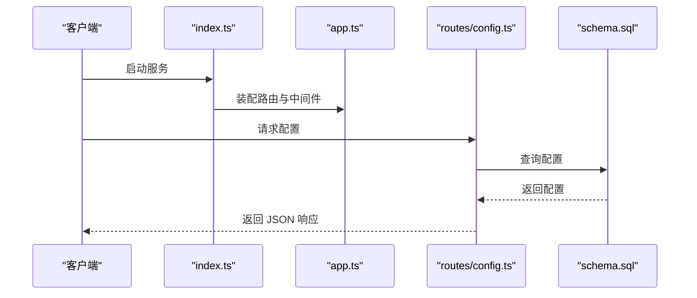
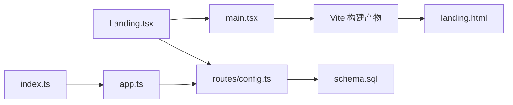

# 落地页面系统

<cite>
**本文引用的文件**   
- [landing.html](file://web/landing.html)
- [web/src/landing/Landing.tsx](file://web/src/landing/Landing.tsx)
- [web/src/landing/main.tsx](file://web/src/landing/main.tsx)
- [web/src/landing/landing.css](file://web/src/landing/landing.css)
- [web/index.html](file://web/index.html)
- [web/vite.config.ts](file://web/vite.config.ts)
- [web/package.json](file://web/package.json)
- [server/src/app.ts](file://server/src/app.ts)
- [server/src/index.ts](file://server/src/index.ts)
- [server/src/routes/config.ts](file://server/src/routes/config.ts)
- [server/src/db/schema.sql](file://server/src/db/schema.sql)
</cite>

## 目录
1. [简介](#简介)
2. [项目结构](#项目结构)
3. [核心组件](#核心组件)
4. [架构总览](#架构总览)
5. [详细组件分析](#详细组件分析)
6. [依赖关系分析](#依赖关系分析)
7. [性能考虑](#性能考虑)
8. [故障排查指南](#故障排查指南)
9. [结论](#结论)
10. [附录](#附录)

## 简介
本仓库包含一个“落地页面系统”，主要用于提供面向用户的静态或轻量级前端入口，并配合后端服务完成配置读取与基础能力集成。前端采用 Vite + React 构建，提供独立的落地页应用；后端基于 Node.js 提供路由与数据库访问能力。整体目标是快速展示产品能力、引导用户进入主应用或执行关键任务。

## 项目结构
- 前端（web）
  - 独立落地页入口：web/landing.html
  - 落地页应用源码：web/src/landing/*（React 组件、样式、入口脚本）
  - 主应用入口与构建配置：web/index.html、web/vite.config.ts、web/package.json
- 后端（server）
  - 应用启动与路由挂载：server/src/index.ts、server/src/app.ts
  - 配置相关路由：server/src/routes/config.ts
  - 数据库初始化与迁移：server/src/db/schema.sql

**图表来源** 
- [web/landing.html](file://web/landing.html)
- [web/src/landing/main.tsx](file://web/src/landing/main.tsx)
- [web/src/landing/Landing.tsx](file://web/src/landing/Landing.tsx)
- [web/src/landing/landing.css](file://web/src/landing/landing.css)
- [web/vite.config.ts](file://web/vite.config.ts)
- [web/package.json](file://web/package.json)
- [server/src/index.ts](file://server/src/index.ts)
- [server/src/app.ts](file://server/src/app.ts)
- [server/src/routes/config.ts](file://server/src/routes/config.ts)
- [server/src/db/schema.sql](file://server/src/db/schema.sql)

**章节来源**
- [web/landing.html](file://web/landing.html)
- [web/src/landing/main.tsx](file://web/src/landing/main.tsx)
- [web/src/landing/Landing.tsx](file://web/src/landing/Landing.tsx)
- [web/src/landing/landing.css](file://web/src/landing/landing.css)
- [web/vite.config.ts](file://web/vite.config.ts)
- [web/package.json](file://web/package.json)
- [server/src/index.ts](file://server/src/index.ts)
- [server/src/app.ts](file://server/src/app.ts)
- [server/src/routes/config.ts](file://server/src/routes/config.ts)
- [server/src/db/schema.sql](file://server/src/db/schema.sql)

## 核心组件
- 落地页 HTML 入口
  - 负责加载前端资源与初始化脚本，作为浏览器访问的起点。
- 落地页应用入口（main.tsx）
  - 初始化 React 应用，挂载根组件，处理基础运行时环境。
- 落地页主组件（Landing.tsx）
  - 渲染落地页内容，组织 UI 结构与交互逻辑。
- 样式文件（landing.css）
  - 定义落地页视觉风格与布局。
- 后端配置路由（routes/config.ts）
  - 暴露配置接口供前端在运行期获取必要参数。
- 应用启动与路由挂载（index.ts、app.ts）
  - 启动 HTTP 服务，注册路由与中间件，连接数据库。
- 数据库模式（db/schema.sql）
  - 定义数据表结构与初始数据。

**章节来源**
- [web/src/landing/main.tsx](file://web/src/landing/main.tsx)
- [web/src/landing/Landing.tsx](file://web/src/landing/Landing.tsx)
- [web/src/landing/landing.css](file://web/src/landing/landing.css)
- [server/src/routes/config.ts](file://server/src/routes/config.ts)
- [server/src/index.ts](file://server/src/index.ts)
- [server/src/app.ts](file://server/src/app.ts)
- [server/src/db/schema.sql](file://server/src/db/schema.sql)

## 架构总览
落地页系统由“前端静态入口 + React 应用”和“后端配置服务”组成。浏览器访问 landing.html 后，通过 Vite 构建产物加载 main.tsx，进而渲染 Landing.tsx。落地页在需要时向后端发起配置请求，后端通过 routes/config.ts 返回配置信息，必要时读写 schema.sql 定义的数据库对象。

**图表来源** 
- [web/src/landing/main.tsx](file://web/src/landing/main.tsx)
- [web/src/landing/Landing.tsx](file://web/src/landing/Landing.tsx)
- [server/src/app.ts](file://server/src/app.ts)
- [server/src/index.ts](file://server/src/index.ts)
- [server/src/routes/config.ts](file://server/src/routes/config.ts)
- [server/src/db/schema.sql](file://server/src/db/schema.sql)

## 详细组件分析

### 前端落地页组件（Landing.tsx）
- 职责
  - 渲染落地页主体内容，组织标题、说明、操作按钮等元素。
  - 与后端配置接口交互以动态调整展示或行为。
- 交互流程
  - 页面加载完成后，向配置接口发起请求，根据返回结果更新状态。
  - 用户点击操作按钮时触发导航或任务提交等动作。
- 错误处理
  - 网络异常或配置缺失时，提供降级显示或提示。
- 性能优化
  - 避免重复请求，缓存配置结果。
  - 按需加载资源，减少首屏体积。

**图表来源** 
- [web/src/landing/Landing.tsx](file://web/src/landing/Landing.tsx)
- [server/src/routes/config.ts](file://server/src/routes/config.ts)

**章节来源**
- [web/src/landing/Landing.tsx](file://web/src/landing/Landing.tsx)

### 前端入口与构建（main.tsx、landing.html、vite.config.ts、package.json）
- 入口脚本（main.tsx）
  - 初始化 React 应用，挂载根节点，绑定事件与生命周期。
- HTML 入口（landing.html）
  - 引入构建后的脚本与样式，作为浏览器访问的起始点。
- 构建配置（vite.config.ts）
  - 定义开发服务器、构建输出路径、插件与代理设置。
- 包管理（package.json）
  - 声明依赖、脚本命令与构建目标。

**图表来源** 
- [web/landing.html](file://web/landing.html)
- [web/src/landing/main.tsx](file://web/src/landing/main.tsx)
- [web/src/landing/Landing.tsx](file://web/src/landing/Landing.tsx)
- [web/vite.config.ts](file://web/vite.config.ts)
- [web/package.json](file://web/package.json)

**章节来源**
- [web/landing.html](file://web/landing.html)
- [web/src/landing/main.tsx](file://web/src/landing/main.tsx)
- [web/vite.config.ts](file://web/vite.config.ts)
- [web/package.json](file://web/package.json)

### 后端服务与配置路由（index.ts、app.ts、routes/config.ts）
- 应用启动（index.ts）
  - 创建 HTTP 服务，监听端口，打印启动日志。
- 应用装配（app.ts）
  - 注册中间件、路由、错误处理与跨域策略。
- 配置路由（routes/config.ts）
  - 提供 GET/POST 接口用于读取或更新配置。
  - 与数据库交互，确保配置持久化。
- 数据库模式（schema.sql）
  - 定义配置表结构、索引与约束。

**图表来源** 
- [server/src/index.ts](file://server/src/index.ts)
- [server/src/app.ts](file://server/src/app.ts)
- [server/src/routes/config.ts](file://server/src/routes/config.ts)
- [server/src/db/schema.sql](file://server/src/db/schema.sql)

**章节来源**
- [server/src/index.ts](file://server/src/index.ts)
- [server/src/app.ts](file://server/src/app.ts)
- [server/src/routes/config.ts](file://server/src/routes/config.ts)
- [server/src/db/schema.sql](file://server/src/db/schema.sql)

### 样式与主题（landing.css）
- 作用
  - 定义落地页的布局、颜色、字体与响应式规则。
- 建议
  - 将通用样式抽离为可复用模块，便于维护与扩展。
  - 使用 CSS 变量管理主题色，支持多主题切换。

**章节来源**
- [web/src/landing/landing.css](file://web/src/landing/landing.css)

## 依赖关系分析
- 前端依赖
  - React 生态（组件、渲染、路由等）
  - Vite 构建工具（开发服务器、打包、热重载）
- 后端依赖
  - HTTP 框架（Express/Koa 等）
  - 数据库驱动（PostgreSQL/MySQL 等）
- 外部集成
  - 配置中心或环境变量（可选）
  - 第三方服务（如认证、埋点、CDN）

**图表来源** 
- [web/src/landing/Landing.tsx](file://web/src/landing/Landing.tsx)
- [web/src/landing/main.tsx](file://web/src/landing/main.tsx)
- [web/landing.html](file://web/landing.html)
- [server/src/index.ts](file://server/src/index.ts)
- [server/src/app.ts](file://server/src/app.ts)
- [server/src/routes/config.ts](file://server/src/routes/config.ts)
- [server/src/db/schema.sql](file://server/src/db/schema.sql)

**章节来源**
- [web/src/landing/Landing.tsx](file://web/src/landing/Landing.tsx)
- [web/src/landing/main.tsx](file://web/src/landing/main.tsx)
- [web/landing.html](file://web/landing.html)
- [server/src/index.ts](file://server/src/index.ts)
- [server/src/app.ts](file://server/src/app.ts)
- [server/src/routes/config.ts](file://server/src/routes/config.ts)
- [server/src/db/schema.sql](file://server/src/db/schema.sql)

## 性能考虑
- 首屏加载
  - 启用代码分割与懒加载，减少初始包体。
  - 对图片与字体进行压缩与缓存。
- 网络请求
  - 合并配置请求，避免重复调用。
  - 使用缓存策略（ETag/Cache-Control）提升命中率。
- 渲染性能
  - 避免不必要的重渲染，合理使用 React.memo 与 useMemo。
  - 大列表虚拟化渲染，降低 DOM 压力。
- 服务端
  - 配置接口增加分页与字段裁剪，减少传输量。
  - 数据库查询添加合适索引，避免全表扫描。

[本节为通用指导，不直接分析具体文件]

## 故障排查指南
- 前端无法加载
  - 检查 landing.html 是否正确引入构建产物。
  - 确认 vite.config.ts 的输出路径与部署一致。
- 配置接口失败
  - 验证后端服务是否启动，端口是否开放。
  - 检查 routes/config.ts 的路由是否与前端请求匹配。
  - 查看数据库连接与 schema.sql 是否已正确初始化。
- 样式未生效
  - 确认 landing.css 被正确引入且未被覆盖。
  - 检查浏览器开发者工具的 Network 面板是否有 404。

**章节来源**
- [web/landing.html](file://web/landing.html)
- [web/vite.config.ts](file://web/vite.config.ts)
- [server/src/routes/config.ts](file://server/src/routes/config.ts)
- [server/src/db/schema.sql](file://server/src/db/schema.sql)

## 结论
落地页面系统通过简洁的前端入口与后端配置服务，实现了快速展示与基本交互。建议在后续迭代中完善错误处理、监控埋点与性能优化，以提升用户体验与可维护性。

[本节为总结性内容，不直接分析具体文件]

## 附录
- 常见命令
  - 安装依赖：参考 web/package.json 中的 scripts。
  - 本地开发：使用 Vite 启动前端服务。
  - 启动后端：参考 server/src/index.ts 的启动方式。
- 部署建议
  - 前端静态资源托管至 CDN。
  - 后端容器化部署，配置环境变量与数据库连接。

[本节为补充信息，不直接分析具体文件]