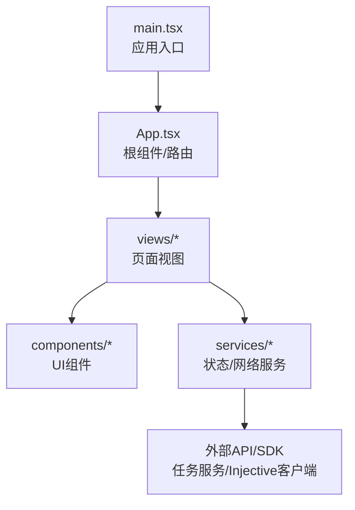
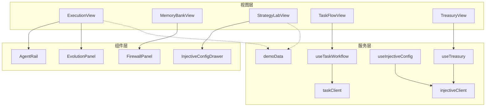
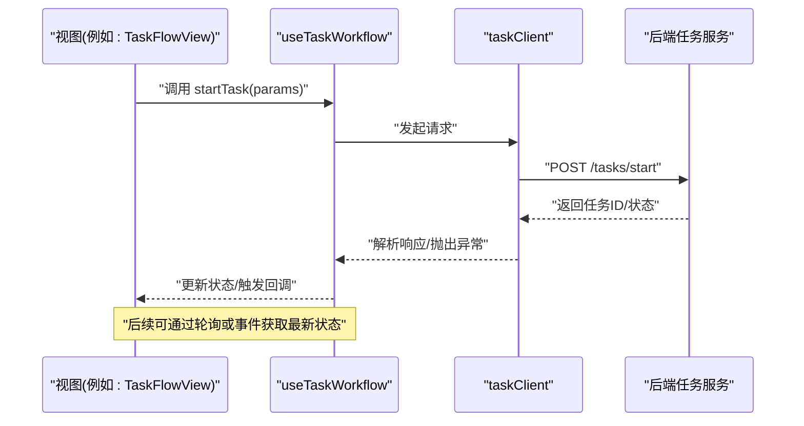
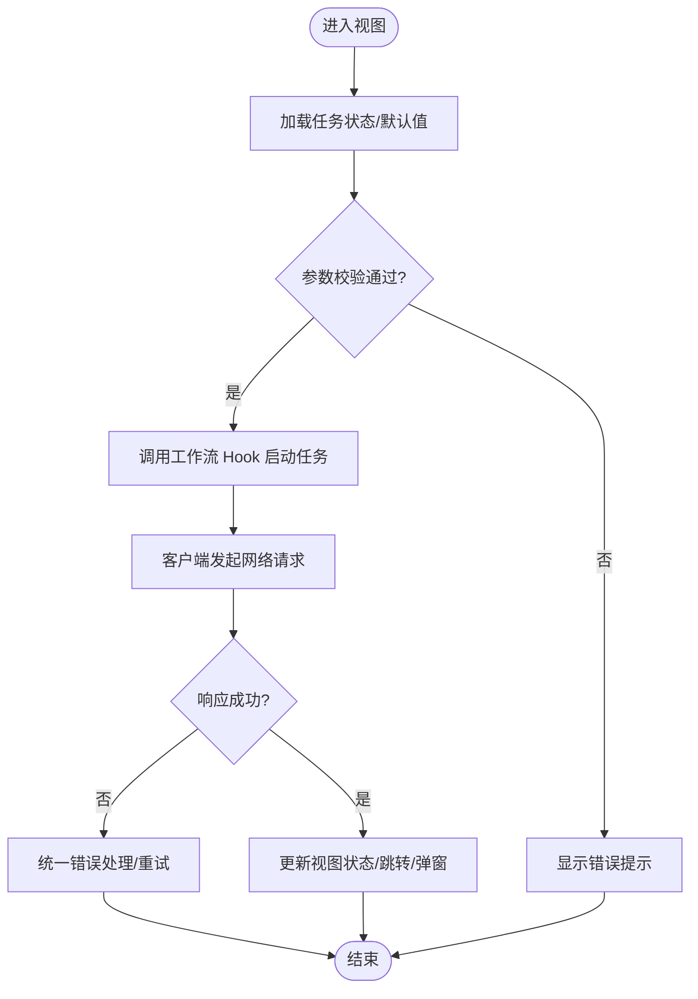
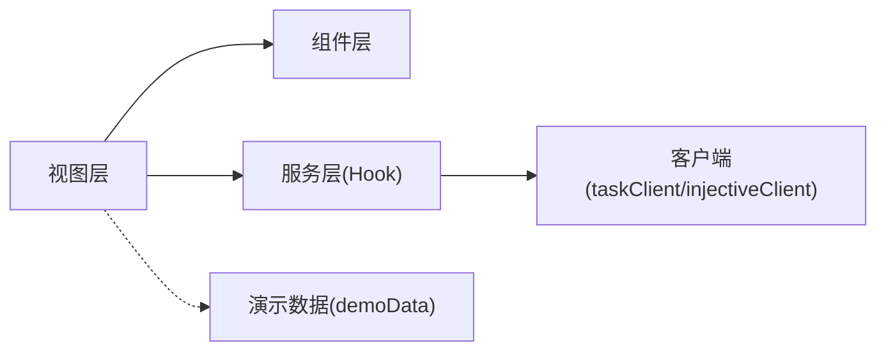

# 视图组件系统

<cite>
**本文引用的文件**   
- [App.tsx](file://web/src/App.tsx)
- [main.tsx](file://web/src/main.tsx)
- [ExecutionView.tsx](file://web/src/views/ExecutionView.tsx)
- [MemoryBankView.tsx](file://web/src/views/MemoryBankView.tsx)
- [StrategyLabView.tsx](file://web/src/views/StrategyLabView.tsx)
- [TaskFlowView.tsx](file://web/src/views/TaskFlowView.tsx)
- [TreasuryView.tsx](file://web/src/views/TreasuryView.tsx)
- [AgentRail.tsx](file://web/src/components/AgentRail.tsx)
- [EvolutionPanel.tsx](file://web/src/components/EvolutionPanel.tsx)
- [FirewallPanel.tsx](file://web/src/components/FirewallPanel.tsx)
- [InjectiveConfigDrawer.tsx](file://web/src/components/InjectiveConfigDrawer.tsx)
- [useTaskWorkflow.ts](file://web/src/services/useTaskWorkflow.ts)
- [useTreasury.ts](file://web/src/services/useTreasury.ts)
- [useInjectiveConfig.ts](file://web/src/services/useInjectiveConfig.ts)
- [taskClient.ts](file://web/src/services/taskClient.ts)
- [injectiveClient.ts](file://web/src/services/injectiveClient.ts)
- [demoData.ts](file://web/src/services/demoData.ts)
</cite>

## 目录
1. [简介](#简介)
2. [项目结构](#项目结构)
3. [核心组件](#核心组件)
4. [架构总览](#架构总览)
5. [详细组件分析](#详细组件分析)
6. [依赖关系分析](#依赖关系分析)
7. [性能考虑](#性能考虑)
8. [故障排查指南](#故障排查指南)
9. [结论](#结论)
10. [附录](#附录)

## 简介
本文件聚焦于前端“视图组件系统”，围绕 web 子工程中的 React 视图与组件组织方式、数据流与服务集成进行系统化说明。目标读者包括产品与研发人员，既提供高层架构概览，也深入到关键组件的职责边界、交互流程与可维护性建议。

## 项目结构
前端采用按功能域划分的目录组织：
- views：页面级视图（路由容器），负责组合业务面板与布局
- components：通用或领域内复用的小组件（抽屉、面板、轨道等）
- services：状态与网络服务封装（任务工作流、金库、配置、演示数据）
- App.tsx：应用根组件，挂载路由与全局上下文
- main.tsx：应用入口，渲染根组件

图表来源
- [main.tsx](file://web/src/main.tsx)
- [App.tsx](file://web/src/App.tsx)

章节来源
- [main.tsx](file://web/src/main.tsx)
- [App.tsx](file://web/src/App.tsx)

## 核心组件
- 页面视图层
  - ExecutionView：执行结果与运行态展示
  - MemoryBankView：记忆库/知识库的浏览与管理
  - StrategyLabView：策略实验室的配置与回测
  - TaskFlowView：任务编排与流程可视化
  - TreasuryView：金库资产与交易记录
- 通用组件层
  - AgentRail：智能体列表/轨道
  - EvolutionPanel：演化面板（如模型/策略迭代）
  - FirewallPanel：防火墙规则管理
  - InjectiveConfigDrawer：Injective 配置抽屉
- 服务层
  - useTaskWorkflow：任务工作流状态与操作
  - useTreasury：金库相关状态与操作
  - useInjectiveConfig：Injective 配置读取与更新
  - taskClient：任务服务 HTTP 客户端
  - injectiveClient：Injective 链上/交易所客户端
  - demoData：演示数据生成器

章节来源
- [ExecutionView.tsx](file://web/src/views/ExecutionView.tsx)
- [MemoryBankView.tsx](file://web/src/views/MemoryBankView.tsx)
- [StrategyLabView.tsx](file://web/src/views/StrategyLabView.tsx)
- [TaskFlowView.tsx](file://web/src/views/TaskFlowView.tsx)
- [TreasuryView.tsx](file://web/src/views/TreasuryView.tsx)
- [AgentRail.tsx](file://web/src/components/AgentRail.tsx)
- [EvolutionPanel.tsx](file://web/src/components/EvolutionPanel.tsx)
- [FirewallPanel.tsx](file://web/src/components/FirewallPanel.tsx)
- [InjectiveConfigDrawer.tsx](file://web/src/components/InjectiveConfigDrawer.tsx)
- [useTaskWorkflow.ts](file://web/src/services/useTaskWorkflow.ts)
- [useTreasury.ts](file://web/src/services/useTreasury.ts)
- [useInjectiveConfig.ts](file://web/src/services/useInjectiveConfig.ts)
- [taskClient.ts](file://web/src/services/taskClient.ts)
- [injectiveClient.ts](file://web/src/services/injectiveClient.ts)
- [demoData.ts](file://web/src/services/demoData.ts)

## 架构总览
视图组件系统遵循“视图-组件-服务”的分层模式：
- 视图层：聚合 UI 组件与服务 Hook，承载页面逻辑
- 组件层：无状态或轻状态的纯展示/交互单元
- 服务层：封装副作用（网络请求、状态同步）、暴露 Hook 供视图消费

图表来源
- [ExecutionView.tsx](file://web/src/views/ExecutionView.tsx)
- [MemoryBankView.tsx](file://web/src/views/MemoryBankView.tsx)
- [StrategyLabView.tsx](file://web/src/views/StrategyLabView.tsx)
- [TaskFlowView.tsx](file://web/src/views/TaskFlowView.tsx)
- [TreasuryView.tsx](file://web/src/views/TreasuryView.tsx)
- [AgentRail.tsx](file://web/src/components/AgentRail.tsx)
- [EvolutionPanel.tsx](file://web/src/components/EvolutionPanel.tsx)
- [FirewallPanel.tsx](file://web/src/components/FirewallPanel.tsx)
- [InjectiveConfigDrawer.tsx](file://web/src/components/InjectiveConfigDrawer.tsx)
- [useTaskWorkflow.ts](file://web/src/services/useTaskWorkflow.ts)
- [useTreasury.ts](file://web/src/services/useTreasury.ts)
- [useInjectiveConfig.ts](file://web/src/services/useInjectiveConfig.ts)
- [taskClient.ts](file://web/src/services/taskClient.ts)
- [injectiveClient.ts](file://web/src/services/injectiveClient.ts)
- [demoData.ts](file://web/src/services/demoData.ts)

## 详细组件分析

### 视图层职责与协作
- ExecutionView：呈现执行结果、日志与状态；通过任务工作流 Hook 触发执行与轮询；必要时使用演示数据快速验证
- MemoryBankView：展示记忆条目，支持检索与筛选；通常由服务层提供缓存或本地存储能力
- StrategyLabView：策略参数编辑、保存与回测；与 Injective 配置联动，可能使用演示数据进行模拟
- TaskFlowView：任务编排可视化，包含创建、启动、停止、重试等操作；强依赖任务工作流 Hook
- TreasuryView：资产概览、交易流水、出入金操作；依赖金库服务 Hook 与注入式客户端

章节来源
- [ExecutionView.tsx](file://web/src/views/ExecutionView.tsx)
- [MemoryBankView.tsx](file://web/src/views/MemoryBankView.tsx)
- [StrategyLabView.tsx](file://web/src/views/StrategyLabView.tsx)
- [TaskFlowView.tsx](file://web/src/views/TaskFlowView.tsx)
- [TreasuryView.tsx](file://web/src/views/TreasuryView.tsx)

### 通用组件设计要点
- AgentRail：以列表/轨道形式展示智能体，支持选择、排序与批量操作；适合在多个视图中复用
- EvolutionPanel：用于展示模型/策略的演化历史与对比；常与策略实验室配合
- FirewallPanel：提供规则增删改查与启用/禁用开关；关注表单校验与即时反馈
- InjectiveConfigDrawer：抽屉式配置面板，集中管理链/交易所连接参数；变更需持久化并通知相关服务

章节来源
- [AgentRail.tsx](file://web/src/components/AgentRail.tsx)
- [EvolutionPanel.tsx](file://web/src/components/EvolutionPanel.tsx)
- [FirewallPanel.tsx](file://web/src/components/FirewallPanel.tsx)
- [InjectiveConfigDrawer.tsx](file://web/src/components/InjectiveConfigDrawer.tsx)

### 服务层与数据流
- useTaskWorkflow：封装任务生命周期（创建、调度、查询、取消）；对外暴露状态与操作方法
- useTreasury：封装金库相关状态（余额、流水、持仓）与操作（转账、充值）
- useInjectiveConfig：管理 Injective 配置项的读取、校验与更新
- taskClient / injectiveClient：HTTP/SDK 客户端，统一错误处理、重试与鉴权
- demoData：为开发/演示场景提供稳定数据源，便于联调与回归

图表来源
- [TaskFlowView.tsx](file://web/src/views/TaskFlowView.tsx)
- [useTaskWorkflow.ts](file://web/src/services/useTaskWorkflow.ts)
- [taskClient.ts](file://web/src/services/taskClient.ts)

章节来源
- [useTaskWorkflow.ts](file://web/src/services/useTaskWorkflow.ts)
- [useTreasury.ts](file://web/src/services/useTreasury.ts)
- [useInjectiveConfig.ts](file://web/src/services/useInjectiveConfig.ts)
- [taskClient.ts](file://web/src/services/taskClient.ts)
- [injectiveClient.ts](file://web/src/services/injectiveClient.ts)
- [demoData.ts](file://web/src/services/demoData.ts)

### 复杂逻辑流程图（示例：任务启动）

图表来源
- [TaskFlowView.tsx](file://web/src/views/TaskFlowView.tsx)
- [useTaskWorkflow.ts](file://web/src/services/useTaskWorkflow.ts)
- [taskClient.ts](file://web/src/services/taskClient.ts)

## 依赖关系分析
- 视图对组件的依赖：通过 props 传递数据与回调，保持松耦合
- 视图对服务的依赖：通过 Hook 订阅状态与触发副作用，避免直接耦合网络细节
- 服务对客户端的依赖：taskClient/injectiveClient 作为唯一出口，屏蔽底层差异
- 演示数据作为可选依赖：在开发/测试环境注入，不影响生产路径

图表来源
- [App.tsx](file://web/src/App.tsx)
- [ExecutionView.tsx](file://web/src/views/ExecutionView.tsx)
- [TaskFlowView.tsx](file://web/src/views/TaskFlowView.tsx)
- [useTaskWorkflow.ts](file://web/src/services/useTaskWorkflow.ts)
- [taskClient.ts](file://web/src/services/taskClient.ts)
- [injectiveClient.ts](file://web/src/services/injectiveClient.ts)
- [demoData.ts](file://web/src/services/demoData.ts)

章节来源
- [App.tsx](file://web/src/App.tsx)
- [ExecutionView.tsx](file://web/src/views/ExecutionView.tsx)
- [TaskFlowView.tsx](file://web/src/views/TaskFlowView.tsx)
- [useTaskWorkflow.ts](file://web/src/services/useTaskWorkflow.ts)
- [taskClient.ts](file://web/src/services/taskClient.ts)
- [injectiveClient.ts](file://web/src/services/injectiveClient.ts)
- [demoData.ts](file://web/src/services/demoData.ts)

## 性能考虑
- 列表与表格虚拟化：当记忆库/任务列表规模较大时，采用虚拟滚动降低渲染压力
- 状态局部化：将频繁更新的字段下沉到更细粒度的 Hook 或组件，减少重渲染范围
- 请求去抖与节流：搜索、过滤与高频操作应做防抖/节流，避免重复请求
- 缓存策略：对只读或低频变更数据（如配置、字典）增加短期缓存
- 懒加载与代码分割：按需加载视图与重型组件，缩短首屏时间
- 错误边界：为关键视图包裹错误边界，防止单点崩溃影响整体体验

[本节为通用指导，不直接分析具体文件]

## 故障排查指南
- 网络请求失败
  - 检查客户端基础 URL、鉴权头与跨域设置
  - 查看统一错误处理是否捕获并上报
- 状态不同步
  - 确认 Hook 是否正确订阅/清理副作用
  - 检查是否存在竞态条件（并发请求覆盖）
- 配置未生效
  - 核对配置抽屉提交后是否持久化并刷新相关服务
- 演示数据干扰
  - 确认环境变量或开关是否正确切换真实/演示数据源

章节来源
- [useTaskWorkflow.ts](file://web/src/services/useTaskWorkflow.ts)
- [useTreasury.ts](file://web/src/services/useTreasury.ts)
- [useInjectiveConfig.ts](file://web/src/services/useInjectiveConfig.ts)
- [taskClient.ts](file://web/src/services/taskClient.ts)
- [injectiveClient.ts](file://web/src/services/injectiveClient.ts)
- [InjectiveConfigDrawer.tsx](file://web/src/components/InjectiveConfigDrawer.tsx)

## 结论
视图组件系统以清晰的层次划分与稳定的服务抽象为核心，实现了良好的可维护性与可扩展性。通过 Hook 驱动的状态管理与统一的客户端封装，视图层得以专注于业务编排与用户体验。建议在后续迭代中持续完善错误边界、性能优化与可观测性，进一步提升系统的稳定性与可诊断性。

[本节为总结性内容，不直接分析具体文件]

## 附录
- 术语
  - 视图：页面级 React 组件，负责组合 UI 与业务逻辑
  - 组件：可复用的 UI 单元，尽量无状态或轻状态
  - 服务：封装副作用与状态的业务 Hook/模块
  - 客户端：与后端或第三方 SDK 交互的统一接口

[本节为概念性内容，不直接分析具体文件]