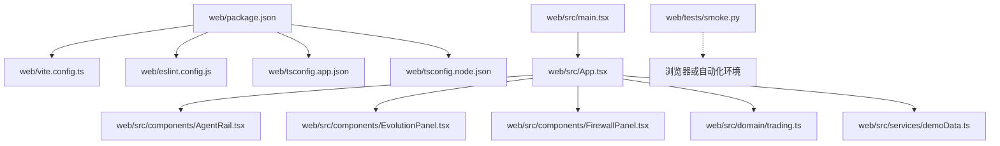
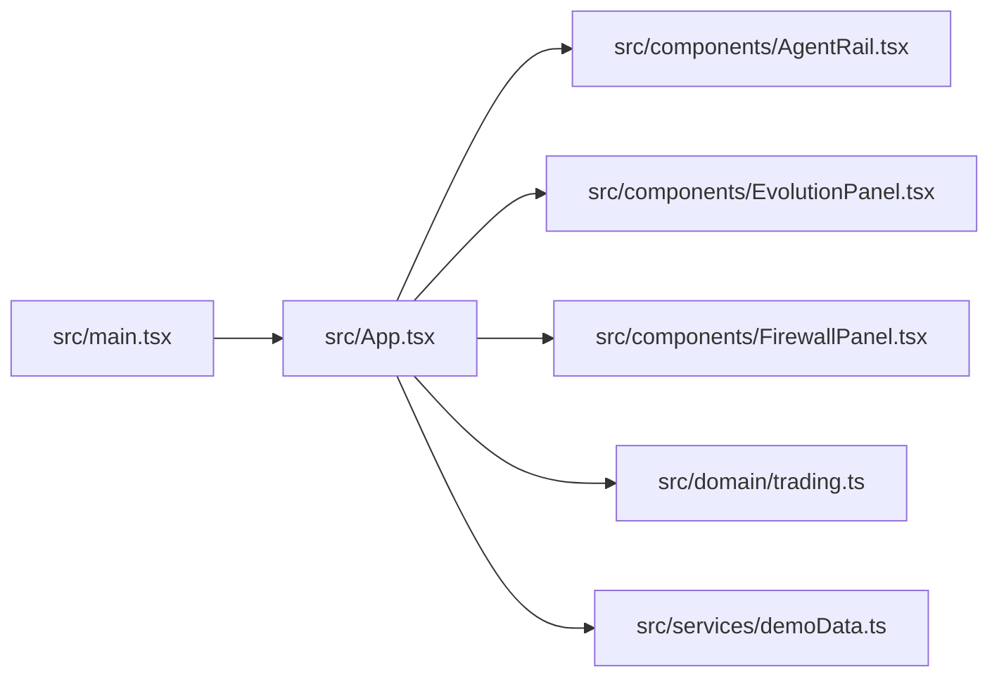
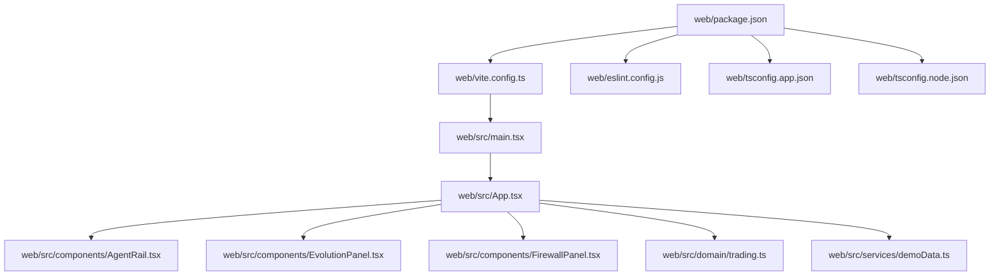

# 测试与调试

<cite>
**本文引用的文件**   
- [package.json](file://web/package.json)
- [vite.config.ts](file://web/vite.config.ts)
- [eslint.config.js](file://web/eslint.config.js)
- [tsconfig.app.json](file://web/tsconfig.app.json)
- [tsconfig.node.json](file://web/tsconfig.node.json)
- [App.tsx](file://web/src/App.tsx)
- [main.tsx](file://web/src/main.tsx)
- [AgentRail.tsx](file://web/src/components/AgentRail.tsx)
- [EvolutionPanel.tsx](file://web/src/components/EvolutionPanel.tsx)
- [FirewallPanel.tsx](file://web/src/components/FirewallPanel.tsx)
- [trading.ts](file://web/src/domain/trading.ts)
- [demoData.ts](file://web/src/services/demoData.ts)
- [smoke.py](file://web/tests/smoke.py)
</cite>

## 目录
1. [简介](#简介)
2. [项目结构](#项目结构)
3. [核心组件](#核心组件)
4. [架构总览](#架构总览)
5. [详细组件分析](#详细组件分析)
6. [依赖分析](#依赖分析)
7. [性能考虑](#性能考虑)
8. [故障排查指南](#故障排查指南)
9. [结论](#结论)
10. [附录](#附录)

## 简介
本指南面向AdventureX前端工程的质量保证与调试实践，覆盖单元测试、集成测试与端到端测试策略，ESLint代码检查配置与自定义规则，浏览器与React DevTools调试方法，错误日志记录与分析，异常处理最佳实践，以及常见问题排查步骤。目标是帮助开发者建立稳定、可维护的调试工作流与质量门禁。

## 项目结构
本项目采用Vite + React + TypeScript的前端工程组织方式，关键目录与职责如下：
- web/src：应用源码，包含入口、页面级组件、业务领域模型与服务层数据
- web/tests：测试脚本与产物目录（当前包含一个端到端冒烟脚本）
- web根目录：构建与工具链配置（Vite、ESLint、TypeScript等）

图表来源
- [package.json](file://web/package.json)
- [vite.config.ts](file://web/vite.config.ts)
- [eslint.config.js](file://web/eslint.config.js)
- [tsconfig.app.json](file://web/tsconfig.app.json)
- [tsconfig.node.json](file://web/tsconfig.node.json)
- [main.tsx](file://web/src/main.tsx)
- [App.tsx](file://web/src/App.tsx)
- [AgentRail.tsx](file://web/src/components/AgentRail.tsx)
- [EvolutionPanel.tsx](file://web/src/components/EvolutionPanel.tsx)
- [FirewallPanel.tsx](file://web/src/components/FirewallPanel.tsx)
- [trading.ts](file://web/src/domain/trading.ts)
- [demoData.ts](file://web/src/services/demoData.ts)
- [smoke.py](file://web/tests/smoke.py)

章节来源
- [package.json](file://web/package.json)
- [vite.config.ts](file://web/vite.config.ts)
- [eslint.config.js](file://web/eslint.config.js)
- [tsconfig.app.json](file://web/tsconfig.app.json)
- [tsconfig.node.json](file://web/tsconfig.node.json)
- [main.tsx](file://web/src/main.tsx)
- [App.tsx](file://web/src/App.tsx)
- [AgentRail.tsx](file://web/src/components/AgentRail.tsx)
- [EvolutionPanel.tsx](file://web/src/components/EvolutionPanel.tsx)
- [FirewallPanel.tsx](file://web/src/components/FirewallPanel.tsx)
- [trading.ts](file://web/src/domain/trading.ts)
- [demoData.ts](file://web/src/services/demoData.ts)
- [smoke.py](file://web/tests/smoke.py)

## 核心组件
本节聚焦质量保证相关的关键配置与入口点，说明其在测试与调试中的作用。

- 包管理与脚本入口
  - package.json集中管理依赖与脚本命令，是运行测试、构建、启动开发服务器与执行ESLint的统一入口。
  - 建议为不同测试类型定义独立脚本（如单元测试、集成测试、端到端测试），便于CI流水线分层执行。

- 构建与开发服务器
  - vite.config.ts控制开发服务器、插件、别名与构建行为。可通过环境变量切换测试模式，注入模拟服务或关闭外部依赖。

- 代码质量与静态检查
  - eslint.config.js提供ESLint配置，统一代码风格与规则集。建议结合IDE实时提示与提交前钩子（如husky+lint-staged）提升质量。

- TypeScript配置
  - tsconfig.app.json与tsconfig.node.json分别约束应用与Node侧编译选项，确保类型安全与模块解析一致。

章节来源
- [package.json](file://web/package.json)
- [vite.config.ts](file://web/vite.config.ts)
- [eslint.config.js](file://web/eslint.config.js)
- [tsconfig.app.json](file://web/tsconfig.app.json)
- [tsconfig.node.json](file://web/tsconfig.node.json)

## 架构总览
下图展示从应用入口到UI组件与领域模型的调用关系，有助于定位测试边界与断言位置。

图表来源
- [main.tsx](file://web/src/main.tsx)
- [App.tsx](file://web/src/App.tsx)
- [AgentRail.tsx](file://web/src/components/AgentRail.tsx)
- [EvolutionPanel.tsx](file://web/src/components/EvolutionPanel.tsx)
- [FirewallPanel.tsx](file://web/src/components/FirewallPanel.tsx)
- [trading.ts](file://web/src/domain/trading.ts)
- [demoData.ts](file://web/src/services/demoData.ts)

## 详细组件分析

### 单元测试策略与实践
- 目标与范围
  - 对纯函数与无副作用逻辑进行快速验证，优先覆盖domain层与工具函数。
  - 示例关注点：交易领域模型计算、状态转换、边界条件与异常分支。

- 框架选择与安装
  - 推荐在现有包管理中引入轻量级测试框架与断言库，并配置与Vite兼容的运行器。
  - 若需React组件渲染与交互，可引入配套的React测试工具以支持组件级断言。

- 用例编写规范
  - 命名：描述“被测单元_场景_期望结果”
  - 结构：Arrange-Act-Assert三段式
  - 隔离：避免真实网络请求与外部I/O，使用mock或stub
  - 可重复：固定时间源、随机种子与确定性输入

- 测试数据准备
  - 将样例数据与工厂函数置于tests/fixtures或tests/factories目录
  - 通过服务层提供的演示数据作为基础样本，必要时裁剪与扩展

- 与Vite集成要点
  - 在构建配置中启用测试模式的环境变量，按需替换全局常量或服务地址
  - 使用路径别名简化导入，保持测试与源码一致的模块解析

章节来源
- [package.json](file://web/package.json)
- [vite.config.ts](file://web/vite.config.ts)
- [trading.ts](file://web/src/domain/trading.ts)
- [demoData.ts](file://web/src/services/demoData.ts)

### 集成测试策略与实践
- 目标与范围
  - 验证组件间协作、路由跳转、状态共享与异步流程的正确性
  - 覆盖关键用户旅程，如面板初始化、数据加载与更新

- 实现建议
  - 使用组件测试框架配合测试渲染器，模拟上下文与外部依赖
  - 对网络请求进行拦截与响应模拟，确保可重复性与稳定性
  - 针对复杂交互，编写基于事件与状态的断言

- 与构建系统集成
  - 通过环境变量切换Mock后端或本地数据源
  - 在CI中并行执行多组集成用例，缩短反馈周期

章节来源
- [App.tsx](file://web/src/App.tsx)
- [AgentRail.tsx](file://web/src/components/AgentRail.tsx)
- [EvolutionPanel.tsx](file://web/src/components/EvolutionPanel.tsx)
- [FirewallPanel.tsx](file://web/src/components/FirewallPanel.tsx)
- [vite.config.ts](file://web/vite.config.ts)

### 端到端测试策略与实践
- 目标与范围
  - 在真实浏览器环境中验证关键业务流程，包括登录、导航、表单提交与结果展示
  - 覆盖跨页面与跨会话的用户旅程

- 现有冒烟脚本
  - tests/smoke.py可作为E2E基线，用于快速验证构建产物是否可用、关键页面是否可访问
  - 建议在CI中将其作为首道门禁，失败则阻断后续阶段

- 实施建议
  - 选择成熟的浏览器自动化框架，按功能域拆分测试套件
  - 使用稳定的选择器与重试机制，降低偶发失败
  - 为不同环境（dev/staging/prod）提供独立的基线与凭据

章节来源
- [smoke.py](file://web/tests/smoke.py)

### ESLint配置与自定义规则
- 配置要点
  - 在eslint.config.js中启用必要的语言与框架插件，统一团队风格
  - 针对React与TypeScript开启严格规则，减少潜在缺陷
  - 结合编辑器与提交钩子，实现“写即检”

- 自定义规则建议
  - 禁止在生产代码中使用console.log，改用结构化日志
  - 强制组件导出命名与文件命名一致
  - 限制直接访问DOM API，鼓励使用抽象封装

- 与构建和CI集成
  - 在构建前执行ESLint，失败则中断构建
  - 在CI中输出报告并归档，便于回溯

章节来源
- [eslint.config.js](file://web/eslint.config.js)

### 浏览器调试与React DevTools
- 浏览器调试
  - 使用Sources面板设置断点、单步执行与表达式求值
  - 使用Network面板观察请求与缓存，Console面板查看日志与错误堆栈
  - 使用Performance面板录制性能片段，识别重排与长任务

- React DevTools
  - 组件树：检查props/state变化与渲染次数
  - Profiler：捕获渲染耗时与原因，定位不必要的重渲染
  - 与Vite热重载联动，提高调试效率

- 调试技巧
  - 使用条件断点与日志过滤，缩小问题范围
  - 利用Time Travel调试（如适用）复现场景
  - 将关键状态序列化为快照，便于对比与回归

[本节为通用调试方法说明，不直接分析具体文件]

### 错误日志记录与分析
- 日志策略
  - 分级记录：info/warn/error，附带上下文信息（用户ID、操作、时间戳）
  - 结构化输出：JSON格式，便于聚合与检索
  - 脱敏与合规：避免记录敏感信息

- 采集与上报
  - 在应用入口注册全局错误处理器，捕获未捕获异常与Promise拒绝
  - 对关键业务路径埋点，记录关键事件与错误码
  - 区分开发环境与生产环境的上报策略

- 分析与告警
  - 建立错误聚合看板，按模块与版本维度统计
  - 设定阈值触发告警，快速定位线上问题

[本节为通用日志策略说明，不直接分析具体文件]

### 异常处理最佳实践
- 原则
  - 尽早失败：在输入校验与前置条件处抛出明确错误
  - 局部恢复：对可恢复错误进行降级与回退
  - 清晰传播：上层统一处理与呈现，避免泄露内部细节

- 常见模式
  - 使用统一的错误类型与错误码
  - 对异步流程使用try/catch与finally清理资源
  - 对外部依赖调用增加超时与重试策略

[本节为通用异常处理策略说明，不直接分析具体文件]

## 依赖分析
下图展示主要配置文件之间的依赖关系，有助于理解测试与调试在不同阶段的切入点。

图表来源
- [package.json](file://web/package.json)
- [vite.config.ts](file://web/vite.config.ts)
- [eslint.config.js](file://web/eslint.config.js)
- [tsconfig.app.json](file://web/tsconfig.app.json)
- [tsconfig.node.json](file://web/tsconfig.node.json)
- [main.tsx](file://web/src/main.tsx)
- [App.tsx](file://web/src/App.tsx)
- [AgentRail.tsx](file://web/src/components/AgentRail.tsx)
- [EvolutionPanel.tsx](file://web/src/components/EvolutionPanel.tsx)
- [FirewallPanel.tsx](file://web/src/components/FirewallPanel.tsx)
- [trading.ts](file://web/src/domain/trading.ts)
- [demoData.ts](file://web/src/services/demoData.ts)

章节来源
- [package.json](file://web/package.json)
- [vite.config.ts](file://web/vite.config.ts)
- [eslint.config.js](file://web/eslint.config.js)
- [tsconfig.app.json](file://web/tsconfig.app.json)
- [tsconfig.node.json](file://web/tsconfig.node.json)
- [main.tsx](file://web/src/main.tsx)
- [App.tsx](file://web/src/App.tsx)
- [AgentRail.tsx](file://web/src/components/AgentRail.tsx)
- [EvolutionPanel.tsx](file://web/src/components/EvolutionPanel.tsx)
- [FirewallPanel.tsx](file://web/src/components/FirewallPanel.tsx)
- [trading.ts](file://web/src/domain/trading.ts)
- [demoData.ts](file://web/src/services/demoData.ts)

## 性能考虑
- 单元测试
  - 控制用例数量与复杂度，避免阻塞CI；对慢用例进行分组与并行化
- 集成测试
  - 使用内存数据库或Mock服务，减少I/O等待；合理设置超时与重试
- 端到端测试
  - 精简关键路径用例，避免全量页面扫描；使用稳定的选择器与最小化交互
- 构建与运行
  - 在Vite中启用按需加载与Tree Shaking，减少打包体积
  - 使用Profiling工具定位瓶颈，优化渲染与数据处理路径

[本节为通用性能指导，不直接分析具体文件]

## 故障排查指南
- 构建失败
  - 检查TypeScript配置与路径别名是否正确
  - 确认Vite插件与依赖版本兼容
- 测试无法运行
  - 核对包管理器脚本与环境变量
  - 检查测试框架与Vite集成配置
- 组件渲染异常
  - 使用React DevTools检查props/state与渲染次数
  - 在控制台查看错误堆栈与警告
- 网络请求失败
  - 使用Network面板检查请求头、参数与响应
  - 在测试中拦截请求并返回确定响应
- 性能退化
  - 使用Performance面板录制，定位长任务与重排
  - 对大数据列表与频繁更新组件进行虚拟化与防抖节流

[本节为通用排查方法说明，不直接分析具体文件]

## 结论
通过分层测试策略、严格的代码检查与完善的调试手段，可以显著提升AdventureX项目的质量与可维护性。建议将上述实践纳入日常开发与CI流程，持续改进质量门禁与问题定位效率。

[本节为总结性内容，不直接分析具体文件]

## 附录
- 术语
  - 单元测试：对最小可测单元的验证
  - 集成测试：对模块间协作的验证
  - 端到端测试：在真实环境中对用户旅程的验证
- 参考
  - 包管理与脚本：参见package.json
  - 构建与开发服务器：参见vite.config.ts
  - 代码检查：参见eslint.config.js
  - TypeScript配置：参见tsconfig.app.json与tsconfig.node.json
  - 应用入口与组件：参见src/main.tsx、src/App.tsx与components目录
  - 领域与服务：参见src/domain/trading.ts与src/services/demoData.ts
  - 端到端冒烟：参见tests/smoke.py

[本节为补充信息，不直接分析具体文件]