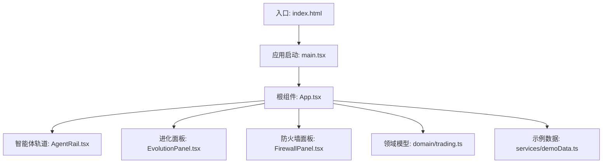
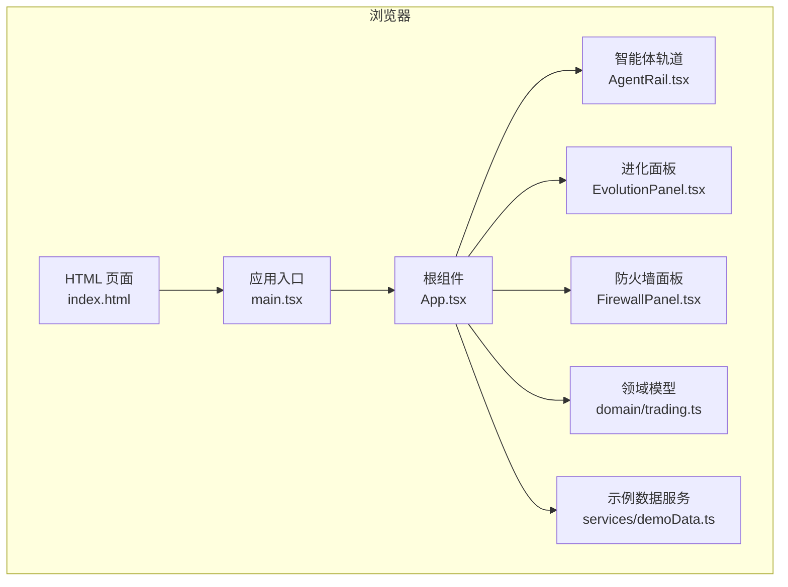
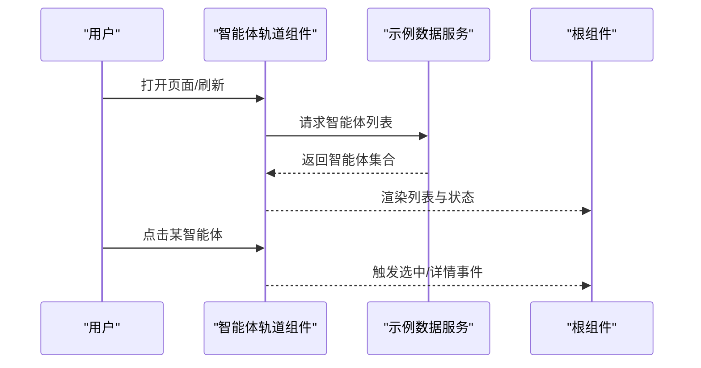
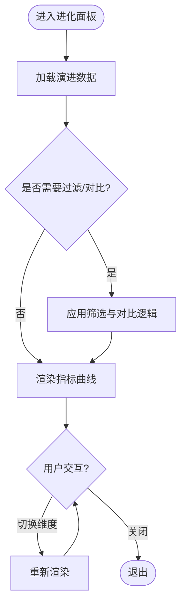
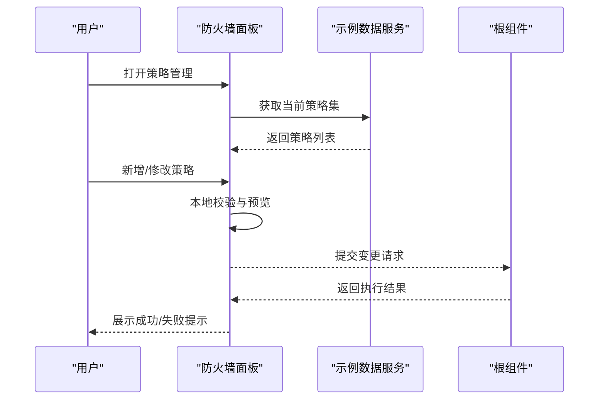
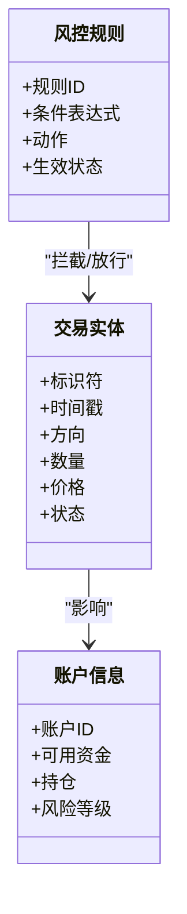
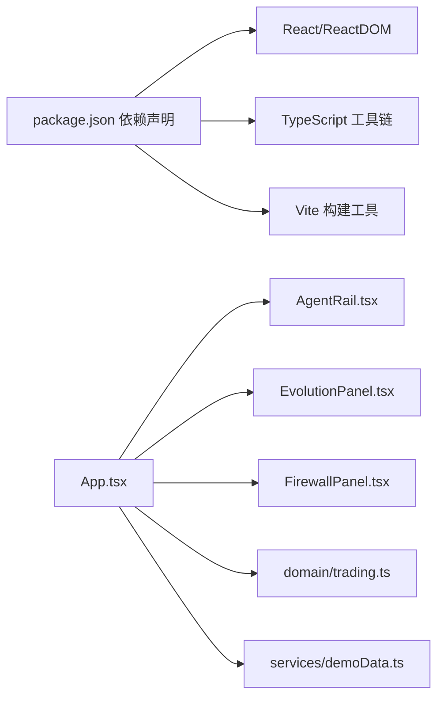

# 项目概述

<cite>
**本文引用的文件**   
- [web/src/App.tsx](file://web/src/App.tsx)
- [web/src/main.tsx](file://web/src/main.tsx)
- [web/src/components/AgentRail.tsx](file://web/src/components/AgentRail.tsx)
- [web/src/components/EvolutionPanel.tsx](file://web/src/components/EvolutionPanel.tsx)
- [web/src/components/FirewallPanel.tsx](file://web/src/components/FirewallPanel.tsx)
- [web/src/domain/trading.ts](file://web/src/domain/trading.ts)
- [web/src/services/demoData.ts](file://web/src/services/demoData.ts)
- [web/package.json](file://web/package.json)
- [web/vite.config.ts](file://web/vite.config.ts)
- [web/tsconfig.app.json](file://web/tsconfig.app.json)
- [web/index.html](file://web/index.html)
- [思路设计.md](file://思路设计.md)
</cite>

## 目录
1. [简介](#简介)
2. [项目结构](#项目结构)
3. [核心组件](#核心组件)
4. [架构总览](#架构总览)
5. [详细组件分析](#详细组件分析)
6. [依赖关系分析](#依赖关系分析)
7. [性能考虑](#性能考虑)
8. [故障排查指南](#故障排查指南)
9. [结论](#结论)
10. [附录：快速开始](#附录快速开始)

## 简介
AdventureX 是一个面向智能体交易与策略演化的前端可视化平台。其核心目标是通过直观的界面，帮助开发者与管理者理解并操控“智能体”的生命周期、进化轨迹与风险控制策略，同时提供交易数据的实时或回放式可视化能力。项目采用 React + TypeScript 技术栈，结合 Vite 构建工具，强调类型安全、可维护性与开发体验。

主要特性包括：
- 智能体管理系统：以列表/轨道形式展示智能体状态、行为与生命周期事件。
- 进化追踪系统：记录并可视化智能体的策略演化路径与关键指标变化。
- 防火墙策略管理：集中配置与调整风控规则，支持动态生效与回滚。
- 交易数据可视化：以图表与面板形式呈现订单、成交、盈亏等关键指标。

设计理念强调“可观测、可解释、可干预”，通过清晰的领域模型与组件边界，降低复杂系统的认知成本。

[本节为概念性概述，不直接分析具体文件]

## 项目结构
项目位于 web 子目录，采用基于功能域的前端工程化组织方式：
- src/components：UI 组件（智能体轨道、进化面板、防火墙面板）
- src/domain：领域模型（如交易相关的数据结构）
- src/services：服务层（示例数据、未来可扩展至真实后端接口）
- 根级配置文件：package.json、vite.config.ts、tsconfig.*、index.html

**图示来源**
- [web/index.html:1-20](file://web/index.html#L1-L20)
- [web/src/main.tsx:1-40](file://web/src/main.tsx#L1-L40)
- [web/src/App.tsx:1-80](file://web/src/App.tsx#L1-L80)
- [web/src/components/AgentRail.tsx:1-120](file://web/src/components/AgentRail.tsx#L1-L120)
- [web/src/components/EvolutionPanel.tsx:1-120](file://web/src/components/EvolutionPanel.tsx#L1-L120)
- [web/src/components/FirewallPanel.tsx:1-120](file://web/src/components/FirewallPanel.tsx#L1-L120)
- [web/src/domain/trading.ts:1-120](file://web/src/domain/trading.ts#L1-L120)
- [web/src/services/demoData.ts:1-120](file://web/src/services/demoData.ts#L1-L120)

**章节来源**
- [web/src/App.tsx:1-80](file://web/src/App.tsx#L1-L80)
- [web/src/main.tsx:1-40](file://web/src/main.tsx#L1-L40)
- [web/index.html:1-20](file://web/index.html#L1-L20)

## 核心组件
- 智能体轨道（AgentRail）：负责展示智能体集合及其运行状态，支持选择、筛选与基础交互。
- 进化面板（EvolutionPanel）：聚焦于智能体策略的演进过程，展示关键指标曲线与版本差异。
- 防火墙面板（FirewallPanel）：用于管理与下发风控策略，包含规则编辑、生效控制与变更记录。
- 领域模型（domain/trading.ts）：定义交易相关的核心数据结构与约束，确保前后端数据一致性。
- 示例数据（services/demoData.ts）：提供演示与测试所需的数据集，便于快速验证 UI 与流程。

这些组件围绕“智能体—进化—风控—交易”的主线展开，形成清晰的功能闭环。

**章节来源**
- [web/src/components/AgentRail.tsx:1-120](file://web/src/components/AgentRail.tsx#L1-L120)
- [web/src/components/EvolutionPanel.tsx:1-120](file://web/src/components/EvolutionPanel.tsx#L1-L120)
- [web/src/components/FirewallPanel.tsx:1-120](file://web/src/components/FirewallPanel.tsx#L1-L120)
- [web/src/domain/trading.ts:1-120](file://web/src/domain/trading.ts#L1-L120)
- [web/src/services/demoData.ts:1-120](file://web/src/services/demoData.ts#L1-L120)

## 架构总览
整体架构遵循“入口 → 根组件 → 功能面板 → 领域模型/服务”的分层模式。React 作为视图层，TypeScript 贯穿全栈保证类型安全；Vite 负责开发与构建优化。

**图示来源**
- [web/index.html:1-20](file://web/index.html#L1-L20)
- [web/src/main.tsx:1-40](file://web/src/main.tsx#L1-L40)
- [web/src/App.tsx:1-80](file://web/src/App.tsx#L1-L80)
- [web/src/components/AgentRail.tsx:1-120](file://web/src/components/AgentRail.tsx#L1-L120)
- [web/src/components/EvolutionPanel.tsx:1-120](file://web/src/components/EvolutionPanel.tsx#L1-L120)
- [web/src/components/FirewallPanel.tsx:1-120](file://web/src/components/FirewallPanel.tsx#L1-L120)
- [web/src/domain/trading.ts:1-120](file://web/src/domain/trading.ts#L1-L120)
- [web/src/services/demoData.ts:1-120](file://web/src/services/demoData.ts#L1-L120)

## 详细组件分析

### 智能体管理系统（AgentRail）
- 职责：渲染智能体列表/轨道，展示状态、标签与基本操作入口。
- 数据流：从示例数据或服务层获取智能体集合，按状态分组显示；用户交互触发回调，由父组件协调后续动作。
- 扩展点：可接入 WebSocket 或轮询机制实现实时更新。

**图示来源**
- [web/src/components/AgentRail.tsx:1-120](file://web/src/components/AgentRail.tsx#L1-L120)
- [web/src/services/demoData.ts:1-120](file://web/src/services/demoData.ts#L1-L120)
- [web/src/App.tsx:1-80](file://web/src/App.tsx#L1-L80)

**章节来源**
- [web/src/components/AgentRail.tsx:1-120](file://web/src/components/AgentRail.tsx#L1-L120)
- [web/src/services/demoData.ts:1-120](file://web/src/services/demoData.ts#L1-L120)
- [web/src/App.tsx:1-80](file://web/src/App.tsx#L1-L80)

### 进化追踪系统（EvolutionPanel）
- 职责：展示智能体策略的演进历史与关键指标变化，支持时间轴浏览与对比。
- 数据流：读取示例数据中的演进记录，计算并渲染趋势图；用户可选择不同维度进行对比。
- 关键点：对时间序列数据进行平滑与聚合，避免视觉噪声。

**图示来源**
- [web/src/components/EvolutionPanel.tsx:1-120](file://web/src/components/EvolutionPanel.tsx#L1-L120)
- [web/src/services/demoData.ts:1-120](file://web/src/services/demoData.ts#L1-L120)

**章节来源**
- [web/src/components/EvolutionPanel.tsx:1-120](file://web/src/components/EvolutionPanel.tsx#L1-L120)
- [web/src/services/demoData.ts:1-120](file://web/src/services/demoData.ts#L1-L120)

### 防火墙策略管理（FirewallPanel）
- 职责：提供风控规则的创建、编辑、启用/停用与变更记录查看。
- 数据流：从示例数据加载当前策略集；用户修改后提交到服务层（当前为模拟），并更新本地状态。
- 安全性：对输入进行校验，防止非法策略下发。

**图示来源**
- [web/src/components/FirewallPanel.tsx:1-120](file://web/src/components/FirewallPanel.tsx#L1-L120)
- [web/src/services/demoData.ts:1-120](file://web/src/services/demoData.ts#L1-L120)
- [web/src/App.tsx:1-80](file://web/src/App.tsx#L1-L80)

**章节来源**
- [web/src/components/FirewallPanel.tsx:1-120](file://web/src/components/FirewallPanel.tsx#L1-L120)
- [web/src/services/demoData.ts:1-120](file://web/src/services/demoData.ts#L1-L120)
- [web/src/App.tsx:1-80](file://web/src/App.tsx#L1-L80)

### 领域模型与交易数据（domain/trading.ts）
- 职责：定义交易实体、订单、成交、账户余额等核心数据结构与约束。
- 作用：统一前后端契约，减少歧义；为可视化组件提供稳定数据源。
- 建议：随业务演进持续完善字段与校验规则。

**图示来源**
- [web/src/domain/trading.ts:1-120](file://web/src/domain/trading.ts#L1-L120)

**章节来源**
- [web/src/domain/trading.ts:1-120](file://web/src/domain/trading.ts#L1-L120)

## 依赖关系分析
- 运行时依赖：React 与 ReactDOM 提供视图与渲染能力；TypeScript 保障类型安全；Vite 提供开发服务器与构建优化。
- 内部依赖：根组件协调各面板；面板依赖领域模型与服务层；示例数据服务于演示与测试。

**图示来源**
- [web/package.json:1-80](file://web/package.json#L1-L80)
- [web/src/App.tsx:1-80](file://web/src/App.tsx#L1-L80)
- [web/src/components/AgentRail.tsx:1-120](file://web/src/components/AgentRail.tsx#L1-L120)
- [web/src/components/EvolutionPanel.tsx:1-120](file://web/src/components/EvolutionPanel.tsx#L1-L120)
- [web/src/components/FirewallPanel.tsx:1-120](file://web/src/components/FirewallPanel.tsx#L1-L120)
- [web/src/domain/trading.ts:1-120](file://web/src/domain/trading.ts#L1-L120)
- [web/src/services/demoData.ts:1-120](file://web/src/services/demoData.ts#L1-L120)

**章节来源**
- [web/package.json:1-80](file://web/package.json#L1-L80)
- [web/vite.config.ts:1-60](file://web/vite.config.ts#L1-L60)
- [web/tsconfig.app.json:1-40](file://web/tsconfig.app.json#L1-L40)

## 性能考虑
- 组件粒度：将大面板拆分为更小的子组件，减少不必要的重渲染。
- 数据更新：对高频数据使用增量更新与虚拟滚动，避免长列表卡顿。
- 构建优化：利用 Vite 的代码分割与缓存策略，缩短冷启动与热更新时延。
- 类型检查：在开发阶段开启严格类型检查，尽早发现潜在错误，降低运行时开销。

[本节为通用指导，不直接分析具体文件]

## 故障排查指南
- 启动失败：检查 Node 版本与依赖安装是否完整；确认端口未被占用。
- 页面空白：查看控制台是否有类型错误或模块加载失败；确认入口脚本与路由挂载正确。
- 数据不更新：核对示例数据服务是否返回预期结构；检查组件状态更新逻辑。
- 样式异常：确认 CSS 文件引入顺序与命名冲突；必要时清理构建缓存。

**章节来源**
- [web/src/main.tsx:1-40](file://web/src/main.tsx#L1-L40)
- [web/src/App.tsx:1-80](file://web/src/App.tsx#L1-L80)
- [web/src/services/demoData.ts:1-120](file://web/src/services/demoData.ts#L1-L120)

## 结论
AdventureX 通过清晰的组件分层与领域建模，将复杂的智能体交易与风控场景转化为直观、可操作的可视化界面。React + TypeScript 的组合在保证类型安全的同时提升了开发效率；Vite 提供了现代化的构建体验。随着后端服务的接入，平台可进一步实现实时数据联动与策略自动化。

[本节为总结性内容，不直接分析具体文件]

## 附录：快速开始
- 环境准备：安装 Node.js（建议使用 LTS 版本）。
- 安装依赖：在项目根目录执行包管理器安装命令。
- 启动开发服务器：运行开发命令，浏览器自动打开应用。
- 构建生产版本：执行构建命令，产物输出至 dist 目录。
- 常用配置：参考 vite.config.ts 与 tsconfig.app.json 调整构建与类型检查选项。

**章节来源**
- [web/package.json:1-80](file://web/package.json#L1-L80)
- [web/vite.config.ts:1-60](file://web/vite.config.ts#L1-L60)
- [web/tsconfig.app.json:1-40](file://web/tsconfig.app.json#L1-L40)
- [web/index.html:1-20](file://web/index.html#L1-L20)