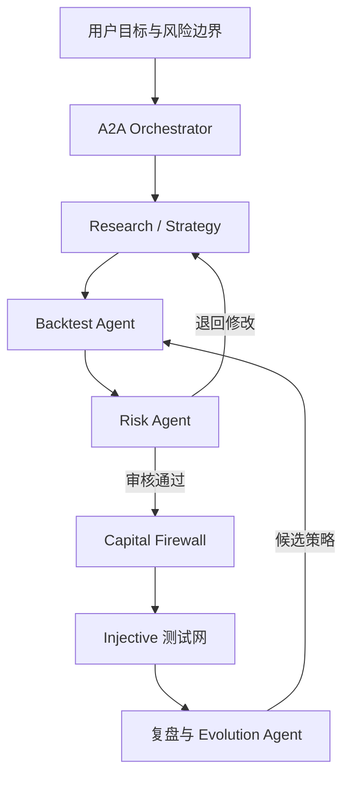

# KaleidoX

> **一个能够从每次交易结果中反思、验证并进化策略，同时在严格风险边界内完成 Injective 链上执行的 AI 投资团队。**

## 赛道定位

KaleidoX 聚焦两个赛道：

- **赛道 18｜PandaAI Build the Next AI Trader**：负责金融数据、投研 Skills、多 Agent 协作、策略回测与自主进化；
- **赛道 1｜Injective Blockchain x AI**：负责资金权限、风险规则、测试网真实链上交易与可验证的策略记录。

一句话说明二者的关系：

> **PandaAI 是会研究和进化的大脑，Injective 是受规则约束的手与可信执行层。**

---

## 实现思路

KaleidoX 将构建一个**可自主进化的 Multi-Agent 链上交易系统**。

用户不需要理解复杂的量化工具，只需通过简洁的对话界面描述自己的目标和风险边界，例如：

> “使用 1,000 USDT 寻找未来一周的 ETH 交易机会，最大可接受亏损为 5%，单一资产仓位不能超过 30%。”

系统随后通过 A2A Remote Agent 接收任务，调用 PandaAI 提供的金融数据与投研 Skills，组织多个专业 Agent 完成从市场研究到 Injective 测试网执行的完整工作流。

### 1. Multi-Agent 交易团队

KaleidoX 不使用一个大模型直接决定买卖，而是将任务拆分给六类具有明确职责和相互制约关系的 Agent：

1. **Research Agent｜市场研究**
   - 调用 PandaAI 的行情、财务、行业和宏观数据；
   - 识别市场环境、潜在机会与关键风险；
   - 输出带数据来源的研究结论。

2. **Strategy Agent｜策略生成**
   - 根据研究结论和用户风险偏好生成交易策略；
   - 明确交易方向、仓位、入场条件、退出条件和止损规则；
   - 生成多个可供验证的候选方案。

3. **Backtest Agent｜策略验证**
   - 调用 PandaAI 的策略回测与绩效分析 Skills；
   - 比较收益、最大回撤、波动率、胜率和样本外表现；
   - 将验证不合格的策略退回 Strategy Agent 修改。

4. **Risk Agent｜独立风控**
   - 检查集中度、最大亏损、极端行情和流动性风险；
   - 验证策略是否符合用户授权范围；
   - 对高风险方案拥有否决权。

5. **Evolution Agent｜策略进化**
   - 对比策略预期、回测结果与实际链上执行结果；
   - 分析策略失败来自信号失效、市场变化、参数问题还是执行偏差；
   - 生成下一代候选策略，并通过 Champion–Challenger 机制竞争晋级。

6. **Execution Agent｜链上执行**
   - 将审核通过的交易计划转换为 Injective 交易指令；
   - 调用 Capital Firewall 完成预算、仓位和止损检查；
   - 在 Injective 测试网执行交易并回传交易哈希。

这些 Agent 不是简单串联。Backtest Agent 可以要求 Strategy Agent 重写策略，Risk Agent 可以否决方案，Evolution Agent 也不能绕过风险规则直接发布新版本。

### 2. 双层记忆系统

KaleidoX 将“记住用户”和“策略进化”分开处理。

#### User Profile Memory｜用户偏好记忆

记录：

- 用户的投资期限；
- 风险承受能力；
- 最大可接受亏损；
- 允许交易的资产；
- 用户对历史建议的反馈。

它的作用是让策略更符合用户，而不是擅自扩大交易权限。

#### Strategy Performance Memory｜策略表现记忆

记录：

- 每个策略版本的逻辑与参数；
- 回测和样本外验证指标；
- 对应的 Injective 测试网交易；
- 预测与实际结果之间的偏差；
- 失败原因和版本升级理由。

它的作用是让系统从真实结果中学习，避免不断重复相同错误。

### 3. Alpha Evolution Loop｜自主进化闭环

KaleidoX 的自主进化不是简单修改 Prompt，而是一条可验证的策略升级流程：

1. **Observe｜观察**
   - 读取 Injective 测试网的成交、持仓和交易结果；
   - 对比策略预期与实际表现。

2. **Reflect｜反思**
   - 对失败交易进行结构化归因；
   - 判断问题来自市场环境、信号、参数还是执行。

3. **Mutate｜生成变体**
   - 自动生成多个下一代候选策略；
   - 调整信号组合、指标权重、入场和退出逻辑。

4. **Compete｜竞争验证**
   - 使用统一数据和相同约束回测原策略与候选策略；
   - 只有风险调整后表现更好、且通过样本外验证的候选策略才能晋级。

5. **Approve｜风险审批**
   - Risk Agent 重新审核；
   - Capital Firewall 检查资金和权限规则；
   - 高风险变更仍需用户确认。

6. **Evolve｜版本升级**
   - 获胜策略升级为新版本；
   - 保存版本号、升级原因、验证指标和策略指纹；
   - 后续每一笔 Injective 交易都关联到明确的策略版本。

系统可以自主进化：

- 因子和信号组合；
- 指标权重；
- 入场、退出和再平衡逻辑；
- 对不同市场状态的策略选择。

系统永远不能自行修改：

- 用户总预算；
- 最大单笔金额；
- 最大仓位与最大亏损；
- 资产白名单；
- 人工确认门槛；
- Capital Firewall 的底层权限。

因此，KaleidoX 的“自主进化”本质上是：

> **策略在不可突破的风险边界内，持续提出假设、验证假设并升级版本。**

### 4. Injective 的核心作用

Injective 不是用来给 AI 报告“上链盖章”，而是承担系统中不可替代的执行与约束功能：

- **测试网真实执行**：使用测试资产完成真实链上交易，而不是前端模拟成交；
- **Capital Firewall**：在执行前强制检查预算、仓位、止损和资产范围；
- **可验证结果**：交易哈希证明 Agent 确实完成了任务；
- **策略版本关联**：记录某笔交易由哪个策略版本产生；
- **可信进化历史**：让评委看到 V1 为什么失败、V2 如何产生、最终执行结果如何。

测试网使用测试资产，不涉及用户真实本金；但交易调用、风险检查和链上确认都真实发生在 Injective 上。

### 5. 整体工作流



底座模型统一使用 **DeepSeek V4 Pro**。A2A Agent Card、任务状态、Skills 调用过程、最终结论与风险提示均对外提供结构化输出，单次任务总响应时间控制在 20 分钟以内。

---

## 效果展示

### Demo 主题

> **一笔失败交易，如何让 AI 自主进化出下一代策略。**

为了避免现场等待市场变化，Demo 会先读取一笔事先在 Injective 测试网执行的 V1 策略交易，再现场展示策略进化与新交易执行。

### 第一步：用户设定目标

用户输入：

> “使用 1,000 USDT 研究 ETH 的交易机会，最大可接受亏损为 5%，单一资产仓位不能超过 30%。”

KaleidoX 首先锁定三条不可修改的规则：

```text
交易预算：1,000 USDT
最大亏损：5%
最大 ETH 仓位：30%
```

### 第二步：读取 V1 的链上结果

系统展示一笔由 V1 策略完成的 Injective 测试网交易：

```text
策略版本：V1
市场判断：趋势向上
实际结果：震荡行情中连续产生错误信号
链上凭证：Injective Testnet Tx Hash
```

### 第三步：Evolution Agent 完成失败归因

Evolution Agent 结合研究、回测和链上成交结果给出结论：

```text
失败原因：
1. V1 过度依赖短期趋势信号；
2. 未识别当前震荡市场状态；
3. 交易频率过高，放大了错误信号影响。
```

### 第四步：生成并竞争下一代策略

Evolution Agent 生成两个候选版本：

| 策略 | 主要变化 |
|---|---|
| V2-A | 降低趋势指标权重，增加波动率过滤 |
| V2-B | 增加市场状态识别，只在趋势确认后入场 |

Backtest Agent 使用相同数据区间进行 Champion–Challenger 测试：

以下数值为 Demo 展示格式示例，最终演示应替换为系统实际回测结果：

```text
V1：收益 3.2%，最大回撤 8.1%
V2-A：收益 4.0%，最大回撤 5.7%
V2-B：收益 4.6%，最大回撤 4.2%
```

V2-B 在风险调整后表现最好，成为晋级候选。

### 第五步：风控否决第一次升级

Risk Agent 发现 V2-B 建议使用 40% ETH 仓位，超过用户设置的 30% 上限，因此拒绝升级：

```text
审核结果：拒绝
拒绝原因：建议仓位 40% > 用户上限 30%
```

Evolution Agent 随后将仓位调整为 25%，重新回测并再次提交。

### 第六步：Injective 测试网执行 V2

Risk Agent 和 Capital Firewall 均通过后，V2 正式晋级并执行：

```text
策略版本：V2
建议动作：分批建仓
执行仓位：25%
风险等级：中等
状态：Capital Firewall 已通过
执行网络：Injective Testnet
交易结果：Success
交易哈希：0x...
```

### 第七步：展示进化结果

最终界面同时展示：

- V1 → V2 策略进化树；
- V1 的失败归因；
- V2-A、V2-B 的回测比较；
- Risk Agent 的否决与修改过程；
- V2 对应的 Injective 测试网交易哈希；
- 下一轮策略复盘入口。

---

## Demo 最终证明

这个 Demo 不只是展示一份 ETH 投资分析报告，而是同时证明：

1. 多个 Agent 能完成真实的复杂金融工作流；
2. Agent 之间存在退回、竞争、否决和修正机制；
3. 系统能够从历史结果中生成并验证下一代策略；
4. AI 的自主进化不能突破用户设定的风险边界；
5. 最终结果是在 Injective 测试网真实发生、可验证的链上交易。

---

## 最终 Pitch

> 今天的大多数 AI Trader 只能分析市场，少数能够自动下单，但它们都在重复执行同一套策略。  
> KaleidoX 是一支由研究、策略、回测、风控、进化和执行 Agent 组成的 AI 投资团队。  
> 它使用 PandaAI 的真实金融数据与投研 Skills 形成和验证策略，再由 Injective 的 Capital Firewall 约束资金权限并完成链上执行。  
> 每次交易结束后，它都会从结果中反思，生成下一代候选策略，并在通过回测与风控后完成版本升级。  
> **KaleidoX 不是让 AI 盲目地自动交易，而是让它在不可突破的风险边界内，完成“研究—决策—执行—验证—进化”的闭环。**
