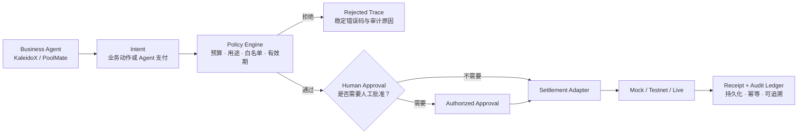

<!-- markdownlint-disable MD013 MD033 MD041 -->

<p align="center">
  
</p>

<h1 align="center">PactLedger</h1>

<p align="center">
  <strong>让 Agent 提出付款，让规则决定付款，让 Injective 证明付款。</strong><br />
  <sub>The Treasury Control Plane for AI Agents.</sub>
</p>

<p align="center">
  
  
  
  
</p>

<p align="center">
  <a href="#overview">产品概览</a> ·
  <a href="#flow">资金控制链</a> ·
  <a href="#showcases">参考应用</a> ·
  <a href="#architecture">技术架构</a> ·
  <a href="#quick-start">快速开始</a> ·
  <a href="#status">交付状态</a> ·
  <a href="#documentation">项目文档</a>
</p>

---

<a id="overview"></a>

## 产品概览

AI Agent 正在从“回答问题”走向“代表用户执行任务”。当 Agent 开始购买数据、调用其他 Agent、向商户付款时，真正需要解决的不是**如何给 Agent 一个钱包**，而是：

- 它最多可以花多少钱？
- 这笔支出是否符合任务用途？
- 收款方是否在可信白名单中？
- 哪些高风险动作必须由人批准？
- 客户端重试会不会导致重复付款？
- 如何证明付款真实发生，而不是生成了一段虚假的交易哈希？

**PactLedger 是位于业务 Agent 与结算网络之间的可编程财务控制层（Agent Treasury / Agent Spend Control）。**

业务 Agent 无法直接操作资金账户，只能提交结构化 Intent。PactLedger 统一接管账户、预算、策略、审批、结算、回执与审计，让“能办事的 Agent”同时成为“不能越权花钱的 Agent”。

> **核心原则：Agent 可以提出花钱，但不能绕过 PactLedger 直接花钱。**

<a id="flow"></a>

## 一条不可绕过的资金控制链



每一次资金动作都遵循同一条执行链：

```text
Intent -> PolicyDecision -> Approval(optional) -> Settlement -> Receipt
```

| 控制能力 | PactLedger 的处理方式 |
| --- | --- |
| **预算控制** | 校验 Agent、任务、单笔与累计支出上限 |
| **用途控制** | 只允许与当前任务和策略匹配的付款目的 |
| **收款方控制** | 在进入结算前校验地址和商户白名单 |
| **人工批准** | 大额或高风险动作只能由授权用户批准 |
| **幂等保护** | 相同 Payment Intent 重试只返回同一 Receipt，不重复付款 |
| **审计追踪** | 将 Intent、Decision、Approval、Settlement、Receipt 关联为完整 Trace |
| **真实性标记** | 在类型、API 与 UI 中明确区分 Mock、Replay、Testnet、Live |

<a id="showcases"></a>

## 一个基座，两个完全不同的参考应用

<table>
  <tr>
    <td width="50%" valign="top">
      <h3>KaleidoX</h3>
      <p><strong>股票投研 Agent 团队</strong></p>
      <p>Research、Strategy、Backtest 与 Risk Agent 协作完成股票研究和策略评估。PandaAI 提供股票数据与研究解释；PactLedger 管理 Agent 采购研究、回测和风控服务时产生的费用。</p>
      <p><strong>证明重点：</strong>高风险业务中，Agent 不能绕过预算、Policy 与人工批准。</p>
    </td>
    <td width="50%" valign="top">
      <h3>PoolMate</h3>
      <p><strong>群聊拼单 Agent</strong></p>
      <p>从群聊中提取商品、份额、截止时间和商户信息，生成标准 AgentPaymentIntent。合法商户可以进入结算流程；陌生收款人或越权请求会被直接拒绝并留下审计 Trace。</p>
      <p><strong>证明重点：</strong>同一套财务控制能力可以跨业务复用，而不是某个应用内部的支付功能。</p>
    </td>
  </tr>
</table>

> [!NOTE]
> KaleidoX 的 A 股研究与 Injective 上的 Agent 服务费结算属于两个不同领域。PandaAI 负责股票数据与研究解释；Injective 负责 Agent 支付结算与可验证回执。项目**不会**宣称“在 Injective 上交易 A 股”。

## Injective 在这里做什么

Injective 是 PactLedger 的**结算与公开验证层**，不是装饰性的“上链标签”。它用于：

- 结算 Agent 之间的服务采购费用；
- 结算 Agent 向白名单商户发起的付款；
- 提供交易哈希、区块高度、确认状态和 Explorer 证据；
- 将链上结果与原始 Intent、PolicyDecision 和 Approval 关联为可审计 Receipt。

只有同时具备**真实交易哈希、可打开的 Explorer 链接、链上确认结果和已持久化 Receipt**，系统才允许显示“Injective Testnet · Confirmed”。Mock 哈希不会被拼接到 Explorer，也不会被描述为链上确认。

<a id="architecture"></a>

## 技术架构

```text
┌─────────────────────────────────────────────────────────────────┐
│ Reference Apps                                                  │
│ KaleidoX · Stock Research        PoolMate · Group Buying        │
└──────────────────────────────┬──────────────────────────────────┘
                               │ ActionIntent / AgentPaymentIntent
┌──────────────────────────────▼──────────────────────────────────┐
│ PactLedger Control Plane                                        │
│ Agent Accounts · Budget · Policy · Approval · Idempotency       │
│ Settlement Orchestration · Receipt · Audit Ledger               │
└───────────────┬───────────────────────────────┬─────────────────┘
                │                               │
┌───────────────▼──────────────┐  ┌─────────────▼─────────────────┐
│ Data & Intelligence          │  │ Settlement & Verification     │
│ PandaData · DeepSeek V4 Pro  │  │ Mock · Injective Testnet SDK │
└──────────────────────────────┘  └───────────────────────────────┘
```

### 技术栈

| 层级 | 实现 |
| --- | --- |
| **Frontend** | React · TypeScript · Vite |
| **Backend** | Fastify · TypeScript |
| **Persistence** | PostgreSQL · Intent / Decision / Receipt 独立持久化 |
| **Settlement** | Injective 官方 SDK Testnet Adapter · Mock Adapter |
| **Data & Model** | PandaData · DeepSeek V4 Pro · Ark fallback |
| **Agent Protocol** | A2A Agent Card · REST · JSON-RPC · SSE |
| **Messaging** | Telegram Bot / PoolMate 拼单流程 |

### 仓库边界

```text
web/src/                  PactLedger 前端与参考应用
web/src/landing/          产品落地页
web/server/               唯一权威 Fastify 后端
web/server/pactledger/    通用 Intent / Policy / Settlement / Receipt
web/server/poolmate/      PoolMate 与 Telegram 流程
web/server/adapters/      Injective 等外部结算适配器
docs/                     产品、开发、部署与交接文档
```

> 本仓库只保留 `web/server/` 一套后端。业务应用不得绕过 Policy Engine 直接调用结算适配器。

<a id="quick-start"></a>

## 快速开始

### 环境要求

- Node.js 22
- Python 3.10+
- PostgreSQL 16 或兼容版本

### 本地启动（PowerShell）

```powershell
Set-Location .\web
npm ci

python -m venv .venv
.\.venv\Scripts\python.exe -m pip install -r requirements-panda.txt

Copy-Item .env.example .env.local
# 编辑 .env.local，至少配置 PostgreSQL；PandaAI 与 Injective 可先使用 Replay / Mock。

npm run dev
```

启动后访问：

| 入口 | 地址 | 用途 |
| --- | --- | --- |
| **PactLedger** | `http://127.0.0.1:5173/` | 产品主页与共用基座说明 |
| **KaleidoX** | `http://127.0.0.1:5173/kaleidox.html` | 股票投研参考应用 |
| **PoolMate** | `http://127.0.0.1:5173/poolmate.html` | 群聊拼单参考应用 |
| **API Health** | `http://127.0.0.1:8787/api/health` | 后端依赖与运行模式摘要 |
| **Base Status** | `http://127.0.0.1:8787/api/public/base-status` | 无需登录的基座与结算证据状态 |
| **Agent Card** | `http://127.0.0.1:8787/.well-known/agent-card.json` | Fastify A2A 能力声明 |

### 质量门

在 `web/` 目录执行：

```powershell
npm run lint
npm run build
npm run test:api
```

<a id="status"></a>

## 当前交付状态

> 基线日期：**2026-07-24**。源码完成、外部服务接入、真实链上证据和公网部署是四个不同状态，不能混为一谈。

| 能力 | 状态 | 当前证据 / 边界 |
| --- | :---: | --- |
| 通用 Intent / Policy / Settlement / Receipt | **已实现** | 覆盖批准、拒绝、人工审批、失败与重试 Trace |
| PostgreSQL 持久化与支付幂等 | **已实现** | Intent、Decision、Receipt 独立持久化；相同 Intent 并发去重 |
| KaleidoX 与 PoolMate 同基座验证 | **已实现** | 包含策略通过用例和陌生收款人拒绝用例 |
| PandaData 股票日线 | **已接入** | 已完成真实 `get_stock_daily_pre` 调用验证 |
| DeepSeek V4 Pro 研究解释 | **已接入** | 主模型真实调用已验证；Ark 保留为后备 |
| Injective 官方 SDK Testnet Adapter | **已实现** | `MsgSend`、地址白名单、denom/精度、签名与 Receipt 映射已通过单元测试 |
| Injective Testnet 真实支付 | **待完成** | 尚缺正式钱包、白名单地址、支付资产配置与测试币；目前没有 Explorer 可确认交易 |
| Fastify A2A / Agent Card / Base Status | **本地已实现** | 已通过本地测试；公网仍需重新部署与 Smoke Test |
| Telegram Bot | **Mock 闭环** | 拼单、Policy 与 Receipt 流程已实现；尚未配置生产 Token，明确为 `Mock · No Chain` |
| 本地质量门 | **通过** | lint、生产构建、API tests `42/42` |

> [!IMPORTANT]
> 截至 **2026-07-24** 的实测，公网 `http://129.226.91.246:8787` 仍是旧部署：`/api/health` 返回旧服务名，`/api/public/base-status` 返回 `401`，Agent Card 返回 `404`。完成 redeploy、restart 与公网 Smoke Test 前，不得宣称新 Base Status、Agent Card 或真实 Testnet Receipt 已上线。

## 90 秒演示主线

1. **提交一个合法 Agent 服务费 Intent**：展示预算、用途和收款白名单检查。
2. **展示 Policy 通过或人工批准**：强调 Agent 不能批准自己的高风险请求。
3. **提交一个越权或陌生收款人请求**：展示稳定拒绝原因与完整 Trace。
4. **切换到 PoolMate**：证明另一种业务复用同一套账户、Policy、Settlement 与 Receipt。
5. **展示证据而非口号**：只有真实 Testnet 交易才打开 Explorer；网络或配置未就绪时明确降级为 Mock。

<a id="documentation"></a>

## 项目文档

| 文档 | 说明 |
| --- | --- |
| [`docs/PRODUCT_SPEC.md`](docs/PRODUCT_SPEC.md) | 产品定位、架构、完成度、演示设计、路线图与 Definition of Done |
| [`docs/DEVELOPMENT.md`](docs/DEVELOPMENT.md) | 当前权威运行路径、环境变量、测试、Docker 与生产部署 |
| [`docs/INJECTIVE_AGENT_PAYMENT_HANDOFF.md`](docs/INJECTIVE_AGENT_PAYMENT_HANDOFF.md) | Injective 支付接入边界、配置、安全、恢复与验收清单 |
| [`docs/README.md`](docs/README.md) | 文档索引、事实源优先级与维护规则 |
| [`AGENTS.md`](AGENTS.md) | 所有编程 Agent 在本仓库工作时必须遵守的约束 |

## 安全与真实性原则

- 私钥、PandaAI 密码和数据库密码只由服务端环境变量读取，禁止使用 `VITE_` 前缀，禁止提交 Git。
- 股票业务动作使用 `ActionIntent` / `BrokerOrderIntent`；Agent 支付使用 `AgentPaymentIntent`，两者不得混用。
- 链上只写 ID、金额、地址和必要哈希，不写用户名、群聊内容、研究全文或手机号。
- Mock、Replay、Testnet、Live 必须在类型、API 和 UI 中清晰区分。
- 没有真实交易哈希、Explorer 和持久化 Receipt，就没有“链上已确认”。

---

<p align="center">
  <strong>业务可以变化，Agent 可以进化，但它永远不能进化自己的资金权限。</strong>
</p>
