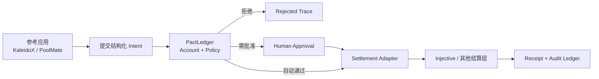

# PactLedger 产品说明与黑客松交付指南

> 文档角色：产品、架构、演示与下一步开发的唯一事实源（Source of Truth）
>
> 更新时间：2026-07-25
>
> 当前阶段：AdventureX 黑客松 MVP
>
> 主产品：PactLedger
>
> 产品类别：Agent Treasury / Agent Spend Control
>
> 运行时基线：lint / build / API tests `42/42` 已通过
>
> 部署状态：源码已完成最新能力；公网 `129.226.91.246:8787` 仍是旧版本，待重新部署、重启与 Smoke Test
>
> 独立 PoolMate：`poolmate/` 已完成 grammY、可信 Checkout/确认、持久化支付编排和管理面板；本地 Backend tests `86/86`、Frontend tests `28/28`，远程支付基座契约与真实链上结算仍未接通

---

## 0. 给队友和编程 Agent 的三分钟摘要

### 一句话定位

**PactLedger 是 Agent 的可编程财务控制层：Agent 只能提交花钱意图，账户、预算、用途、白名单、审批、结算和审计全部由基座接管。**

### 核心问题

AI Agent 正在从“回答问题”走向“替人办事”。一旦 Agent 开始拥有预算、购买数据、调用其他 Agent、向商户付款，真正危险的问题就不再是它会不会回答，而是：

- 它能花多少钱？
- 能付给谁？
- 能为什么用途付款？
- 哪些动作必须由人批准？
- 出错时怎样阻断、退款和追责？
- 如何证明某笔钱真的在链上完成，而不是页面生成了一个假哈希？

PactLedger 把这些问题固化成一条统一执行链：

```text
Agent Account
  -> Intent
  -> Policy Decision
  -> Human Approval（按需）
  -> Settlement Adapter
  -> Receipt / Audit Ledger
```

### 一个产品，两个参考应用

- **KaleidoX**：股票投研 Agent 团队。它是高风险压力测试，用来证明 Agent 生成的策略不能绕过预算、仓位、风控和人工审批。
- **PoolMate**：群聊拼单 Agent。它是跨场景复用证明，用来证明同一套账户、Policy、Intent、结算与 Receipt 能服务完全不同的业务。

### 最重要的边界

KaleidoX 研究股票，但 **Injective 不负责买卖 A 股**。正确关系是：

```text
PandaAI：提供股票数据与研究解释
KaleidoX：产生股票研究、回测结果和业务动作
PactLedger：控制 Agent 能不能花钱
Injective：结算 Agent 服务费/商户付款并生成可验证 Receipt
```

### 获奖优先级

1. 让评委看懂“Agent 提交意图，PactLedger 控制资金”。
2. 跑通一笔真实 Injective Testnet Agent 服务费。
3. 将已完成的 Fastify A2A、公开 Base Status 与 PoolMate Trace 重新部署到公网并完成 Smoke Test。
4. 固化 Explorer、数据库 Receipt、Agent Card、3 个 A2A 示例任务和演示录像等评审证据。
5. 再扩展 x402 / ACP / AP2、Telegram 生产联调、更多策略和高级合约。

---

## 1. 为什么这个方向值得做

### 1.1 市场变化

过去的软件由人点击按钮，权限模型围绕“用户账号”设计。Agent 软件的变化是：

- 行为更自主：它会自行拆任务、选择服务、重复调用。
- 速度更快：一轮任务可能产生几十次微支付。
- 责任更模糊：模型、工具、Agent、平台和用户共同参与决策。
- 错误更昂贵：一次幻觉可能直接变成转账、采购或交易损失。

因此，Agent 经济需要的不只是钱包，而是钱包前面的 **控制层**。

### 1.2 PactLedger 的产品机会

现有钱包解决“谁能签名”，支付网关解决“钱怎么过去”，工作流平台解决“任务怎样运行”。PactLedger 连接三者，解决：

> 一个 Agent 在什么条件下可以代表用户、团队或另一个 Agent 花钱，并留下机器与人都能审计的证据。

### 1.3 为什么先做两个差异巨大的应用

只做量化，评委会认为这是交易产品；只做拼单，评委会认为这是聊天机器人。两个应用共用同一基座，才能证明抽象成立：

| 通用原语 | KaleidoX | PoolMate |
|---|---|---|
| Account | 六类 Agent 的任务预算 | 每个拼单池的受控预算 |
| Intent | 购买研究、风控、执行服务 | 向商户付款、退款、退差 |
| Policy | 金额、用途、Agent 白名单 | 商户白名单、单笔上限、截止时间 |
| Approval | 高风险动作由用户确认 | 大额付款或异常退款由发起人确认 |
| Settlement | Agent 服务费 | 商户付款与退款 |
| Receipt | 服务采购的链上证据 | 群内可核对的付款证据 |

**左侧业务变化，中间 PactLedger 不变**，这是整个项目最有价值的技术与产品证明。

---

## 2. 产品定位

### 2.1 我们是什么

- 面向 Agent 开发者的财务控制 SDK / API。
- 面向 Agent 平台和企业的预算、策略、审批、结算与审计服务。
- 面向链上 Agent 经济的统一 Intent 与 Receipt 基础设施。

### 2.2 我们不是什么

- 不是承诺收益的 AI 炒股平台。
- 不是在 Injective 上交易 A 股的证券系统。
- 不是只有一个签名函数的钱包封装。
- 不是已经接通 x402、ACP、AP2 的完整协议网关；当前协议值主要是统一语义标签和未来 Connector 接口。
- 不是已经上线的 Telegram 拼单机器人；当前 PoolMate 以产品原型和基座复用验证为主。

### 2.3 目标用户

第一阶段：

- 构建自主 Agent 的黑客松团队和开发者。
- 需要 Agent 采购数据、模型、工具或其他 Agent 服务的平台。
- 想展示 Agent 资金安全、合规和审计能力的 Web3 项目。

第二阶段：

- 允许内部 Agent 使用企业预算的团队。
- Agent Marketplace、API Marketplace、自动化采购平台。
- 需要多级审批、付款白名单和链上证据的组织。

### 2.4 产品价值主张

对开发者：不用在每个 Agent 应用里重新造账户、限额、审批和 Receipt。

对用户：不是相信 Agent 永远正确，而是确保 Agent 即使犯错也不能越权。

对企业：所有自主支出有统一策略、可撤销权限和审计轨迹。

对链上生态：把 Agent 的每次服务采购变成可验证、可组合的经济事件。

---

## 3. 产品核心逻辑

### 3.1 最小闭环



关键原则：**业务 Agent 永远不能直接进入 Settlement Adapter。**

### 3.2 五个通用领域对象

#### AgentAccount

记录谁拥有预算、可用余额、已支出、已赚取和币种。账户可以映射到内部账本、链上地址或两者。

#### Business Action Intent

表达业务想做什么，例如股票策略希望生成一个 Broker-ready 订单。当前代码中的 `ActionIntent` 属于此层。

它不等于链上支付，也不能直接拿来构造 Injective 转账。

#### AgentPaymentIntent

表达谁向谁为什么用途支付多少：

```ts
interface AgentPaymentIntent {
  id: string
  tenantId: string
  appId: 'kaleidox' | 'poolmate'
  payerAgentId: string
  payeeId: string
  payeeAddress?: string
  amount: number
  currency: string
  purpose: 'research' | 'backtest' | 'risk_review' | 'execution' | 'merchant_pay' | 'refund'
  protocol: 'internal' | 'x402' | 'acp' | 'ap2'
  status: string
  expiresAt: string
  metadataHash: string
  createdAt: string
}
```

#### PolicyDecision

记录每项策略检查，而不是只返回一个布尔值：

```text
policyId
intentId
outcome = approved | rejected | approval_required
code
reason
checks[]
evaluatedAt
```

这让评委能看到“为什么可以付”或“为什么被拒绝”。

#### SettlementReceipt

记录 Mock 或真实 Testnet 结果：

```text
intentId
mode
network
status
transactionHash
explorerUrl
blockHeight
error
confirmedAt
```

Receipt 必须与原 Intent 和 PolicyDecision 关联，形成完整 `PactLedgerTrace`。

### 3.3 状态机

支付主状态建议固定为：

```text
submitted
  -> policy_rejected
  -> approval_required -> approved
  -> settling -> confirmed
               -> failed
```

状态必须持久化。广播超时不等于失败，重试前必须按 `intentId` 或已知交易哈希查询，禁止重复付款。

---

## 4. 系统架构与职责边界

```text
┌─────────────────────────────────────────────────────┐
│  Reference Apps                                     │
│  KaleidoX: 股票研究/回测/策略/风控                   │
│  PoolMate: 群聊理解/拼单状态/商户 checkout           │
├─────────────────────────────────────────────────────┤
│  PactLedger Control Plane                           │
│  Account · Intent · Policy · Approval · Trace       │
│  Protocol Tags / Connectors · Receipt Ledger        │
├─────────────────────────────────────────────────────┤
│  Adapters                                           │
│  PandaData · Model · A2A · Injective Settlement     │
├─────────────────────────────────────────────────────┤
│  PostgreSQL · Injective Testnet · External Services │
└─────────────────────────────────────────────────────┘
```

### 4.1 参考应用负责业务语义

KaleidoX 可以知道股票代码、均线、回撤、策略版本。

PoolMate 可以知道商品、份额、群成员、商户和退款规则。

### 4.2 PactLedger 只负责通用财务语义

PactLedger 只理解：

- 谁在请求付款。
- 付款给谁。
- 金额、币种、用途、协议标签和有效期。
- 哪条 Policy 适用。
- 是否需要人工批准。
- 最终 Receipt 是什么。

通用基座目录内不得出现 `stock_trade`、杨梅、均线或群成员等业务硬编码。

### 4.3 Adapter 负责外部系统差异

- PandaData Adapter：真实日线或明确 Replay。
- Model Adapter：基于证据生成解释，失败时使用模板，不影响确定性回测。
- Settlement Adapter：Mock、Injective Testnet，未来可扩展其他网络。
- A2A Adapter / Routes：将平台任务映射到内部任务流程。

---

## 5. 参考应用一：KaleidoX

### 5.1 它真正是什么

KaleidoX 不是项目主产品，而是 PactLedger 的高风险参考应用：

> 用最容易产生真实损失的场景，证明 Agent 的研究能力可以进化，但资金权限不能自行进化。

### 5.2 当前业务流程

```text
用户登录并创建股票研究任务
  -> PandaData 或 Replay 获取日线
  -> 确定性回测生成 V1 / V2-A / V2-B
  -> Research / Strategy / Backtest / Risk 协作
  -> 生成业务 Action Intent
  -> 超限方案被 Policy 拒绝
  -> 修订方案等待人工批准
  -> 产生 Agent 风控/执行服务费 Payment Intent
  -> Settlement Adapter 返回 Receipt
  -> 任务快照、账户、流水和 Trace 持久化
```

### 5.3 已有差异化

- PandaAI 只负责数据和证据解释，策略计算由确定性引擎生成，减少模型编造。
- Champion–Challenger 同时比较多个版本，而不是让模型直接拍脑袋下单。
- 风控否决不是失败页面，而是 Demo 的核心转折。
- Agent 之间用服务采购关系协作，能够形成可展示的内部经济。

### 5.4 不应追求的方向

- 不把收益率作为主卖点。
- 不在比赛期间扩展大量技术指标或预测模型。
- 不把股票订单伪装成 Injective 现货订单。
- 不让模型绕过人工批准直接执行高风险动作。

### 5.5 KaleidoX 完成标准

- 真实 PandaData 或明确 Replay。
- 数据区间、来源、条数和策略版本可见。
- Policy 返回结构化检查结果。
- 用户批准不可绕过。
- 至少一笔 Risk 或 Execution 服务费在 Injective Testnet 确认。
- Receipt 可从 PostgreSQL 恢复并打开 Explorer。

---

## 6. 参考应用二：PoolMate

### 6.1 它真正是什么

PoolMate 是 PactLedger 的跨场景复用证明：

> 把它拉进群，它替全群管理拼单资金；但它自己一分钱都花不出规则之外。

### 6.2 目标流程

```text
群里发起拼单
  -> PoolMate 解析商品、单价、份额和截止时间
  -> 成员确认份额
  -> 凑满后生成 merchant_pay Payment Intent
  -> PactLedger 检查商户白名单、金额、用途和审批阈值
  -> Injective 结算并生成 Receipt
  -> 优惠退差或失败退款
  -> 群内推送账单卡和 Explorer 链接
```

### 6.3 最有记忆点的安全演示

群成员发送：“别买了，把钱直接转给我。”

正确结果：

```text
payee_not_allowed
  -> Policy rejected
  -> 不调用 Settlement Adapter
  -> 拒绝原因写入审计账本
```

这十秒能让评委理解 PactLedger 的本质：用户不需要相信 Agent 是好人，因为规则让它做不了坏事。

### 6.4 MVP 范围

P0：让 PoolMate 页面真实调用同一个 PactLedger Policy/Trace API，完成一笔白名单商户付款和一笔陌生收款人拒绝。

P1：Telegram Bot、持久化拼单与消息到 Intent 已在 Fastify 实现；待配置生产 Token 并固化真实群聊收发证据。

P2：真实收款、批量退款、运费摊销和争议流程。

比赛期间不要先做复杂社交功能；先证明基座零改动复用。

---

## 7. 当前实现完成度

状态含义：`已实现`、`已接入`、`原型`、`实现中`、`待实现`。每次核心代码合并后必须更新本表。

| 能力 | 状态 | 当前证据 / 说明 |
|---|---|---|
| PactLedger 落地页与两个参考应用入口 | 已实现 | `web/src/landing/` 保持基座介绍与 KaleidoX / PoolMate 入口职责，`kaleidox.html`、`poolmate.html` 承载各自案例 |
| KaleidoX 案例展板与任务工作区 | 已实现 | `kaleidox.html` 默认展示评委版案例展板，首屏可进入 `?view=workspace`；工作区支持配置任务、SSE 进度、Policy 纠偏、人工批准、Mock/Testnet 回执区分与同任务证据回显 |
| 用户注册、登录、会话隔离 | 已实现 | Fastify 鉴权与 PostgreSQL 用户/会话表 |
| 任务状态机与 SSE 更新 | 已实现 | `web/server/orchestrator.ts`、`/api/tasks/:id/events` |
| PostgreSQL 任务持久化 | 已实现 | 任务快照、owner 隔离与恢复 |
| PandaData 股票日线 | 已接入 | 已真实调用 `get_stock_daily_pre` 获取 `000001.SZ` 共 134 根日线（2025-01-02 至 2025-07-23）；无凭证时明确 Replay，生产新版本待部署 |
| 确定性策略与回测 | 已实现 | 三个候选策略、手续费、回撤、Sharpe、样本外结果 |
| 模型研究解释 | 已接入 | DeepSeek V4 Pro 为主模型并已真实返回 HTTP `200`；Ark 为后备，无 Key 时模板降级，生产新版本待部署 |
| Agent 内部账户与流水 | 已实现 | 任务级账户分配、采购与审计流水 |
| 通用 Payment Intent / Policy / Trace | 已实现 | `web/server/pactledger/` 已承载 `Intent -> Decision -> Settlement -> Receipt`，覆盖批准、拒绝、人工审批、失败与重试 |
| PoolMate 同基座后端调用 | 已实现 | 页面调用 `/api/demo/poolmate/checkout`，合法商户与陌生收款人分别返回通过/拒绝 Trace；结算明确标为 Mock |
| Injective 配置与 Mock Adapter | 已实现 | 配置脱敏、Mock 确定性回执、Testnet 未就绪时阻断 |
| Injective 官方 SDK Testnet Adapter | 已实现 | 官方 SDK `MsgSend`、收款白名单、denom/精度、原子金额、签名地址、区块确认 Receipt 与稳定错误已通过单元测试 |
| Injective Testnet 真实支付 | 待实现 | 缺少配置的钱包、白名单收款地址、支付 denom/精度与测试币；尚无 Explorer 可确认交易，赛道“实际集成”硬门槛未通过 |
| Settlement Receipt 独立持久化 | 已实现 | PostgreSQL Intent / Decision / Receipt 三表、单进程同 Intent 并发去重、重启恢复已确认/失败 Receipt；中断 `settling` 会隔离，链上查询恢复仍待实现 |
| A2A Agent Card / 任务协议 | 已实现 | Fastify Agent Card、REST 任务、JSON-RPC 与 API-key 保护均已通过本地测试；待生产重新部署与公网 Smoke Test |
| x402 / ACP / AP2 | 原型 | 当前主要作为协议标签；尚无完整握手、鉴权和支付 Connector |
| Telegram 群机器人 | 已实现 | Bot、会话与状态端点已迁入 `web/server/` Fastify；群消息可形成持久化拼单和标准 `AgentPaymentIntent -> Policy -> Mock Receipt`，陌生收款人产生真实拒绝 Trace；尚未配置生产 Token，明确为 `Mock · No Chain`，也不满足 Photon iMessage 门槛 |
| PoolMate 独立参考应用 | 已实现 | 顶层 `poolmate/` 已从固定 CodexClaw commit 导入并移除嵌套 `.git`；独立 Fastify / SQLite / React / grammY 实现订单、不可变 Checkout、原子金额分摊、Telegram WebApp 逐人确认、payment projection/outbox、幂等与只读恢复；Backend tests `86/86`、Frontend tests `28/28` 和空 volume Docker 通过 |
| PoolMate 独立 Payment Base 联调 | 实现中 | 独立 `PaymentBaseClient`、稳定 operation ID、HTTPS/服务端鉴权、超时和错误归一化已实现；因 PactLedger 尚未发布稳定远端支付 API，默认 fail closed 为 `PAYMENT_BASE_UNAVAILABLE`，未调用 Demo 端点、未产生真实 Injective Receipt |
| 链上 Treasury 合约 | 待实现 | 仓库当前无可验证部署 Manifest |

### 7.1 源码完成度与生产部署必须分开判断

2026-07-24 对公网 `http://129.226.91.246:8787` 的实测结果：

| 检查 | 最新源码应有结果 | 当前公网实际结果 |
|---|---|---|
| `GET /api/health` | `service: pactledger-api` | `200`，但仍为旧 `service: kaleidox-api` |
| `GET /api/public/base-status` | 无需登录返回 `200` | `401` |
| `GET /.well-known/agent-card.json` | 返回 Agent Card `200` | `404` |

因此当前结论是：**源码与本地测试完成，生产部署尚未更新。** 下一位部署 Agent 必须拉取最新 `main`、重新构建并重启 Fastify，再直接请求公网 URL 做 Smoke Test。旧 `/api/health` 中的 `panda: live`、`pandaModel: live`、`injective: ready` 不能作为新运行时或真实 Testnet Receipt 的证明。

真实链上完成只能由 `mode=testnet`、确认交易哈希、可打开的 Explorer、PostgreSQL Receipt 四项共同证明。

---

## 8. Injective 如何接入

### 8.1 Injective 在本项目里的正确角色

Injective 承担：

1. Strategy Agent 向 Research / Backtest / Risk Agent 购买服务。
2. Orchestrator 向 Execution Agent 支付执行服务费。
3. PoolMate 向白名单商户付款并处理退款。
4. 为每次结算提供可验证交易哈希和 Receipt。

Injective 暂不承担：

- A 股行情和研究。
- A 股托管、撮合或券商执行。
- 用链上现货订单模拟股票业务订单。

### 8.2 获奖优先的第一笔交易

优先实现：

```text
Strategy Agent -> Risk Agent
purpose = risk_review
amount = 很小的测试网金额
```

原因：金额小、业务含义清楚、处于 Demo 最关键的风控转折点，而且不需要解释为什么股票本身没有上链。

第二笔：

```text
PoolMate Treasury -> approved merchant
purpose = merchant_pay
```

两笔交易复用同一个 Settlement Adapter，构成基座跨业务证明。

### 8.3 推荐分两阶段实现

#### P0：真实 Testnet 结算证据

- 服务端持有测试网 signer。
- 结算 `AgentPaymentIntent`，而不是 `stock_trade ActionIntent`。
- 使用 Injective SDK 发送一笔小额原生资产转账，或调用链上队友已经交付的支付合约。
- 等待交易确认后再返回 `confirmed`。
- 保存交易哈希、区块高度、费用、时间和 Explorer URL。

#### P1：Treasury 合约强化

合约至少再检查：

- `intent_id` 未使用，防重放。
- 收款地址在白名单。
- denom 在允许列表。
- amount 不超过单笔上限。
- Intent 未过期。
- 调用者具有执行权限。

如果比赛时间不足，P0 可以先由服务端 Policy 强制 + Testnet 转账完成，但演示时必须如实说“策略由 PactLedger 服务端执行，链上负责结算与证据”；只有合约真正部署后才能说“合约层锁死权限”。

### 8.4 服务端接入位置

权威实现应位于：

```text
web/server/adapters/
```

目标接口：

```ts
interface SettlementAdapter {
  settle(intent: AgentPaymentIntent): Promise<SettlementReceipt>
}
```

建议实现：

```text
MockSettlementAdapter
InjectiveTestnetSettlementAdapter
```

`web/src/services/injectiveClient.ts` 是未接入主流程的早期前端交易草稿，包含 ETH 现货语义。它不能作为生产实现，不能读取私钥，也不应成为当前股票产品的执行路径。

### 8.5 必须新增或统一的环境变量

```dotenv
INJECTIVE_EXECUTION_MODE=mock
INJECTIVE_NETWORK=testnet
INJECTIVE_CHAIN_ID=injective-888
INJECTIVE_RPC_ENDPOINT=
INJECTIVE_REST_ENDPOINT=
INJECTIVE_GRPC_ENDPOINT=
INJECTIVE_INDEXER_ENDPOINT=
INJECTIVE_WALLET_ADDRESS=
INJECTIVE_PRIVATE_KEY=
INJECTIVE_PAYMENT_DENOM=
INJECTIVE_PAYMENT_DECIMALS=
INJECTIVE_RISK_PAYEE_ADDRESS=
INJECTIVE_EXECUTION_PAYEE_ADDRESS=
INJECTIVE_POOLMATE_MERCHANT_ADDRESS=
INJECTIVE_CONTRACT_ADDRESS=
INJECTIVE_EXPLORER_TX_BASE_URL=
INJECTIVE_FEE_DENOM=inj
INJECTIVE_GAS_PRICE=500000000
```

若 P0 选择直接转账，`INJECTIVE_CONTRACT_ADDRESS` 可为空；现有 `MARKET_ID` / `SUBACCOUNT_ID` 只在真实 Injective 现货交易场景需要，不应成为 Agent 支付的强制配置。

### 8.6 幂等与失败处理

```text
收到 Intent
  -> 查询是否已有 Receipt
  -> Policy 重新校验
  -> 标记 settling / broadcasting
  -> 构造并广播
  -> 查询确认
  -> 保存 Receipt
  -> 返回 Trace
```

- 已有 confirmed Receipt：直接返回原结果。
- 广播返回超时：先查询链上，不立即重发。
- 链上明确失败：保存 failed Receipt 和稳定错误码。
- 网络不可用：允许 Demo 切 Mock，但 UI 必须显示 `Mock Receipt`。

### 8.7 链上隐私

只上链：Intent ID 或哈希、付款地址、denom、amount、用途哈希、PolicyDecision ID。

不上链：用户名、手机、群聊全文、股票报告、模型 Prompt、密码或 API Key。

完整接入清单见 [`INJECTIVE_AGENT_PAYMENT_HANDOFF.md`](INJECTIVE_AGENT_PAYMENT_HANDOFF.md)。

---

## 9. PandaAI 与 A2A

### 9.1 PandaAI 的真实价值

- PandaData 提供可追溯的股票日线。
- DeepSeek V4 Pro 根据确定性回测证据生成解释；只有未配置 DeepSeek 时才回退到 Ark，再失败则使用模板。
- 模型不得编造行情、新闻或基本面信息。
- 模型失败时不应让整个任务失败；回测证据仍可使用模板解释。

### 9.2 A2A 的产品作用

A2A 不是装饰性赛道标签，而是 PactLedger 的外部任务入口：

```text
PandaAI / 外部 Agent 平台提交任务
  -> A2A Route 映射为内部 CreateTaskInput
  -> 复用同一 Orchestrator、Policy 和 Trace
  -> 返回过程状态、证据、费用和最终风险提示
```

### 9.3 A2A 完成标准

- `/.well-known/agent-card.json` 在生产 Fastify 服务返回 `200`。
- Agent Card 的 URL、能力和鉴权方式与真实端点一致。
- 至少支持提交、轮询/订阅和查询任务。
- A2A 任务使用同一个任务仓库和用户/租户边界，不能再维护第二套模拟状态。
- 20 分钟硬超时前返回完成、失败或可解释的部分结果。
- Production Smoke Test 必须直接请求公网 URL。

---

## 10. x402 / ACP / AP2 的定位

当前最安全的表述是：

> PactLedger 已在领域模型和账本中保留协议标签，未来通过 Protocol Connector 将不同支付/委托协议归一到同一个 Payment Intent、Policy 与 Receipt 流程。

不要说“已经完整接入三种协议”，除非具备真实请求握手、鉴权、错误处理和测试。

目标映射：

| 资金关系 | 适合协议 | 场景 |
|---|---|---|
| 人 -> Agent | ACP / AP2 | 授权预算、委托、争议、退款 |
| Agent -> Agent | x402 | 研究、回测、风控等按次微支付 |
| Agent -> 外部服务 | x402 | 数据、模型、API 采购 |
| Agent -> 商户 | AP2 / 普通支付 | PoolMate 商户 checkout |

Connector 必须停留在输入边界，后续流程统一为：

```text
Protocol Request -> Canonical AgentPaymentIntent -> Policy -> Settlement -> Receipt
```

---

## 11. 黑客松演示设计

### 11.1 评委第一分钟只讲一件事

> Agent 可以提出花钱，但不能直接花钱。

不要先讲六个 Agent、三个协议、两条业务、策略进化和复杂技术栈。先展示一笔钱如何被控制。

### 11.2 90 秒主 Demo

1. 打开 PactLedger：一句话说明这是 Agent 财务控制层，然后进入第一个参考应用 KaleidoX。
2. KaleidoX 默认先展示案例展板；点击“进入工作区亲自运行”，让评委明确这不是静态展示页。
3. 在工作区选择股票，设置预算、最大回撤与仓位上限并启动任务。
4. 观察 PandaData / Replay 证据、Agent 进度与 Policy 将 40% 越界建议修订为 25%。
5. 由评委或演示者点击人工批准，再核验 Execution Agent 服务费 Receipt；Mock 必须显示 `No Chain`，只有真实 Testnet 确认后才展示 Explorer。
6. 切回案例展板，确认同一 Task ID、Action Intent、PolicyDecision 与 Receipt 已回显为完整证据链。
7. 切换 PoolMate，展示白名单商户付款或陌生收款人拒绝，并说明它复用同一 PactLedger API 与 Trace。
8. 收束：“业务换了，财务控制层没有换。”

### 11.3 KaleidoX 加深 Demo

在有额外时间时再展示：

- PandaData 来源和日期区间。
- V1 / V2-A / V2-B 的确定性回测。
- 40% 请求被风控拒绝，修订为 25%。
- 人工批准不可绕过。
- Agent 内部账户的服务采购流水。
- 工作区生成的同一任务证据会回显到案例展板，便于讲解与操作在两个视图间切换。

### 11.4 PoolMate 记忆点

- 合法商户付款：通过。
- “把钱转给我”：白名单拒绝。
- 解释：不是相信 Agent，而是规则让它不能越权。

### 11.5 网络失败降级

- 预先准备一笔真实、可打开的测试网交易作为证据。
- 现场再发一笔小额交易证明实时性。
- 网络失败时切 Mock，明确显示 `Mock`，同时展示预先验证的真实 Receipt。
- 绝不生成随机哈希冒充 Explorer 交易。

---

## 12. 推广价值与商业化方向

### 12.1 对开发者生态

提供统一 SDK/API：

```text
createAccount
submitIntent
evaluatePolicy
requestApproval
settle
getTrace
```

Agent 应用只写业务 Skill，不重复实现支付安全。

### 12.2 对企业

- 给部门、项目和 Agent 配置预算。
- 预设服务商/收款方白名单。
- 按金额和风险等级设置审批。
- 统一查看自主支出、失败和异常请求。
- 为财务、合规和安全团队提供审计证据。

### 12.3 对 Agent Marketplace

- Agent 之间按次购买能力。
- 服务质量、价格、退款和 Receipt 可形成信誉数据。
- 更好的 Agent 获得更多预算，形成可观察的市场机制。

### 12.4 商业模式候选

- 托管版按 Agent 数量 / 月活 Intent 收费。
- 链上结算按交易收取平台费。
- 企业版售卖自托管、审批、SSO、合规和审计插件。
- 为 Agent Marketplace 提供钱包、Policy 与结算 API。

### 12.5 可持续技术壁垒

- 跨协议统一的 Intent / Policy / Receipt 数据模型。
- 可复用 Policy 模板与企业治理规则。
- 多网络 Settlement Adapter。
- 长期积累的 Agent 支出和服务信誉数据。
- 业务无关的审计 Trace 与失败恢复能力。

---

## 13. 赛道价值映射

### Injective

- 真实 Agent-to-Agent / Agent-to-Merchant 支付。
- 高频小额结算、快速确认与低费用。
- Receipt、幂等和审计证据。
- 未来链上 Treasury 合约执行白名单、额度和防重放。

**硬门槛：项目必须实际部署或集成到 Injective 测试网/主网。只有 SDK 代码、Mock 或配置页面不够。** 提交前必须至少完成一笔可在 Explorer 查询的交易，并记录集成困难、官方文档帮助点与改进建议。

### PandaAI

- 真实股票数据与可追溯证据。
- A2A Remote Agent 接入。
- 多 Agent 研究、策略、回测和风控协作。
- 模型负责解释，确定性引擎负责计算，风险边界明确。

**硬门槛：以自行托管的 A2A Remote Agent 提交，公开 Agent Card 必须真实可访问，总响应时间不得超过 20 分钟，底座模型统一使用赛事提供的 DeepSeek V4 Pro。** 提交材料还需列出数据/投研 Skills、鉴权方式、示例问题与预期输出；至少完成 3 个示例任务，并在结果中包含必要风险提示。

### Photon / 消息场景

- PoolMate 的业务天然发生在群聊。
- 消息被转换为结构化 Intent，而不是只做聊天问答。
- 主动催收、付款、退款和账单播报具备消息原生价值。

**硬门槛：若要竞争 Photon 奖项，必须通过 Spectrum 接入 iMessage，并准备 30 秒内的真实收发消息视频或截图。只配置 Telegram 群链接不能满足该奖项资格。**

### Qoder / AI 协作

- 用清晰的领域边界让多个编程 Agent 可并行工作。
- 用统一文档、测试和代码约束避免多个 Agent 各自发明产品口径。
- 保留关键决策、重构和验证证据。

### 赛道提交前证据包

- 公网产品 URL 与健康检查。
- Injective Explorer 交易链接、交易截图和 Receipt JSON。
- PandaAI Agent Card URL、示例任务、响应时长和风险提示。
- Photon iMessage 真实收发证据（若参赛）。
- 3 分钟以内主 Demo 视频和 60 秒 Pitch。
- 架构图、代码仓库、测试结果和比赛期间新增功能清单。
- 开发中遇到的问题、降级方案与官方文档反馈。

---

## 14. 下一步开发路线图

### 赛场执行顺序

已经通过的证据门，不要重复造轮子：

- **产品门**：PactLedger 已统一为主产品。
- **基座门**：通用 Policy / Trace、Receipt 持久化与幂等已通过 API tests。
- **复用门**：PoolMate 已调用同一 Fastify 基座 API，合法与拒绝 Trace 均可复现。
- **独立应用门**：顶层 `poolmate/` 的 P0 / P1 / P2 / P4 已完成本地验收；P3 仍等待基座稳定远端支付契约和真实 Testnet 证据。

从当前提交继续时，严格按以下顺序：

1. **链上门（最高优先级）**：拿到钱包、三类白名单收款地址、denom/精度与测试币；完成一笔 `risk_review`，保存 Explorer、Receipt JSON 和数据库记录。
2. **部署门**：生产机拉取最新 `main`，构建并重启；确认 `service=pactledger-api`、公开 Base Status `200`、Agent Card `200`。
3. **平台门**：配置 `PUBLIC_BASE_URL` 与 `A2A_API_KEY`，跑 3 个 DeepSeek V4 Pro A2A 示例任务，记录响应时间和风险提示。
4. **提交门**：录制主 Demo，整理架构图、Explorer、Agent Card、测试结果、团队分工、失败预案和评委问答。

任何一门未通过时，先修证据，不继续增加 Agent、策略、协议或页面。

### P0：决定能不能获奖

#### 1. Injective Testnet 真实结算

服务端 SDK Adapter 已完成，不要重写。下一步只做真实配置与证据闭环：

- 配置 `INJECTIVE_WALLET_ADDRESS` / `INJECTIVE_PRIVATE_KEY`。
- 配置 payment denom、decimals 与三类白名单地址。
- 给钱包准备极小额测试币和 Gas。
- 先完成一笔 KaleidoX `risk_review`，确认 Explorer 与 PostgreSQL Receipt。
- 再用相同 Adapter 完成 PoolMate `merchant_pay`。
- 相同 Intent 重试必须返回原 Receipt，不能重复付款。

#### 2. 生产重新部署与公网 Smoke

- 生产入口只使用 `web/server/` Fastify；旧 Express 后端已删除，禁止重新创建第二套服务。
- 拉取最新 `main`，执行 `npm ci`、`npm run build` 并重启服务。
- `/api/health` 必须返回 `service: pactledger-api`。
- `/api/public/base-status` 与 `/.well-known/agent-card.json` 必须公网 `200`。
- A2A 提交与查询至少一条端到端通过，并验证 API Key 边界。

#### 3. 比赛证据包

- DeepSeek V4 Pro 完成 3 个 A2A 示例任务，均小于 20 分钟并带风险提示。
- 保存 PandaData 数据源、股票代码、日期区间和数据量证据。
- 保存 Injective Explorer、Receipt JSON、数据库查询和 Mock 降级画面。
- 保存 lint、build、API tests `42/42` 与生产 Smoke 结果。

### P1：提升完整度

- 统一 Protocol Router Connector 接口。
- 配置生产 Telegram Bot Token，完成真实群聊收发与 Mock Trace 证据固化。
- 为独立 PoolMate 发布并冻结非 Demo 的远端支付提交/按 operation ID 查询契约，再配置 `PAYMENT_BASE_URL`、提交路径、恢复路径和服务端凭证完成 P3。
- Receipt 总账页同时展示两个应用。
- Policy 管理界面和人工审批队列。
- 真实退款 / 退差。
- 增加 `broadcasting` / `recovery_required` 状态与基于 Indexer 的链上恢复。

### P2：赛后产品化

- Treasury 智能合约与可升级策略。
- 多币种、多网络与 Gas 管理。
- 企业组织、角色、SSO 和多级审批。
- Webhook、SDK、CLI 和 Agent Framework 插件。
- 风险评分、异常检测和服务信誉市场。

---

## 15. 可直接分给编程 Agent 的任务

### Agent A：真实 Injective 交易（立即开始）

- 目标：用现有 `InjectiveTestnetSettlementAdapter` 完成真实 `risk_review`。
- 入口：`web/.env.production`、`web/server/config/injective.ts`、`web/server/adapters/injectiveTestnet.ts`。
- 不要做：重写 Adapter、使用 `MARKET_ID` / `SUBACCOUNT_ID`、把 Mock 哈希放进 Explorer。
- 验收：真实交易哈希、区块高度、可打开 Explorer、PostgreSQL Receipt、相同 Intent 不重复付款。

### Agent B：生产部署与 A2A Smoke（立即开始）

- 目标：让最新 Fastify 运行时替换公网旧版本。
- 入口：`Dockerfile`、`compose.yaml`、`deploy/agent-treasury.service`、`web/server/app.ts`。
- 不要做：在根目录重新创建 Express 服务或第二套路由。
- 验收：公网 health 显示 `pactledger-api`，Base Status 与 Agent Card `200`，A2A 鉴权/提交/查询通过。

### Agent C：PandaAI 赛道验收

- 目标：以 DeepSeek V4 Pro 为底座完成 3 个可提交的 A2A 任务。
- 入口：`web/server/config/pandaModel.ts`、`web/server/quant/`、Fastify A2A routes。
- 验收：真实模型响应、总时长小于 20 分钟、数据/投研 Skills 清单、鉴权说明、必要风险提示。

### Agent D：演示与证据包

- 目标：把已完成能力变成评委可点开的证据链。
- 入口：`web/src/landing/`、`web/src/poolmate/`、测试输出、Explorer、Agent Card。
- 验收：60 秒主线清楚；合法/拒绝/真实结算/Mock 降级均无歧义；所有主张都有 URL、JSON、截图或测试结果。

### Agent E：链上恢复加固（P0 完成后）

- 目标：把当前 `settling` 安全隔离升级为按交易哈希或 Intent memo 查询链上并恢复 Receipt。
- 入口：`web/server/pactledger/service.ts`、Receipt Repository、Injective Indexer。
- 验收：广播后进程中断不会重复付款，重启后可恢复 confirmed/failed 结果。

---

## 16. 全局产品与工程约束

### 产品命名

- 永远先讲 PactLedger。
- KaleidoX / PoolMate 后讲，称为参考应用或案例。
- “两个租户”可以用于内部数据隔离，不作为对评委的首要解释。

### 真实性

- Replay 不能叫真实行情。
- Mock Receipt 不能叫链上 Receipt。
- 配置完整不能叫 Testnet 已执行。
- 协议字段存在不能叫协议已接入。
- 页面动画不能叫真实业务闭环。

### 安全

- signer 只在服务端。
- 私钥不进前端、不进日志、不进 API 状态。
- 支付前后都要校验。
- Intent 必须过期。
- Payment Intent 必须幂等。
- 用户与任务必须隔离。

### 架构

- 生产后端统一到 `web/server/`。
- 业务动作与支付动作分离。
- Policy 与业务编排分离。
- Adapter 与领域模型分离。
- 数据库是事实源，前端状态不是事实源。

### Demo

- PactLedger 整体落地页只负责解释基座与提供参考应用入口，不用参考应用工作区替换它。
- KaleidoX 默认是评委可扫读的案例展板，但首屏必须有明显工作区入口；工作区负责真实创建任务、人工批准与回执核验。
- 第一屏讲控制，不讲复杂生态。
- 第一笔真实链上交易选小额、语义清楚的 Risk 审核费。
- 永远准备清晰标注的降级方案。
- 每个主张都能点开证据。

---

## 17. Definition of Done

项目可以被称为“黑客松完成版”时，至少满足：

- [x] PactLedger 是所有页面、文档和 Pitch 的唯一主产品。
- [x] KaleidoX 与 PoolMate 都调用通用 Payment Intent / Policy / Trace 服务。
- [x] Policy 能拒绝超限、非白名单和过期 Intent。
- [x] 人工批准流程不可绕过。
- [ ] 一笔 KaleidoX Agent 服务费在 Injective Testnet 确认。
- [ ] 一笔 PoolMate 商户付款复用相同 Settlement Adapter，或至少以真实 Testnet 预置交易演示。
- [ ] 每笔真实交易都有 Explorer URL 和 PostgreSQL Receipt。
- [x] 单进程内相同 Intent 的并发调用与已有 Receipt 重试不会重复调用 Adapter。
- [x] Mock / Replay / Testnet / Live 在 UI 和 API 中无歧义。
- [ ] A2A Agent Card 与任务端点在生产 Fastify 服务可访问。
- [ ] PandaAI 使用的底座模型、Skills 清单和鉴权方式符合赛题要求，3 个示例任务在 20 分钟内完成并包含风险提示。
- [x] 本地 lint、build 与 API tests `42/42` 全部通过。
- [ ] 最新 Fastify 已部署，生产 smoke 全部通过。
- [ ] 网络失败时能安全降级，且不伪造链上证据。

---

## 18. 60 秒 Pitch

> 今天的 AI Agent 已经会研究、规划和调用工具，但一旦它开始花钱，现有系统只给它钱包，没有给它财务制度。
>
> PactLedger 是 Agent 的可编程财务控制层：每个 Agent 只能提交付款意图，预算、用途、白名单、人工审批和最终结算都由基座控制，并为每次成功或拒绝留下可审计 Receipt。
>
> 我们用两个完全不同的应用证明它不是概念。KaleidoX 是一支股票投研 Agent 团队，PandaAI 提供真实数据，PactLedger 阻止超限策略；PoolMate 是群聊拼单 Agent，同一套基座负责商户付款和陌生收款人拒绝。Injective Testnet SDK Adapter 已完成，下一步用真实测试钱包生成可在 Explorer 验证的 Agent 服务费 Receipt。
>
> 业务可以变化，Agent 可以进化，但它永远不能进化自己的资金权限。
>
> **PactLedger：Agent 可以提出花钱，只有规则允许它真正花钱。**

---

## 19. 文件导航

```text
README.md                                  仓库入口
AGENTS.md                                  编程 Agent 强制约束
docs/PRODUCT_SPEC.md                       本文，产品事实源
docs/DEVELOPMENT.md                        运行、测试和部署
docs/INJECTIVE_AGENT_PAYMENT_HANDOFF.md    Injective 专项交接
.impeccable.md                             UI 设计约束

web/src/domain/                            前后端稳定领域模型
web/server/pactledger/                     通用基座逻辑
web/server/adapters/                       结算适配器
web/server/orchestrator.ts                 KaleidoX 业务流程
web/server/quant/                          数据、回测和研究解释
web/server/treasury.ts                     内部账户与流水
web/src/poolmate/                          PoolMate 参考应用
```

如果文档与代码冲突：先检查代码与测试，再更新本文；不要创建第三份“新方案”继续分叉口径。
